# CHƯƠNG 2: PHÂN TÍCH VÀ THIẾT KẾ HỆ THỐNG

## 2.1. Phân tích yêu cầu

Dựa trên quá trình khảo sát và thu thập thông tin từ thực tế hoạt động của nhà thuốc, hệ thống phần mềm Quản lý Kho thuốc và Bán hàng POS (PIS) được thiết kế nhằm giải quyết triệt để bài toán quản lý hàng hóa theo lô/hạn sử dụng. Dưới đây là đặc tả chi tiết các yêu cầu của hệ thống (Software Requirements Specification - SRS).

### 2.1.1. Yêu cầu chức năng (Functional Requirements - FR)
Hệ thống được chia thành 7 phân hệ chức năng cốt lõi, phục vụ cho 3 nhóm đối tượng người dùng chính: **Admin (Quản trị viên)**, **Product_manager (Thủ kho)** và **Sales (Nhân viên bán hàng)**.

1. **Phân hệ Xác thực & Tài khoản (FR-AUTH)**: Đăng nhập/Đăng xuất bảo mật bằng JWT; Đổi mật khẩu; Quên mật khẩu và cấp lại mật khẩu tạm thời; Tự động xoay vòng (refresh) token.
2. **Phân hệ Quản lý Danh mục (FR-MED)**: Quản lý danh mục nhóm thuốc, đơn vị tính, nước sản xuất. Đặc biệt là chức năng Quản lý chi tiết thông tin các loại Thuốc (Mã, Tên, Hoạt chất, Hàm lượng).
3. **Phân hệ Đối tác & Nhân sự (FR-PARTNER)**: Quản lý thông tin Khách hàng thành viên; Quản lý Nhà cung cấp; Quản lý Hồ sơ Nhân viên và cấp phát tài khoản sử dụng.
4. **Phân hệ Nghiệp vụ Kho (FR-WH)**: Lập và xác nhận Phiếu Nhập Kho; Lập và xác nhận Phiếu Xuất Kho. Quá trình xuất/nhập bắt buộc phải chọn chính xác Lô thuốc và Hạn sử dụng.
5. **Phân hệ Kiểm kê Kho (FR-AUDIT)**: Tạo phiếu kiểm kê tự động chụp tồn kho hệ thống; Nhập số đếm thực tế; Xác nhận đối soát và tự động sinh giao dịch bù trừ chênh lệch.
6. **Phân hệ POS & Bán hàng (FR-POS)**: Quản lý giỏ hàng bán lẻ tại quầy; Hỗ trợ quét mã vạch tìm thuốc; Áp dụng khách hàng thành viên; Tính toán tiền thừa; Trừ tồn kho lô trực tiếp khi thanh toán; In hóa đơn nhiệt K80.
7. **Phân hệ Tồn kho & Báo cáo (FR-INV)**: Xem tồn kho chi tiết theo từng Lô; Lọc thuốc sắp/đã hết hạn; Xem lịch sử thẻ kho (biến động xuất/nhập/bán); Dashboard thống kê doanh thu.

### 2.1.2. Yêu cầu phi chức năng (Non-Functional Requirements - NFR)
- **Hiệu năng (Performance)**: Các API tra cứu dữ liệu phải phản hồi dưới 500ms. Giao dịch POS và xác nhận xuất/nhập kho dưới 1000ms. Bắt buộc phân trang dữ liệu ở DB.
- **Bảo mật (Security)**: Mật khẩu mã hóa BCrypt. Tất cả API (trừ đăng nhập) yêu cầu JWT Access Token. Áp dụng Role-based Access Control (RBAC). Vô hiệu hóa Token vào blacklist khi đăng xuất.
- **Toàn vẹn dữ liệu (Reliability)**: Nghiệp vụ POS và Kho phải sử dụng Transaction (`@Transactional` của Spring). Bất kỳ lỗi logic nào (như thiếu tồn kho) đều phải rollback toàn bộ giao dịch, đảm bảo chuẩn ACID.
- **Triển khai (Deployment)**: Ứng dụng đóng gói bằng Docker và Docker Compose.

---

## 2.3. Thiết kế Cơ sở dữ liệu

Dựa vào việc phân tích mã nguồn thực tế, lược đồ cơ sở dữ liệu (Database Schema) của hệ thống được thiết kế tối ưu trên MySQL với các bảng (Tables) cốt lõi sau:

### Bảng dữ liệu cốt lõi
1. **`account`**: Quản lý tài khoản. Bao gồm `username` (PK), `password_hash`, `role`, `is_active`, `is_first_login`. Liên kết 1-1 với `employee`.
2. **`employee`**: Hồ sơ nhân sự. Bao gồm `id` (PK), `full_name`, `phone`, `email`, `address`.
3. **`medicine`**: Danh mục Thuốc. Bao gồm `id` (PK), `medicine_code`, `name`, `active_ingredient`, `retail_price`. Có khóa ngoại liên kết tới `catalog`, `origin`, `unit`.
4. **`inventory`**: Bảng Tồn Kho Lô (Quan trọng nhất). Bao gồm `id` (PK), `medicine_id` (FK), `batch_code` (Mã lô), `expiry_date` (Hạn dùng), `stock_quantity` (Tồn kho hiện tại), `import_price`.
5. **`inventory_transaction`**: Thẻ kho / Biến động. Ghi lại mọi sự thay đổi tồn kho. Bao gồm `id` (PK), `inventory_id` (FK), `transaction_type` (IMPORT, EXPORT, SALE, AUDIT), `quantity_change` (+/-), `balance_after`, `reference_id` (Mã phiếu tham chiếu).
6. **`receipt` / `issue` / `audit`**: Các phiếu nghiệp vụ kho. Lưu thông tin chung (Ngày lập, Trạng thái DRAFT/CONFIRMED, Tổng tiền, Người lập).
7. **`receipt_detail` / `issue_detail` / `audit_detail`**: Chi tiết phiếu. Liên kết n-1 với bảng Phiếu và liên kết với Lô `inventory`.
8. **`invoice` & `invoice_detail`**: Hóa đơn bán lẻ POS. Lưu tổng tiền, khách hàng (nếu có), tiền khách đưa, tiền thừa. Chi tiết hóa đơn liên kết với lô `inventory` đã xuất bán.

---

## 2.2. Thiết kế hệ thống

### 2.2.1. Biểu đồ Use Case Tổng quát
Hệ thống được chia thành các cụm Use Case (Package) theo phân hệ. Dưới đây là sơ đồ Use Case cho Phân hệ Xác thực & Cài đặt hệ thống.

```mermaid
usecaseDiagram
    actor Admin
    actor ProductManager as "Thủ kho"
    actor Sales as "Nhân viên BH"
    
    package "Phân hệ 1 & 3: Xác thực và Nhân sự" {
        usecase "Đăng nhập/Đăng xuất" as UC1
        usecase "Đổi mật khẩu" as UC2
        usecase "Quản lý Nhân viên" as UC3
        usecase "Quản lý Tài khoản" as UC4
    }
    
    Admin --> UC1
    ProductManager --> UC1
    Sales --> UC1
    
    Admin --> UC2
    ProductManager --> UC2
    Sales --> UC2
    
    Admin --> UC3
    Admin --> UC4
```

### 2.2.2. Biểu đồ Lớp (Class Diagram) cốt lõi
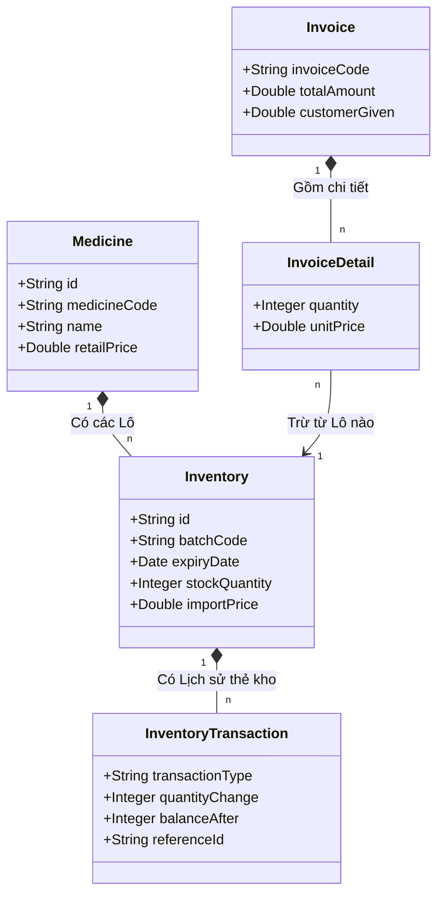

---

### 2.2.3. Đặc tả chi tiết các Use Case (Phân hệ 1: Xác thực)

#### UC01: ĐĂNG NHẬP HỆ THỐNG
* **Tác nhân**: Admin, Sales, Product_manager
* **Tiền điều kiện**: Tài khoản tồn tại và được kích hoạt (`isActive = true`).
* **Luồng sự kiện chính**:
  1. Người dùng truy cập trang đăng nhập, nhập Username và Password.
  2. Hệ thống kiểm tra trong cơ sở dữ liệu (`account` table) bằng BCrypt.
  3. Hệ thống sinh JWT (Access Token, Refresh Token).
  4. Chuyển hướng người dùng vào Dashboard tương ứng quyền hạn.
* **Luồng thay thế**:
  - Sai mật khẩu: Báo lỗi "Tài khoản không chính xác".
  - Tài khoản lần đầu đăng nhập (`isFirstLogin = true`): Chuyển hướng ép buộc sang trang Đổi mật khẩu.

**Activity Diagram (UC01):**
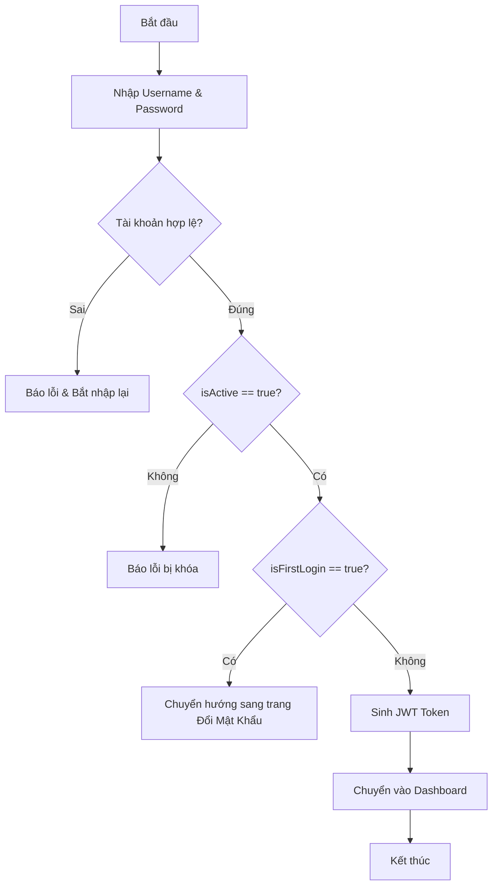

**Sequence Diagram (UC01):**
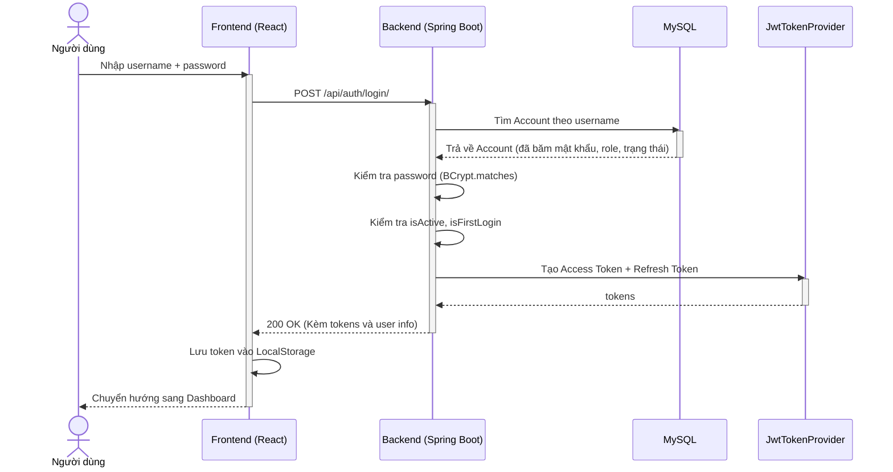

#### UC05: ĐỔI MẬT KHẨU TÀI KHOẢN
* **Tác nhân**: Tất cả
* **Tiền điều kiện**: Người dùng đã đăng nhập hoặc đang bị kẹt ở trạng thái `isFirstLogin = true`.
* **Luồng sự kiện chính**:
  1. Người dùng vào form Đổi mật khẩu.
  2. Nhập mật khẩu cũ, mật khẩu mới và xác nhận mật khẩu mới.
  3. Hệ thống đối chiếu mật khẩu cũ. Nếu khớp, mã hóa mật khẩu mới (BCrypt) và lưu DB.
  4. Cập nhật `isFirstLogin = false`. Thông báo thành công.

**Bảng Đặc tả Dữ liệu (Data Dictionary):**
| Tên Table | Cột (Field) | Loại thao tác | Dữ liệu cập nhật | Ý nghĩa |
| :--- | :--- | :--- | :--- | :--- |
| `account` | `password_hash` | UPDATE | Chuỗi mã hóa BCrypt | Cập nhật mật khẩu mới bảo mật |
| `account` | `is_first_login` | UPDATE | `false` (Boolean) | Gỡ bỏ ràng buộc đổi mật khẩu lần đầu |

**Activity Diagram (UC05):**
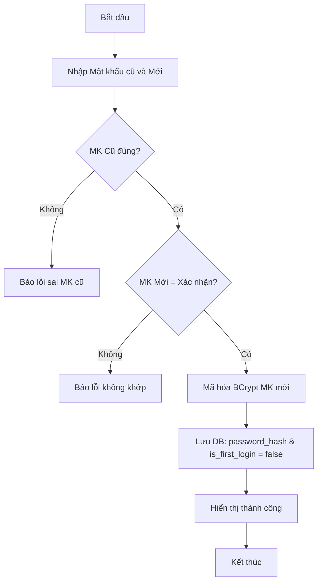

**Sequence Diagram (UC05):**
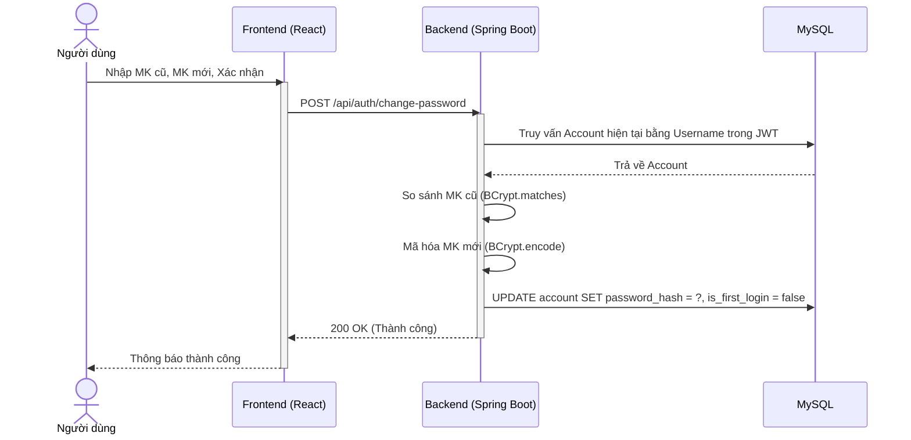

---
*Ghi chú: Nội dung Phần 2.1, 2.3 và Phân hệ 1 đã hoàn thiện. Vui lòng phản hồi "Tiếp tục" để hệ thống tự động sinh Phân hệ 2 (Danh mục Thuốc).*

---

### 2.2.4. Đặc tả chi tiết các Use Case (Phân hệ 2: Quản lý Danh mục và Dữ liệu Thuốc)

#### Biểu đồ Use Case Phân hệ 2
```mermaid
usecaseDiagram
    actor ProductManager as "Thủ kho (Product_manager)"
    actor Admin
    actor Sales as "Nhân viên BH (Sales)"
    
    package "Phân hệ 2: Danh mục và Thuốc" {
        usecase "Xem/Tìm kiếm thuốc" as UC13
        usecase "Thêm Thuốc mới" as UC14
        usecase "Sửa thông tin Thuốc" as UC15
        usecase "Xóa Thuốc" as UC16
        usecase "Quản lý Danh mục" as UC_CAT
        usecase "Quản lý Đơn vị tính" as UC_UNIT
        usecase "Quản lý Nước sản xuất" as UC_ORIGIN
    }
    
    ProductManager --> UC13
    ProductManager --> UC14
    ProductManager --> UC15
    ProductManager --> UC16
    ProductManager --> UC_CAT
    ProductManager --> UC_UNIT
    ProductManager --> UC_ORIGIN
    
    Admin --> UC13
    Admin --> UC14
    Admin --> UC15
    Admin --> UC16
    Admin --> UC_CAT
    Admin --> UC_UNIT
    Admin --> UC_ORIGIN
    
    Sales --> UC13
```

#### UC14: THÊM THÔNG TIN THUỐC MỚI
* **Tác nhân**: Product_manager, Admin
* **Tiền điều kiện**: Người dùng đã đăng nhập hệ thống với vai trò Admin hoặc Product_manager.
* **Luồng sự kiện chính**:
  1. Người dùng vào trang Danh sách thuốc, chọn Thêm thuốc mới.
  2. Hiển thị Form Thêm thuốc mới.
  3. Người dùng nhập: Mã thuốc, Tên thuốc, Hoạt chất, Giá bán lẻ, Danh mục, Đơn vị, Nước SX. Nhấn Lưu.
  4. Hệ thống kiểm tra Mã thuốc chưa tồn tại.
  5. Hệ thống lưu bản ghi vào bảng `medicine`. Báo thành công.
* **Luồng thay thế**:
  - Mã thuốc trùng lặp: Báo lỗi "Mã thuốc đã tồn tại".
  - Bỏ trống trường bắt buộc: Báo lỗi "Vui lòng nhập đầy đủ".

**Bảng Đặc tả Dữ liệu (Data Dictionary):**
| Tên Table | Cột (Field) | Loại thao tác | Dữ liệu cập nhật | Ý nghĩa |
| :--- | :--- | :--- | :--- | :--- |
| `medicine` | `medicine_code` | INSERT | Chuỗi (Unique) | Mã thuốc định danh |
| `medicine` | `name` | INSERT | Chuỗi | Tên thương mại của thuốc |
| `medicine` | `active_ingredient` | INSERT | Chuỗi | Hoạt chất chính |
| `medicine` | `retail_price` | INSERT | Số thực (> 0) | Giá bán lẻ mặc định |
| `medicine` | `catalog_id` | INSERT | FK (UUID) | ID Danh mục liên kết |
| `medicine` | `unit_id` | INSERT | FK (UUID) | ID Đơn vị tính cơ bản |

**Activity Diagram (UC14):**
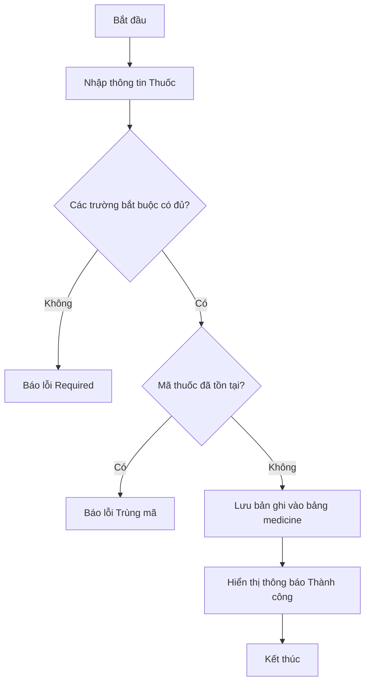

**Sequence Diagram (UC14):**
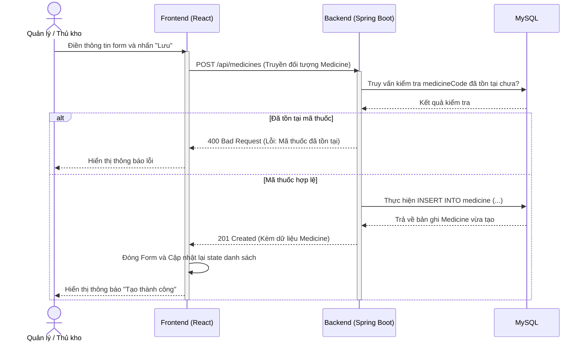

#### UC15: CẬP NHẬT THÔNG TIN THUỐC
* **Tác nhân**: Product_manager, Admin
* **Tiền điều kiện**: Người dùng đã đăng nhập hệ thống với vai trò Admin hoặc Product_manager.
* **Luồng sự kiện chính**:
  1. Người dùng chọn thuốc cần sửa, nhấn nút Sửa.
  2. Hiển thị Form chứa dữ liệu cũ (Mã thuốc bị khóa, không cho sửa).
  3. Người dùng cập nhật các trường và nhấn Lưu.
  4. Hệ thống kiểm tra hợp lệ và lưu thay đổi vào bảng `medicine`.
* **Luồng thay thế**: Bỏ trống trường bắt buộc sẽ báo lỗi.

**Bảng Đặc tả Dữ liệu (Data Dictionary):**
| Tên Table | Cột (Field) | Loại thao tác | Dữ liệu cập nhật | Ý nghĩa |
| :--- | :--- | :--- | :--- | :--- |
| `medicine` | `name`, `retail_price`, `active_ingredient`... | UPDATE | Các giá trị mới | Cập nhật thông tin chi tiết |

**Activity Diagram (UC15):**
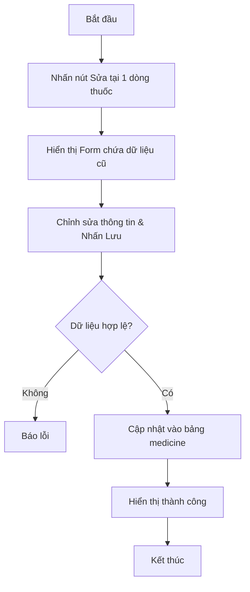

#### UC16: XÓA THÔNG TIN THUỐC
* **Tác nhân**: Product_manager, Admin
* **Tiền điều kiện**: Thuốc chưa từng phát sinh bất kỳ giao dịch kho nào (chưa nhập, xuất, bán).
* **Luồng sự kiện chính**:
  1. Chọn thuốc cần xóa, nhấn Xóa.
  2. Hệ thống cảnh báo xác nhận. Người dùng Xác nhận.
  3. Hệ thống kiểm tra ràng buộc liên kết (có tồn tại trong `inventory` không).
  4. Xóa bản ghi khỏi `medicine` và báo thành công.
* **Luồng thay thế**:
  - Đã có dữ liệu tồn kho: Báo lỗi "Không thể xóa thuốc vì đã phát sinh giao dịch tồn kho".

**Bảng Đặc tả Dữ liệu (Data Dictionary):**
| Tên Table | Cột (Field) | Loại thao tác | Dữ liệu cập nhật | Ý nghĩa |
| :--- | :--- | :--- | :--- | :--- |
| `medicine` | (Bản ghi nguyên dòng) | DELETE | Bản ghi ID tương ứng | Xóa vĩnh viễn khỏi danh mục |

**Activity Diagram (UC16):**
```mermaid
flowchart TD
    A[Bắt đầu] --> B[Nhấn Xóa]
    B --> C[Hiển thị cảnh báo]
    C --> D{Người dùng Xác nhận?}
    D -- Không --> E[Hủy thao tác]
    D -- Có --> F{Đã có trong kho (inventory)?}
    F -- Có --> G[Báo lỗi: Đã phát sinh giao dịch]
    F -- Không --> H[Xóa khỏi bảng medicine]
    H --> I[Hiển thị thành công]
    I --> J[Kết thúc]
```

**Sequence Diagram (UC16):**
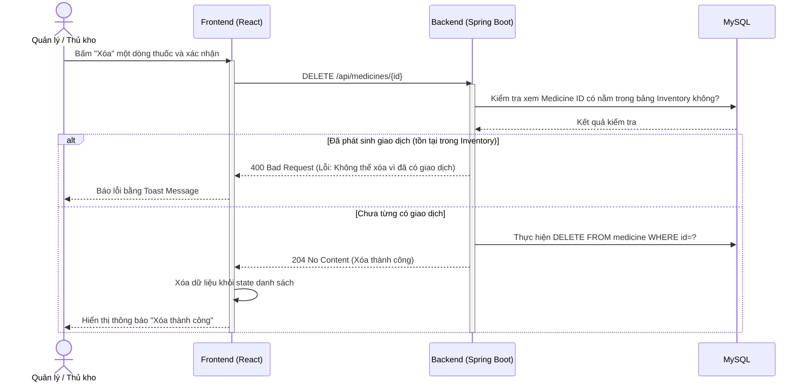

---

### 2.2.5. Đặc tả chi tiết các Use Case (Phân hệ 4: Nghiệp vụ Kho Thuốc)

#### Biểu đồ Use Case Phân hệ Nghiệp vụ Kho
```mermaid
usecaseDiagram
    actor ProductManager as "Thủ kho (Product_manager)"
    actor Admin
    
    package "Phân hệ 4: Nghiệp vụ Kho Thuốc" {
        usecase "Lập phiếu nhập kho nháp" as UC22
        usecase "Xác nhận nhập kho" as UC23
        usecase "Hủy phiếu nhập nháp" as UC24
        usecase "Lập phiếu xuất kho nháp" as UC25
        usecase "Xác nhận xuất kho" as UC26
        usecase "Hủy phiếu xuất nháp" as UC27
    }
    
    ProductManager --> UC22
    ProductManager --> UC23
    ProductManager --> UC24
    ProductManager --> UC25
    ProductManager --> UC26
    ProductManager --> UC27
    
    Admin --> UC22
    Admin --> UC23
    Admin --> UC24
    Admin --> UC25
    Admin --> UC26
    Admin --> UC27
```

#### UC22 & UC23: LẬP VÀ XÁC NHẬN PHIẾU NHẬP KHO
* **Tác nhân**: Product_manager, Admin
* **Tiền điều kiện**: Thuốc cần nhập đã tồn tại trong Danh mục Thuốc.
* **Luồng sự kiện chính (Lập nháp - UC22)**:
  1. Người dùng vào giao diện Nhập kho, chọn Tạo phiếu mới.
  2. Hệ thống tạo mã phiếu nhập tự động (VD: REC-1001).
  3. Người dùng chọn Nhà cung cấp, chọn Thuốc, nhập thông tin Lô (Batch), Hạn sử dụng, Số lượng, Giá nhập.
  4. Nhấn **Lưu nháp**. Hệ thống lưu phiếu ở trạng thái `DRAFT`.
* **Luồng sự kiện chính (Xác nhận - UC23)**:
  1. Từ phiếu nhập `DRAFT`, người dùng nhấn **Xác nhận nhập kho**.
  2. Hệ thống kiểm tra dữ liệu, thay đổi trạng thái phiếu thành `CONFIRMED`.
  3. Duyệt từng dòng chi tiết: Cộng dồn số lượng vào Tồn kho lô (`inventory`).
  4. Ghi nhận lịch sử giao dịch vào thẻ kho (`inventory_transaction`).
* **Luồng thay thế**:
  - Hạn sử dụng nhỏ hơn ngày hiện tại: Báo lỗi "Thuốc đã hết hạn, không thể nhập kho".

**Bảng Đặc tả Dữ liệu (Data Dictionary):**
| Tên Table | Cột (Field) | Loại thao tác | Dữ liệu cập nhật | Ý nghĩa |
| :--- | :--- | :--- | :--- | :--- |
| `receipt` | `status` | UPDATE | `CONFIRMED` | Chốt phiếu |
| `inventory` | `stock_quantity` | INSERT/UPDATE | Cộng thêm SL nhập | Tăng tồn kho theo lô |
| `inventory_transaction` | `transaction_type` | INSERT | `IMPORT` | Loại giao dịch nhập |
| `inventory_transaction` | `quantity_change` | INSERT | Giá trị dương (+) | Số lượng tăng lên |

**Activity Diagram (Xác nhận Nhập kho):**
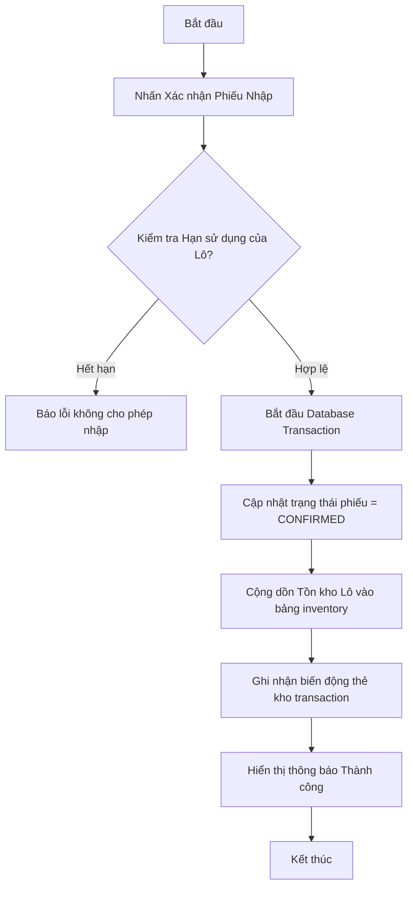

**Sequence Diagram (Xác nhận Nhập kho):**
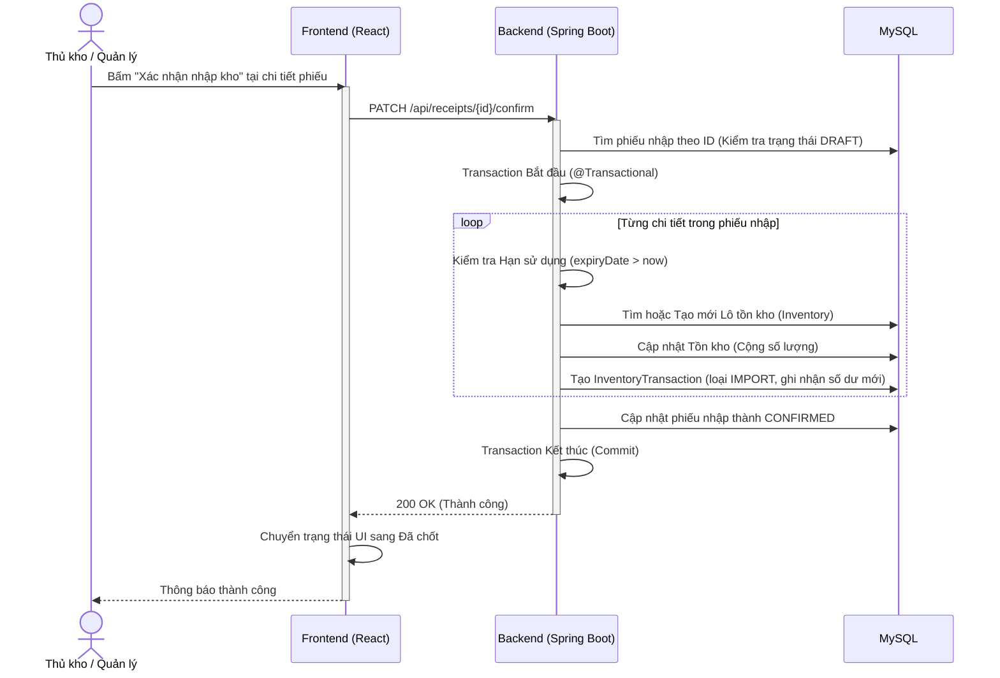

#### UC25 & UC26: LẬP VÀ XÁC NHẬN PHIẾU XUẤT KHO
* **Tác nhân**: Product_manager, Admin
* **Tiền điều kiện**: Thuốc cần xuất phải có Lô tồn kho > 0.
* **Luồng sự kiện chính (Lập nháp - UC25)**:
  1. Người dùng vào giao diện Xuất kho, chọn Tạo phiếu xuất.
  2. Chọn Lý do xuất (Xuất hủy, Trả hàng, Khác).
  3. Chọn cụ thể Lô thuốc cần xuất, nhập số lượng. Nhấn Lưu nháp (trạng thái `DRAFT`).
* **Luồng sự kiện chính (Xác nhận - UC26)**:
  1. Nhấn **Xác nhận xuất kho**.
  2. Hệ thống kiểm tra số lượng tồn kho thực tế của Lô đó so với số lượng định xuất.
  3. Nếu đủ, trừ tồn kho và ghi nhận giao dịch `EXPORT`. Đổi trạng thái phiếu thành `CONFIRMED`.
* **Luồng thay thế**:
  - Tồn kho không đủ: Hệ thống bắt lỗi, Rollback toàn bộ giao dịch và báo lỗi "Không đủ số lượng trong kho".

**Bảng Đặc tả Dữ liệu (Data Dictionary):**
| Tên Table | Cột (Field) | Loại thao tác | Dữ liệu cập nhật | Ý nghĩa |
| :--- | :--- | :--- | :--- | :--- |
| `issue` | `status` | UPDATE | `CONFIRMED` | Chốt phiếu xuất |
| `inventory` | `stock_quantity` | UPDATE | Trừ đi SL xuất | Giảm tồn kho theo lô |
| `inventory_transaction` | `transaction_type` | INSERT | `EXPORT` | Loại giao dịch xuất |
| `inventory_transaction` | `quantity_change` | INSERT | Giá trị âm (-) | Số lượng giảm xuống |

**Activity Diagram (Xác nhận Xuất kho):**
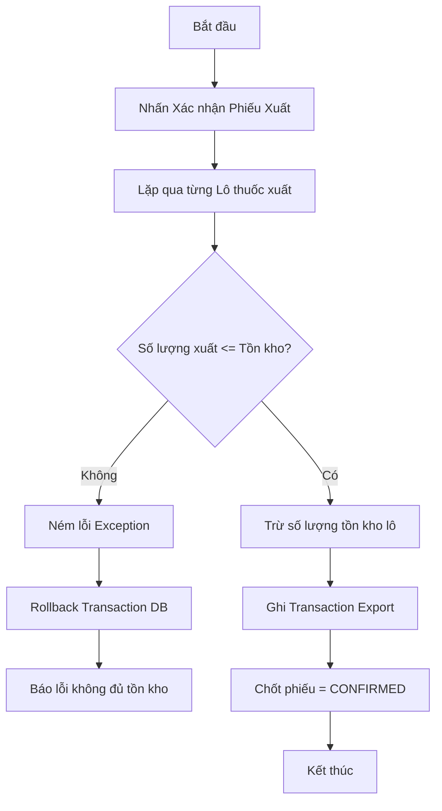

**Sequence Diagram (Xác nhận Xuất kho):**
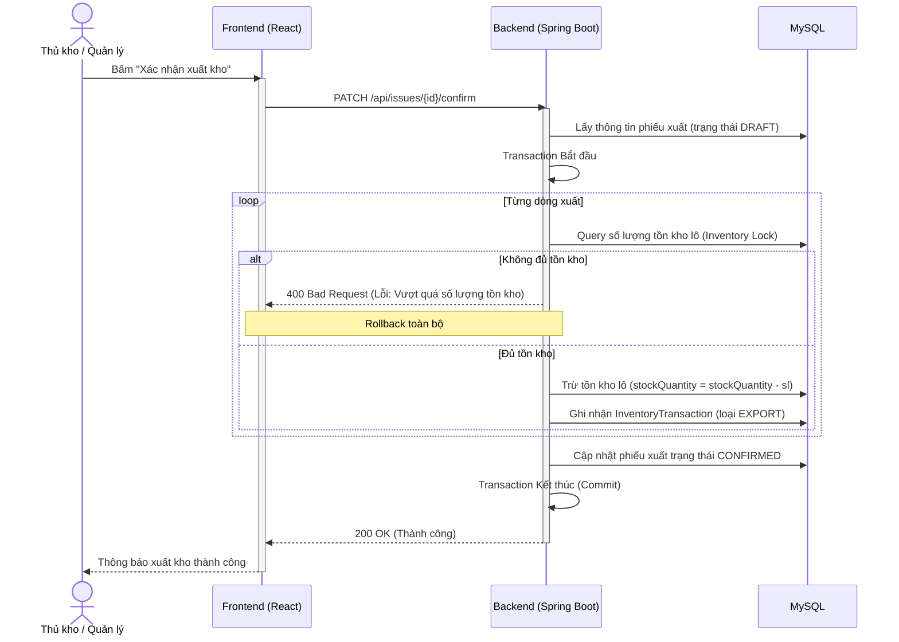

---

### 2.2.6. Đặc tả chi tiết các Use Case (Phân hệ 5 & 6: Bán hàng POS và Thẻ kho)

#### Biểu đồ Use Case Phân hệ Bán hàng & Thẻ kho
```mermaid
usecaseDiagram
    actor Sales as "Nhân viên BH (Sales)"
    actor Admin
    actor ProductManager as "Thủ kho"
    
    package "Phân hệ 5 & 6: POS và Thẻ kho" {
        usecase "Tìm kiếm thuốc tại quầy" as UC31_1
        usecase "Lập hóa đơn bán lẻ (POS)" as UC31
        usecase "Thanh toán & Trừ kho" as UC31_2
        usecase "Xem lịch sử thẻ kho" as UC32
    }
    
    Sales --> UC31_1
    Sales --> UC31
    Sales --> UC31_2
    
    Admin --> UC31
    Admin --> UC32
    ProductManager --> UC32
```

#### UC31: LẬP HÓA ĐƠN BÁN LẺ THUỐC TẠI QUẦY (POS)
* **Tác nhân**: Sales, Admin
* **Tiền điều kiện**: Lô thuốc phải còn Hạn sử dụng và số lượng Tồn kho > 0.
* **Luồng sự kiện chính**:
  1. Nhân viên tìm kiếm thuốc, chọn lô thuốc và thêm vào Giỏ hàng POS.
  2. Chọn khách hàng (nếu có). Điền số tiền khách đưa.
  3. Hệ thống tự động tính tổng tiền hóa đơn và tiền thừa.
  4. Nhân viên nhấn **Thanh toán**.
  5. Hệ thống duyệt từng chi tiết giỏ hàng: Quy đổi số lượng bán ra đơn vị cơ bản, trừ trực tiếp vào Tồn kho Lô (`inventory`).
  6. Ghi nhận giao dịch `SALE` vào lịch sử thẻ kho (`inventory_transaction`).
  7. Lưu hóa đơn vào bảng `invoice` với trạng thái `PAID`.
  8. Hệ thống gọi tính năng in bill nhiệt (window.print).
* **Luồng thay thế**:
  - Tồn kho không đủ tại thời điểm nhấn thanh toán (do có người khác vừa xuất): Hệ thống Rollback giao dịch, báo lỗi "Không đủ tồn kho lô thuốc".

**Bảng Đặc tả Dữ liệu (Data Dictionary):**
| Tên Table | Cột (Field) | Loại thao tác | Dữ liệu cập nhật | Ý nghĩa |
| :--- | :--- | :--- | :--- | :--- |
| `invoice` | Bản ghi mới | INSERT | Thông tin hóa đơn | Lưu tổng tiền, tiền thừa |
| `invoice_detail` | Bản ghi mới | INSERT | Chi tiết thuốc bán | Số lượng, giá bán lẻ |
| `inventory` | `stock_quantity` | UPDATE | Trừ đi SL bán | Trừ tồn kho lô FEFO |
| `inventory_transaction`| `transaction_type`| INSERT | `SALE` | Lịch sử bán hàng |

**Activity Diagram (POS Bán hàng):**
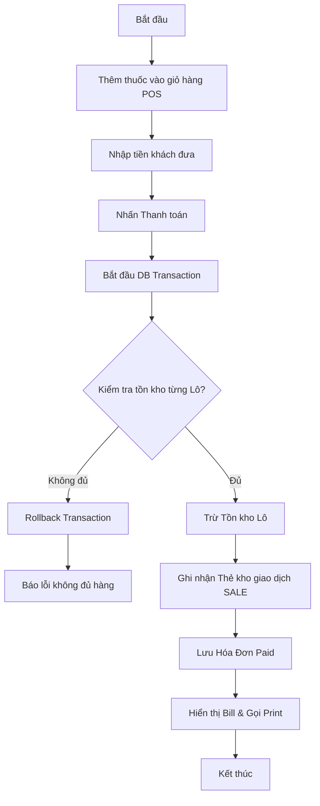

**Sequence Diagram (UC31 - POS Bán hàng):**
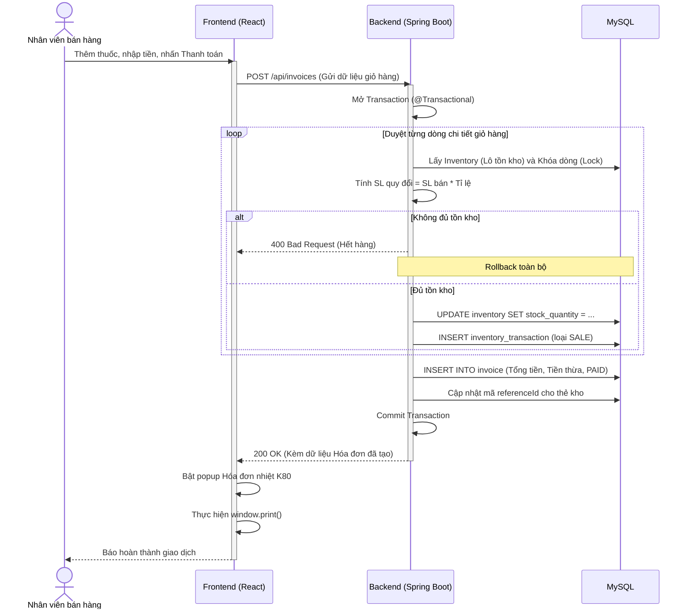

#### UC32: XEM LỊCH SỬ THẺ KHO CỦA THUỐC
* **Tác nhân**: Product_manager, Admin
* **Tiền điều kiện**: Không có.
* **Luồng sự kiện chính**:
  1. Người dùng vào chức năng Thẻ kho, tìm kiếm và chọn một thuốc cụ thể.
  2. Hệ thống gọi API truy vấn bảng `inventory_transaction` theo ID của thuốc.
  3. Cơ sở dữ liệu trả về toàn bộ biến động: Nhập (IMPORT), Xuất (EXPORT), Bán lẻ (SALE), Đối soát (AUDIT_ADJUST) sắp xếp theo thời gian mới nhất.
  4. Frontend định dạng dữ liệu, tính toán số dư lũy kế và hiển thị dưới dạng bảng chi tiết.

**Bảng Đặc tả Dữ liệu (Data Dictionary):**
| Tên Table | Cột (Field) | Loại thao tác | Dữ liệu cập nhật | Ý nghĩa |
| :--- | :--- | :--- | :--- | :--- |
| `inventory_transaction`| N/A | SELECT | Tra cứu | Đọc dữ liệu biến động |
| `inventory` | N/A | SELECT | Tra cứu | Lấy thông tin lô |

**Activity Diagram (UC32):**
```mermaid
flowchart TD
    A[Bắt đầu] --> B[Chọn tính năng Thẻ Kho]
    B --> C[Gõ tên thuốc cần xem]
    C --> D[Gọi API /inventory/transactions]
    D --> E[Lấy dữ liệu từ DB, sắp xếp theo thời gian]
    E --> F[Frontend tính số dư lũy kế]
    F --> G[Hiển thị bảng chi tiết Thẻ kho]
    G --> H[Kết thúc]
```

**Sequence Diagram (UC32):**
```mermaid
sequenceDiagram
    actor ND as Quản lý / Thủ kho
    participant FE as Frontend (React)
    participant BE as Backend (Spring Boot)
    participant DB as MySQL
    
    ND->>FE: Chọn thuốc cần xem thẻ kho
    activate FE
    FE->>BE: GET /api/inventory/transactions?medicineId={id}
    activate BE
    BE->>DB: Truy vấn tất cả giao dịch kho của thuốc đó
    activate DB
    DB-->>BE: Danh sách InventoryTransaction
    deactivate DB
    BE-->>FE: 200 OK (Mảng danh sách lịch sử)
    deactivate BE
    FE->>FE: Tính toán số dư và render bảng
    FE-->>ND: Hiển thị Thẻ kho chi tiết
    deactivate FE
```
