# TÀI LIỆU 32 BIỂU ĐỒ HOẠT ĐỘNG (ACTIVITY DIAGRAMS) - HỆ THỐNG PIS

Tài liệu này cung cấp chi tiết **32 Biểu đồ Hoạt động (Activity Diagrams)** tương ứng với 32 Use Case cốt lõi của hệ thống **PIS - Quản lý kho thuốc và Bán lẻ POS**. 
Tất cả biểu đồ được mô tả chuẩn hóa bằng cú pháp **Mermaid Flowchart (flowchart TD)**, thể hiện rõ ràng các hành động của Người dùng, các bước kiểm tra nghiệp vụ và xử lý dữ liệu của Hệ thống.

---

## PHÂN HỆ 1: XÁC THỰC VÀ TÀI KHOẢN CÁ NHÂN (UC01 - UC06)

### UC01: Đăng nhập hệ thống (System Login)
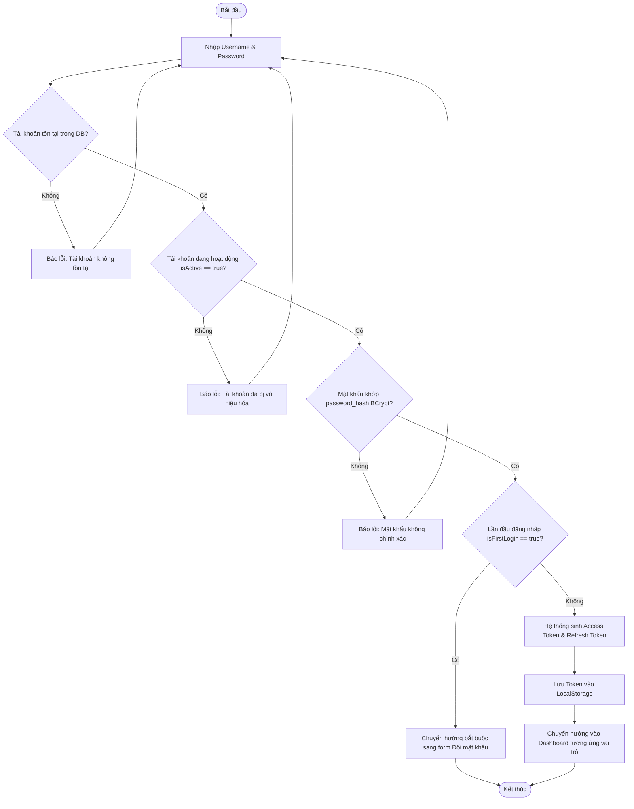

### UC02: Đăng xuất hệ thống (System Logout)
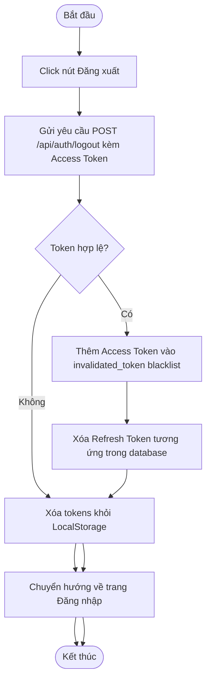

### UC03: Làm mới Token tự động (Token Refresh)
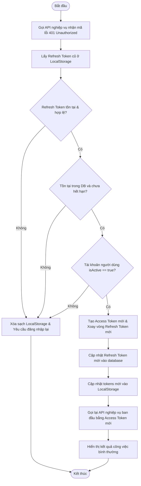

### UC04: Xem thông tin tài khoản cá nhân (Get Me)
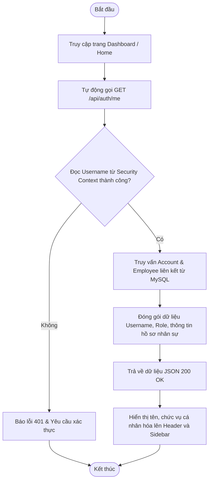

### UC05: Đổi mật khẩu tài khoản (Change Password)
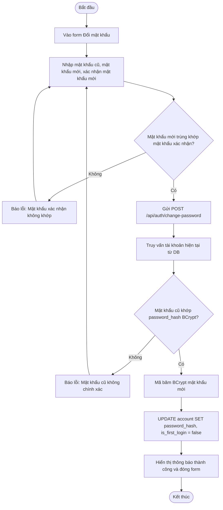

### UC06: Cấp lại mật khẩu tạm khi quên mật khẩu (Forgot Password)
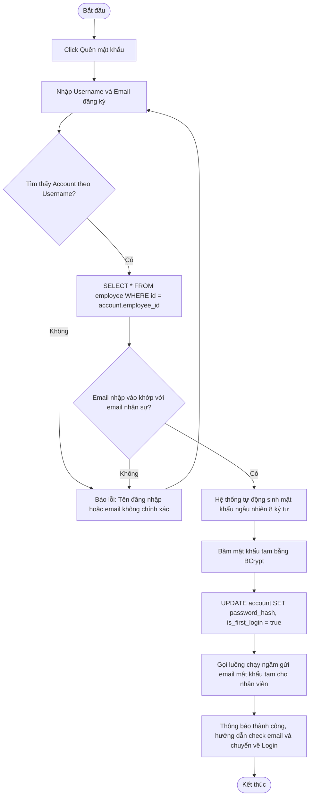

---

## PHÂN HỆ 2: QUẢN LÝ DANH MỤC VÀ DỮ LIỆU THUỐC (UC07 - UC16)

### UC07: Xem danh sách danh mục thuốc (View Catalogs)
```mermaid
flowchart TD
    Start([Bắt đầu]) --> ClickCatalog[Chọn menu Danh mục thuốc]
    ClickCatalog --> SendAPI[Gửi GET /api/catalogs kèm page, size, search]
    SendAPI --> QueryDB[SELECT * FROM catalog lọc theo từ khóa & LIMIT/OFFSET]
    QueryDB --> CountDB[SELECT COUNT(*) FROM catalog]
    CountDB --> PageResponse[Đóng gói dữ liệu danh sách và thông tin phân trang]
    PageResponse --> RenderTable[Hiển thị danh sách danh mục thuốc lên bảng dữ liệu] --> End([Kết thúc])
```

### UC08: Thêm danh mục thuốc mới (Create Catalog)
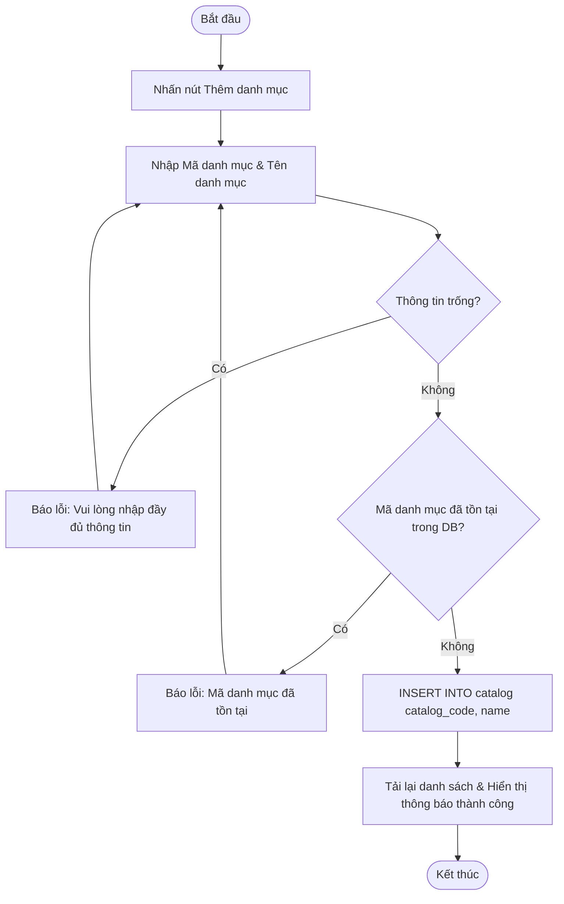

### UC09: Cập nhật danh mục thuốc (Update Catalog)
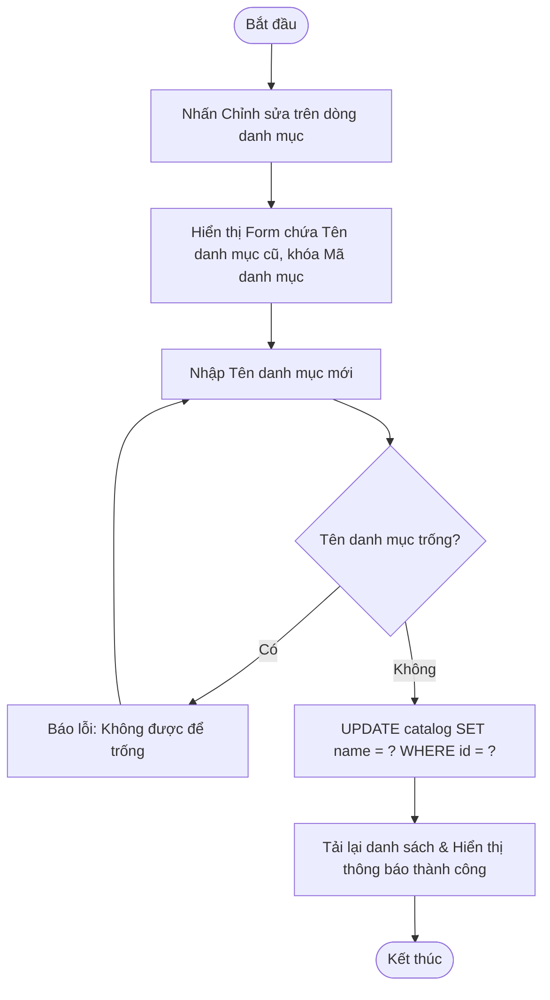

### UC10: Xóa danh mục thuốc (Delete Catalog)
```mermaid
flowchart TD
    Start([Bắt đầu]) --> ClickDelete[Nhấn Xóa trên dòng danh mục]
    ClickDelete --> ConfirmDialog{Xác nhận xóa?}
    ConfirmDialog -- Không --> End([Kết thúc])
    ConfirmDialog -- Có --> LinkCheck{SELECT COUNT(*) FROM medicine WHERE catalog_id = ?}
    LinkCheck -- Có liên kết > 0 --> Error[Báo lỗi: Không thể xóa vì danh mục đang chứa thuốc] --> End
    LinkCheck -- Không liên kết == 0 --> DeleteDB[DELETE FROM catalog WHERE id = ?]
    DeleteDB --> Reload[Tải lại danh sách & Báo xóa thành công] --> End
```

### UC11: Quản lý nước sản xuất - Origin CRUD
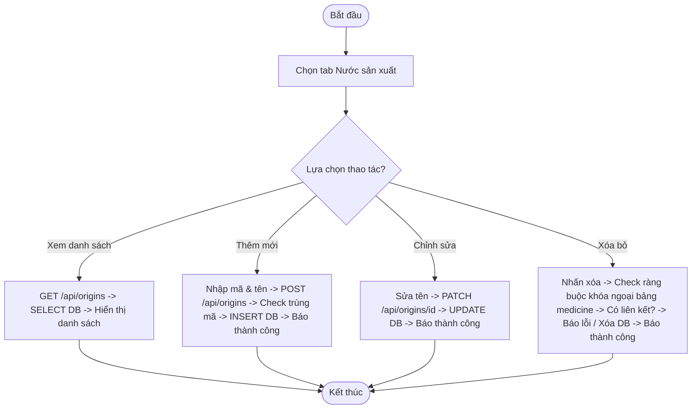

### UC12: Quản lý đơn vị tính - Unit CRUD
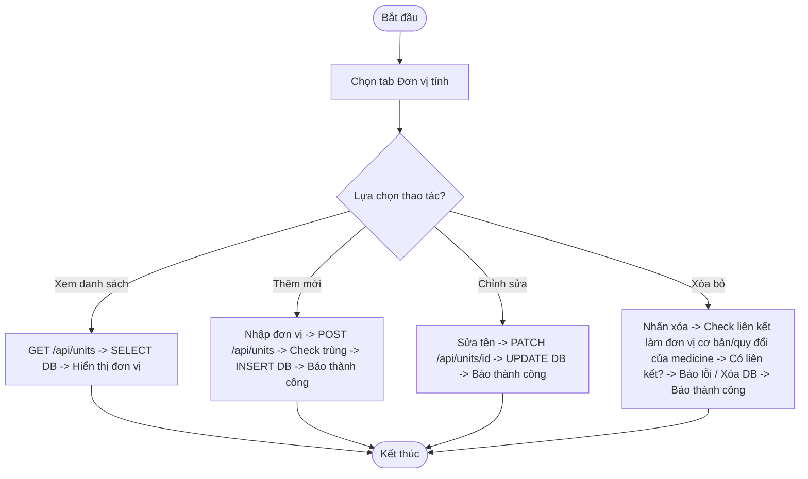

### UC13: Xem danh sách và tìm kiếm thuốc (Search Medicines)
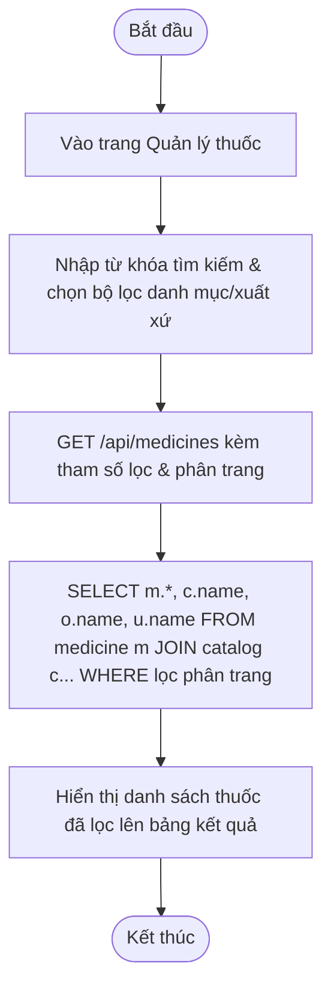

### UC14: Thêm thông tin thuốc mới (Create Medicine)
```mermaid
flowchart TD
    Start([Bắt đầu]) --> ClickAdd[Nhấn nút Thêm thuốc mới]
    ClickAdd --> InputData[Nhập: Mã thuốc, Tên thuốc, giá bán, hoạt chất, danh mục, đơn vị cơ bản]
    InputData --> Validate{Các trường bắt buộc đầy đủ?}
    Validate -- Không --> Error1[Báo lỗi: Thiếu thông tin bắt buộc] --> InputData
    Validate -- Có --> CodeCheck{SELECT COUNT(*) FROM medicine WHERE medicine_code = ?}
    CodeCheck -- Trùng > 0 --> Error2[Báo lỗi: Mã thuốc đã tồn tại] --> InputData
    CodeCheck -- Không trùng == 0 --> ForeignCheck{Kiểm tra Catalog, Unit, Origin tồn tại?}
    ForeignCheck -- Không --> Error3[Báo lỗi: Liên kết dữ liệu nền không hợp lệ] --> InputData
    ForeignCheck -- Có --> InsertDB[INSERT INTO medicine ...]
    InsertDB --> Reload[Tải lại danh sách thuốc & Báo tạo thành công] --> End([Kết thúc])
```

### UC15: Cập nhật thông tin thuốc (Update Medicine)
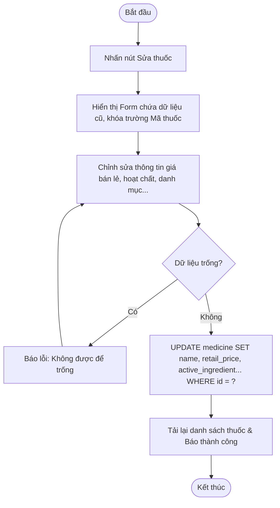

### UC16: Xóa thông tin thuốc (Delete Medicine)
```mermaid
flowchart TD
    Start([Bắt đầu]) --> ClickDelete[Nhấn Xóa trên dòng thuốc]
    ClickDelete --> ConfirmDialog{Xác nhận xóa thuốc?}
    ConfirmDialog -- Không --> End([Kết thúc])
    ConfirmDialog -- Có --> StockCheck{SELECT COUNT(*) FROM inventory WHERE medicine_id = ?}
    StockCheck -- Đã có lô hàng > 0 --> Error[Báo lỗi: Không thể xóa vì đã phát sinh lô hàng/giao dịch kho] --> End
    StockCheck -- Chưa có lô == 0 --> DeleteDB[DELETE FROM medicine WHERE id = ?]
    DeleteDB --> Reload[Tải lại danh sách & Báo xóa thành công] --> End
```

---

## PHÂN HỆ 3: QUẢN LÝ ĐỐI TÁC VÀ NHÂN SỰ (UC17 - UC21)

### UC17: Quản lý nhà cung cấp - Supplier CRUD
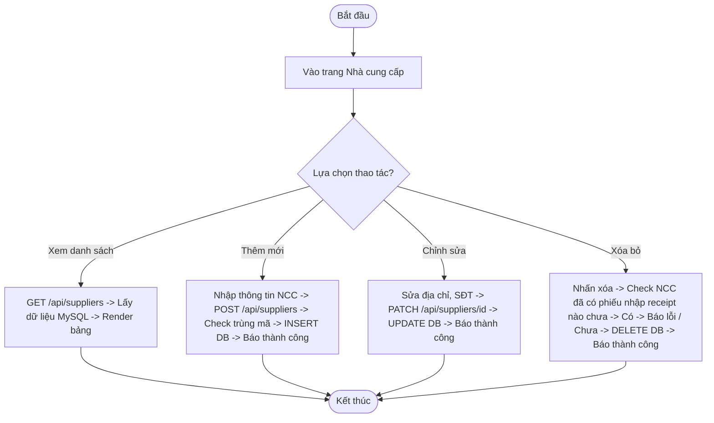

### UC18: Quản lý thông tin khách hàng - Customer CRUD
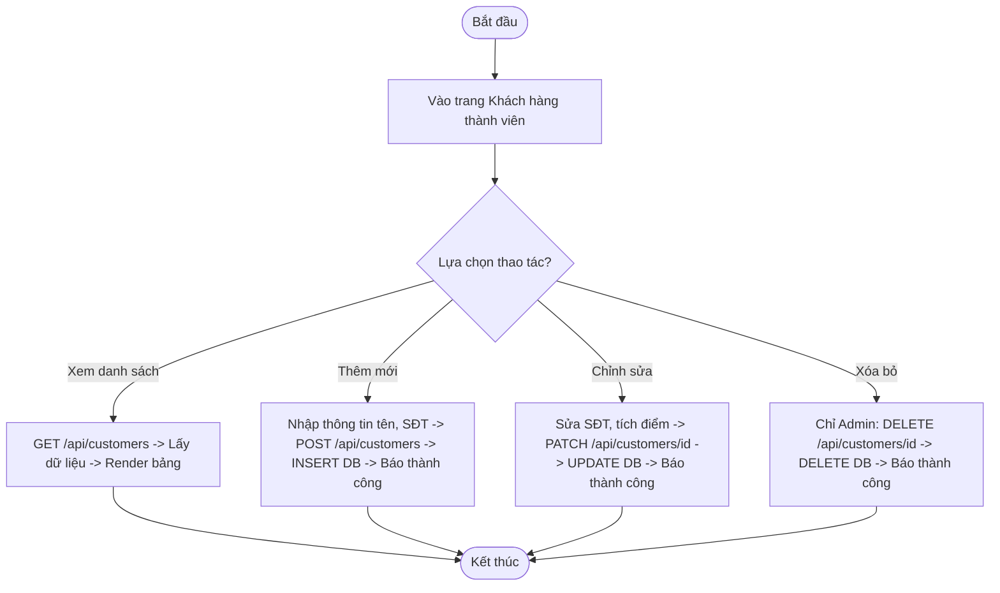

### UC19: Quản lý thông tin nhân viên - Employee CRUD
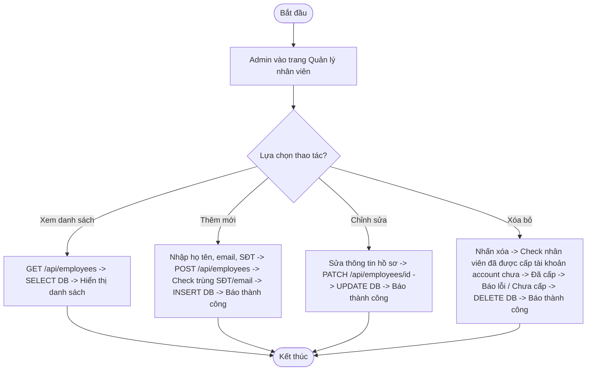

### UC20: Quản lý tài khoản người dùng - Account CRUD
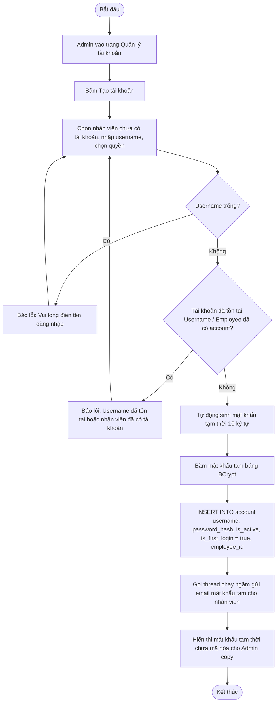

### UC21: Đặt lại mật khẩu nhân viên - Admin Reset Password
```mermaid
flowchart TD
    Start([Bắt đầu]) --> SelectAccount[Admin chọn tài khoản nhân viên cần reset]
    SelectAccount --> ClickReset[Bấm nút Đặt lại mật khẩu]
    ClickReset --> ConfirmDialog{Xác nhận reset mật khẩu?}
    ConfirmDialog -- Không --> End([Kết thúc])
    ConfirmDialog -- Có --> GenerateNew[Hệ thống tự động sinh mật khẩu ngẫu nhiên mới]
    GenerateNew --> HashNew[Mã hóa BCrypt mật khẩu mới]
    HashNew --> UpdateDB[UPDATE account SET password_hash, is_first_login = true WHERE username = ?]
    UpdateDB --> SendMail[Gửi email thông báo mật khẩu mới cho nhân viên]
    SendMail --> ShowResponse[Trả về mật khẩu mới trên giao diện cho Admin] --> End
```

---

## PHÂN HỆ 4: NGHIỆP VỤ KHO THUỐC (UC22 - UC30)

### UC22: Lập phiếu nhập kho nháp (Create Goods Receipt Draft)
```mermaid
flowchart TD
    Start([Bắt đầu]) --> OpenReceipt[Vào trang Tạo phiếu nhập kho]
    OpenReceipt --> SelectSupplier[Chọn Nhà cung cấp]
    SelectSupplier --> SelectMedicine[Tìm chọn thuốc cần nhập]
    SelectMedicine --> InputBatch[Nhập: Số lô, hạn sử dụng, số lượng nhập, đơn vị quy đổi, giá nhập]
    InputBatch --> AddItem[Bấm Thêm dòng kê]
    AddItem --> MoreItem{Nhập thêm thuốc khác?}
    MoreItem -- Có --> SelectMedicine
    MoreItem -- Không --> ClickSaveDraft[Nhấn nút Lưu nháp]
    ClickSaveDraft --> GenCode[Sinh mã phiếu REC-XXX & đặt trạng thái DRAFT]
    GenCode --> InsertReceipt[INSERT INTO goods_receipt & goods_receipt_detail]
    InsertReceipt --> ShowSuccess[Thông báo tạo nháp thành công, hiển thị lên danh sách] --> End([Kết thúc])
```

### UC23: Xác nhận phiếu nhập kho (Confirm Goods Receipt)
```mermaid
flowchart TD
    Start([Bắt đầu]) --> OpenDraft[Mở chi tiết phiếu nhập kho DRAFT]
    OpenDraft --> ClickConfirm[Nhấn Xác nhận nhập kho]
    ClickConfirm --> StateCheck{Phiếu đang ở trạng thái DRAFT?}
    StateCheck -- Không --> Error1[Báo lỗi: Phiếu đã được xử lý trước đó] --> End([Kết thúc])
    StateCheck -- Có --> StartTrans[Khởi chạy Database Transaction @Transactional]
    StartTrans --> LoopDetails[Duyệt từng dòng chi tiết thuốc nhập]
    LoopDetails --> ExpCheck{Hạn sử dụng lớn hơn ngày hiện tại?}
    ExpCheck -- Hết hạn --> Error2[Ném Exception: Thuốc đã hết hạn dùng]
    Error2 --> Rollback[Hủy bỏ mọi cập nhật Rollback Transaction] --> ShowErrorUI[Hiển thị báo lỗi chi tiết trên màn hình] --> End
    ExpCheck -- Hợp lệ --> ConvertUnit[Quy đổi số lượng thực nhập về đơn vị cơ bản]
    ConvertUnit --> QueryInventory{Lô hàng đã tồn tại trong bảng inventory?}
    QueryInventory -- Chưa --> CreateInv[INSERT INTO inventory Tạo lô hàng mới với SL quy đổi] --> WriteTrans
    QueryInventory -- Rồi --> AddInv[UPDATE inventory Cộng dồn SL quy đổi & Cập nhật giá nhập] --> WriteTrans
    WriteTrans[INSERT INTO inventory_transaction Ghi thẻ kho biến động IMPORT số lượng dương] --> LoopNext{Duyệt hết danh sách?}
    LoopNext -- Chưa --> LoopDetails
    LoopNext -- Rồi --> UpdateState[UPDATE goods_receipt SET status = 'CONFIRMED']
    UpdateState --> CommitTrans[Commit Transaction hoàn tất]
    CommitTrans --> ShowSuccessUI[Thông báo thành công & Tự động gọi popup HTML in phiếu nhiệt] --> End
```

### UC24: Hủy phiếu nhập kho nháp (Cancel Goods Receipt)
```mermaid
flowchart TD
    Start([Bắt đầu]) --> OpenDraft[Mở chi tiết phiếu nhập nháp DRAFT]
    OpenDraft --> ClickCancel[Nhấn nút Hủy phiếu]
    ClickCancel --> ConfirmDialog{Xác nhận hủy?}
    ConfirmDialog -- Không --> End([Kết thúc])
    ConfirmDialog -- Có --> StateCheck{Phiếu đang ở trạng thái DRAFT?}
    StateCheck -- Không --> Error[Báo lỗi: Chỉ được hủy phiếu nháp] --> End
    StateCheck -- Có --> UpdateState[UPDATE goods_receipt SET status = 'CANCELLED']
    UpdateState --> ShowSuccess[Thông báo hủy phiếu thành công & tải lại giao diện] --> End
```

### UC25: Lập phiếu xuất kho nháp (Create Goods Issue Draft)
```mermaid
flowchart TD
    Start([Bắt đầu]) --> OpenIssue[Vào trang Tạo phiếu xuất kho]
    OpenIssue --> SelectReason[Chọn lý do xuất kho & ghi chú]
    SelectReason --> FindInv[Tìm chọn lô thuốc inventory còn tồn trong kho]
    FindInv --> InputQty[Nhập số lượng xuất & đơn vị xuất]
    InputQty --> AddItem[Bấm Thêm dòng kê]
    AddItem --> MoreItem{Xuất thêm thuốc khác?}
    MoreItem -- Có --> FindInv
    MoreItem -- Không --> ClickSaveDraft[Nhấn nút Lưu nháp]
    ClickSaveDraft --> GenCode[Sinh mã phiếu GIN-XXX & đặt trạng thái DRAFT]
    GenCode --> InsertIssue[INSERT INTO goods_issue & goods_issue_detail]
    InsertIssue --> ShowSuccess[Thông báo tạo nháp thành công, hiển thị lên bảng kê] --> End([Kết thúc])
```

### UC26: Xác nhận phiếu xuất kho (Confirm Goods Issue)
```mermaid
flowchart TD
    Start([Bắt đầu]) --> OpenDraft[Mở chi tiết phiếu xuất nháp DRAFT]
    OpenDraft --> ClickConfirm[Nhấn Xác nhận xuất kho]
    ClickConfirm --> StateCheck{Phiếu đang ở trạng thái DRAFT?}
    StateCheck -- Không --> Error1[Báo lỗi: Phiếu đã được xử lý trước đó] --> End([Kết thúc])
    StateCheck -- Có --> StartTrans[Khởi chạy Database Transaction @Transactional]
    StartTrans --> LoopDetails[Duyệt từng dòng chi tiết xuất]
    LoopDetails --> LockRow[Truy vấn khóa dòng lô tồn kho SELECT FOR UPDATE]
    LockRow --> ConvertUnit[Quy đổi số lượng xuất về đơn vị cơ bản]
    ConvertUnit --> StockCheck{Số lượng xuất <= Tồn kho thực tế của lô?}
    StockCheck -- Không đủ --> Error2[Ném Exception: Không đủ tồn kho thực tế]
    Error2 --> Rollback[Hủy bỏ mọi cập nhật Rollback Transaction] --> ShowErrorUI[Hiển thị báo lỗi thiếu hàng trên màn hình] --> End
    StockCheck -- Đủ --> SubStock[UPDATE inventory SET stock_quantity = stock_quantity - SL_quydoi]
    SubStock --> ZeroCheck{Tồn kho của lô giảm về 0?}
    ZeroCheck -- Có --> UpdateInvStatus[Đặt trạng thái lô status = 'SOLD_OUT'] --> WriteTrans
    ZeroCheck -- Không --> WriteTrans[INSERT INTO inventory_transaction Ghi thẻ kho EXPORT số lượng âm]
    WriteTrans --> LoopNext{Duyệt hết danh sách?}
    LoopNext -- Chưa --> LoopDetails
    LoopNext -- Rồi --> UpdateState[UPDATE goods_issue SET status = 'CONFIRMED']
    UpdateState --> CommitTrans[Commit Transaction hoàn tất]
    CommitTrans --> ShowSuccessUI[Thông báo xuất kho thành công & hỗ trợ in phiếu] --> End
```

### UC27: Hủy phiếu xuất kho nháp (Cancel Goods Issue)
```mermaid
flowchart TD
    Start([Bắt đầu]) --> OpenDraft[Mở chi tiết phiếu xuất nháp DRAFT]
    OpenDraft --> ClickCancel[Nhấn nút Hủy phiếu]
    ClickCancel --> ConfirmDialog{Xác nhận hủy?}
    ConfirmDialog -- Không --> End([Kết thúc])
    ConfirmDialog -- Có --> StateCheck{Phiếu đang ở trạng thái DRAFT?}
    StateCheck -- Không --> Error[Báo lỗi: Chỉ được hủy phiếu nháp] --> End
    StateCheck -- Có --> UpdateState[UPDATE goods_issue SET status = 'CANCELLED']
    UpdateState --> ShowSuccess[Thông báo hủy phiếu xuất thành công & tải lại giao diện] --> End
```

### UC28: Lập phiếu kiểm kê kho nháp (Create Stock Audit Draft)
```mermaid
flowchart TD
    Start([Bắt đầu]) --> ClickCreate[Nhấn Tạo phiếu kiểm kê mới]
    ClickCreate --> StartTrans[Khởi chạy Transaction @Transactional]
    StartTrans --> LoadActive[SELECT * FROM inventory WHERE stock_quantity >= 0 AND status = 'ACTIVE']
    LoadActive --> GenCode[Sinh mã phiếu AUD-XXX & Đặt trạng thái DRAFT]
    GenCode --> InsertAudit[INSERT INTO audit]
    InsertAudit --> LoopItems[Sao chụp tồn kho hệ thống của từng lô vào system_quantity]
    LoopItems --> InsertDetails[INSERT INTO audit_detail actual_quantity = system_quantity, discrepancy = 0]
    InsertDetails --> LoopNext{Duyệt hết danh sách lô hàng?}
    LoopNext -- Chưa --> LoopItems
    LoopNext -- Rồi --> CommitTrans[Commit Transaction]
    CommitTrans --> RenderUI[Hiển thị danh sách các lô kiểm kê với SL sổ sách lên màn hình] --> End([Kết thúc])
```

### UC29: Nhập số đếm thực tế kiểm kho (Save Audit Quantities)
```mermaid
flowchart TD
    Start([Bắt đầu]) --> ClickStart[Nhấn Bắt đầu thực hiện kiểm kho]
    ClickStart --> UpdateStatus[UPDATE audit SET status = 'IN_PROGRESS']
    UpdateStatus --> RenderInputs[Mở khóa các ô nhập Số lượng thực tế trên giao diện]
    RenderInputs --> InputCounts[Kiểm đếm kho thực tế & điền Số lượng thực tế của từng lô]
    InputCounts --> AutoCalc[Frontend tự động tính chênh lệch thừa/thiếu hiển thị trực quan]
    AutoCalc --> ClickSave[Nhấn nút Lưu tạm]
    ClickSave --> StartTrans[Khởi chạy Transaction]
    StartTrans --> LoopUpdates[UPDATE audit_detail SET actual_quantity, discrepancy]
    LoopUpdates --> LoopNext{Duyệt hết danh sách?}
    LoopNext -- Chưa --> LoopUpdates
    LoopNext -- Rồi --> CommitTrans[Commit Transaction]
    CommitTrans --> ShowSuccess[Báo lưu tạm số đếm thành công] --> End([Kết thúc])
```

### UC30: Xác nhận đối soát hoàn thành kiểm kê (Confirm Stock Audit)
```mermaid
flowchart TD
    Start([Bắt đầu]) --> OpenInProgress[Mở phiếu kiểm kê đang tiến hành IN_PROGRESS]
    OpenInProgress --> ClickConfirm[Nhấn Xác nhận đối soát hoàn thành kiểm kê]
    ClickConfirm --> CountCheck{Tất cả các lô đã được nhập số lượng thực tế?}
    CountCheck -- Chưa --> Error1[Báo lỗi: Vui lòng nhập đầy đủ số thực đếm] --> End([Kết thúc])
    CountCheck -- Có --> StateCheck{Phiếu đang ở trạng thái IN_PROGRESS?}
    StateCheck -- Không --> Error2[Báo lỗi: Sai trạng thái phiếu] --> End
    StateCheck -- Có --> StartTrans[Khởi chạy Database Transaction @Transactional]
    StartTrans --> LoopDetails[Duyệt từng dòng chi tiết kiểm kê]
    LoopDetails --> LockRow[SELECT FOR UPDATE Khóa dòng lô thuốc inventory]
    LockRow --> SyncInv[UPDATE inventory SET stock_quantity = actual_quantity]
    SyncInv --> DiscrepancyCheck{Có chênh lệch discrepancy != 0?}
    DiscrepancyCheck -- Có --> WriteTrans[INSERT INTO inventory_transaction Loại AUDIT_ADJUST, SL +/-] --> LoopNext
    DiscrepancyCheck -- Không --> LoopNext{Duyệt hết danh sách?}
    LoopNext -- Chưa --> LoopDetails
    LoopNext -- Rồi --> UpdateState[UPDATE audit SET status = 'CONFIRMED', approved_by = ?]
    UpdateState --> CommitTrans[Commit Transaction hoàn tất]
    CommitTrans --> ShowSuccessUI[Thông báo đối soát thành công, chênh lệch tồn kho đã đồng bộ] --> End
```

---

## PHÂN HỆ 5: BÁN HÀNG VÀ BÁO CÁO TỒN KHO (UC31 - UC32)

### UC31: Lập hóa đơn bán lẻ thuốc tại quầy - POS (Create Invoice)
```mermaid
flowchart TD
    Start([Bắt đầu]) --> OpenPOS[Vào màn hình Bán lẻ POS]
    OpenPOS --> SearchMed[Gõ tìm kiếm nhanh tên/hoạt chất/mã vạch thuốc còn hạn]
    SearchMed --> SelectBatch[Chọn cụ thể lô hàng còn hàng & thêm vào giỏ]
    SelectBatch --> InputQty[Nhập số lượng & chọn đơn vị bán lẻ vỉ/hộp/viên]
    InputQty --> CalcItem[Hệ thống nhân giá quy đổi tính thành tiền dòng]
    CalcItem --> MoreMed{Thêm thuốc khác?}
    MoreMed -- Có --> SearchMed
    MoreMed -- Không --> MemberSearch{Nhập SĐT khách hàng thành viên?}
    MemberSearch -- Có --> GETCustomer[GET /api/customers/search -> Trả về thông tin khách & điểm tích lũy] --> PayInput
    MemberSearch -- Không --> PayInput[Nhập số tiền mặt khách đưa & điểm muốn áp dụng]
    PayInput --> CalcChange[Hệ thống tự động tính Tiền thừa thối lại khách]
    CalcChange --> ClickPay[Nhấn nút Thanh toán & Xuất hóa đơn]
    ClickPay --> StartTrans[Khởi chạy Database Transaction @Transactional]
    StartTrans --> LockCust[Hồ sơ khách: SELECT FOR UPDATE Khóa dòng cộng/trừ điểm]
    LockCust --> LoopDetails[Duyệt từng dòng thuốc trong giỏ hàng]
    LoopDetails --> LockInv[SELECT FOR UPDATE Khóa dòng lô thuốc inventory]
    LockInv --> ConvertUnit[Quy đổi số lượng bán về đơn vị cơ bản Qty * Rate]
    ConvertUnit --> StockCheck{Lượng bán <= Tồn kho thực tế của lô?}
    StockCheck -- Không đủ --> ErrorStock[Exception: Lô thuốc không đủ tồn kho bán lẻ]
    ErrorStock --> Rollback[Hủy bỏ mọi cập nhật Rollback Transaction] --> ShowErrorUI[Hiển thị báo lỗi hết hàng trên màn hình] --> End([Kết thúc])
    StockCheck -- Đủ --> SubStock[UPDATE inventory SET stock_quantity = stock_quantity - SL_quyđổi]
    SubStock --> ZeroCheck{Lô hàng cạn kho stock_quantity == 0?}
    ZeroCheck -- Có --> UpdateStatusInv[Đặt trạng thái lô status = 'SOLD_OUT'] --> WriteTrans
    ZeroCheck -- Không --> WriteTrans[INSERT INTO inventory_transaction Loại SALE, SL biến động âm]
    WriteTrans --> LoopNext{Duyệt hết giỏ hàng?}
    LoopNext -- Chưa --> LoopDetails
    LoopNext -- Rồi --> CalcPoints[Tính điểm tích lũy mới & UPDATE điểm cho Customer]
    CalcPoints --> InsertInvoice[INSERT INTO invoice & invoice_detail trạng thái PAID]
    InsertInvoice --> CommitTrans[Commit Transaction hoàn tất]
    CommitTrans --> ShowSuccessUI[Thông báo thành công & Tự động mở popup in hóa đơn nhiệt khổ K80] --> End
```

### UC32: Xem lịch sử thẻ kho của thuốc (View Stock Card)
```mermaid
flowchart TD
    Start([Bắt đầu]) --> OpenStockCard[Vào chức năng Lịch sử thẻ kho]
    OpenStockCard --> SelectMedicine[Tìm kiếm và chọn thuốc cụ thể]
    SelectMedicine --> SelectDates[Chọn khoảng thời gian xem startDate & endDate]
    SelectDates --> SendGET[GET /api/inventory/transactions kèm medicineId & dates]
    SendGET --> QueryMed[SELECT * FROM medicine WHERE id = ?]
    QueryMed --> CalcInitial[SELECT SUM(quantity_change) trước startDate -> Tính Số dư đầu kỳ]
    CalcInitial --> QueryTrans[SELECT transactions JOIN inventory trong khoảng thời gian ORDER BY date ASC]
    QueryTrans --> SendResponse[Trả về StockCardResponse gồm initial_balance & danh sách biến động]
    SendResponse --> FEInit[Frontend gán running_balance = initial_balance]
    FEInit --> LoopTrans[Frontend duyệt từng giao dịch biến động]
    LoopTrans --> CalcRunning[running_balance = running_balance + quantity_change]
    CalcRunning --> FormatRow[Định dạng loại SALE/IMPORT/EXPORT/AUDIT_ADJUST & gán running_balance vào dòng]
    FormatRow --> LoopNext{Duyệt hết danh sách?}
    LoopNext -- Chưa --> LoopTrans
    LoopNext -- Rồi --> RenderTable[Hiển thị bảng Thẻ kho lũy kế trực quan ra màn hình] --> End([Kết thúc])
```
