# HỆ THỐNG PIS - SƠ ĐỒ USE CASE TỔNG QUÁT

Tài liệu này cung cấp **Sơ đồ Use Case tổng quát** của hệ thống **PIS - Quản lý kho thuốc và Bán lẻ POS**. Sơ đồ được xây dựng dựa trên đặc tả hệ thống thực tế, phân chia rõ ràng các phân hệ chức năng (system boundaries) và mối quan hệ giữa các tác nhân (Actors).

---

## 1. ĐỊNH NGHĨA CÁC TÁC NHÂN (ACTORS)

Hệ thống PIS phân quyền chặt chẽ dựa trên 3 vai trò tác nhân chính (Role-Based Access Control - RBAC) và mối quan hệ kế thừa như sau:

| Tác nhân | Ký hiệu | Mô tả vai trò | Quyền hạn đặc trưng |
| :--- | :---: | :--- | :--- |
| **Admin** | `👤 Admin` | Quản trị viên toàn quyền hệ thống. | Quản lý nhân sự, cấp phát tài khoản, thiết lập quyền hạn hệ thống, và thừa hưởng toàn bộ quyền của PM và Sales. |
| **Product Manager** | `👤 PM` | Quản lý kho (Thủ kho). | Quản lý danh mục thuốc, đối tác nhà cung cấp, thực hiện nhập/xuất kho, và đối soát kiểm kê tồn kho. |
| **Sales** | `👤 Sales` | Nhân viên bán lẻ tại quầy. | Tìm kiếm thông tin thuốc nhanh, quản lý khách hàng thành viên, thực hiện bán hàng & xuất hóa đơn tại quầy POS. |

> [!NOTE]
> **Quan hệ Kế thừa (Generalization)**:
> Hệ thống áp dụng nguyên tắc kế thừa quyền hạn: **Admin** kế thừa toàn bộ quyền của **Product Manager** và **Sales**. Điều này giúp sơ đồ tổng quát cực kỳ tinh gọn, tránh tình trạng chồng chéo hàng trăm đường liên kết chằng chịt từ Admin đến tất cả các Use Case.

---

## 2. SƠ ĐỒ USE CASE TỔNG QUÁT (GENERAL USE CASE DIAGRAM)

Biểu đồ dưới đây được mô tả bằng cú pháp **Mermaid Flowchart**, phân nhóm 32 Use Case vào **7 Phân hệ chức năng** riêng biệt:

```mermaid
flowchart LR
    %% Định nghĩa các lớp giao diện để tạo phong cách Premium
    classDef actor fill:#e0f7fa,stroke:#00acc1,stroke-width:2px,font-weight:bold;
    classDef usecase fill:#fffde7,stroke:#fbc02d,stroke-width:1.5px;
    classDef module fill:#ffffff,stroke:#cfd8dc,stroke-width:1px,stroke-dasharray: 5 5;

    %% 1. Khai báo các Tác nhân (Actors)
    Admin(((👤 Admin)))
    PM(((👤 Product Manager<br/>Quản lý kho)))
    Sales(((👤 Sales<br/>Nhân viên bán lẻ)))

    %% Thiết lập quan hệ Kế thừa / Phân cấp vai trò
    Admin -->|Kế thừa quyền| PM
    Admin -->|Kế thừa quyền| Sales

    %% 2. Hệ thống PIS và các Phân hệ (System Boundary)
    subgraph PIS ["HỆ THỐNG QUẢN LÝ KHO THUỐC VÀ BÁN LẺ POS - PIS"]
        
        %% Phân hệ 1: Xác thực
        subgraph Mod1 ["Phân hệ 1: Xác thực & Tài khoản cá nhân"]
            UC01(["UC01: Đăng nhập"])
            UC02(["UC02: Đăng xuất"])
            UC03(["UC03: Tự động làm mới Token"])
            UC04(["UC04: Xem thông tin tài khoản"])
            UC05(["UC05: Đổi mật khẩu"])
            UC06(["UC06: Quên mật khẩu"])
        end
        
        %% Phân hệ 2: Dữ liệu nền & Thuốc
        subgraph Mod2 ["Phân hệ 2: Quản lý Dữ liệu nền & Thuốc"]
            UC07(["UC07: Xem danh mục thuốc"])
            UC08(["UC08: Thêm danh mục mới"])
            UC09(["UC09: Cập nhật danh mục"])
            UC10(["UC10: Xóa danh mục"])
            UC11(["UC11: Quản lý nước sản xuất"])
            UC12(["UC12: Quản lý đơn vị tính"])
            UC13(["UC13: Xem & Tìm kiếm thuốc"])
            UC14(["UC14: Thêm thuốc mới"])
            UC15(["UC15: Cập nhật thông tin thuốc"])
            UC16(["UC16: Xóa thông tin thuốc"])
        end
        
        %% Phân hệ 3: Đối tác & Nhân sự
        subgraph Mod3 ["Phân hệ 3: Quản lý Đối tác & Nhân sự"]
            UC17(["UC17: Quản lý nhà cung cấp"])
            UC18(["UC18: Quản lý khách hàng"])
            UC19(["UC19: Quản lý nhân viên"])
            UC20(["UC20: Quản lý tài khoản"])
            UC21(["UC21: Reset mật khẩu nhân viên"])
        end
        
        %% Phân hệ 4: Nghiệp vụ Kho
        subgraph Mod4 ["Phân hệ 4: Nghiệp vụ Kho thuốc"]
            UC22(["UC22: Tạo phiếu nhập nháp"])
            UC23(["UC23: Xác nhận nhập kho"])
            UC24(["UC24: Hủy phiếu nhập nháp"])
            UC25(["UC25: Tạo phiếu xuất nháp"])
            UC26(["UC26: Xác nhận xuất kho"])
            UC27(["UC27: Hủy phiếu xuất nháp"])
        end
        
        %% Phân hệ 5: Kiểm kê kho
        subgraph Mod5 ["Phân hệ 5: Nghiệp vụ Kiểm kê kho"]
            UC28(["UC28: Tạo phiếu kiểm kê nháp"])
            UC29(["UC29: Nhập số đếm thực tế"])
            UC30(["UC30: Xác nhận đối soát hoàn thành"])
        end
        
        %% Phân hệ 6: POS Bán hàng
        subgraph Mod6 ["Phân hệ 6: POS & Nghiệp vụ Bán hàng"]
            UC31(["UC31: Tạo hóa đơn bán lẻ POS"])
        end
        
        %% Phân hệ 7: Báo cáo
        subgraph Mod7 ["Phân hệ 7: Tồn kho & Báo cáo thẻ kho"]
            UC32(["UC32: Xem lịch sử thẻ kho"])
        end
    end

    %% 3. Thiết lập các liên kết tác nhân và Use Case (Associations)
    
    %% Quyền riêng của Admin
    Admin --> UC19
    Admin --> UC20
    Admin --> UC21
    
    %% Quyền của Sales (Nhân viên bán lẻ)
    Sales --> UC01
    Sales --> UC02
    Sales --> UC03
    Sales --> UC04
    Sales --> UC05
    Sales --> UC06
    Sales --> UC13
    Sales --> UC18
    Sales --> UC31
    Sales --> UC32
    
    %% Quyền của Product Manager (Quản lý kho / Thủ kho)
    PM --> UC01
    PM --> UC02
    PM --> UC03
    PM --> UC04
    PM --> UC05
    PM --> UC06
    PM --> UC07
    PM --> UC08
    PM --> UC09
    PM --> UC10
    PM --> UC11
    PM --> UC12
    PM --> UC13
    PM --> UC14
    PM --> UC15
    PM --> UC16
    PM --> UC17
    PM --> UC22
    PM --> UC23
    PM --> UC24
    PM --> UC25
    PM --> UC26
    PM --> UC27
    PM --> UC28
    PM --> UC29
    PM --> UC30
    PM --> UC32

    %% 4. Áp dụng các lớp CSS để tô màu giao diện trực quan
    class Admin,PM,Sales actor;
    class UC01,UC02,UC03,UC04,UC05,UC06,UC07,UC08,UC09,UC10,UC11,UC12,UC13,UC14,UC15,UC16,UC17,UC18,UC19,UC20,UC21,UC22,UC23,UC24,UC25,UC26,UC27,UC28,UC29,UC30,UC31,UC32 usecase;
    class Mod1,Mod2,Mod3,Mod4,Mod5,Mod6,Mod7 module;
```

---

## 3. CHI TIẾT CÁC PHÂN HỆ VÀ PHÂN QUYỀN

### Phân hệ 1: Xác thực & Tài khoản cá nhân
- **Mục tiêu**: Đảm bảo an toàn hệ thống, cung cấp cơ chế bảo mật Stateless Token JWT.
- **Tác nhân**: Tất cả các tác nhân (Admin, PM, Sales) đều có quyền truy cập để quản trị tài khoản cá nhân của chính mình.
- **Quan hệ logic**:
  - `UC01 (Đăng nhập)` có ràng buộc `<<include>>` bắt buộc đổi mật khẩu ở lần đăng nhập đầu tiên (`UC05`).

### Phân hệ 2: Quản lý Dữ liệu nền & Thuốc
- **Mục tiêu**: Xây dựng kho dữ liệu nền tảng chuẩn hóa (Metadata) phục vụ cho hoạt động nhập xuất và POS.
- **Tác nhân**: 
  - **PM (Quản lý kho)** và **Admin**: Quản lý toàn bộ danh mục thuốc (`UC07-UC10`), các tab dữ liệu về Đơn vị tính (`UC12`) và Nước sản xuất (`UC11`), cũng như quản trị thông tin thuốc chi tiết (`UC13-UC16`).
  - **Sales**: Được cấp quyền đọc/tra cứu (`UC13: Xem & Tìm kiếm thuốc`) để phục vụ bán lẻ tại quầy.

### Phân hệ 3: Quản lý Đối tác & Nhân sự
- **Mục tiêu**: Đồng bộ thông tin nhân lực nội bộ và các đối tác bên ngoài hiệu thuốc.
- **Tác nhân**:
  - **Admin**: Độc quyền quản lý thông tin hồ sơ nhân sự (`UC19`), cấp phát tài khoản bảo mật (`UC20`), và cưỡng chế Reset mật khẩu nhân viên khi cần thiết (`UC21`).
  - **PM**: Quản lý thông tin Nhà cung cấp (`UC17`) để làm cơ sở tạo các phiếu nhập kho.
  - **Sales**: Quản lý thông tin Khách hàng thành viên (`UC18`) để thực hiện các chương trình ưu đãi, tích lũy điểm thưởng khi bán hàng POS.

### Phân hệ 4: Nghiệp vụ Kho thuốc
- **Mục tiêu**: Vận hành luồng logistics và kiểm soát kho dược phẩm theo nguyên tắc FEFO (Hết hạn trước, Xuất trước).
- **Tác nhân**: **PM** và **Admin** có toàn quyền thao tác.
- **Mô tả nghiệp vụ**:
  - Nhập kho: Khởi tạo phiếu nháp (`UC22`), khi thực tế hàng về sẽ Xác nhận nhập kho (`UC23`) để cộng dồn tồn kho của lô tương ứng, hoặc Hủy phiếu nháp (`UC24`).
  - Xuất kho (hủy hàng, trả NCC): Lập phiếu xuất nháp (`UC25`), Xác nhận xuất kho thực tế (`UC26`) để trừ kho lô hàng, hoặc Hủy phiếu xuất nháp (`UC27`).

### Phân hệ 5: Nghiệp vụ Kiểm kê kho
- **Mục tiêu**: Đối soát sự đồng bộ giữa số lượng thuốc ghi nhận trên sổ sách hệ thống và số lượng kiểm đếm thực tế tại kho định kỳ.
- **Tác nhân**: **PM** và **Admin** chịu trách nhiệm thực hiện.
- **Mô tả nghiệp vụ**:
  - `UC28`: Khởi tạo phiếu kiểm kê nháp và tự động chụp (snapshot) số lượng sổ sách hiện thời.
  - `UC29`: Nhập số đếm thực tế của từng lô thuốc và lưu tạm thời.
  - `UC30`: Xác nhận hoàn thành đối soát, tự động cập nhật số tồn thực tế và ghi nhận biến động điều chỉnh kho (`AUDIT_ADJUST`).

### Phân hệ 6: POS & Nghiệp vụ Bán hàng
- **Mục tiêu**: Tối ưu hóa tốc độ thanh toán và trải nghiệm khách hàng tại quầy thuốc.
- **Tác nhân**: **Sales**, **Admin**.
- **Mô tả nghiệp vụ**:
  - `UC31`: Tìm kiếm nhanh thuốc, áp dụng quy đổi đơn vị bán lẻ (hộp/vỉ/viên), tự động kiểm soát số lượng tồn của từng lô hàng cụ thể, kết nối điểm tích lũy của khách hàng, thanh toán trừ kho thời gian thực và tự động in hóa đơn nhiệt K80.

### Phân hệ 7: Tồn kho & Báo cáo thẻ kho
- **Mục tiêu**: Cung cấp khả năng theo dõi lũy kế lịch sử biến động kho thuốc.
- **Tác nhân**: Tất cả các tác nhân (Admin, PM, Sales) đều có quyền xem.
- **Mô tả nghiệp vụ**:
  - `UC32`: Truy vấn toàn bộ lịch sử thẻ kho (SALE, IMPORT, EXPORT, AUDIT_ADJUST) của một mặt hàng cụ thể theo thời gian để kiểm tra tính minh bạch dòng tiền và dòng hàng.
