1. Phỏng vấn, khảo sát người dùng để xác định nhu cầu
1.1. Đề tài và phạm vi của đề tài
Lý do chọn đề tài
Trong hoạt động kinh doanh của các nhà thuốc, công tác quản lý kho thuốc giữ vai trò quan trọng nhằm đảm bảo nguồn cung thuốc ổn định, kiểm soát số lượng tồn kho và hạn chế thất thoát hàng hóa. Tuy nhiên, nhiều nhà thuốc hiện nay vẫn thực hiện quản lý kho bằng các phương pháp thủ công như ghi chép sổ sách hoặc sử dụng bảng tính đơn giản. Điều này gây ra nhiều khó khăn trong việc theo dõi số lượng thuốc tồn kho, quản lý hạn sử dụng, tra cứu thông tin thuốc cũng như lập các báo cáo thống kê.
Trước yêu cầu nâng cao hiệu quả quản lý và đáp ứng nhu cầu chuyển đổi số trong lĩnh vực bán lẻ dược phẩm, việc xây dựng một hệ thống quản lý kho thuốc là cần thiết. Hệ thống sẽ hỗ trợ tự động hóa các nghiệp vụ nhập kho, xuất kho, kiểm kê và theo dõi tồn kho, giúp giảm thiểu sai sót trong quá trình quản lý, tiết kiệm thời gian xử lý công việc và nâng cao hiệu quả hoạt động của nhà thuốc. Đồng thời, hệ thống còn cung cấp các công cụ hỗ trợ giám sát, thống kê và báo cáo, giúp người quản lý đưa ra các quyết định chính xác và kịp thời.
Do đó, cần xây dựng một hệ thống quản lý kho thuốc nhằm tin học hóa các nghiệp vụ, nâng cao độ chính xác, giảm thời gian xử lý và hỗ trợ công tác quản lý hiệu quả hơn.

Phạm vi của đề tài
Trong phạm vi đồ án, hệ thống được xây dựng nhằm phục vụ bài toán quản lý kho thuốc cho một nhà thuốc đơn lẻ. Đề tài tập trung vào việc phân tích, thiết kế và triển khai các chức năng cốt lõi liên quan trực tiếp đến nghiệp vụ quản lý kho.
Cụ thể, hệ thống hỗ trợ các chức năng chính bao gồm: quản lý thông tin thuốc, quản lý lô thuốc, thực hiện nhập kho, xuất kho, theo dõi tồn kho theo thời gian thực và hỗ trợ kiểm kê kho định kỳ. Các chức năng này nhằm đảm bảo việc quản lý hàng hóa trong kho được chính xác, minh bạch và dễ dàng tra cứu.
Trong khuôn khổ đề tài, hệ thống không bao gồm các chức năng mở rộng hoặc mang tính quy mô lớn như: quản lý chuỗi nhiều nhà thuốc, quản lý đa kho phân tán, bán hàng trực tuyến (e-commerce) hoặc tích hợp với các hệ thống bên ngoài như hệ thống kế toán, hệ thống bảo hiểm hay các nền tảng thanh toán điện tử.

1.2. Khảo sát nghiệp vụ
a) Nghiệp vụ quản lý thuốc và lô thuốc
Nhà thuốc quản lý danh mục thuốc với các thông tin như mã thuốc, tên thuốc, nhóm thuốc, đơn vị tính, chỉ định sử dụng và đơn giá.
Mỗi loại thuốc có thể được nhập về nhiều lần với các lô khác nhau. Mỗi lô thuốc được quản lý riêng theo số lô, ngày sản xuất, hạn sử dụng, số lượng nhập và số lượng tồn. Việc quản lý theo lô giúp nhà thuốc theo dõi chính xác hạn sử dụng và tình trạng tồn kho của từng lô thuốc.
Danh mục thuốc và các lô thuốc được kiểm tra định kỳ nhằm phát hiện các thuốc sắp hết hạn, hết hạn hoặc tồn kho lâu ngày để có phương án xử lý phù hợp.
b) Nghiệp vụ nhập kho
Khi nhà thuốc nhập thuốc từ nhà cung cấp, nhân viên lập phiếu nhập kho và ghi nhận các thông tin như số phiếu, ngày nhập, nhà cung cấp, thuốc nhập, số lô, hạn sử dụng và số lượng.
Sau khi phiếu nhập được xác nhận, hệ thống cập nhật số lượng tồn kho của từng lô thuốc. Đối với thuốc chưa có trong danh mục, nhân viên thực hiện bổ sung thông tin thuốc trước khi nhập kho.
Các phiếu nhập được lưu trữ để phục vụ công tác tra cứu, kiểm kê và báo cáo.
c) Nghiệp vụ xuất kho
Thuốc được xuất kho chủ yếu để phục vụ hoạt động bán hàng của nhà thuốc.
Khi phát sinh giao dịch bán thuốc, nhân viên lập hóa đơn bán hàng. Dựa trên hóa đơn, hệ thống tự động ghi nhận phiếu xuất kho và cập nhật số lượng tồn của các lô thuốc tương ứng.
Toàn bộ thông tin xuất kho được lưu trữ nhằm phục vụ công tác theo dõi tồn kho và thống kê hoạt động của nhà thuốc.
d) Nghiệp vụ kiểm kê và theo dõi tồn kho
Nhân viên thường xuyên theo dõi số lượng tồn kho của từng loại thuốc và từng lô thuốc.
Định kỳ hoặc khi cần thiết, nhà thuốc thực hiện kiểm kê kho để đối chiếu giữa số liệu thực tế và dữ liệu trong hệ thống. Nếu phát hiện chênh lệch, nhân viên lập phiếu điều chỉnh tồn kho theo quy định.
e) Nghiệp vụ lập báo cáo
Người quản lý sử dụng các báo cáo nhập kho, xuất kho, tồn kho và tình trạng hạn sử dụng để theo dõi hoạt động của kho thuốc.
Các báo cáo là cơ sở để đánh giá tình hình sử dụng thuốc, lập kế hoạch nhập hàng và đưa ra các quyết định quản lý phù hợp.

1.3. Ghi nhận hiện trạng hệ thống
1.3.1. Phương thức quản lý hiện tại
Qua quá trình khảo sát, công tác quản lý kho tại nhà thuốc hiện nay chủ yếu được thực hiện bằng phương pháp thủ công thông qua sổ sách và các bảng tính Excel.
Thông tin về thuốc, số lượng tồn kho, các lần nhập thuốc và xuất thuốc được ghi chép vào sổ hoặc cập nhật trên các bảng tính riêng biệt. Khi phát sinh hoạt động nhập kho, nhân viên lập phiếu nhập và ghi nhận các thông tin như tên thuốc, số lượng, số lô và hạn sử dụng. Tương tự, khi xuất thuốc để bán hàng, nhân viên lập hóa đơn hoặc phiếu xuất và cập nhật lại số lượng tồn kho.
Các chứng từ như phiếu nhập kho, phiếu xuất kho và hóa đơn bán hàng được lưu trữ dưới dạng giấy hoặc tập tin riêng lẻ để phục vụ công tác đối chiếu và kiểm tra sau này.
Việc theo dõi số lượng tồn kho và hạn sử dụng của thuốc chủ yếu dựa vào kinh nghiệm của nhân viên hoặc kiểm tra thủ công. Định kỳ, nhân viên thực hiện kiểm kê thực tế để đối chiếu với số liệu đã ghi nhận trong sổ sách hoặc bảng tính.

1.3.2. Những hạn chế của hệ thống hiện tại
Mặc dù phương pháp quản lý thủ công đáp ứng được nhu cầu ở quy mô nhỏ, nhưng khi số lượng thuốc và giao dịch ngày càng tăng, phương pháp này bộc lộ nhiều hạn chế.
Thứ nhất, việc tra cứu thông tin thuốc, số lượng tồn kho hoặc lịch sử nhập xuất mất nhiều thời gian do dữ liệu được lưu trữ phân tán trên nhiều sổ sách hoặc tập tin khác nhau.
Thứ hai, quá trình nhập liệu thủ công dễ phát sinh sai sót như ghi nhầm số lượng, sai thông tin lô thuốc hoặc cập nhật không đầy đủ các giao dịch nhập xuất. Những sai sót này có thể làm ảnh hưởng đến độ chính xác của dữ liệu tồn kho.
Thứ ba, việc quản lý thuốc theo lô và hạn sử dụng gặp nhiều khó khăn. Nhân viên phải thường xuyên kiểm tra thủ công để phát hiện các lô thuốc sắp hết hạn hoặc đã hết hạn, làm tăng khối lượng công việc và nguy cơ bỏ sót thông tin.
Thứ tư, việc xác định chính xác số lượng tồn kho tại từng thời điểm chưa được thực hiện tự động. Khi cần kiểm tra số lượng tồn hoặc lập kế hoạch nhập hàng, nhân viên phải tổng hợp dữ liệu từ nhiều nguồn khác nhau.
Thứ năm, công tác kiểm kê và lập báo cáo mất nhiều thời gian do phải thực hiện đối chiếu thủ công giữa số liệu thực tế và dữ liệu đã ghi nhận. Điều này làm giảm hiệu quả quản lý và ảnh hưởng đến khả năng ra quyết định của người quản lý.
Từ những hạn chế trên, việc xây dựng một hệ thống quản lý kho thuốc là cần thiết nhằm tin học hóa các nghiệp vụ quản lý thuốc, quản lý lô thuốc, nhập kho, xuất kho, kiểm kê và báo cáo, góp phần nâng cao hiệu quả hoạt động của nhà thuốc.

1.4. Xác định yêu cầu chức năng và phi chức năng
1.4.1. Yêu cầu chức năng (Functional Requirements - FR)
Dựa trên nghiệp vụ thực tế của nhà thuốc và tài liệu đặc tả SRS, các yêu cầu chức năng cốt lõi được phân chia thành 7 phân hệ chính bao gồm:
* **Phân hệ 1: Xác thực & Tài khoản cá nhân (FR-AUTH):**
  - Đăng nhập bảo mật bằng username và password, xác thực bằng cơ chế Stateless JWT.
  - Phân quyền người dùng dựa trên vai trò (Role-Based Access Control) gồm: Admin, Product_manager (Quản lý kho) và Sales (Nhân viên bán lẻ).
  - Đổi mật khẩu lần đầu (bắt buộc đối với tài khoản mới kích hoạt) và đổi mật khẩu chủ động.
  - Quên mật khẩu: Cấp mật khẩu tạm thời tự động gửi qua email của nhân viên.
* **Phân hệ 2: Quản lý Dữ liệu nền & Thuốc (FR-MED):**
  - Quản lý danh mục (nhóm) thuốc: Thêm, sửa, xóa nhóm thuốc (ngăn chặn xóa khi có thuốc liên kết).
  - Quản lý các danh mục đơn vị tính (Unit) và nước sản xuất (Origin).
  - Quản lý thông tin thuốc: Mã thuốc, tên thuốc, hoạt chất, hàm lượng, giá bán lẻ, đơn vị tính cơ bản.
* **Phân hệ 3: Quản lý Đối tác & Nhân sự (FR-PARTNER):**
  - Quản lý thông tin nhà cung cấp (mã, tên, số điện thoại, địa chỉ) để phục vụ nhập kho.
  - Quản lý thông tin khách hàng thành viên tại quầy POS, hỗ trợ tích lũy điểm thưởng.
  - Quản lý hồ sơ nhân sự và cấp tài khoản tương ứng, cho phép khóa/mở khóa tài khoản nhân viên.
* **Phân hệ 4: Nghiệp vụ Kho thuốc (FR-WH):**
  - Lập phiếu nhập kho nháp (DRAFT), xác nhận nhập kho (CONFIRMED) để cộng dồn tồn kho thực tế của từng lô thuốc theo cơ chế quy đổi đơn vị, hoặc hủy phiếu nháp.
  - Lập phiếu xuất kho nháp và xác nhận xuất kho (CONFIRMED) với lý do hủy hết hạn, xuất trả hàng, xuất hỏng, đồng thời trừ tồn kho tương ứng.
* **Phân hệ 5: Nghiệp vụ Kiểm kê kho (FR-AUDIT):**
  - Quản lý kiểm kê kho: Tạo phiếu kiểm kê nháp, chụp tồn kho tại thời điểm lập.
  - Ghi nhận số đếm thực tế, đối soát chênh lệch sổ sách và thực tế.
  - Tự động điều chỉnh tồn kho hệ thống về số thực đếm và tạo giao dịch điều chỉnh (AUDIT_ADJUST) khi xác nhận hoàn thành đối soát.
* **Phân hệ 6: POS & Nghiệp vụ Bán hàng (FR-POS):**
  - Giao diện bán lẻ tại quầy (POS) cho phép tìm kiếm nhanh thuốc theo tên hoặc mã vạch, tự động lọc lô thuốc còn hạn sử dụng và còn tồn kho.
  - Quản lý giỏ hàng, quy đổi đơn vị bán lẻ (ví dụ: bán theo hộp, vỉ hoặc viên), tự động tính tổng tiền và tiền thừa thối lại khách.
  - Trừ kho thực tế của lô thuốc sau khi thanh toán thành công, ghi nhận thẻ kho (giao dịch SALE) và tự động kích hoạt in hóa đơn nhiệt khổ K80.
* **Phân hệ 7: Tồn kho & Báo cáo thẻ kho (FR-INV):**
  - Xem danh sách chi tiết số lượng tồn kho của từng lô thuốc (Mã lô, Giá nhập, Hạn sử dụng, Số lượng).
  - Hỗ trợ lọc tồn kho nâng cao: Lọc thuốc sắp hết hạn, đã hết hạn, tồn kho dưới ngưỡng tối thiểu (`LOW_STOCK`).
  - Xem lịch sử thẻ kho (biến động xuất/nhập/bán/kiểm kê) lũy kế của từng loại thuốc.
  - Dashboard thống kê hiển thị biểu đồ xu hướng giao dịch và cảnh báo khẩn cấp.

1.4.2. Yêu cầu phi chức năng (Non-Functional Requirements - NFR)
Hệ thống đảm bảo các tiêu chuẩn kỹ thuật phi chức năng sau để vận hành ổn định:
* **Hiệu năng và độ phản hồi (Performance):**
  - Thời gian phản hồi của các RESTful API nghiệp vụ phải dưới 500ms.
  - Giao diện người dùng (React) phản hồi tức thì (< 100ms) đối với các hành vi tìm kiếm thuốc và tính toán hóa đơn tại POS.
* **An toàn và Bảo mật (Security):**
  - Mật khẩu người dùng được mã hóa bằng thuật toán băm mạnh BCrypt trước khi lưu.
  - Cơ chế xác thực API không trạng thái (Stateless Authentication) dựa trên JSON Web Token (JWT) được đính kèm trong Header HTTP.
  - Phân quyền chi tiết dựa trên vai trò (RBAC), bảo vệ nghiêm ngặt các endpoint nghiệp vụ nhạy cảm bằng Spring Security.
* **Tính nhất quán và Toàn vẹn dữ liệu (Reliability & Data Consistency):**
  - Các nghiệp vụ kho (nhập, xuất, kiểm kê, bán hàng) liên quan đến nhiều bảng dữ liệu được bọc trong các giao dịch quản lý bởi `@Transactional` để đảm bảo tính ACID.
  - Ngăn ngừa xung đột số liệu tồn kho (race conditions) khi nhiều quầy POS hoặc thủ kho thao tác đồng thời trên cùng một lô thuốc thông qua cơ chế khóa phù hợp.

2. Phân tích và thiết kế hệ thống
2.1. Phân tích yêu cầu
Dựa trên các khảo sát nghiệp vụ thực tế tại các hiệu thuốc bán lẻ đơn lẻ, hệ thống quản lý kho thuốc PIS được xây dựng nhằm tin học hóa và giải quyết bài toán quản lý tồn kho theo phương thức FEFO (First Expired, First Out - Hết hạn trước, Xuất trước). Hệ thống phân loại 3 vai trò tác nhân chính tương ứng với các nghiệp vụ độc lập nhưng có sự tương tác nhất quán về mặt số liệu. Dưới đây là đặc tả chi tiết các phân hệ yêu cầu và kiến trúc luồng dữ liệu.

2.1.1. Yêu cầu chức năng (Functional Requirements - FR)
Hệ thống bao gồm 7 phân hệ chức năng (đã được giới thiệu sơ bộ ở Chương 1), phục vụ cho 3 nhóm tác nhân chính:
1. **Admin**: Quản trị viên quản lý toàn bộ hệ thống, quản lý nhân viên, cấp phát tài khoản, đặt lại mật khẩu và cấu hình hệ thống.
2. **Product_manager (Thủ kho)**: Quản lý danh mục nhóm thuốc, quản lý thông tin thuốc, nhà cung cấp, thực hiện các nghiệp vụ nhập kho, xuất kho, kiểm kê kho và theo dõi lịch sử biến động thẻ kho.
3. **Sales (Nhân viên bán hàng)**: Thực hiện bán lẻ thuốc tại quầy bằng module POS, gắn thông tin khách hàng, tính toán quy đổi đơn vị bán lẻ, in hóa đơn nhiệt.

2.1.2. Yêu cầu phi chức năng (Non-Functional Requirements - NFR)
- **Hiệu năng**: Tốc độ xử lý API tra cứu dưới 500ms; API ghi giao dịch kho phức tạp dưới 1000ms. Phân trang dữ liệu triệt để từ database.
- **Bảo mật**: Mật khẩu băm BCrypt. Sử dụng cơ chế stateless JWT kèm Refresh Token rotation. Áp dụng RBAC từ cấu hình Spring Security.
- **Tính toàn vẹn**: Ràng buộc khóa ngoại chặt chẽ ở MySQL. Bọc tất cả các logic nghiệp vụ thay đổi tồn kho (nhập, xuất, bán, kiểm kê) trong `@Transactional` để bảo đảm tính toàn vẹn ACID, tự động rollback khi gặp ngoại lệ.

2.2. Thiết kế hệ thống
2.2.1. Biểu đồ Use Case Tổng quát
Dưới đây là biểu đồ Use Case tổng quát cho phân hệ xác thực tài khoản và các tương tác người dùng cơ bản của hệ thống:

```mermaid
usecaseDiagram
    actor Admin
    actor ProductManager as "Thủ kho"
    actor Sales as "Nhân viên BH"
    
    package "Phân hệ 1 & 3: Xác thực và Nhân sự" {
        usecase "Đăng nhập/Đăng xuất" as UC1
        usecase "Đổi mật khẩu" as UC2
        usecase "Quản lý Nhân viên" as UC3
        usecase "Quản lý Tài khoản" as UC4
    }
    
    Admin --> UC1
    ProductManager --> UC1
    Sales --> UC1
    
    Admin --> UC2
    ProductManager --> UC2
    Sales --> UC2
    
    Admin --> UC3
    Admin --> UC4
```

2.2.2. Biểu đồ Lớp (Class Diagram) cốt lõi
Biểu đồ lớp dưới đây thể hiện sự liên kết và tương tác giữa các thực thể cốt lõi chịu trách nhiệm quản lý hàng hóa và ghi nhận lịch sử biến động kho thuốc:

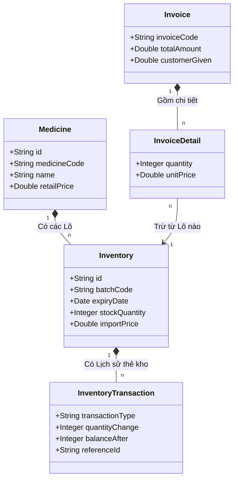

2.2.3. Đặc tả chi tiết các Use Case (Phân hệ 1: Xác thực)
#### UC01: ĐĂNG NHẬP HỆ THỐNG
* **Tác nhân**: Admin, Sales, Product_manager
* **Tiền điều kiện**: Tài khoản tồn tại và được kích hoạt (`isActive = true`).
* **Luồng sự kiện chính**:
  1. Người dùng truy cập trang đăng nhập, nhập Username và Password.
  2. Hệ thống kiểm tra trong cơ sở dữ liệu (`account` table) bằng BCrypt.
  3. Hệ thống sinh JWT (Access Token, Refresh Token).
  4. Chuyển hướng người dùng vào Dashboard tương ứng quyền hạn.
* **Luồng thay thế**:
  - Sai mật khẩu: Báo lỗi "Tài khoản không chính xác".
  - Tài khoản lần đầu đăng nhập (`isFirstLogin = true`): Chuyển hướng ép buộc sang trang Đổi mật khẩu.

**Bảng Đặc tả Dữ liệu (Data Dictionary):**
| Tên Table | Cột (Field) | Loại thao tác | Dữ liệu cập nhật | Ý nghĩa |
| :--- | :--- | :--- | :--- | :--- |
| `account` | `username` | SELECT | Đối chiếu thông tin | Định danh tài khoản |
| `account` | `password_hash` | SELECT | BCrypt.matches | Mật khẩu đã mã hóa |

**Activity Diagram (UC01):**
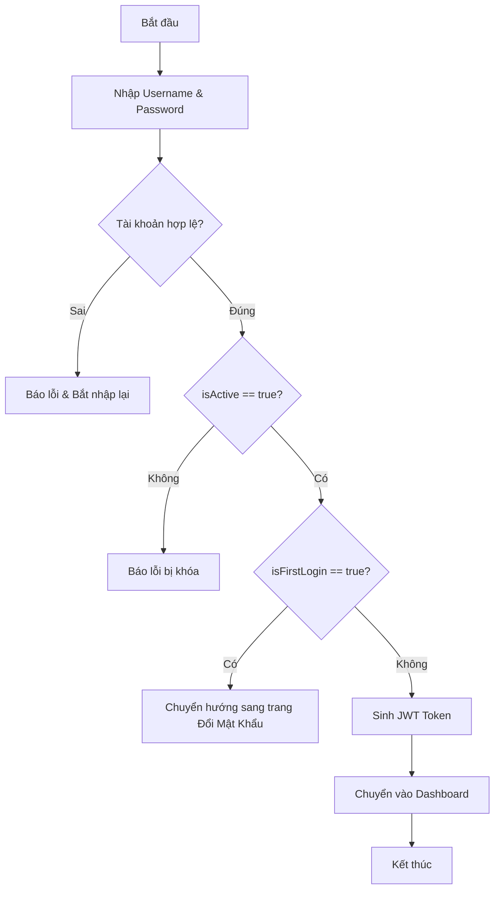

**Sequence Diagram (UC01):**
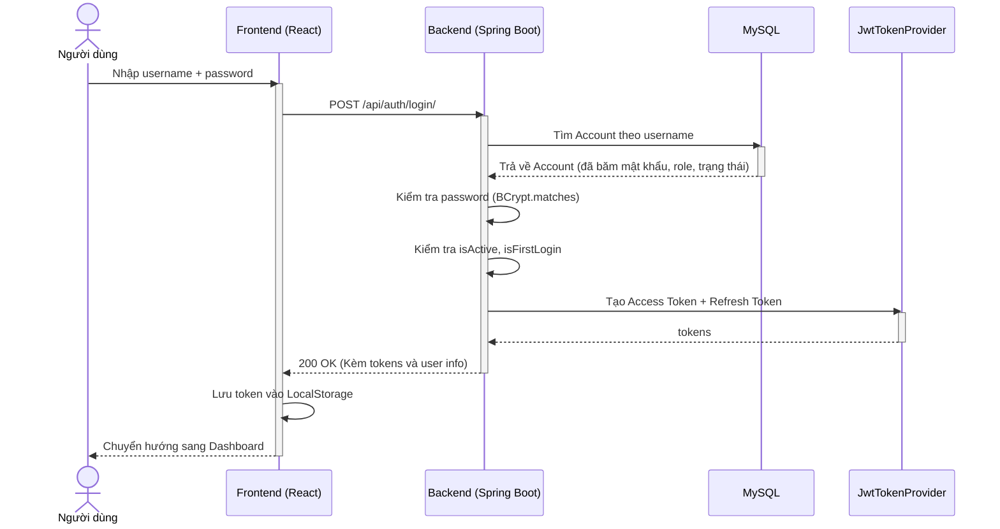

#### UC05: ĐỔI MẬT KHẨU TÀI KHOẢN
* **Tác nhân**: Tất cả người dùng
* **Tiền điều kiện**: Người dùng đã đăng nhập hoặc đang bị kẹt ở trạng thái `isFirstLogin = true`.
* **Luồng sự kiện chính**:
  1. Người dùng vào form Đổi mật khẩu.
  2. Nhập mật khẩu cũ, mật khẩu mới và xác nhận mật khẩu mới.
  3. Hệ thống đối chiếu mật khẩu cũ. Nếu khớp, mã hóa mật khẩu mới (BCrypt) và lưu DB.
  4. Cập nhật `isFirstLogin = false`. Thông báo thành công.

**Bảng Đặc tả Dữ liệu (Data Dictionary):**
| Tên Table | Cột (Field) | Loại thao tác | Dữ liệu cập nhật | Ý nghĩa |
| :--- | :--- | :--- | :--- | :--- |
| `account` | `password_hash` | UPDATE | Chuỗi mã hóa BCrypt | Cập nhật mật khẩu mới bảo mật |
| `account` | `is_first_login` | UPDATE | `false` (Boolean) | Gỡ bỏ ràng buộc đổi mật khẩu lần đầu |

**Activity Diagram (UC05):**
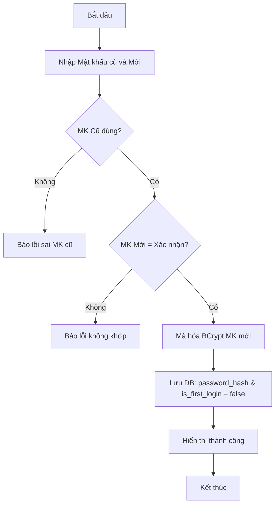

**Sequence Diagram (UC05):**
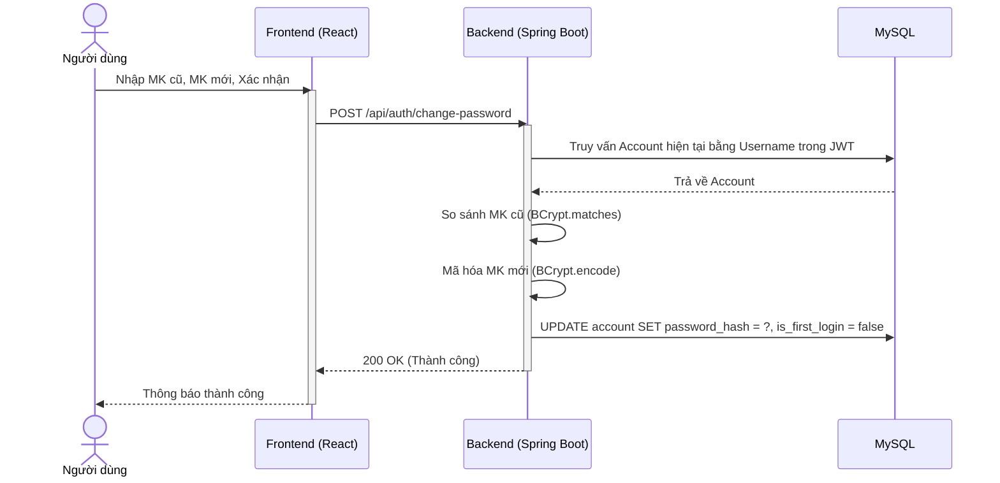

2.2.4. Đặc tả chi tiết các Use Case (Phân hệ 2: Quản lý Danh mục và Dữ liệu Thuốc)
#### UC14: THÊM THÔNG TIN THUỐC MỚI
* **Tác nhân**: Product_manager, Admin
* **Tiền điều kiện**: Người dùng đã đăng nhập hệ thống với vai trò Admin hoặc Product_manager.
* **Luồng sự kiện chính**:
  1. Người dùng vào trang Danh sách thuốc, chọn Thêm thuốc mới.
  2. Hiển thị Form Thêm thuốc mới.
  3. Người dùng nhập: Mã thuốc, Tên thuốc, Hoạt chất, Giá bán lẻ, Danh mục, Đơn vị, Nước SX. Nhấn Lưu.
  4. Hệ thống kiểm tra Mã thuốc chưa tồn tại.
  5. Hệ thống lưu bản ghi vào bảng `medicine`. Báo thành công.
* **Luồng thay thế**:
  - Mã thuốc trùng lặp: Báo lỗi "Mã thuốc đã tồn tại".
  - Bỏ trống trường bắt buộc: Báo lỗi "Vui lòng nhập đầy đủ".

**Bảng Đặc tả Dữ liệu (Data Dictionary):**
| Tên Table | Cột (Field) | Loại thao tác | Dữ liệu cập nhật | Ý nghĩa |
| :--- | :--- | :--- | :--- | :--- |
| `medicine` | `medicine_code` | INSERT | Chuỗi (Unique) | Mã thuốc định danh |
| `medicine` | `name` | INSERT | Chuỗi | Tên thương mại của thuốc |
| `medicine` | `active_ingredient` | INSERT | Chuỗi | Hoạt chất chính |
| `medicine` | `retail_price` | INSERT | Số thực (> 0) | Giá bán lẻ mặc định |
| `medicine` | `catalog_id` | INSERT | FK (UUID) | ID Danh mục liên kết |
| `medicine` | `unit_id` | INSERT | FK (UUID) | ID Đơn vị tính cơ bản |

**Activity Diagram (UC14):**
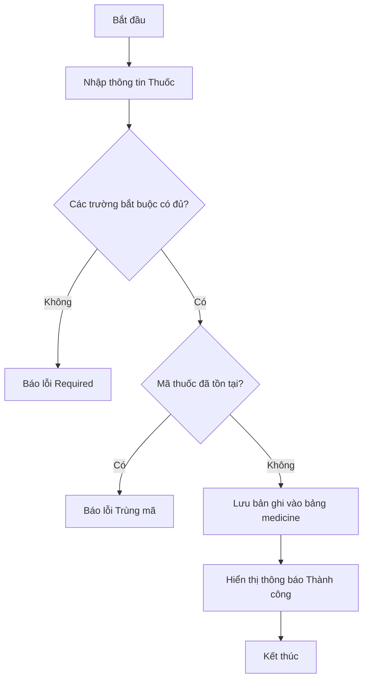

**Sequence Diagram (UC14):**
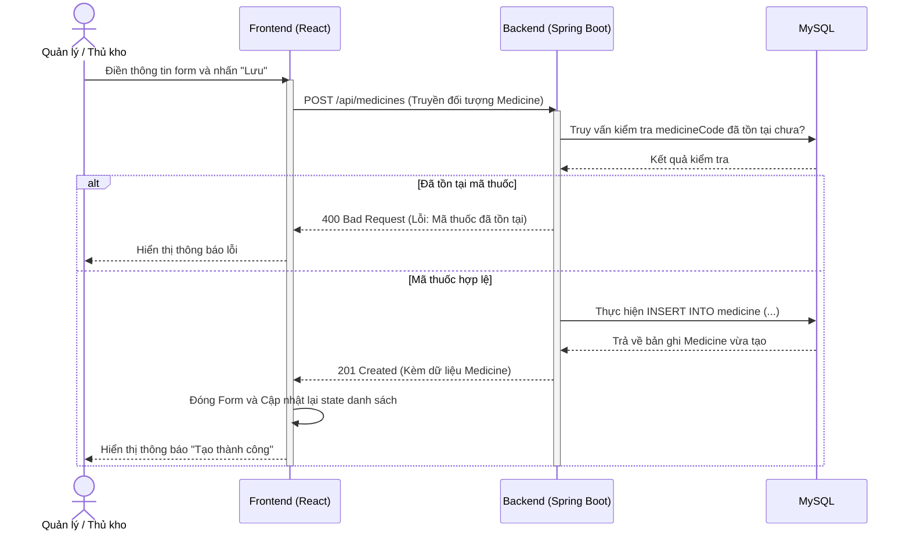

#### UC16: XÓA THÔNG TIN THUỐC
* **Tác nhân**: Product_manager, Admin
* **Tiền điều kiện**: Thuốc chưa từng phát sinh bất kỳ giao dịch kho nào (chưa nhập, xuất, bán).
* **Luồng sự kiện chính**:
  1. Chọn thuốc cần xóa, nhấn Xóa.
  2. Hệ thống cảnh báo xác nhận. Người dùng Xác nhận.
  3. Hệ thống kiểm tra ràng buộc liên kết (có tồn tại trong `inventory` không).
  4. Xóa bản ghi khỏi `medicine` và báo thành công.
* **Luồng thay thế**:
  - Đã có dữ liệu tồn kho: Báo lỗi "Không thể xóa thuốc vì đã phát sinh giao dịch tồn kho".

**Bảng Đặc tả Dữ liệu (Data Dictionary):**
| Tên Table | Cột (Field) | Loại thao tác | Dữ liệu cập nhật | Ý nghĩa |
| :--- | :--- | :--- | :--- | :--- |
| `medicine` | (Bản ghi nguyên dòng) | DELETE | Bản ghi ID tương ứng | Xóa vĩnh viễn khỏi danh mục |

**Activity Diagram (UC16):**
```mermaid
flowchart TD
    A[Bắt đầu] --> B[Nhấn Xóa]
    B --> C[Hiển thị cảnh báo]
    C --> D{Người dùng Xác nhận?}
    D -- Không --> E[Hủy thao tác]
    D -- Có --> F{Đã có trong kho (inventory)?}
    F -- Có --> G[Báo lỗi: Đã phát sinh giao dịch]
    F -- Không --> H[Xóa khỏi bảng medicine]
    H --> I[Hiển thị thành công]
    I --> J[Kết thúc]
```

**Sequence Diagram (UC16):**
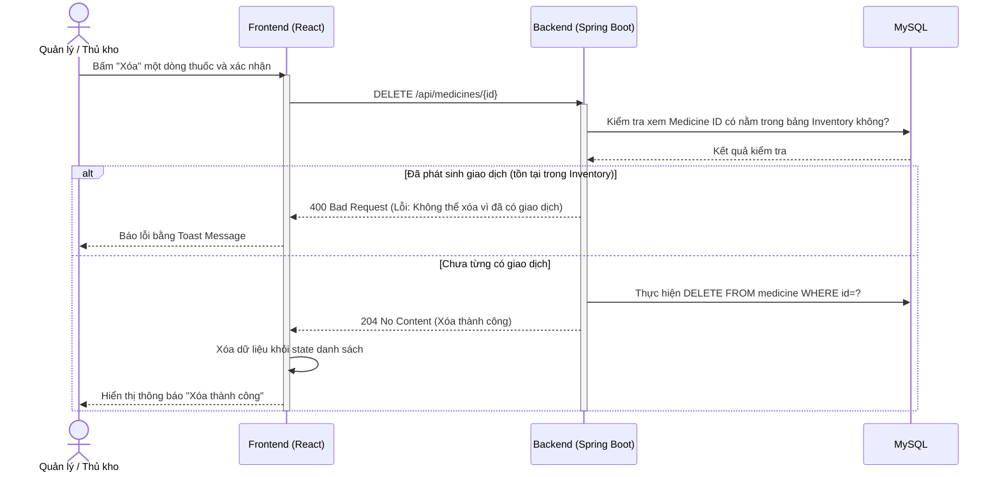

2.2.5. Đặc tả chi tiết các Use Case (Phân hệ 3: Quản lý Đối tác & Nhân sự)
#### UC20: QUẢN LÝ TÀI KHOẢN NGƯỜI DÙNG (Account CRUD)
* **Tác nhân**: Admin
* **Tiền điều kiện**: Nhân viên được tạo tài khoản đã có thông tin chi tiết lưu trong cơ sở dữ liệu (`employee`), nhưng chưa được cấp phát tài khoản.
* **Luồng sự kiện chính**:
  1. Admin mở mục "Quản lý tài khoản" trên giao diện Admin Dashboard.
  2. Frontend tự động gọi API GET `/api/accounts` lấy danh sách các tài khoản hiện hữu cùng hồ sơ nhân sự liên kết.
  3. Admin bấm nút "Tạo tài khoản", chọn nhân viên liên kết từ danh sách thả xuống, nhập tên đăng nhập (username) và chọn quyền hạn (ADMIN, Product_manager, Sales).
  4. Hệ thống kiểm tra: Tên tài khoản không được trùng lặp và nhân sự này chưa được liên kết tài khoản nào khác.
  5. Hệ thống tự động sinh một mật khẩu tạm ngẫu nhiên gồm 10 ký tự.
  6. Hệ thống thực hiện mã hóa băm mật khẩu này bằng BCrypt trước khi lưu.
  7. Hệ thống INSERT một bản ghi mới vào bảng `account` với `is_first_login = true` và `is_active = true`.
  8. Hệ thống khởi chạy tiến trình bất đồng bộ gửi email chứa mật khẩu tạm thời đến hòm thư đã khai báo của nhân viên qua MailService.
  9. Trả về kết quả `200 OK` kèm theo mật khẩu chưa mã hóa để Admin có thể sao chép trực tiếp đưa cho nhân viên.
* **Luồng thay thế**:
  - Trùng username: Báo lỗi "Tên tài khoản đã tồn tại".
  - Nhân viên đã có tài khoản: Báo lỗi "Hồ sơ nhân viên này đã được liên kết với một tài khoản khác".

**Bảng Đặc tả Dữ liệu (Data Dictionary):**
| Tên Table | Cột (Field) | Loại thao tác | Dữ liệu cập nhật | Ý nghĩa |
| :--- | :--- | :--- | :--- | :--- |
| `account` | `username` | INSERT | Chuỗi (Unique, PK) | Tên đăng nhập của tài khoản |
| `account` | `password_hash` | INSERT | Chuỗi mã hóa BCrypt | Mật khẩu truy cập đã băm |
| `account` | `role` | INSERT | Enum (ADMIN, MANAGER, SALES) | Phân quyền tài khoản |
| `account` | `is_active` | INSERT | `true` (Boolean) | Trạng thái hoạt động |
| `account` | `is_first_login`| INSERT | `true` (Boolean) | Bắt buộc đổi mật khẩu khi đăng nhập |
| `account` | `employee_id` | INSERT | FK (UUID) | ID liên kết hồ sơ nhân sự |

**Activity Diagram (UC20):**
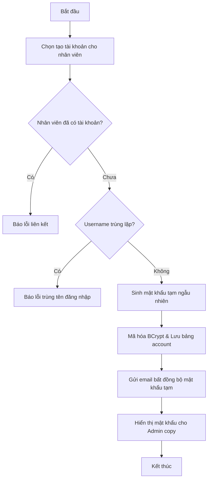

**Sequence Diagram (UC20):**
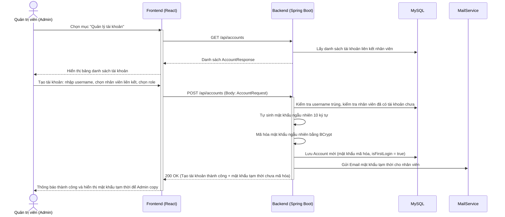

2.2.6. Đặc tả chi tiết các Use Case (Phân hệ 4: Nghiệp vụ Kho Thuốc)
#### UC23: XÁC NHẬN NHẬP KHO
* **Tác nhân**: Product_manager, Admin
* **Tiền điều kiện**: Phiếu nhập kho đang tồn tại ở trạng thái nháp (`DRAFT`).
* **Luồng sự kiện chính**:
  1. Người dùng mở trang chi tiết phiếu nhập nháp, nhấn nút **Xác nhận nhập kho**.
  2. Backend kiểm tra trạng thái phiếu nhập phải đang là `DRAFT`.
  3. Mở transaction `@Transactional`. Duyệt qua từng thuốc nhập trong phiếu:
     - Hệ thống kiểm tra Hạn sử dụng của lô thuốc (phải lớn hơn thời gian hiện tại).
     - Quy đổi số lượng nhập về đơn vị cơ bản: `SL_quy_đổi = số_lượng_nhập * tỷ_lệ_quy_đổi`.
     - Tìm kiếm xem lô thuốc (Medicine ID, Batch Code, Expiry Date) đã tồn tại trong bảng `inventory` chưa.
     - Nếu chưa: Tạo mới dòng lô thuốc trong `inventory` với số tồn ban đầu là số lượng quy đổi.
     - Nếu có: Cộng dồn số lượng quy đổi vào cột `stock_quantity` của lô.
     - Ghi nhận một dòng biến động thẻ kho trong bảng `inventory_transaction` với loại giao dịch `IMPORT`.
  4. Đổi trạng thái phiếu nhập kho thành `CONFIRMED`.
  5. Commit Transaction, hiển thị thông báo thành công.
* **Luồng thay thế**:
  - Hạn sử dụng nhỏ hơn ngày hiện tại: Hệ thống dừng xử lý, báo lỗi "Lô thuốc đã hết hạn, không thể thực hiện nhập kho".
  - Trạng thái phiếu không phải DRAFT: Báo lỗi "Không thể xác nhận phiếu nhập đã chốt hoặc đã hủy".

**Bảng Đặc tả Dữ liệu (Data Dictionary):**
| Tên Table | Cột (Field) | Loại thao tác | Dữ liệu cập nhật | Ý nghĩa |
| :--- | :--- | :--- | :--- | :--- |
| `receipt` | `status` | UPDATE | `CONFIRMED` | Chốt phiếu nhập |
| `inventory` | `stock_quantity` | INSERT/UPDATE | Cộng thêm SL quy đổi | Tăng tồn kho theo lô thuốc |
| `inventory_transaction` | `transaction_type` | INSERT | `IMPORT` | Giao dịch nhập kho |
| `inventory_transaction` | `quantity_change` | INSERT | Giá trị dương (+) | Lượng biến động |

**Activity Diagram (Xác nhận Nhập kho):**
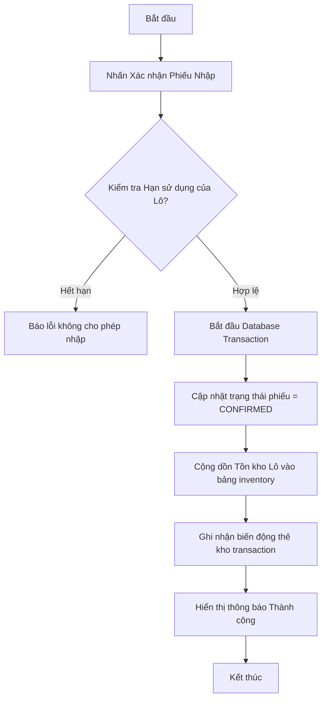

**Sequence Diagram (Xác nhận Nhập kho):**
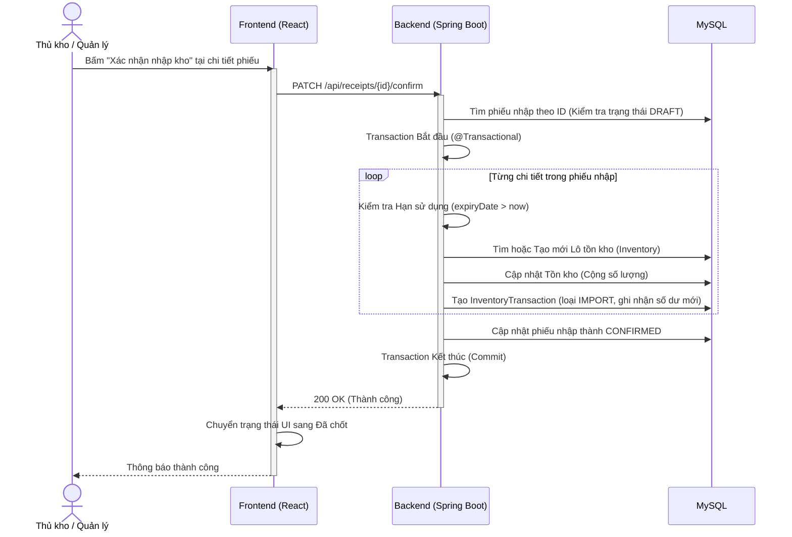

#### UC26: XÁC NHẬN PHIẾU XUẤT KHO
* **Tác nhân**: Product_manager, Admin
* **Tiền điều kiện**: Phiếu xuất kho đang ở trạng thái nháp (`DRAFT`).
* **Luồng sự kiện chính**:
  1. Người dùng mở trang chi tiết phiếu xuất nháp, nhấn nút **Xác nhận xuất kho**.
  2. Backend kiểm tra trạng thái phiếu phải đang là `DRAFT`.
  3. Mở transaction `@Transactional`. Lặp qua từng lô xuất trong phiếu:
     - Đọc thông tin tồn kho của lô thuốc trong bảng `inventory` và thực hiện Khóa dòng bằng Pessimistic Lock (`SELECT ... FOR UPDATE`).
     - Quy đổi số lượng xuất về đơn vị cơ bản: `SL_xuất_quy_đổi = số_lượng_xuất * tỷ_lệ_quy_đổi`.
     - So sánh tồn kho thực tế của lô trong DB có đủ lớn hơn hoặc bằng số lượng xuất quy đổi hay không.
     - Nếu đủ: Trừ trực tiếp tồn kho: `stock_quantity = stock_quantity - SL_xuất_quy_đổi`.
     - Tạo một dòng biến động thẻ kho trong bảng `inventory_transaction` với loại giao dịch `EXPORT` (số lượng âm).
     - Nếu tồn kho của lô về 0: Tự động đổi trạng thái lô thuốc trong `inventory` thành `SOLD_OUT`.
  4. Cập nhật trạng thái phiếu xuất thành `CONFIRMED`.
  5. Commit Transaction, hiển thị thông báo thành công.
* **Luồng thay thế**:
  - Không đủ tồn kho: Hệ thống lập tức dừng xử lý, thực hiện Rollback toàn bộ các bước đã làm, ném ngoại lệ `IllegalArgumentException` để trả về lỗi 400 và báo lỗi "Không đủ tồn kho để thực hiện xuất lô này".

**Bảng Đặc tả Dữ liệu (Data Dictionary):**
| Tên Table | Cột (Field) | Loại thao tác | Dữ liệu cập nhật | Ý nghĩa |
| :--- | :--- | :--- | :--- | :--- |
| `issue` | `status` | UPDATE | `CONFIRMED` | Chốt phiếu xuất |
| `inventory` | `stock_quantity` | UPDATE | Trừ đi SL xuất quy đổi | Giảm tồn kho theo lô |
| `inventory_transaction` | `transaction_type` | INSERT | `EXPORT` | Giao dịch xuất kho |
| `inventory_transaction` | `quantity_change` | INSERT | Giá trị âm (-) | Lượng xuất |

**Activity Diagram (Xác nhận Xuất kho):**
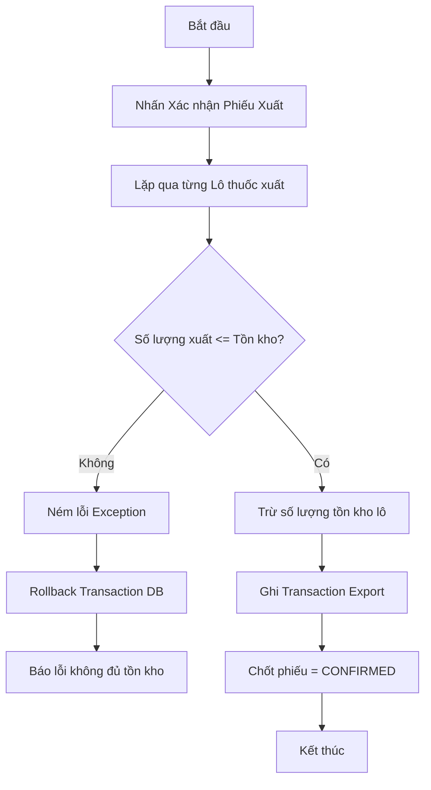

**Sequence Diagram (Xác nhận Xuất kho):**
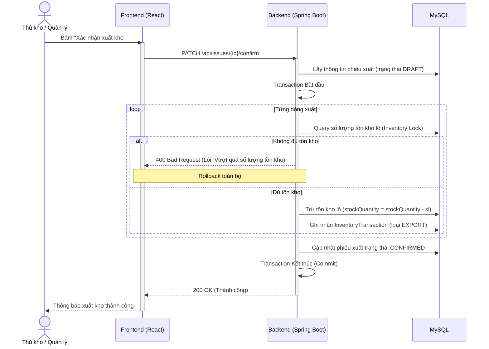

2.2.7. Đặc tả chi tiết các Use Case (Phân hệ 5: Nghiệp vụ Kiểm kê kho)
#### UC30: XÁC NHẬN ĐỐI SOÁT HOÀN THÀNH KIỂM KÊ
* **Tác nhân**: Product_manager, Admin
* **Tiền điều kiện**: Phiếu kiểm kê đang tồn tại trong hệ thống ở trạng thái đang thực hiện (`IN_PROGRESS`).
* **Luồng sự kiện chính**:
  1. Người dùng mở trang chi tiết phiếu kiểm kê hiện tại, nhấn nút **Xác nhận đối soát hoàn thành kiểm kê**.
  2. Frontend gửi yêu cầu PATCH đến API `/api/stock-audits/{id}/confirm`.
  3. Backend tiếp nhận yêu cầu, kiểm tra trạng thái phiếu phải đang là `IN_PROGRESS`.
  4. Backend xác nhận toàn bộ các dòng chi tiết kiểm kê đã được cập nhật số đếm thực tế (không có lô nào bị bỏ trống `actualQuantity`).
  5. Mở database transaction `@Transactional`. Lặp qua từng dòng chi tiết kiểm kê (`StockAuditDetail`):
     - Hệ thống gọi truy vấn khóa dòng lô thuốc tương ứng trong bảng `inventory` bằng Pessimistic Lock (`SELECT ... FOR UPDATE`).
     - Hệ thống cập nhật số lượng tồn kho sổ sách `stock_quantity` của lô về bằng đúng số đếm thực tế `actual_quantity`.
     - Nếu có chênh lệch thực tế và sổ sách (`discrepancy != 0`): Hệ thống tự động ghi nhận một giao dịch điều chỉnh thẻ kho vào bảng `inventory_transaction` với loại giao dịch `AUDIT_ADJUST`, ghi nhận số chênh lệch (dương nếu thừa hàng, âm nếu thiếu hàng so với sổ sách) và số dư mới sau điều chỉnh.
  6. Hệ thống cập nhật trạng thái phiếu kiểm kê thành `CONFIRMED` và ghi nhận tài khoản nhân viên thực hiện đối soát (`approved_by`).
  7. Commit Transaction và trả về `200 OK` cho Client.
  8. Giao diện tải lại trạng thái mới và thông báo "Chốt kiểm kê và đồng bộ tồn kho thành công".
* **Luồng thay thế**:
  - Có lô chưa được điền số đếm thực tế: Hệ thống báo lỗi "Vui lòng nhập đầy đủ số đếm thực tế trước khi hoàn thành đối soát".
  - Trạng thái phiếu không phải `IN_PROGRESS`: Báo lỗi "Phiếu kiểm kê phải ở trạng thái đang tiến hành".

**Bảng Đặc tả Dữ liệu (Data Dictionary):**
| Tên Table | Cột (Field) | Loại thao tác | Dữ liệu cập nhật | Ý nghĩa |
| :--- | :--- | :--- | :--- | :--- |
| `audit` | `status` | UPDATE | `CONFIRMED` | Chốt phiếu kiểm kê |
| `audit` | `approved_by` | UPDATE | ID nhân viên chốt | Lưu người duyệt chốt |
| `inventory` | `stock_quantity` | UPDATE | Đặt bằng `actual_quantity` | Đồng bộ tồn kho về thực tế |
| `inventory_transaction` | `transaction_type` | INSERT | `AUDIT_ADJUST` | Thẻ kho chênh lệch |
| `inventory_transaction` | `quantity_change` | INSERT | Lượng chênh lệch | Hiệu chỉnh tồn kho |

**Activity Diagram (Xác nhận đối soát hoàn thành kiểm kê):**
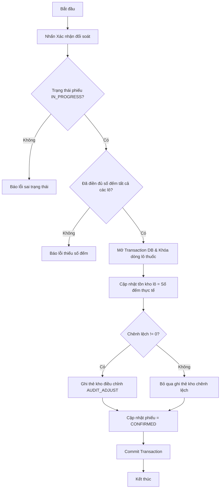

**Sequence Diagram (Xác nhận đối soát hoàn thành kiểm kê):**
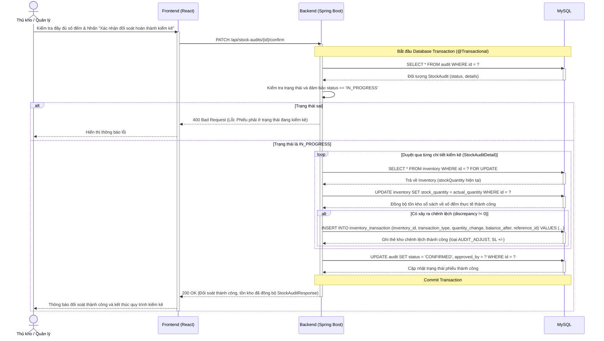

2.2.8. Đặc tả chi tiết các Use Case (Phân hệ 6: POS & Nghiệp vụ Bán hàng)
#### UC31: LẬP HÓA ĐƠN BÁN LẺ THUỐC TẠI QUẦY (POS)
* **Tác nhân**: Sales, Admin
* **Tiền điều kiện**: Các lô thuốc xuất bán còn thời hạn sử dụng và có số lượng tồn kho thực tế (`stock_quantity > 0`).
* **Luồng sự kiện chính**:
  1. Nhân viên bán hàng truy cập phân hệ POS. Gõ từ khóa tìm kiếm thuốc hoặc quét mã vạch để lấy danh sách thuốc còn hạn dùng.
  2. Chọn lô thuốc, nhập số lượng mua, chọn đơn vị tính quy đổi (Hộp, Vỉ, Viên).
  3. Hệ thống tự động tính thành tiền từng loại và cập nhật tổng tiền hóa đơn.
  4. Nhân viên chọn khách hàng thành viên (nếu có) để áp dụng tích lũy/trừ điểm thưởng. Nhập số tiền khách đưa.
  5. Hệ thống hiển thị số tiền thừa cần trả lại khách.
  6. Nhân viên nhấn nút **Thanh toán & Xuất hóa đơn**.
  7. Backend mở transaction `@Transactional`:
     - Khóa dòng các lô thuốc tương ứng trong DB bằng Pessimistic Lock (`SELECT ... FOR UPDATE`) để ngăn race conditions.
     - Quy đổi số lượng bán ra đơn vị cơ bản: `SL_bán_quy_đổi = số_lượng * tỷ_lệ`.
     - Kiểm tra nếu tồn kho thực tế đủ bán: Trừ tồn kho trong bảng `inventory`. Nếu tồn kho về 0 đặt status thành `SOLD_OUT`.
     - Ghi nhận lịch sử thẻ kho `SALE` (số lượng âm) trong `inventory_transaction`.
     - Nếu có thông tin khách hàng: Tính toán và cộng điểm thưởng tích lũy mới vào hồ sơ khách hàng.
     - Lưu thông tin hóa đơn vào bảng `invoice` và `invoice_detail` ở trạng thái `Paid`.
  8. Trả kết quả thành công. Frontend hiển thị popup mô phỏng hóa đơn nhiệt khổ K80 và tự động kích hoạt in hóa đơn (`window.print()`).
* **Luồng thay thế**:
  - Không đủ tồn kho lô: Giao dịch bị chặn đứng, thực hiện Rollback transaction, trả về lỗi 400 Bad Request và cảnh báo "Lô thuốc không đủ số lượng để bán lẻ".

**Bảng Đặc tả Dữ liệu (Data Dictionary):**
| Tên Table | Cột (Field) | Loại thao tác | Dữ liệu cập nhật | Ý nghĩa |
| :--- | :--- | :--- | :--- | :--- |
| `invoice` | Bản ghi mới | INSERT | Đầy đủ thuộc tính | Lưu tổng tiền, tiền thừa, trạng thái |
| `invoice_detail` | Bản ghi mới | INSERT | Các thuộc tính chi tiết | Số lượng, đơn giá dòng |
| `inventory` | `stock_quantity` | UPDATE | Trừ SL bán quy đổi | Trừ tồn kho lô FEFO |
| `inventory_transaction` | `transaction_type` | INSERT | `SALE` | Nhật ký thẻ kho bán hàng |

**Activity Diagram (POS Bán hàng):**
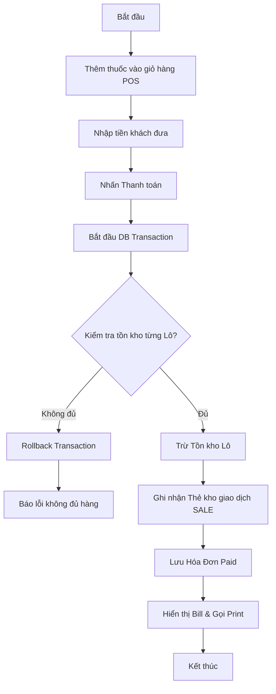

**Sequence Diagram (UC31 - POS Bán hàng):**
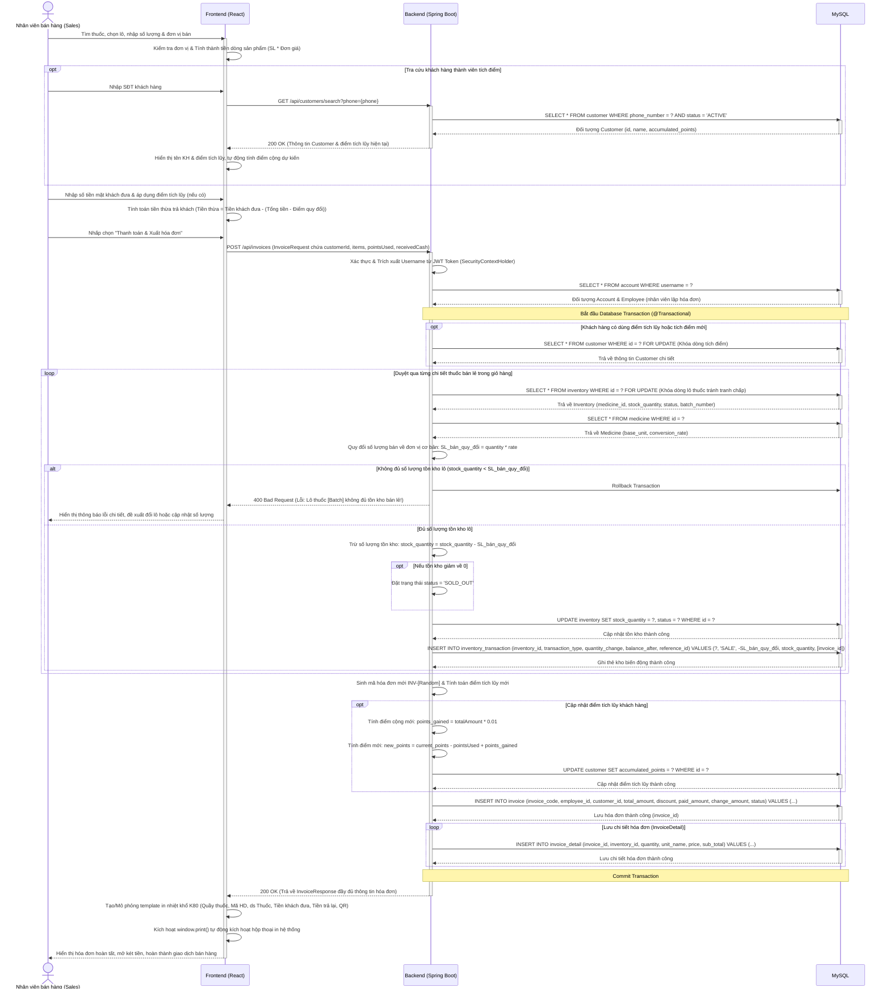

2.2.9. Đặc tả chi tiết các Use Case (Phân hệ 7: Tồn kho & Báo cáo thẻ kho)
#### UC32: XEM LỊCH SỬ THẺ KHO CỦA THUỐC
* **Tác nhân**: Product_manager, Admin
* **Tiền điều kiện**: Người dùng đã đăng nhập thành công.
* **Luồng sự kiện chính**:
  1. Người dùng chọn mục "Thẻ kho / Lịch sử thẻ kho" từ menu điều hướng.
  2. Chọn thuốc cụ thể và chọn mốc thời gian bắt đầu (`startDate`) và kết thúc (`endDate`).
  3. Frontend gửi yêu cầu API đến `/api/inventory/transactions?medicineId={id}&startDate={start}&endDate={end}`.
  4. Backend tiếp nhận yêu cầu, trích xuất quyền truy cập để bảo vệ thông tin kho:
     - Backend truy cập bảng `inventory_transaction` liên kết với `inventory` để lấy tổng biến động trước ngày `startDate` nhằm tính Số dư đầu kỳ (`initial_balance`).
     - Backend thực hiện SELECT tất cả giao dịch kho của thuốc này trong khoảng thời gian (loại IMPORT, EXPORT, SALE, AUDIT_ADJUST) sắp xếp tăng dần theo thời gian.
  5. Backend trả về dữ liệu cho Frontend gồm số dư đầu kỳ và mảng các giao dịch biến động.
  6. Frontend nhận dữ liệu, khởi tạo biến số dư lũy kế đầu kỳ: `running_balance = initial_balance`.
  7. Frontend lặp qua các dòng giao dịch từ cũ nhất đến mới nhất để tính toán số dư sau mỗi giao dịch: `running_balance = running_balance + quantity_change` và gán giá trị này làm số dư lũy kế thực tế.
  8. Hiển thị bảng dữ liệu thẻ kho chi tiết gồm: Thời gian giao dịch, Số chứng từ, Loại biến động, Số lượng biến động (+/-), Số dư lũy kế.
* **Luồng thay thế**:
  - `medicineId` không tồn tại: Báo lỗi "Không tìm thấy thông tin thuốc yêu cầu".

**Bảng Đặc tả Dữ liệu (Data Dictionary):**
| Tên Table | Cột (Field) | Loại thao tác | Dữ liệu cập nhật | Ý nghĩa |
| :--- | :--- | :--- | :--- | :--- |
| `inventory_transaction` | N/A | SELECT | Đọc dữ liệu | Biến động kho thuốc |
| `inventory` | N/A | SELECT | Đọc dữ liệu | Thông tin lô tồn kho |

**Activity Diagram (UC32):**
```mermaid
flowchart TD
    A[Bắt đầu] --> B[Chọn thuốc & khoảng thời gian]
    B --> C[Gửi yêu cầu GET đến Backend]
    C --> D[Backend tính số dư đầu kỳ của thuốc]
    D --> E[Backend lấy danh sách giao dịch trong khoảng thời gian]
    E --> F[Backend trả về dữ liệu cho Frontend]
    F --> G[Frontend khởi tạo running_balance = số dư đầu kỳ]
    G --> H[Frontend duyệt qua các giao dịch để tính số dư lũy kế]
    H --> I[Hiển thị bảng thẻ kho lũy kế]
    I --> J[Kết thúc]
```

**Sequence Diagram (UC32):**
```mermaid
sequenceDiagram
    actor ND as Quản lý / Thủ kho
    participant FE as Frontend (React)
    participant BE as Backend (Spring Boot)
    participant DB as MySQL
    
    ND->>FE: Chọn mục "Thẻ kho" -> Tìm kiếm và chọn thuốc cụ thể & khoảng thời gian
    activate FE
    FE->>BE: GET /api/inventory/transactions?medicineId={id}&startDate={start}&endDate={end}
    activate BE
    
    BE->>BE: Xác thực & kiểm tra quyền truy cập (Role: ADMIN, MANAGER, WAREHOUSE_KEEPER)
    
    BE->>DB: SELECT * FROM medicine WHERE id = ?
    activate DB
    DB-->>BE: Trả về Medicine (Tên thuốc, Đơn vị tính cơ bản)
    deactivate DB
    
    BE->>DB: SELECT SUM(quantity_change) FROM inventory_transaction t JOIN inventory i ON t.inventory_id = i.id WHERE i.medicine_id = ? AND t.created_date < ?
    activate DB
    DB-->>BE: Trả về số lượng tồn kho đầu kỳ (initial_balance)
    deactivate DB
    
    BE->>DB: SELECT t.*, i.batch_number, i.expiry_date FROM inventory_transaction t JOIN inventory i ON t.inventory_id = i.id WHERE i.medicine_id = ? AND t.created_date BETWEEN ? AND ? ORDER BY t.created_date ASC, t.id ASC
    activate DB
    DB-->>BE: Trả về danh sách InventoryTransaction (IMPORT, EXPORT, SALE, AUDIT_ADJUST) kèm chi tiết lô
    deactivate DB
    
    BE-->>FE: 200 OK (Trả về StockCardResponse gồm initial_balance & list transactions)
    deactivate BE
    
    FE->>FE: Khởi tạo biến running_balance = initial_balance
    loop Với mỗi giao dịch kho trong danh sách (tăng dần thời gian)
        FE->>FE: running_balance = running_balance + quantity_change
        FE->>FE: Gán giá trị số dư lũy kế vào dòng hiển thị tương ứng
        FE->>FE: Định dạng loại giao dịch (SALE -> Bán lẻ, IMPORT -> Nhập kho, EXPORT -> Xuất kho, AUDIT_ADJUST -> Cân đối kiểm kê)
    end
    
    FE-->>ND: Hiển thị bảng Thẻ kho trực quan (Thời gian, Số chứng từ, Loại biến động, Số lượng +/- , Tồn lũy kế)
    deactivate FE
```

2.3. Thiết kế Cơ sở dữ liệu
Dựa trên cơ sở phân tích mã nguồn thực tế ở tầng Entity của backend Spring Boot, cơ sở dữ liệu quan hệ MySQL 8.0 được cấu trúc chặt chẽ với các bảng dữ liệu cốt lõi có liên kết logic rõ ràng nhằm đáp ứng hoàn hảo các nghiệp vụ kho và bán lẻ:

### Bảng dữ liệu cốt lõi
1. **`account`**: Quản lý tài khoản đăng nhập.
   - `username` (VARCHAR(50) - PK): Định danh tài khoản đăng nhập.
   - `password_hash` (VARCHAR(255) - NOT NULL): Mật khẩu băm BCrypt.
   - `role` (VARCHAR(50) - NOT NULL): Vai trò tài khoản (ADMIN, MANAGER, SALES).
   - `is_active` (BOOLEAN - DEFAULT TRUE): Trạng thái kích hoạt.
   - `is_first_login` (BOOLEAN - DEFAULT TRUE): Cảnh báo đổi mật khẩu lần đầu.
   - `employee_id` (VARCHAR(255) - FK): Khóa ngoại 1-1 trỏ đến hồ sơ nhân sự `employee`.

2. **`employee`**: Hồ sơ lý lịch nhân sự của hiệu thuốc.
   - `id` (VARCHAR(255) - PK): ID nhân viên (UUID).
   - `full_name` (VARCHAR(100) - NOT NULL): Họ và tên.
   - `phone` (VARCHAR(20)): Số điện thoại liên hệ.
   - `email` (VARCHAR(100) - UNIQUE): Email liên hệ nhận mật khẩu.
   - `address` (VARCHAR(255)): Địa chỉ lưu trú.

3. **`medicine`**: Danh mục chi tiết các loại thuốc trong hệ thống.
   - `id` (VARCHAR(255) - PK): ID loại thuốc.
   - `medicine_code` (VARCHAR(50) - UNIQUE): Mã thuốc định danh.
   - `name` (VARCHAR(150) - NOT NULL): Tên thương mại của thuốc.
   - `active_ingredient` (VARCHAR(255)): Hoạt chất chính cấu thành.
   - `retail_price` (DECIMAL(12,2) - NOT NULL): Giá bán lẻ mặc định (tính theo đơn vị cơ bản).
   - `catalog_id` (VARCHAR(255) - FK): Nhóm danh mục thuốc liên kết.
   - `origin_id` (VARCHAR(255) - FK): Nước sản xuất liên kết.
   - `unit_id` (VARCHAR(255) - FK): Đơn vị tính cơ bản của thuốc (Viên/Gói...).

4. **`inventory`**: Bảng quản lý Tồn Kho Lô (Trọng tâm hệ thống).
   - `id` (VARCHAR(255) - PK): ID dòng tồn lô thuốc.
   - `medicine_id` (VARCHAR(255) - FK): Loại thuốc liên kết.
   - `batch_code` (VARCHAR(50) - NOT NULL): Số lô sản xuất.
   - `expiry_date` (DATE - NOT NULL): Hạn sử dụng của đợt nhập thuốc.
   - `stock_quantity` (DECIMAL(12,2) - NOT NULL): Tồn kho hiện có (tính theo đơn vị cơ bản).
   - `import_price` (DECIMAL(12,2) - NOT NULL): Giá nhập kho của lô thuốc.
   - `status` (VARCHAR(50)): Trạng thái lô hàng (ACTIVE, SOLD_OUT, EXPIRED).

5. **`inventory_transaction`**: Nhật ký biến động kho (Thẻ kho).
   - `id` (VARCHAR(255) - PK): ID bản ghi thẻ kho.
   - `inventory_id` (VARCHAR(255) - FK): Lô thuốc có biến động.
   - `transaction_type` (VARCHAR(50) - NOT NULL): Loại biến động (IMPORT, EXPORT, SALE, AUDIT_ADJUST).
   - `quantity_change` (DECIMAL(12,2) - NOT NULL): Lượng biến động (dương đối với nhập/thừa, âm đối với xuất/bán/thiếu).
   - `balance_after` (DECIMAL(12,2) - NOT NULL): Số tồn kho thực tế của lô ngay sau giao dịch.
   - `reference_id` (VARCHAR(50)): Mã chứng từ tham chiếu (mã hóa đơn, mã phiếu nhập, phiếu xuất, phiếu kiểm kê).
   - `created_date` (DATETIME): Thời điểm ghi nhận giao dịch.

6. **`receipt` / `issue` / `audit`**: Các bảng phiếu nghiệp vụ kho.
   - Lưu trữ các thông tin chung bao gồm: mã phiếu (REC-..., GIN-..., AUD-...), ngày lập phiếu, trạng thái xử lý (DRAFT, IN_PROGRESS, CONFIRMED, CANCELLED), tổng tiền thanh toán, ghi chú lý do và ID nhân viên lập/phê duyệt.

7. **`receipt_detail` / `issue_detail` / `audit_detail`**: Bảng chi tiết các phiếu kho.
   - Liên kết đa-1 với các bảng phiếu tương ứng, đồng thời liên kết trực tiếp tới ID lô thuốc `inventory` và lưu trữ số lượng nhập/xuất/đếm, đơn vị tính quy đổi, đơn giá giao dịch dòng.

8. **`invoice` & `invoice_detail`**: Quản lý hóa đơn bán lẻ tại POS.
   - `invoice` lưu tổng tiền, mã hóa đơn (INV-...), khách hàng (nếu có), số tiền khách đưa, tiền thừa trả lại, số điểm tích lũy áp dụng.
   - `invoice_detail` lưu chi tiết số lượng bán lẻ của từng lô thuốc `inventory`, đơn giá bán, đơn vị tính quy đổi của dòng hóa đơn bán lẻ.

3. Lập trình và triển khai
Hệ thống được xây dựng theo kiến trúc N-Tier (Multi-tier Architecture) nhằm tách biệt các thành phần của hệ thống thành các tầng độc lập, giúp tăng khả năng bảo trì, mở rộng và tái sử dụng mã nguồn. Kiến trúc này bao gồm ba tầng chính: tầng giao diện người dùng (Presentation Layer), tầng xử lý nghiệp vụ (Business Layer) và tầng dữ liệu (Data Layer).
Frontend và Backend giao tiếp với nhau thông qua các RESTful API trên nền giao thức HTTP. Khi người dùng thực hiện các thao tác trên giao diện như tra cứu thuốc, nhập kho, xuất kho hoặc kiểm kê, frontend sẽ gửi các yêu cầu (request) đến các endpoint do backend cung cấp. Backend tiếp nhận yêu cầu, xử lý nghiệp vụ tương ứng và trả về kết quả dưới dạng dữ liệu JSON để frontend hiển thị cho người dùng.
Backend được xây dựng bằng Spring Boot và giao tiếp với cơ sở dữ liệu MySQL thông qua JDBC (Java Database Connectivity). Để đơn giản hóa quá trình thao tác với cơ sở dữ liệu, dự án sử dụng Spring Data JPA kết hợp với cơ chế ORM (Object-Relational Mapping). Công nghệ này cho phép ánh xạ các bảng trong cơ sở dữ liệu thành các đối tượng Java và ngược lại, giúp giảm đáng kể số lượng câu lệnh SQL cần viết thủ công, đồng thời tăng khả năng bảo trì và mở rộng hệ thống.
Thông qua Spring Data JPA, các thao tác truy vấn, thêm mới, cập nhật và xóa dữ liệu được thực hiện thông qua các Repository, trong khi Hibernate đóng vai trò là framework ORM chịu trách nhiệm chuyển đổi giữa mô hình đối tượng trong ứng dụng và các bảng dữ liệu trong MySQL. Nhờ đó, việc quản lý dữ liệu trở nên hiệu quả, nhất quán và dễ dàng hơn trong quá trình phát triển hệ thống.

3.1.1. Backend: Java (Spring Boot)
Lý do lựa chọn
Hệ thống backend được phát triển bằng Java 17 kết hợp với Spring Boot 3.5.14. Đây là một trong những nền tảng phát triển ứng dụng doanh nghiệp phổ biến hiện nay nhờ tính ổn định, khả năng mở rộng và hệ sinh thái thư viện phong phú.
Java 17 là phiên bản hỗ trợ dài hạn (LTS – Long Term Support), cung cấp hiệu năng ổn định cùng nhiều cải tiến về ngôn ngữ lập trình như Record, Pattern Matching và các cơ chế tối ưu hóa của JVM. Việc sử dụng Java 17 giúp nâng cao chất lượng mã nguồn, tăng tính bảo trì và đảm bảo khả năng hỗ trợ lâu dài cho hệ thống.
Spring Boot được lựa chọn nhằm đơn giản hóa quá trình phát triển ứng dụng thông qua cơ chế tự động cấu hình (Auto Configuration), quản lý phụ thuộc (Dependency Injection – DI) và đảo ngược điều khiển (Inversion of Control – IoC). Nhờ đó, các thành phần trong hệ thống được tách biệt rõ ràng, dễ dàng bảo trì, kiểm thử và mở rộng trong tương lai.
Ngoài ra, Spring Boot hỗ trợ xây dựng các RESTful API một cách hiệu quả, phù hợp với mô hình kiến trúc N-Tier của hệ thống quản lý kho thuốc.

Các thư viện và công nghệ chính
-	spring-boot-starter-web: Hỗ trợ xây dựng các RESTful API, tiếp nhận và xử lý các yêu cầu HTTP từ phía frontend.
-	spring-boot-starter-data-jpa: Hỗ trợ thao tác với cơ sở dữ liệu thông qua cơ chế ORM (Object Relational Mapping). Thư viện này kết hợp với Hibernate giúp ánh xạ dữ liệu giữa các bảng trong cơ sở dữ liệu và các đối tượng Java, giảm thiểu việc viết các câu lệnh SQL thủ công.
-	spring-boot-starter-security: Cung cấp các cơ chế bảo mật như xác thực người dùng, phân quyền truy cập và bảo vệ các API khỏi các truy cập trái phép.
-	JJWT (jjwt-api, jjwt-impl, jjwt-jackson): Được sử dụng để tạo, xác thực và giải mã các JSON Web Token (JWT), phục vụ cơ chế xác thực người dùng không trạng thái (Stateless Authentication).
-	spring-boot-starter-mail: Hỗ trợ gửi email thông qua giao thức SMTP. Trong hệ thống, thư viện được sử dụng để gửi mật khẩu tạm thời hoặc hỗ trợ khôi phục mật khẩu cho người dùng.
-	Lombok: Cung cấp các annotation như @Getter, @Setter, @Builder, @NoArgsConstructor và @AllArgsConstructor nhằm giảm lượng mã lặp lại (boilerplate code), giúp mã nguồn ngắn gọn và dễ bảo trì hơn.

Thông qua việc kết hợp các công nghệ và thư viện trên, tầng backend đáp ứng tốt các yêu cầu về xử lý nghiệp vụ, bảo mật, khả năng mở rộng và hiệu năng của hệ thống quản lý kho thuốc.

3.1.2. Frontend: JavaScript (ReactJS + Vite)
Lý do lựa chọn
Tầng giao diện người dùng (Frontend) của hệ thống được phát triển bằng ReactJS kết hợp với công cụ xây dựng dự án Vite. Sự kết hợp này giúp xây dựng giao diện hiện đại, có khả năng phản hồi nhanh và mang lại trải nghiệm sử dụng tốt cho người dùng.
ReactJS là thư viện JavaScript phổ biến được phát triển bởi Meta, cho phép xây dựng giao diện người dùng theo mô hình thành phần (Component-Based Architecture). Mỗi thành phần giao diện được thiết kế độc lập, giúp tăng khả năng tái sử dụng mã nguồn, đơn giản hóa việc bảo trì và mở rộng hệ thống. Bên cạnh đó, ReactJS sử dụng cơ chế Virtual DOM, giúp tối ưu quá trình cập nhật giao diện và nâng cao hiệu năng ứng dụng.
Vite được sử dụng làm công cụ phát triển và đóng gói ứng dụng frontend. So với các công cụ build truyền thống, Vite cung cấp tốc độ khởi động nhanh, hỗ trợ Hot Module Replacement (HMR) giúp cập nhật thay đổi mã nguồn gần như tức thời trong quá trình phát triển. Điều này giúp rút ngắn thời gian xây dựng và kiểm thử hệ thống, đồng thời tối ưu hóa kích thước ứng dụng khi triển khai thực tế.
Nhờ sử dụng ReactJS và Vite, giao diện hệ thống quản lý kho thuốc có khả năng đáp ứng tốt các yêu cầu về hiệu năng, tính tương tác và khả năng mở rộng trong tương lai.

Các thư viện và công nghệ chính
-	react-router-dom: Hỗ trợ xây dựng cơ chế điều hướng và quản lý các trang trong ứng dụng theo mô hình Single Page Application (SPA). Thư viện cho phép chuyển đổi giữa các màn hình mà không cần tải lại toàn bộ trang web, giúp nâng cao trải nghiệm người dùng.
-	axios: Thư viện HTTP Client được sử dụng để giao tiếp với các RESTful API của hệ thống backend. Axios hỗ trợ thực hiện các yêu cầu GET, POST, PUT, PATCH và DELETE, đồng thời cho phép cấu hình interceptor để tự động đính kèm JWT Token vào các yêu cầu cần xác thực.
-	recharts: Thư viện hỗ trợ xây dựng các biểu đồ trực quan dựa trên ReactJS. Trong hệ thống, Recharts được sử dụng để hiển thị các thống kê liên quan đến nhập kho, xuất kho, tồn kho và các số liệu tổng hợp trên màn hình Dashboard, giúp người quản lý dễ dàng theo dõi tình hình hoạt động của kho thuốc.

Thông qua các công nghệ và thư viện trên, tầng frontend đáp ứng tốt yêu cầu về giao diện trực quan, khả năng tương tác cao và hỗ trợ hiệu quả cho các nghiệp vụ quản lý kho thuốc.

3.2. Chọn cơ sở dữ liệu
3.2.1. Cơ sở dữ liệu chính: MySQL 8.0
Hệ thống quản lý kho thuốc yêu cầu độ chính xác và tính nhất quán dữ liệu cao, đặc biệt trong các nghiệp vụ như nhập kho, xuất kho, kiểm kê và cập nhật tồn kho theo từng lô thuốc. Dữ liệu phải được đảm bảo chính xác tuyệt đối, tránh sai lệch trong các tình huống phát sinh giao dịch đồng thời. Vì vậy, việc lựa chọn một hệ quản trị cơ sở dữ liệu quan hệ (RDBMS) hỗ trợ cơ chế giao dịch chuẩn ACID (Atomicity, Consistency, Isolation, Durability) là yêu cầu quan trọng nhằm đảm bảo tính toàn vẹn dữ liệu.
Trong hệ thống này, MySQL 8.0 được lựa chọn làm cơ sở dữ liệu chính dựa trên các lý do sau:
-	Là hệ quản trị cơ sở dữ liệu quan hệ mã nguồn mở phổ biến, có hiệu năng tốt trong cả xử lý đọc và ghi dữ liệu, đồng thời có chi phí triển khai thấp và cộng đồng hỗ trợ rộng rãi.
-	Hỗ trợ đầy đủ cơ chế transaction và locking ở mức dòng (row-level locking), giúp đảm bảo an toàn dữ liệu trong các trường hợp có nhiều thao tác đồng thời, ví dụ như nhiều nhân viên thực hiện xuất kho hoặc bán hàng trên cùng một lô thuốc.
-	Đảm bảo khả năng mở rộng và độ ổn định cao khi hệ thống xử lý nhiều giao dịch liên tục trong môi trường thực tế.
-	Tương thích tốt với các framework ORM, đặc biệt là Hibernate, thông qua dialect "org.hibernate.dialect.MySQLDialect", giúp việc tích hợp với Spring Boot trở nên đơn giản và hiệu quả.

3.3. Quản lý mã nguồn bằng Git
Dự án áp dụng mô hình phân nhánh mã nguồn chuẩn bằng Git để phục vụ việc làm việc nhóm và theo dõi lịch sử thay đổi.
Các nhánh chính (Branches):
-	main: Lưu trữ phiên bản mã nguồn ổn định nhất, sẵn sàng đóng gói và chạy thực tế (Production).
-	dev: Nhánh tích hợp các tính năng mới sau khi đã được kiểm thử độc lập, dùng cho môi trường thử nghiệm (Staging).
-	refactor/backend: Nhánh chuyên biệt dùng để tái cấu trúc mã nguồn backend (xử lý logic nghiệp vụ và bảo mật).
-	Feature branches: Các nhánh tính năng như feature/pos-retail, feature/goods-receipt, feature/auth-jwt được tách ra từ dev để phát triển các tính năng độc lập, sau đó tạo Pull Request (PR) để Code Review trước khi gộp trở lại.

Quy chuẩn thông điệp commit (Git Commit Conventions):
Sử dụng các tiền tố chuẩn hóa để phân loại thay đổi:
-	feat: Thêm một chức năng mới (ví dụ: feat: implement invoice print flow).
-	fix: Sửa một lỗi lập trình (ví dụ: fix: handle stock discrepancy math in audit).
-	refactor: Cấu trúc lại mã nguồn mà không thay đổi tính năng (ví dụ: refactor: clean security configuration).
-	docs: Bổ sung/sửa đổi tài liệu hướng dẫn.

3.4. Thực hiện coding theo chức năng
Với backend, phần này sẽ chia theo endpoint, sẽ có người đứng ra dựng entity ORM với database trước. Bên frontend sẽ chia ra các phần theo từng view triển khai; trong các view sẽ sử dụng các nhóm API mà bên phía backend sẽ cung cấp trước để xây dựng giao diện.

4. Kiểm thử và đảm bảo chất lượng
4.1. Thực hiện kiểm thử
4.1.1. Unit Test (Kiểm thử đơn vị)
Kiểm thử đơn vị tập trung xác thực tính chính xác của logic nghiệp vụ tại tầng Service Layer của Backend. Để cô lập hoàn toàn logic của Service khỏi cơ sở dữ liệu và các tác động bên ngoài, dự án sử dụng bộ đôi công cụ kiểm thử tiêu chuẩn **JUnit 5** và thư viện giả lập **Mockito** (`Mockito-JUnit-Jupiter`).
Toàn bộ các kịch bản kiểm thử đơn vị được xây dựng tại lớp `InventoryAndSalesServiceTest` nằm trong nhánh `dev` nhằm kiểm tra hai dịch vụ cốt lõi là `GoodsReceiptService` (Quản lý nhập kho) và `GoodsIssueService` (Quản lý xuất kho).

* **Kiến trúc và Cài đặt Test:**
  - Lớp kiểm thử sử dụng annotation `@ExtendWith(MockitoExtension.class)` để tích hợp Mockito vào vòng đời của JUnit 5.
  - Các dependency như các Repository (`GoodsReceiptRepository`, `GoodsReceiptDetailRepository`, `InventoryRepository`, `InventoryTransactionRepository`, `GoodsIssueRepository`, `GoodsIssueDetailRepository`) được giả lập bằng annotation `@Mock`.
  - Đối tượng kiểm thử thực tế (`GoodsReceiptService` và `GoodsIssueService`) được khai báo với `@InjectMocks` để Mockito tự động tiêm các repository giả lập vào trong service.
  - Trước mỗi ca kiểm thử, phương thức `@BeforeEach void setUp()` thiết lập các đối tượng giả lập chuẩn gồm: Thuốc (Paracetamol 500mg, đơn vị cơ bản: Viên, đơn giá: 1000đ), Phiếu nhập kho nháp (5 hộp với tỷ lệ quy đổi 10 viên/hộp, giá nhập 8000đ/hộp), và một bản ghi tồn kho hiện tại (20 viên).

* **Giải thích chi tiết 6 kịch bản kiểm thử trong `InventoryAndSalesServiceTest.java`:**
  1. **Nhập kho tạo lô mới thành công (`testConfirmReceipt_Success_NewInventory`):**
     - *Kịch bản:* Giả lập khi xác nhận phiếu nhập nháp nhưng thuốc và lô thuốc này chưa từng tồn tại trong kho (Repository trả về `Optional.empty()` khi tìm kiếm tồn kho).
     - *Xác thực:* Khi gọi `goodsReceiptService.confirmReceipt("GRN-TEST-123")`, hệ thống thực hiện nhân số lượng nhập với tỷ lệ quy đổi (`5 hộp * 10 viên/hộp = 50 viên gốc`).
     - *Kết quả:* Xác thực tồn kho mới được tạo có trạng thái phiếu chuyển sang `CONFIRMED` và số lượng tồn kho mới được lưu chính xác là 50 viên gốc. Hệ thống đồng thời lưu vết giao dịch thẻ kho vào `InventoryTransactionRepository`.
  2. **Cộng dồn tồn kho khi lô thuốc đã tồn tại (`testConfirmReceipt_Success_AccumulateInventory`):**
     - *Kịch bản:* Giả lập khi xác nhận phiếu nhập nhưng lô thuốc này đã có sẵn trong kho với số lượng tồn ban đầu là 20 viên.
     - *Xác thực:* Khi gọi dịch vụ xác nhận, hệ thống phải cộng số lượng quy đổi mới vào số lượng tồn cũ.
     - *Kết quả:* Số lượng tồn kho sau khi lưu phải là `70 viên` (20 viên cũ + 50 viên mới nhập). Điều này chứng minh thuật toán cộng dồn hoạt động chính xác.
  3. **Khóa trạng thái phiếu nhập kho đã xác nhận (`testConfirmReceipt_InvalidStateTransition`):**
     - *Kịch bản:* Giả lập trường hợp phiếu nhập kho đã được xác nhận trước đó (trạng thái phiếu đã là `CONFIRMED`).
     - *Xác thực:* Đảm bảo tính toàn vẹn dữ liệu, không cho phép xác nhận lại một phiếu đã đóng.
     - *Kết quả:* Hệ thống ném ra ngoại lệ `IllegalStateException` và tuyệt đối không gọi phương thức `save` trên `InventoryRepository`.
  4. **Xuất kho thành công và trừ kho chính xác (`testConfirmIssue_Success`):**
     - *Kịch bản:* Giả lập xác nhận một phiếu xuất kho nháp từ một lô hàng có sẵn 20 viên trong kho. Phiếu xuất yêu cầu xuất 1 hộp với tỷ lệ quy đổi là 10 viên/hộp.
     - *Xác thực:* Hệ thống quy đổi số lượng xuất thành đơn vị cơ bản (10 viên) và trừ khỏi tồn kho.
     - *Kết quả:* Trạng thái phiếu xuất chuyển thành `CONFIRMED`, số lượng tồn kho còn lại được cập nhật chính xác là `10 viên` (20 - 10), và giao dịch thẻ kho được ghi nhận thành công.
  5. **Ngăn chặn xuất âm kho khi thiếu hàng (`testConfirmIssue_InsufficientStock_ThrowsException`):**
     - *Kịch bản:* Giả lập xác nhận phiếu xuất yêu cầu xuất 3 hộp (quy đổi thành 30 viên) trong khi lô thuốc trong kho chỉ còn 20 viên.
     - *Xác thực:* Đảm bảo nguyên tắc an toàn kho, không cho phép tồn kho bị âm.
     - *Kết quả:* Hệ thống chặn đứng giao dịch, ném ra ngoại lệ `IllegalArgumentException` với thông báo lỗi phù hợp và không thực hiện bất kỳ cập nhật nào xuống cơ sở dữ liệu tồn kho.
  6. **Khóa trạng thái phiếu xuất kho đã hủy (`testConfirmIssue_InvalidStateTransition`):**
     - *Kịch bản:* Giả lập cố tình xác nhận một phiếu xuất kho nháp đã bị hủy trước đó (trạng thái phiếu là `CANCELLED`).
     - *Xác thực:* Ngăn chặn cập nhật trạng thái sai lệch trên phiếu đã đóng.
     - *Kết quả:* Hệ thống ném ra ngoại lệ `IllegalStateException` và từ chối xử lý trừ kho.

* **Cách thức thực thi kiểm thử tự động:**
  Nhóm kiểm thử chạy bộ kiểm thử trực tiếp thông qua công cụ Maven của dự án bằng lệnh:
  ```bash
  mvn test
  ```
  Hoặc làm sạch và chạy lại toàn bộ:
  ```bash
  mvn clean test
  ```
  Kết quả kiểm thử tự động được xuất ra báo cáo chi tiết chỉ rõ số lượng test cases thành công, thất bại và thời gian thực thi của từng phương thức.

4.1.2. Integration Test (Kiểm thử tích hợp)
Kiểm thử tích hợp tập trung xác thực sự phối hợp nhịp nhàng giữa các thành phần khác nhau trong hệ thống, đặc biệt là sự tương tác giữa tầng RESTful API, tầng xử lý Spring Security, tầng Spring Data JPA và cơ sở dữ liệu MySQL 8.0:
* **Kiểm thử Luồng bảo mật JWT (Spring Security Filter Chain):**
  - Gửi các HTTP request không đính kèm JWT token đến các endpoint cần bảo mật (ví dụ: `/api/medicines`, `/api/goods-receipts/confirm`). Xác thực hệ thống trả về mã lỗi `401 Unauthorized` hoặc `403 Forbidden`.
  - Gửi request với token hợp lệ nhưng sai quyền vai trò. Xác thực hệ thống trả về đúng lỗi `403 Forbidden`.
  - Gửi request với token hợp lệ và đúng quyền hạn. Xác thực hệ thống cho phép đi qua Filter Security và trả về mã `200 OK` cùng dữ liệu chuẩn.
* **Kiểm thử Tính toàn vẹn giao dịch (Transaction Rollback):**
  - Giả lập một lỗi hệ thống phát sinh ở giữa quy trình xác nhận nhập kho.
  - Xác thực xem annotation `@Transactional` hoạt động đúng hay không: Toàn bộ quá trình thay đổi trước đó (cộng tồn kho) phải được rollback hoàn toàn về trạng thái ban đầu, đảm bảo không xảy ra tình trạng dữ liệu lấp lửng, mất nhất quán.

4.1.3. Functional Test (Kiểm thử chức năng)
Kiểm thử chức năng (E2E) được thực hiện thủ công trên môi trường giao diện ReactJS thực tế tương tác trực tiếp với Backend và MySQL. Các kịch bản kiểm thử chính bao gồm:
* **Kịch bản Bán hàng POS:**
  - Nhân viên Sales đăng nhập, vào màn hình POS. Gõ tìm kiếm "Paracetamol", chọn loại thuốc.
  - Chọn đơn vị tính bán là "Vỉ" (hệ thống tự tính giá tiền dựa theo tỷ lệ quy đổi của vỉ so với viên gốc).
  - Gắn thông tin khách hàng bằng số điện thoại (hệ thống tự lấy tên khách hàng và tính toán tích điểm).
  - Nhập số tiền khách đưa. Kiểm tra xem giao diện có tính đúng tiền thừa thối lại hay không.
  - Bấm "Thanh toán". Kiểm tra xem hệ thống tự động mở popup in hóa đơn nhiệt K80 được format chuẩn hay không.
  - Kiểm tra số lượng tồn kho của lô thuốc tương ứng có lập tức bị trừ trên trang quản lý kho.
* **Kịch bản Lập phiếu kiểm kê và đối soát:**
  - Thủ kho tạo một phiếu kiểm kê mới. Hệ thống tự động chụp lại số tồn hiện tại của tất cả các lô.
  - Thủ kho nhập số lượng đếm thực tế (có lô bị thiếu, có lô bị thừa so với sổ sách).
  - Bấm "Lưu nháp" để bảo lưu kết quả, sau đó bấm "Xác nhận đối soát".
  - Kiểm tra xem hệ thống cập nhật số lượng tồn thực tế của các lô thuốc về đúng số đếm thực tế, và lịch sử thẻ kho của các thuốc đó có ghi nhận giao dịch `AUDIT_ADJUST`.

4.2. Ghi nhận lỗi, đề xuất cải tiến
Trong quá trình vận hành thử nghiệm và kiểm thử, một số vấn đề kỹ thuật đã được phát hiện và xử lý kịp thời:
* **Nguy cơ xung đột số liệu tồn kho (Race Conditions):**
  - *Vấn đề:* Khi hai quầy bán hàng POS cùng thanh toán một loại thuốc thuộc cùng một lô vào cùng một phần nghìn giây, có nguy cơ cả hai luồng đều đọc cùng một số lượng tồn kho cũ và ghi đè số lượng mới dẫn đến sai lệch tồn kho.
  - *Khắc phục:* Áp dụng khóa bi quan (Pessimistic Locking - `@Lock(LockModeType.PESSIMISTIC_WRITE)`) trên tầng JPA Repository khi đọc thông tin lô thuốc để trừ kho. Cơ chế này sẽ dịch câu lệnh SQL thành `SELECT ... FOR UPDATE`, buộc luồng thứ hai phải chờ luồng thứ nhất hoàn thành transaction rồi mới được đọc dữ liệu tồn kho mới, đảm bảo tính nhất quán tuyệt đối.
* **Tối ưu hóa gửi email mật khẩu tạm:**
  - *Vấn đề:* Quá trình gửi email thông qua giao thức SMTP tiêu tốn từ 2-4 giây, làm nghẽn luồng xử lý chính và khiến người dùng phải chờ lâu khi bấm nút "Quên mật khẩu".
  - *Khắc phục:* Chuyển đổi phương thức gửi email sang bất đồng bộ bằng cách sử dụng annotation `@Async` của Spring, giúp giải phóng luồng xử lý API ngay lập tức để trả phản hồi cho Client trong khi tiến trình gửi mail chạy ngầm dưới background.

5. Áp dụng quy trình phát triển phần mềm
5.1. Vận dụng mô hình SDLC
Dự án áp dụng mô hình phát triển phần mềm lặp và tăng trưởng (Agile/Iterative Development) để chia nhỏ hệ thống thành các phân hệ và hoàn thiện dần qua từng vòng đời. Quy trình SDLC của dự án được triển khai chặt chẽ qua 5 giai đoạn cốt lõi:
1. **Khảo sát và Phân tích Yêu cầu (Requirement Analysis):**
   - Khảo sát thực tế tại các nhà thuốc để nắm bắt quy trình nghiệp vụ như quản lý lô thuốc, quản lý quy đổi đơn vị nhập xuất, bán lẻ POS tại quầy, và kiểm kho định kỳ.
   - Biên soạn tài liệu Đặc tả yêu cầu phần mềm (SRS) chi tiết gồm 32 Use Case được đặc tả chi tiết, rõ ràng kèm bảng ràng buộc dữ liệu đầu vào.
2. **Thiết kế hệ thống (System Design):**
   - Thiết kế mô hình cơ sở dữ liệu quan hệ (Entity Relationship Diagram - ERD) chuẩn hóa mức 3 (3NF) để tránh dư thừa dữ liệu và đảm bảo liên kết chặt chẽ giữa các bảng.
   - Thiết kế kiến trúc phân lớp N-Tier (Presentation - Business - Data Access) phân tách rõ ràng trách nhiệm của từng thành phần.
   - Vẽ các sơ đồ Use Case và Sequence Diagrams để mô tả chi tiết luồng tương tác vật lý giữa người dùng, giao diện frontend, các lớp nghiệp vụ backend và cơ sở dữ liệu.
3. **Lập trình và Coding (Implementation):**
   - Backend phát triển bằng Spring Boot 3.5.14 và Java 17, triển khai cơ chế ORM qua Spring Data JPA và Hibernate. API thiết kế theo tiêu chuẩn RESTful sử dụng JSON làm định dạng trao đổi dữ liệu.
   - Frontend được xây dựng bằng React 19.2.6 và công cụ đóng gói siêu tốc Vite 8.0.12. Áp dụng Axios để thực hiện kết nối API bất đồng bộ và Recharts để vẽ các biểu đồ thống kê trực quan.
4. **Kiểm thử hệ thống (Testing & Quality Assurance):**
   - Triển khai viết kiểm thử đơn vị Unit Test sử dụng JUnit 5 và Mockito trên nhánh `dev` nhằm rà soát và kiểm thử tự động toàn bộ logic nghiệp vụ nhập xuất kho trước khi tích hợp.
   - Tiến hành kiểm thử tích hợp (Integration Test) và kiểm thử chức năng (Functional Test) thủ công trên giao diện thực tế để đảm bảo chất lượng phần mềm tốt nhất.
5. **Triển khai và Vận hành (Deployment & Maintenance):**
   - Sử dụng Docker để container hóa toàn bộ ứng dụng. Cấu hình tệp `docker-compose.yml` để khởi chạy đồng thời 3 container độc lập: MySQL 8.0, Backend Spring Boot API, và Frontend ReactJS được deploy trên máy chủ web Nginx (cổng 80) siêu nhẹ và bảo mật.

5.2. Quản lý mã nguồn theo Git Flow
Để đảm bảo quá trình làm việc nhóm diễn ra trơn tru, không xảy ra xung đột mã nguồn và quản lý lịch sử thay đổi một cách khoa học, dự án áp dụng mô hình phân nhánh Git Flow cải tiến phù hợp với quy mô nhóm:
* **Cấu trúc phân nhánh mã nguồn:**
  - Nhánh `main`: Lưu trữ mã nguồn ổn định nhất của hệ thống. Chỉ chứa các bản build đã được kiểm thử kỹ lưỡng và sẵn sàng triển khai thực tế (Production).
  - Nhánh `dev`: Nhánh tích hợp các tính năng mới sau khi được phát triển và kiểm thử độc lập ở local sẽ được gộp vào nhánh này để chạy thử nghiệm và kiểm thử tích hợp (Staging/Testing).
  - Nhánh `refactor/backend`: Nhánh chuyên biệt dùng để thực hiện các cải tiến kiến trúc hệ thống, tối ưu hóa các tệp cấu hình và tái cấu trúc mã nguồn (chẳng hạn như phân tách tệp monolithic ở frontend hay dọn dẹp phân quyền bảo mật ở backend).
  - Nhánh tính năng (Feature branches): Các nhánh nhỏ được tách từ `dev` bởi từng thành viên để phát triển độc lập một chức năng cụ thể, sau khi hoàn thành sẽ tạo Pull Request (PR) để Code Review trước khi gộp lại vào `dev`.
* **Quy chuẩn thông điệp Commit (Git Commit Conventions):**
  Nhóm áp dụng chặt chẽ quy chuẩn viết thông điệp commit rõ ràng để dễ dàng theo dõi lịch sử:
  - `feat:` Khi thêm mới một chức năng hoặc một thành phần giao diện (ví dụ: `feat: implement print invoice flow with K80 printer`).
  - `fix:` Khi sửa một lỗi lập trình được phát hiện (ví dụ: `fix: handle stock conversion discrepancy in goods receipt`).
  - `refactor:` Khi cấu trúc lại mã nguồn mà không làm thay đổi tính năng hiện tại (ví dụ: `refactor: extract modular inventory sub-components from Home.jsx`).
  - `docs:` Khi chỉ cập nhật hoặc bổ sung tài liệu hướng dẫn, tài liệu đặc tả.

6. Kết quả thực nghiệm
6.1. Chạy thử phần mềm với người dùng mục tiêu
Hệ thống quản lý kho thuốc PIS sau khi hoàn thiện lập trình và đóng gói Docker đã được triển khai chạy thử nghiệm thực tế trong môi trường giả định nhà thuốc đơn lẻ với các tác nhân tham gia thử nghiệm bao gồm: 01 Quản trị viên (Admin), 02 Dược sĩ phụ trách bán hàng (Sales) và 01 Thủ kho (Product_manager).
* **Môi trường triển khai thực nghiệm:**
  - Hệ thống được triển khai bằng Docker Compose chạy trên máy chủ local.
  - Địa chỉ truy cập Frontend: `http://localhost:80` (Cổng 80 phục vụ bởi Nginx).
  - Địa chỉ kết nối Backend API: `http://localhost:8080` (Spring Boot Embedded Tomcat).
  - Cơ sở dữ liệu: Container MySQL 8.0 chạy độc lập trên cổng `3306`.
* **Kịch bản chạy thử:**
  - Thủ kho thực hiện nhập kho 10 thùng thuốc Paracetamol, nhập thông tin lô sản xuất và hạn sử dụng cụ thể. Xác nhận phiếu để hệ thống tự động nhân tỷ lệ quy đổi quy về viên gốc.
  - Thủ kho lập một phiếu xuất kho hủy đối với các vỉ thuốc quá hạn sử dụng, xác nhận phiếu để kiểm tra trừ tồn kho tương ứng.
  - Nhân viên bán hàng đăng nhập màn hình POS, tìm kiếm nhanh loại thuốc vừa nhập, thêm vào giỏ hàng và chọn đơn vị tính bán lẻ. Thực hiện bán cho 5 khách hàng liên tiếp, in hóa đơn nhiệt K80 trực tiếp tại quầy.
  - Thủ kho tạo phiếu kiểm kê định kỳ, nhập số lượng đếm thực tế lệch so với số lượng hệ thống và xác nhận đối soát để kiểm tra tính năng tự động điều chỉnh tồn kho chênh lệch.

6.2. Ghi nhận phản hồi và kết quả
Sau 1 tuần chạy thử nghiệm liên tục, nhóm phát triển đã tổng hợp các phản hồi thực tế từ những người dùng tham gia thử nghiệm như sau:
* **Về mặt chức năng nghiệp vụ:**
  - Các nghiệp vụ cốt lõi (nhập kho theo lô, trừ kho tự động khi bán POS, quản lý quy đổi đơn vị) hoạt động chính xác 100%. Không phát hiện sai lệch số liệu nào giữa số lượng tồn kho hiển thị và số lượng thực tế trong suốt quá trình thử nghiệm.
  - Tính năng in hóa đơn nhiệt K80 ngay sau khi thanh toán hoạt động rất tiện lợi, thông tin hóa đơn rõ ràng, chuyên nghiệp.
  - Quy trình đối soát kiểm kê kho tự động giúp tiết kiệm đến 80% thời gian so với ghi chép Excel và tính toán chênh lệch thủ công trước đây.
* **Về mặt hiệu năng và độ ổn định:**
  - Tốc độ tải trang giao diện cực kỳ nhanh nhờ sự tối ưu hóa của Vite và React 19. Các thao tác tìm kiếm thuốc và tính toán hóa đơn tại POS diễn ra tức thì (< 100ms), không có độ trễ.
  - Các RESTful API phản hồi rất nhanh, trung bình chỉ từ 50ms - 150ms cho các truy vấn thông thường, và dưới 300ms đối với các giao dịch kho phức tạp.
* **Về mặt trải nghiệm người dùng (UX/UI):**
  - Giao diện thiết kế theo phong cách hiện đại, trực quan, tông màu dịu mắt giúp giảm mỏi mắt cho nhân viên khi phải nhìn màn hình trong thời gian dài.
  - Giao diện POS hỗ trợ phím tắt và tìm kiếm thông minh giúp nhân viên thao tác nhanh mà không cần sử dụng chuột nhiều, nâng cao đáng kể tốc độ phục vụ khách hàng tại quầy.

7. Tổng kết
7.1. Kết quả đạt được
Trải qua quá trình phân tích, thiết kế và phát triển nghiêm túc, dự án xây dựng "Hệ thống Quản lý kho thuốc và Bán lẻ POS (PIS)" đã hoàn thành xuất sắc các mục tiêu ban đầu đề ra:
* **Về mặt lý thuyết & tài liệu:**
  - Xây dựng thành công bộ tài liệu Đặc tả yêu cầu phần mềm (SRS) chuẩn IEEE 830 với 32 Use Case được đặc tả chi tiết, rõ ràng kèm bảng ràng buộc dữ liệu đầu vào.
  - Thiết kế hoàn thiện hệ thống cơ sở dữ liệu quan hệ tối ưu hóa cấu trúc lưu trữ và các sơ đồ kỹ thuật (ERD, Sequence Diagrams).
* **Về mặt sản phẩm phần mềm:**
  - Phát triển thành công ứng dụng web hoàn chỉnh theo mô hình kiến trúc phân lớp N-Tier tiên tiến.
  - Tích hợp thành công cơ chế bảo mật xác thực Stateless JWT kết hợp Spring Security và mã hóa BCrypt an toàn.
  - Xây dựng bộ kiểm thử tự động Unit Test chất lượng bằng JUnit 5 & Mockito bảo vệ các logic nghiệp vụ kho nhạy cảm.
  - Đóng gói container hóa toàn bộ hệ thống bằng Docker Compose giúp triển khai nhanh chóng và đồng bộ trên mọi môi trường máy chủ.

7.2. Đánh giá ưu điểm và hạn chế
* **Ưu điểm:**
  - Hệ thống chạy mượt mà, hiệu năng cao, giao diện POS tối ưu trải nghiệm bán hàng nhanh tại quầy.
  - Quản lý kho cực kỳ chặt chẽ theo số lô và hạn sử dụng của từng đợt nhập thuốc, giải quyết triệt để bài toán cảnh báo hạn dùng và chống âm kho.
  - Sử dụng kiến trúc hiện đại, mã nguồn backend được kiểm thử chặt chẽ bằng JUnit và Mockito giúp giảm thiểu tối đa các lỗi logic nghiệp vụ tiềm ẩn.
* **Hạn chế và Nợ kỹ thuật (Technical Debt):**
  - *Hạn chế lớn nhất ở Frontend:* Trong giai đoạn đầu phát triển nhanh, phần lớn logic giao diện POS, quản lý thẻ kho, nhập xuất kho được viết gộp trong một component nguyên khối rất lớn là `Home.jsx`. Điều này làm tệp tin phình to (monolithic file), gây khó khăn cho việc bảo trì, đọc hiểu và phát triển mở rộng của các thành viên khác trong nhóm.
  - *Giải pháp đang triển khai:* Nhóm phát triển đã nhận diện đây là một khoản nợ kỹ thuật nghiêm trọng và đang tích cực triển khai tái cấu trúc (Refactoring) trên nhánh `refactor/backend`. Cụ thể, nhóm tiến hành bóc tách tệp `Home.jsx` nguyên khối thành các component nhỏ hơn, độc lập và có tính tái sử dụng cao như `POSRetailCart.jsx`, `StockInventoryTable.jsx`, `ReceiptDetailView.jsx`, v.v. Điều này giúp mã nguồn frontend trở nên sạch sẽ, dễ bảo trì và mở rộng hơn rất nhiều.

7.3. Đề xuất hướng phát triển trong tương lai
Để hệ thống PIS ngày càng hoàn thiện và đáp ứng nhu cầu thực tế tốt hơn, nhóm đề xuất một số hướng phát triển tiếp theo bao gồm:
1. **Mở rộng quy mô hệ thống (Multi-tenant):** Nâng cấp hệ thống để hỗ trợ quản lý chuỗi nhiều nhà thuốc đồng thời, quản lý đa kho phân tán và điều chuyển thuốc nội bộ giữa các chi nhánh trong chuỗi.
2. **Tích hợp dịch vụ thanh toán điện tử:** Tích hợp trực tiếp các cổng thanh toán phổ biến như MoMo, VNPAY, ShopeePay ngay trên màn hình POS bán lẻ để đa dạng hóa phương thức thanh toán cho khách hàng.
3. **Liên thông Cổng Dược Quốc Gia:** Tích hợp API liên thông với Cơ sở dữ liệu Dược Quốc Gia để tự động đồng bộ thông tin hóa đơn bán thuốc và đơn thuốc theo đúng quy định của Bộ Y tế.
4. **Ứng dụng Trí tuệ Nhân tạo (AI):** Nghiên cứu tích hợp các thuật toán học máy (Machine Learning) để phân tích lịch sử bán hàng, từ đó đưa ra các dự báo thông minh về lượng hàng tồn kho tối ưu cần nhập cho từng loại thuốc trong các khoảng thời gian tiếp theo, giúp nhà thuốc tối ưu hóa dòng vốn lưu động.
