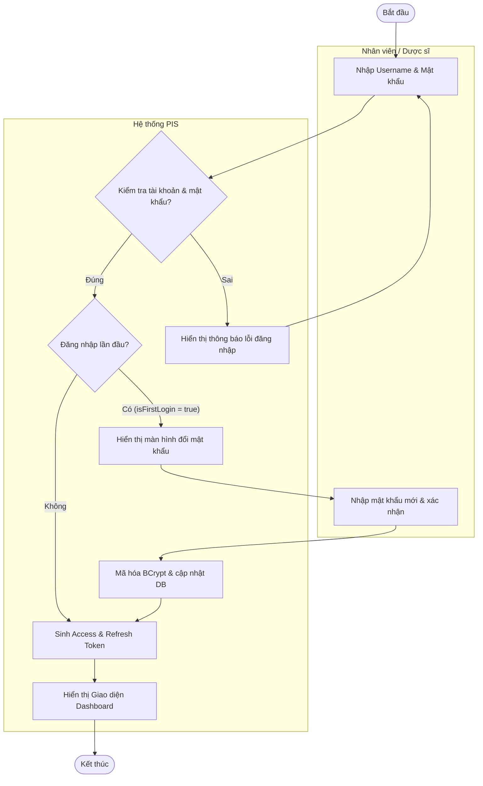
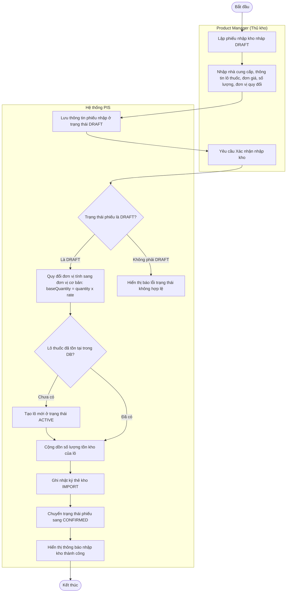
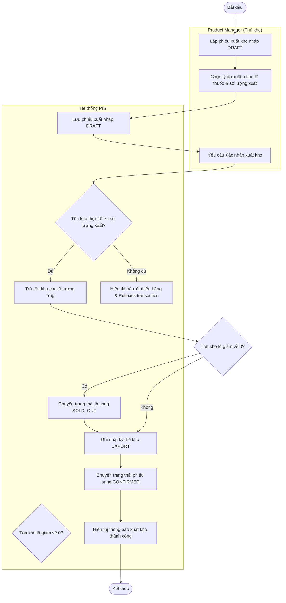
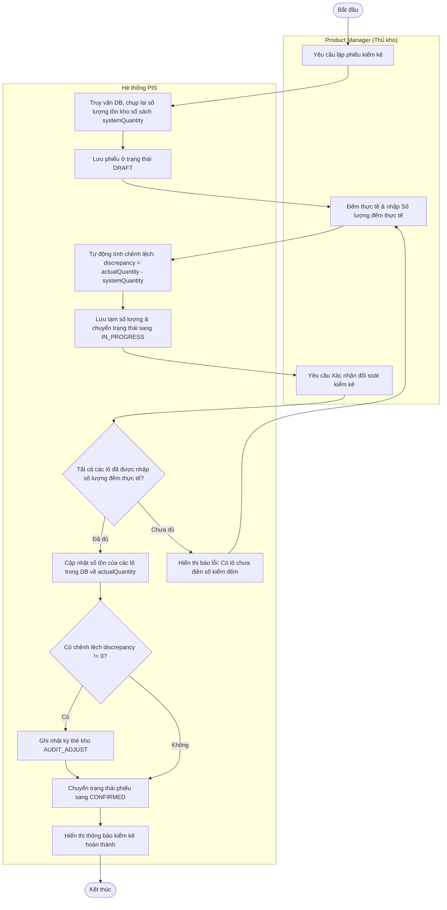
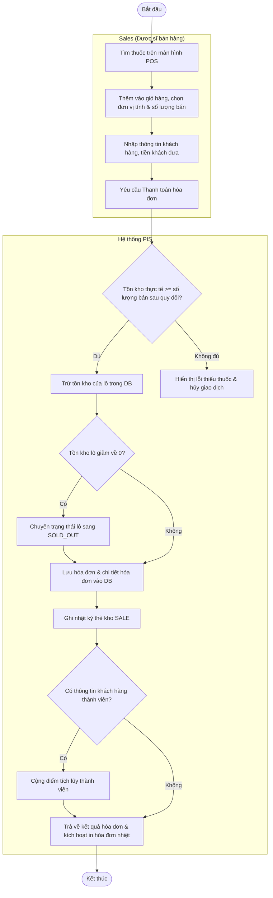
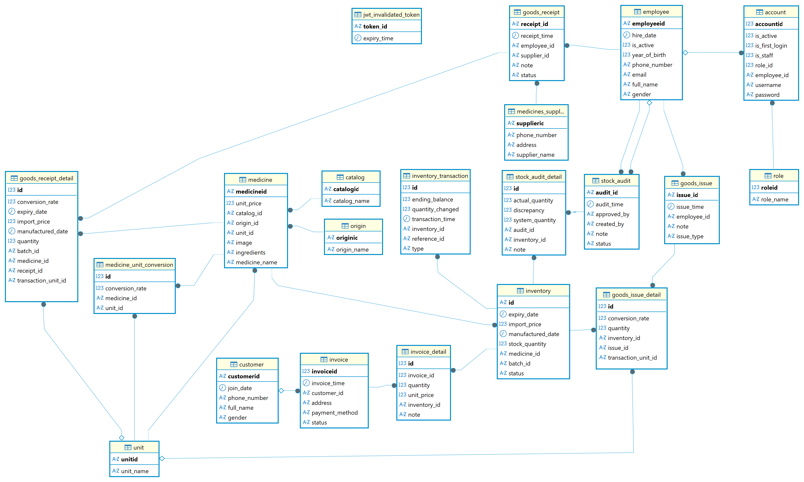
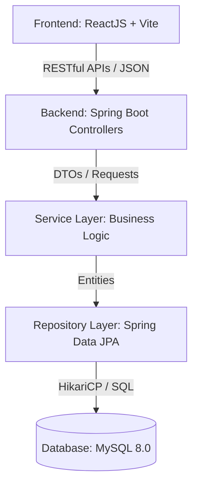
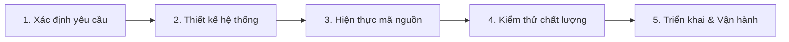

# BÁO CÁO DỰ ÁN DỰ ÁN PHÁT TRIỂN PHẦN MỀM: HỆ THỐNG QUẢN LÝ KHO THUỐC & BÁN LẺ POS (PIS)

---

## 1. KHẢO SÁT HIỆN TRẠNG VÀ XÁC ĐỊNH YÊU CẦU

### 1.1. Phỏng vấn, khảo sát người dùng để xác định nhu cầu
Để xây dựng một hệ thống sát với thực tế vận hành của các nhà thuốc, nhóm phát triển đã tiến hành phỏng vấn và khảo sát trực tiếp tại một số nhà thuốc bán lẻ quy mô vừa và nhỏ. Đối tượng phỏng vấn bao gồm: Chủ nhà thuốc (quản lý chung), Dược sĩ bán thuốc tại quầy, và Thủ kho phụ trách quản lý hàng hóa.

Qua quá trình trao đổi, nhu cầu thực tế của từng đối tượng được tổng hợp như sau:
* **Chủ nhà thuốc (Người quản lý)**:
  * Mong muốn theo dõi được doanh thu, lợi nhuận và biến động xuất nhập tồn theo thời gian thực (real-time) thông qua các báo cáo trực quan.
  * Cần có hệ thống cảnh báo tự động về các lô thuốc sắp hết hạn sử dụng (HSD) hoặc số lượng tồn kho giảm xuống dưới mức tối thiểu để kịp thời đưa ra kế hoạch nhập hàng hoặc thanh lý thuốc.
  * Quản lý nhân sự chặt chẽ, phân quyền rõ ràng giữa nhân viên bán hàng và thủ kho để tránh thất thoát và sai sót dữ liệu.
* **Dược sĩ bán thuốc (Sales)**:
  * Cần một công cụ bán hàng tại quầy (POS) phản hồi nhanh chóng, hỗ trợ tìm kiếm thuốc dễ dàng bằng tên hoặc hoạt chất.
  * Hệ thống phải tự động chọn các lô thuốc còn hạn sử dụng lâu nhất để bán trước (gần hết hạn bán trước hoặc theo nguyên tắc FIFO/FEFO).
  * Quy trình thanh toán đơn giản, tự động tính tiền thừa cho khách, lưu thông tin khách hàng thành viên để tích điểm và hỗ trợ in hóa đơn nhiệt nhanh chóng.
* **Thủ kho (Product manager)**:
  * Cần hệ thống hỗ trợ lập phiếu nhập kho, xuất kho nhanh chóng, hỗ trợ quy đổi đơn vị tính tự động (ví dụ: nhập dạng hộp 10 vỉ nhưng bán lẻ dạng viên).
  * Quy trình kiểm kê định kỳ phải đơn giản: hệ thống tự động chốt số tồn sổ sách, cho phép nhập số lượng kiểm đếm thực tế và tự tính toán chênh lệch thừa/thiếu, tự động tạo phiếu điều chỉnh tồn kho.

---

### 1.2. Ghi nhận hiện trạng hệ thống
Hiện tại, hầu hết các nhà thuốc quy mô nhỏ vẫn thực hiện công tác quản lý bằng các phương pháp thủ công hoặc bán thủ công:
* **Phương thức quản lý**: Ghi chép sổ tay kết hợp sử dụng các bảng tính Excel rời rạc. Khi nhập hàng, nhân viên tự ghi tên thuốc, số lô, hạn dùng và giá vào sổ nhập. Khi bán hàng, dược sĩ lập hóa đơn giấy hoặc tự trừ thủ công trên file Excel.
* **Những hạn chế và rủi ro của hiện trạng**:
  1. **Tra cứu thông tin và số lượng chậm trễ**: Dữ liệu lưu trữ phân tán, khi khách hỏi một loại thuốc hiếm hoặc cần kiểm tra tồn kho, dược sĩ phải đi tìm trong kho hoặc lục lại sổ sách mất nhiều thời gian.
  2. **Tỷ lệ sai lệch và thất thoát cao**: Việc nhập liệu thủ công các thông số phức tạp như số lô (Batch ID), ngày sản xuất, hạn sử dụng dễ phát sinh nhầm lẫn (ví dụ: ghi sai chữ số, nhầm lẫn số lượng đơn vị quy đổi). Dẫn đến tình trạng tồn kho trên sổ sách lệch so với thực tế.
  3. **Quản lý hạn sử dụng gặp khó khăn**: Không có công cụ tự động nhắc nhở thuốc sắp hết hạn. Nhân viên phải đi kiểm tra từng hộp thuốc trên kệ theo định kỳ, dẫn đến nguy cơ bỏ sót thuốc hết hạn gây ảnh hưởng tới sức khỏe người tiêu dùng và thiệt hại kinh tế cho nhà thuốc.
  4. **Quy đổi đơn vị tính phức tạp**: Thuốc thường được nhập dưới đơn vị lớn (Thùng, Hộp) nhưng bán ra dưới đơn vị nhỏ (Vỉ, Viên). Việc tính toán thủ công lượng tồn kho quy đổi quy về đơn vị cơ bản dễ gây nhầm lẫn khi cộng trừ kho.
  5. **Báo cáo và kiểm kê mất nhiều thời gian**: Cuối tháng hoặc cuối quý, nhân viên phải đóng cửa hàng nửa ngày hoặc một ngày để kiểm kho thủ công, đối chiếu từng dòng sổ sách và lập báo cáo doanh thu, gây gián đoạn kinh doanh.

---

### 1.3. Xác định yêu cầu chức năng và phi chức năng
Dựa trên khảo sát và đặc tả SRS, các yêu cầu của hệ thống PIS được phân loại chi tiết như sau:

#### 1.3.1. Yêu cầu chức năng (Functional Requirements - FR)
Hệ thống được thiết kế gồm 7 phân hệ chức năng cốt lõi:
1. **Phân hệ Xác thực & Tài khoản cá nhân (FR-AUTH)**:
   * Đăng nhập hệ thống bằng tài khoản được cấp, kiểm tra trạng thái hoạt động (`isActive`).
   * Bắt buộc đổi mật khẩu ở lần đăng nhập đầu tiên (`isFirstLogin = true`).
   * Đăng xuất hệ thống, thu hồi Access Token qua cơ chế Blacklist (`InvalidatedToken`) và hủy Refresh Token.
   * Cấp lại mật khẩu tạm thời tự động gửi qua email đăng ký của nhân viên.
2. **Phân hệ Quản lý Danh mục & Thuốc (FR-MED)**:
   * Quản lý thông tin thuốc: Mã thuốc, tên thuốc, hoạt chất, hàm lượng, hình ảnh, đơn vị tính cơ bản, đơn giá bán lẻ.
   * Quản lý danh mục (Catalog), Nước sản xuất (Origin), Đơn vị tính (Unit).
   * Cấu hình đơn vị tính quy đổi và tỷ lệ chuyển đổi tương ứng (ví dụ: 1 Hộp = 10 Vỉ = 100 Viên).
3. **Phân hệ Quản lý Đối tác & Nhân sự (FR-PARTNER)**:
   * Quản lý thông tin nhà cung cấp (mã NCC, tên, số điện thoại, địa chỉ).
   * Quản lý khách hàng thành viên (tên, số điện thoại dùng để tích điểm khi mua hàng).
   * Quản lý nhân viên (Mã nhân viên, họ tên, phòng ban, thông tin liên lạc) và cấp tài khoản tương ứng.
4. **Phân hệ Nghiệp vụ Kho thuốc (FR-WH)**:
   * Lập phiếu nhập kho nháp (`DRAFT`), sau khi kiểm tra đầy đủ thông tin thì bấm **Xác nhận**. Hệ thống tự động tính số lượng quy đổi và cộng dồn tồn kho thực tế của lô tương ứng trong bảng `inventory`.
   * Lập phiếu xuất kho nháp (`DRAFT`) với các lý do xuất hủy thuốc hết hạn, hỏng hóc hoặc xuất trả nhà cung cấp. Khi xác nhận, hệ thống kiểm tra tồn kho lô, trừ tồn kho và ghi nhật ký thẻ kho.
5. **Phân hệ Nghiệp vụ Kiểm kê kho (FR-AUDIT)**:
   * Lập phiếu kiểm kê nháp (`DRAFT`), hệ thống chụp lại tồn kho sổ sách của tất cả các lô thuốc tại thời điểm lập (`systemQuantity`).
   * Hỗ trợ lưu tạm số lượng kiểm đếm thực tế của nhân viên (`actualQuantity`) và tự động tính chênh lệch (`discrepancy`).
   * Xác nhận đối soát kiểm kê (`CONFIRMED`): Cập nhật số lượng tồn kho của các lô về khớp đúng bằng số đếm thực tế, tự động sinh các giao dịch điều chỉnh chênh lệch kho (`AUDIT_ADJUST`).
6. **Phân hệ POS & Nghiệp vụ Bán hàng (FR-POS)**:
   * Giao diện bán lẻ tại quầy: Tìm kiếm thuốc nhanh theo tên hoặc hoạt chất, hiển thị các lô còn hạn sử dụng và còn tồn kho.
   * Thêm thuốc vào giỏ hàng, chọn đơn vị tính bán lẻ, tự động tính tiền, tiền thừa thối lại cho khách.
   * Thanh toán hóa đơn: Trừ kho thực tế của các lô thuốc tương ứng, ghi nhận thẻ kho loại `SALE` và kích hoạt in hóa đơn nhiệt khổ K80/K57.
7. **Phân hệ Tồn kho & Báo cáo thẻ kho (FR-INV)**:
   * Xem tồn kho thực tế theo thời gian thực của từng lô thuốc (Mã lô, Hạn sử dụng, Số lượng tồn, Giá nhập).
   * Lọc và đưa ra danh sách cảnh báo: Thuốc sắp hết hạn, đã hết hạn, tồn kho dưới mức tối thiểu (`LOW_STOCK`).
   * Xem lịch sử thẻ kho (Inventory Transactions) của từng loại thuốc để theo dõi vết tăng giảm kho.
   * Dashboard trực quan hiển thị biểu đồ xu hướng nhập xuất, cơ cấu danh mục và các chỉ số thống kê tổng hợp.

#### 1.3.2. Yêu cầu phi chức năng (Non-Functional Requirements - NFR)
* **Hiệu năng (Performance)**:
  * Thời gian phản hồi các API truy vấn dữ liệu thông thường phải dưới **500ms**.
  * Thời gian xử lý các API giao dịch ghi dữ liệu và cập nhật tồn kho đồng thời (nhập, xuất, thanh toán POS) phải dưới **1000ms**.
  * Phân trang (Pagination) bắt buộc ở tầng database đối với các danh sách lớn để tối ưu RAM và băng thông.
* **Bảo mật (Security)**:
  * Mật khẩu nhân viên phải được mã hóa bằng thuật toán băm **BCrypt**.
  * Sử dụng cơ chế xác thực không trạng thái qua **JWT Token** (Access Token có hạn dùng ngắn, Refresh Token xoay vòng).
  * Phân quyền truy cập API nghiêm ngặt ở tầng backend (RBAC) dựa trên 3 vai trò chính: Admin, Product_manager, Sales.
  * Thu hồi Token (Token Blacklisting) bằng cách lưu ID token bị hủy vào bảng `InvalidatedToken` khi đăng xuất.
* **Độ tin cậy & Toàn vẹn dữ liệu (Reliability)**:
  * Các API thay đổi số lượng tồn kho và ghi nhật ký thẻ kho bắt buộc phải được bọc trong giao dịch cơ sở dữ liệu (`@Transactional`). Đảm bảo tính **ACID**, tự động rollback khi xảy ra lỗi thiếu hàng hoặc xung đột.
  * Các ràng buộc khóa ngoại (Foreign Key) giữa các bảng phải được thiết lập chặt chẽ ở mức cơ sở dữ liệu.
* **Tính khả dụng (Usability)**:
  * Giao diện responsive tối ưu trên màn hình Desktop/Laptop của nhân viên nhà thuốc.
  * Màn hình bán hàng POS tối giản hóa các bước thao tác, hỗ trợ phím tắt và tìm kiếm thông minh để đẩy nhanh tốc độ phục vụ khách hàng.

---

## 2. PHÂN TÍCH VÀ THIẾT KẾ HỆ THỐNG

### 2.1. Phân tích yêu cầu (Software Requirements Specification - SRS)

#### 2.1.1. Quy trình khảo sát và thu thập yêu cầu
Để thiết kế hệ thống PIS sát với thực tế vận hành, quy trình thu thập yêu cầu đã được tiến hành qua các bước bài bản:
1. **Phỏng vấn trực tiếp (Interviews)**: Trao đổi trực tiếp với Chủ nhà thuốc, Dược sĩ bán quầy, và Thủ kho để làm rõ các khó khăn trong vận hành hàng ngày (lệch kho, thuốc hết hạn, thanh toán chậm).
2. **Quan sát thực địa (Observation)**: Trực tiếp quan sát quy trình dược sĩ tìm thuốc, cắt liều, tư vấn HSD và quy trình thủ kho kiểm đếm thuốc khi nhập hàng hoặc đối soát tồn kho sổ sách.
3. **Phân tích biểu mẫu nghiệp vụ (Document Analysis)**: Thu thập và phân tích cấu trúc của các mẫu hóa đơn bán lẻ POS, hóa đơn đỏ nhập hàng từ nhà cung cấp, phiếu xuất hủy thuốc quá hạn và các biên bản đối soát kiểm kê kho định kỳ.

#### 2.1.2. Xác định các Tác nhân (Actors) hệ thống
Hệ thống PIS phân quyền truy cập chặt chẽ dựa trên 3 tác nhân chính:
* **Admin (Quản trị viên)**:
  * Có quyền cao nhất trong hệ thống.
  * Quản lý thông tin nhân viên, cấp/khóa tài khoản nhân sự.
  * Phân quyền vai trò (Role-based) và giám sát toàn bộ lịch sử hoạt động.
* **Product Manager (Thủ kho / Quản lý sản phẩm)**:
  * Chịu trách nhiệm quản lý danh mục dữ liệu nền (Thuốc, Catalog, Đơn vị tính, Nước sản xuất).
  * Lập và xác nhận phiếu nhập kho (Goods Receipt) và phiếu xuất kho (Goods Issue).
  * Thực hiện quy trình kiểm kê kho định kỳ (Stock Audit).
  * Giám sát tồn kho thực tế của các lô thuốc và theo dõi biến động thẻ kho.
* **Sales (Nhân viên bán hàng / Dược sĩ tại quầy)**:
  * Sử dụng giao diện POS để tìm kiếm thuốc nhanh theo tên, hoạt chất hoặc mã lô.
  * Lập giỏ hàng, chọn đơn vị tính bán lẻ, tự động tính toán tiền thối và in hóa đơn.
  * Thực hiện thanh toán trực tiếp tại quầy và tự động trừ tồn kho.

#### 2.1.3. Đặc tả yêu cầu chức năng (Functional SRS Summary)
Dưới đây là bảng đặc tả tóm tắt các Use Cases tương ứng với 7 phân hệ nghiệp vụ chính của hệ thống:

| Mã Phân Hệ | Tên Nghiệp Vụ | Danh Sách Use Cases (Chức năng đặc tả) |
| :--- | :--- | :--- |
| **FR-AUTH** | Xác thực & Tài khoản | UC-AUTH-01: Đăng nhập hệ thống (bắt buộc đổi mật khẩu lần đầu)<br>UC-AUTH-02: Đăng xuất (Blacklist Access Token)<br>UC-AUTH-03: Đổi mật khẩu cá nhân<br>UC-AUTH-04: Quên mật khẩu (gửi email cấp mật khẩu tạm tự động)<br>UC-AUTH-05: Quản trị tài khoản nhân viên (Admin) |
| **FR-MED** | Danh mục & Thuốc | UC-MED-01: Quản lý danh mục thuốc (Catalog)<br>UC-MED-02: Quản lý nước sản xuất (Origin)<br>UC-MED-03: Quản lý thông tin thuốc cơ bản (Medicine)<br>UC-MED-04: Cấu hình đơn vị quy đổi (Medicine Unit Conversion) |
| **FR-PARTNER**| Đối tác & Khách hàng | UC-PART-01: Quản lý thông tin nhà cung cấp (Supplier)<br>UC-PART-02: Quản lý khách hàng thành viên (Customer)<br>UC-PART-03: Tích lũy điểm thành viên khi mua hàng |
| **FR-WH** | Nghiệp vụ Kho thuốc | UC-WH-01: Lập phiếu nhập kho nháp (DRAFT)<br>UC-WH-02: Xác nhận nhập kho thực tế (cộng dồn/tạo lô, ghi thẻ kho IMPORT)<br>UC-WH-03: Lập phiếu xuất kho hủy/trả hàng nháp (DRAFT)<br>UC-WH-04: Xác nhận xuất kho (trừ tồn lô thực tế, ghi thẻ kho EXPORT) |
| **FR-AUDIT** | Kiểm kê kho định kỳ | UC-AUD-01: Lập phiếu kiểm kê nháp (Chụp tồn kho sổ sách systemQuantity)<br>UC-AUD-02: Lưu tạm số đếm kiểm thực tế (actualQuantity) & tính chênh lệch<br>UC-AUD-03: Xác nhận chốt đối soát (cập nhật tồn kho lô thực tế & ghi log AUDIT_ADJUST)<br>UC-AUD-04: Hủy phiếu kiểm kê |
| **FR-POS** | Bán lẻ tại quầy POS | UC-POS-01: Tìm kiếm thuốc nhanh theo tên/hoạt chất/mã lô trên POS<br>UC-POS-02: Thêm thuốc vào giỏ hàng POS (chọn đơn vị bán lẻ quy đổi)<br>UC-POS-03: Thanh toán hóa đơn (trừ kho lô, ghi thẻ kho SALE, in hóa đơn nhiệt) |
| **FR-INV** | Tồn kho & Báo cáo | UC-INV-01: Truy vấn tồn kho thực tế theo thời gian thực (Real-time Inventory)<br>UC-INV-02: Cảnh báo thuốc sắp hết hạn sử dụng / Cảnh báo tồn kho tối thiểu<br>UC-INV-03: Xem lịch sử biến động thẻ kho chi tiết từng lô thuốc |

---

### 2.2. Thiết kế hệ thống (System Architecture Design)

Hệ thống được thiết kế theo kiến trúc 3 lớp (3-tier Architecture) kết hợp mô hình Client-Server tách biệt hoàn toàn để tối ưu khả năng mở rộng và bảo trì:
* **Presentation Layer (Frontend)**: Xây dựng trên nền tảng Single Page Application (SPA) dùng ReactJS và Vite. Giao tiếp với Server hoàn toàn qua RESTful API dưới dạng JSON.
* **Application Layer (Backend)**: Phát triển bằng Spring Boot RESTful API. Tầng này chịu trách nhiệm thực thi toàn bộ logic nghiệp vụ (Service), bảo mật lọc request (Spring Security JWT), và xử lý transactions.
* **Data Layer (Database)**: Sử dụng hệ quản trị cơ sở dữ liệu quan hệ MySQL 8.0, ánh xạ thực thể qua Hibernate ORM (JPA).

#### 2.2.1. Sơ đồ Use Case Tổng Quát (Use Case Diagram)
*(Sơ đồ Use Case Diagram được nhóm phát triển chi tiết hóa trong tệp UML đính kèm đồ án, mô tả đầy đủ các tương tác của 3 tác nhân Admin, Product Manager, và Sales với 32 Use Cases cốt lõi).*

#### 2.2.2. Sơ đồ Class (Class Diagram) & Sequence Diagrams
Các sơ đồ cấu trúc Class và Sequence Diagrams cho từng luồng nghiệp vụ phức tạp (nhập kho, đối soát kiểm kê, bán lẻ POS) được thiết kế chi tiết để định hình cấu trúc code backend và đảm bảo tính đồng bộ khi phân tách công việc lập trình giữa các thành viên.

#### 2.2.3. Sơ đồ Hoạt động (Activity Diagrams)
Để trực quan hóa các luồng nghiệp vụ liên tầng giữa Người dùng (Dược sĩ, Thủ kho, Admin) và Hệ thống PIS dưới dạng phân làn (Swimlanes) giống với thiết kế đồ án gốc, nhóm phát triển định nghĩa các biểu đồ hoạt động sau:

##### A. Quy trình Đăng nhập & Đổi mật khẩu lần đầu (Xác thực)
Biểu đồ mô tả quy trình kiểm tra đăng nhập, yêu cầu đổi mật khẩu bắt buộc đối với nhân sự mới ở lần đầu đăng nhập, và cấp phát JWT token:



##### B. Quy trình Nhập kho (Goods Receipt)
Biểu đồ mô tả luồng lập phiếu nhập kho nháp và quá trình xác nhận nhập kho thực tế, tự động quy đổi đơn vị tính để cộng dồn tồn kho:



##### C. Quy trình Xuất kho hủy / Trả hàng (Goods Issue)
Biểu đồ mô tả luồng xuất kho nháp, kiểm tra điều kiện tồn kho thực tế của lô thuốc để ngăn chặn xuất âm kho trước khi hoàn thành:



##### D. Quy trình Kiểm kê kho định kỳ (Stock Audit)
Biểu đồ mô tả quy trình chụp tồn kho sổ sách, lưu tạm số kiểm đếm thực tế, và tự động đối soát điều chỉnh cân bằng kho khi chốt phiếu:



##### E. Quy trình Bán lẻ tại quầy POS (POS Sales)
Biểu đồ mô tả quy trình bán hàng tại quầy POS của dược sĩ, tự động kiểm tra tồn kho lô, trừ kho, tích điểm khách hàng thành viên, và in hóa đơn nhiệt:



---


### 2.3. Thiết kế cơ sở dữ liệu (Database Schema Design)

#### 2.3.1. Sơ đồ thực thể liên kết ERD (Entity Relationship Diagram)
Cơ sở dữ liệu của hệ thống PIS bao gồm 22 bảng dữ liệu, được thiết kế chuẩn hóa để tránh trùng lặp dữ liệu, đảm bảo tính toàn vẹn khóa ngoại và hỗ trợ truy vấn hiệu năng cao. Sơ đồ ERD chi tiết của hệ thống như sau:



#### 2.3.2. Mô tả các nhóm bảng thực thể chính
Dữ liệu được tổ chức thành các nhóm bảng logic:
1. **Nhóm Xác thực & Tài khoản**:
   * `account`: Lưu thông tin đăng nhập, cờ đăng nhập lần đầu (`is_first_login`), và trạng thái hoạt động.
   * `role`: Định nghĩa các vai trò Admin, Product_manager, Sales.
   * `employee`: Lưu thông tin chi tiết nhân sự của nhà thuốc.
   * `jwt_invalidated_token`: Lưu trữ danh sách đen các token đã bị vô hiệu hóa khi người dùng đăng xuất.
2. **Nhóm Danh mục & Thông tin Thuốc**:
   * `medicine`: Thông tin cơ bản của thuốc (Tên, hoạt chất, hàm lượng, hình ảnh, đơn giá bán gốc).
   * `catalog` & `origin`: Nhóm danh mục và quốc gia sản xuất của thuốc.
   * `unit`: Đơn vị tính cơ bản (Viên, Vỉ, Hộp).
   * `medicine_unit_conversion`: Lưu trữ cấu hình tỷ lệ quy đổi của từng loại thuốc (ví dụ: Hộp sang Viên).
3. **Nhóm Đối tác**:
   * `supplier`: Quản lý thông tin nhà cung cấp dược phẩm.
   * `customer`: Quản lý khách hàng thành viên và điểm tích lũy mua hàng.
4. **Nhóm Tồn kho & Giao dịch kho**:
   * `inventory`: Quản lý tồn kho thực tế chi tiết đến từng lô (`batch_id`), ngày sản xuất, hạn sử dụng, giá nhập và trạng thái của lô.
   * `inventory_transaction`: Nhật ký biến động thẻ kho (lưu vết mọi giao dịch IMPORT, EXPORT, SALE, AUDIT_ADJUST).
5. **Nhóm Phiếu kho & Hóa đơn**:
   * `goods_receipt` & `goods_receipt_detail`: Lưu trữ phiếu nhập hàng từ nhà cung cấp.
   * `goods_issue` & `goods_issue_detail`: Lưu trữ phiếu xuất trả hàng hoặc xuất hủy thuốc hỏng/quá hạn.
   * `stock_audit` & `stock_audit_detail`: Lưu biên bản kiểm kê kho, ghi đếm số lượng thực tế.
   * `invoice` & `invoice_detail`: Lưu trữ hóa đơn bán lẻ POS phục vụ khách hàng.

---

## 3. LẬP TRÌNH VÀ TRIỂN KHAI

### 3.1. Chọn ngôn ngữ lập trình phù hợp

#### 3.1.1. Backend: Java (Spring Boot)
* **Lý do lựa chọn**:
  * **Java 17 (LTS)**: Cung cấp tính năng mạnh mẽ về kiểu dữ liệu tĩnh (Static Typing) giúp phát hiện lỗi sớm khi biên dịch, đồng thời tích hợp nhiều cải tiến ngữ pháp hiện đại (như Record, Pattern Matching, Text Blocks) và bộ dọn rác JVM tối ưu hiệu năng.
  * **Spring Boot 3.5.14**: Framework hàng đầu cho ứng dụng doanh nghiệp nhờ cơ chế tự động cấu hình (Auto Configuration) và quản lý phụ thuộc qua Dependency Injection (DI) / Inversion of Control (IoC). Spring Boot hỗ trợ viết RESTful API nhanh chóng, bảo mật cao và dễ bảo trì.
* **Các thư viện cốt lõi sử dụng trong mã nguồn**:
  * `spring-boot-starter-web`: Định nghĩa các Controller tiếp nhận yêu cầu HTTP, xử lý phân trang và trả dữ liệu JSON.
  * `spring-boot-starter-data-jpa`: Tương tác với MySQL thông qua Hibernate ORM, ánh xạ Class Entity thành bảng DB.
  * `spring-boot-starter-security`: Cấu hình bộ lọc bảo mật và phân quyền API dựa trên vai trò.
  * `jjwt-api / jjwt-impl / jjwt-jackson (0.11.5)`: Tạo sinh, giải mã và kiểm tra tính toàn vẹn của mã xác thực JWT.
  * `spring-boot-starter-mail`: Gửi email SMTP tự động mật khẩu tạm cho nhân viên.
  * `lombok`: Tiết kiệm thời gian viết các hàm Getter, Setter, Constructor, Builder thông qua các Annotation tương ứng.

#### 3.1.2. Frontend: JavaScript (ReactJS + Vite)
* **Lý do lựa chọn**:
  * **ReactJS 19.2.6**: Thư viện UI xây dựng giao diện theo mô hình thành phần (Component-based). Mỗi phần giao diện (bảng thuốc, giỏ hàng POS, form nhập kho) được đóng gói độc lập, dễ dàng tái sử dụng và quản lý trạng thái (State) tập trung. Cơ chế Virtual DOM giúp giao diện phản hồi cực nhanh khi thay đổi dữ liệu.
  * **Vite 8.0.12**: Công cụ build frontend thế hệ mới với tốc độ khởi chạy server dev và cập nhật mã nguồn (Hot Module Replacement) gần như tức thời nhờ tận dụng ESM (ES Modules) của trình duyệt.
* **Các thư viện cốt lõi sử dụng trong frontend**:
  * `react-router-dom (7.16.0)`: Định tuyến Client-side Routing, giúp chuyển đổi trang mượt mà không cần tải lại toàn bộ trang web (Single Page Application).
  * `axios (1.16.1)`: Thư viện HTTP client dùng để kết nối với API backend, cấu hình request interceptor để tự động gắn Access Token vào Header và response interceptor để tự động refresh token khi nhận mã lỗi 401.
  * `recharts (3.8.1)`: Trực quan hóa dữ liệu thống kê trên Dashboard bằng các biểu đồ đường, biểu đồ cột và biểu đồ tròn tương tác.

---

### 3.2. Chọn cơ sở dữ liệu phù hợp

#### 3.2.1. Cơ sở dữ liệu chính: MySQL 8.0
Nghiệp vụ quản lý kho thuốc đòi hỏi sự chính xác tuyệt đối của số lượng tồn kho và tiền tệ hóa đơn. Hệ quản trị cơ sở dữ liệu MySQL 8.0 được lựa chọn nhờ:
* Hỗ trợ đầy đủ chuẩn giao dịch **ACID**, bảo vệ dữ liệu khỏi các tình huống lỗi hệ thống đột ngột.
* Cơ chế khóa ở mức dòng (**row-level locking**) của công cụ lưu trữ InnoDB, ngăn chặn hiện tượng tranh chấp dữ liệu (Race Condition) khi nhiều quầy POS cùng thực hiện bán lẻ và trừ kho trên cùng một lô thuốc tại cùng một thời điểm.
* Khả năng tương thích hoàn hảo với Hibernate ORM thông qua cấu hình MySQLDialect.

#### 3.2.2. Cơ chế kết nối và cấu hình Database (JPA/Hibernate)
* **Hikari Connection Pool**: Quản lý hồ chứa kết nối hiệu năng cao. Cấu hình chi tiết trong file `application.yaml`:
  * `maximum-pool-size: 10` (Tối đa 10 kết nối hoạt động đồng thời).
  * `minimum-idle: 5` (Duy trì tối thiểu 5 kết nối nhàn rỗi).
  * `connection-timeout: 30000` (Thời gian chờ kết nối tối đa 30 giây).
  * `idle-timeout: 600000` (Giải phóng kết nối nhàn rỗi sau 10 phút).
* **Đồng bộ hóa Schema**: Cấu hình `ddl-auto: create-drop` kết hợp lớp khởi tạo dữ liệu [DataInitializer.java](file:///c:/Users/Uyen/Desktop/PIS_CNPM/backend/src/main/java/com/app/pis/config/DataInitializer.java) để tự động xóa và dựng lại cấu trúc bảng từ các Class Entity, đồng thời nạp dữ liệu mẫu (nhân viên, thuốc, nhà cung cấp, lô hàng...) mỗi khi ứng dụng khởi chạy trong môi trường phát triển.
* **Danh sách thực thể (Entities)**: Hệ thống định nghĩa 22 thực thể liên kết chặt chẽ bao gồm:
  1. `Account`: Thông tin tài khoản đăng nhập.
  2. `Role`: Phân quyền vai trò (Admin, Product_manager, Sales).
  3. `Employee`: Thông tin nhân sự của nhà thuốc.
  4. `Customer`: Khách hàng thành viên tích điểm.
  5. `Supplier`: Nhà cung cấp dược phẩm.
  6. `Medicine`: Thông tin thuốc cơ bản.
  7. `Unit`: Các đơn vị tính định nghĩa trong hệ thống (Viên, Vỉ, Hộp).
  8. `MedicineUnit`: Bảng liên kết quy định tỷ lệ quy đổi của từng loại thuốc.
  9. `Catalog`: Nhóm danh mục phân loại thuốc.
  10. `Origin`: Nước sản xuất thuốc.
  11. `Inventory`: Lô tồn kho chi tiết (Id kết hợp giữa `medicine_id` và `batchId`).
  12. `InventoryTransaction`: Nhật ký biến động kho (thẻ kho) lưu vết tất cả các giao dịch.
  13. `GoodsReceipt`: Phiếu nhập kho từ nhà cung cấp.
  14. `GoodsReceiptDetail`: Chi tiết các thuốc trong phiếu nhập.
  15. `GoodsIssue`: Phiếu xuất kho hủy/trả hàng.
  16. `GoodsIssueDetail`: Chi tiết các thuốc trong phiếu xuất.
  17. `StockAudit`: Phiếu kiểm kê kho định kỳ.
  18. `StockAuditDetail`: Chi tiết số lượng kiểm đếm thực tế của từng lô.
  19. `Invoice`: Hóa đơn bán lẻ POS.
  20. `InvoiceDetail`: Chi tiết thuốc bán lẻ trong hóa đơn.
  21. `InvalidatedToken`: Blacklist các token JWT đã bị hủy khi đăng xuất.
  22. `RefreshToken`: Quản lý refresh token phục vụ xoay vòng phiên đăng nhập.

---

### 3.3. Quản lý mã nguồn bằng Git
Dự án áp dụng mô hình phân nhánh mã nguồn chuẩn bằng **Git** để phục vụ việc phối hợp phát triển nhóm:
* **Các nhánh chính (Branches)**:
  * `main`: Lưu trữ mã nguồn phiên bản ổn định nhất, sẵn sàng đóng gói và chạy thực tế (Production).
  * `dev`: Nhánh tích hợp các tính năng mới sau khi đã được kiểm thử độc lập, dùng cho môi trường thử nghiệm (Staging).
  * `refactor/backend`: Nhánh chuyên biệt dùng để tái cấu trúc mã nguồn backend (xử lý logic nghiệp vụ và bảo mật).
  * Các nhánh tính năng (`feature/` hoặc `agents/`) được tách ra từ `dev` để phát triển các tính năng độc lập, sau đó tạo Pull Request (PR) để Code Review trước khi gộp trở lại `dev`.
* **Quy chuẩn thông điệp commit (Git Commit Conventions)**:
  * Sử dụng các tiền tố chuẩn hóa để phân loại thay đổi:
    * `feat:` Thêm một chức năng mới.
    * `fix:` Sửa một lỗi lập trình.
    * `refactor:` Cấu trúc lại mã nguồn mà không thay đổi tính năng.
    * `docs:` Bổ sung hoặc sửa đổi tài liệu hướng dẫn.

---

### 3.4. Thực hiện coding theo chức năng
Mã nguồn dự án được tổ chức theo mô hình tách biệt hoàn toàn giữa Frontend (ReactJS) và Backend (Spring Boot REST APIs).



#### 3.4.1. Chức năng Xác thực & Phân quyền (Authentication & Authorization)
* **Bảo mật Endpoint**: Cấu hình tại lớp [SecurityConfig.java](file:///c:/Users/Uyen/Desktop/PIS_CNPM/backend/src/main/java/com/app/pis/config/SecurityConfig.java). Cài đặt phân quyền chi tiết dựa trên vai trò (Role-based Access Control):
  ```java
  .requestMatchers("/api/employees/**", "/api/accounts/**").hasRole("Admin")
  .requestMatchers(HttpMethod.POST, "/api/medicines/**", "/api/goods-receipts/**").hasAnyRole("Admin", "Product_manager")
  .requestMatchers(HttpMethod.POST, "/api/invoices/**").hasAnyRole("Admin", "Sales")
  ```
* **JWT Filter**: Lớp [JwtAuthenticationFilter.java](file:///c:/Users/Uyen/Desktop/PIS_CNPM/backend/src/main/java/com/app/pis/config/JwtAuthenticationFilter.java) đánh chặn mọi yêu cầu HTTP để kiểm tra header `Authorization: Bearer <token>`, giải mã JWT bằng `JwtTokenProvider` và thiết lập quyền truy cập cho Thread xử lý hiện tại thông qua `SecurityContextHolder`.
* **Logic nghiệp vụ xác thực**: Triển khai trong lớp [AuthService.java](file:///c:/Users/Uyen/Desktop/PIS_CNPM/backend/src/main/java/com/app/pis/service/AuthService.java):
  * **Đăng nhập**: Kiểm tra tài khoản tồn tại, đối chiếu mật khẩu băm bằng `passwordEncoder.matches()`. Nếu là lần đăng nhập đầu tiên (`isFirstLogin == true`), hệ thống ném ngoại lệ yêu cầu đổi mật khẩu. Nếu hợp lệ, trả về cặp Access Token và Refresh Token.
  * **Đăng xuất**: Lấy Access Token từ header, lưu ID token vào bảng `invalidated_token` để vô hiệu hóa token đó (Blacklist) đồng thời xóa Refresh Token trong DB.
  * **Quên mật khẩu**: Xác thực Username và Email của nhân viên. Sinh mật khẩu ngẫu nhiên 8 ký tự bằng `SecureRandom`, mã hóa lưu vào DB, đặt `isFirstLogin = true` và gọi `mailService.sendMail()` gửi thông tin mật khẩu tạm cho nhân viên.

#### 3.4.2. Chức năng Quản lý Phiếu Nhập Kho (Goods Receipt)
* **Định nghĩa API**: Xử lý tại [GoodsReceiptController.java](file:///c:/Users/Uyen/Desktop/PIS_CNPM/backend/src/main/java/com/app/pis/controller/GoodsReceiptController.java).
* **Quy trình xử lý nghiệp vụ**: Triển khai trong [GoodsReceiptService.java](file:///c:/Users/Uyen/Desktop/PIS_CNPM/backend/src/main/java/com/app/pis/service/GoodsReceiptService.java):
  * **Lập phiếu nháp (`createReceiptDraft`)**: Lưu các thông tin chung và chi tiết mặt hàng nhập vào bảng `goods_receipt` và `goods_receipt_detail` với trạng thái ban đầu là `DRAFT`. Tại bước này, hệ thống tự động kiểm tra sự tồn tại của đơn vị tính giao dịch, truy xuất `conversionRate` tương ứng của thuốc để tính toán lượng quy đổi, nhưng **chưa cập nhật tồn kho thực tế**.
  * **Xác nhận nhập kho (`confirmReceipt`)**: Được bọc trong annotation `@Transactional`.
    1. Hệ thống kiểm tra trạng thái phiếu phải là `DRAFT`.
    2. Duyệt qua từng chi tiết thuốc nhập, tính số lượng quy đổi sang đơn vị cơ bản: `baseQuantity = Quantity * conversionRate`.
    3. Tìm lô tồn kho trong bảng `inventory` theo mã khóa `medicineID-batchId`. Nếu chưa tồn tại, tạo mới bản ghi lô với trạng thái `ACTIVE`, HSD và giá nhập. Nếu đã tồn tại, cộng dồn số lượng tồn kho `stockQuantity = stockQuantity + baseQuantity` và cập nhật giá nhập mới nhất.
    4. Ghi nhận nhật ký thẻ kho bằng cách tạo mới bản ghi [InventoryTransaction](file:///c:/Users/Uyen/Desktop/PIS_CNPM/backend/src/main/java/com/app/pis/entity/InventoryTransaction.java) loại `IMPORT` chứa số lượng thay đổi dương và số tồn cuối của lô.
    5. Cập nhật trạng thái phiếu nhập kho thành `CONFIRMED`.

#### 3.4.3. Chức năng Quản lý Phiếu Xuất Kho (Goods Issue)
* **Định nghĩa API**: Xử lý tại [GoodsIssueController.java](file:///c:/Users/Uyen/Desktop/PIS_CNPM/backend/src/main/java/com/app/pis/controller/GoodsIssueController.java).
* **Quy trình xử lý nghiệp vụ**: Triển khai trong [GoodsIssueService.java](file:///c:/Users/Uyen/Desktop/PIS_CNPM/backend/src/main/java/com/app/pis/service/GoodsIssueService.java):
  * **Xác nhận xuất kho (`confirmIssue`)**: Xử lý dưới dạng `@Transactional`.
    1. Kiểm tra trạng thái phiếu xuất phải là `DRAFT`.
    2. Duyệt qua từng mặt hàng cần xuất. Truy vấn lô tồn kho tương ứng trong bảng `inventory`.
    3. Kiểm tra điều kiện tồn kho: Số lượng tồn kho thực tế phải lớn hơn hoặc bằng số lượng yêu cầu xuất sau quy đổi. Nếu không đáp ứng, lập tức ném lỗi `IllegalArgumentException` để Rollback toàn bộ giao dịch trừ kho đã chạy trước đó.
    4. Nếu đủ tồn kho, thực hiện trừ tồn kho: `stockQuantity = stockQuantity - baseQuantity`. Nếu số lượng tồn kho giảm về 0, cập nhật trạng thái lô thành `SOLD_OUT` hoặc `DISPOSED`.
    5. Lưu thông tin lô tồn kho mới và ghi log biến động kho [InventoryTransaction](file:///c:/Users/Uyen/Desktop/PIS_CNPM/backend/src/main/java/com/app/pis/entity/InventoryTransaction.java) loại `EXPORT` (hoặc `SALE` tùy lý do xuất) với số lượng thay đổi là giá trị âm.
    6. Cập nhật trạng thái phiếu xuất kho thành `CONFIRMED`.

#### 3.4.4. Chức năng Kiểm kê Kho (Stock Audit)
* **Định nghĩa API**: Xử lý tại [StockAuditController.java](file:///c:/Users/Uyen/Desktop/PIS_CNPM/backend/src/main/java/com/app/pis/controller/StockAuditController.java).
* **Quy trình xử lý nghiệp vụ**: Triển khai trong [StockAuditService.java](file:///c:/Users/Uyen/Desktop/PIS_CNPM/backend/src/main/java/com/app/pis/service/StockAuditService.java):
  * **Lập phiếu kiểm kê nháp (`createAuditDraft`)**: Hệ thống truy vấn toàn bộ các lô hàng hiện có tồn kho trong bảng `inventory`. Chụp lại số lượng tồn kho tại thời điểm đó gán vào cột tồn hệ thống (`systemQuantity`), đồng thời mặc định số đếm thực tế bằng số sổ sách và chênh lệch bằng 0. Tạo phiếu kiểm kê ở trạng thái `DRAFT`.
  * **Lưu số lượng đếm thực tế (`saveAuditDraftQuantity`)**: Cho phép nhân viên cập nhật số lượng thực tế kiểm đếm (`actualQuantity`) và ghi chú giải trình lên giao diện. Hệ thống tự động tính toán chênh lệch chênh lệch: `discrepancy = actualQuantity - systemQuantity` và lưu lại tạm thời. Trạng thái phiếu được cập nhật thành `IN_PROGRESS`.
  * **Xác nhận đối soát hoàn thành kiểm kê (`confirmAudit`)**:
    1. Kiểm tra xem toàn bộ các lô hàng trong phiếu đã được điền số lượng đếm thực tế chưa (không để trống).
    2. Duyệt qua từng lô hàng, cập nhật số lượng tồn kho của lô trong bảng `inventory` về khớp đúng bằng số đếm thực tế `actualQuantity`.
    3. Nếu lô hàng có chênh lệch (`discrepancy != 0`), hệ thống tự động tạo một bản ghi biến động kho [InventoryTransaction](file:///c:/Users/Uyen/Desktop/PIS_CNPM/backend/src/main/java/com/app/pis/entity/InventoryTransaction.java) loại `AUDIT_ADJUST` lưu lại lượng chênh lệch thừa (giá trị dương) hoặc thiếu (giá trị âm) và kết duy mới của lô.
    4. Cập nhật trạng thái phiếu kiểm kê thành `CONFIRMED` và ghi nhận nhân viên phê duyệt đối soát.

#### 3.4.5. Chức năng Lập Hóa Đơn Bán Lẻ POS
* **Định nghĩa API**: Xử lý tại [InvoiceController.java](file:///c:/Users/Uyen/Desktop/PIS_CNPM/backend/src/main/java/com/app/pis/controller/InvoiceController.java).
* **Quy trình xử lý nghiệp vụ**: Triển khai trong [InvoiceService.java](file:///c:/Users/Uyen/Desktop/PIS_CNPM/backend/src/main/java/com/app/pis/service/InvoiceService.java):
  * **Lập hóa đơn và trừ tồn kho (`createInvoice`)**: Xử lý đồng thời dưới dạng `@Transactional`.
    1. Kiểm tra sự tồn tại của Khách hàng thành viên nếu có thông tin truyền lên.
    2. Thiết lập thông tin hóa đơn (phương thức thanh toán: Cash/Card, trạng thái Paid, địa chỉ).
    3. Duyệt qua danh sách thuốc trong giỏ hàng. Truy vấn từng lô thuốc tương ứng theo `inventoryId`.
    4. Thực hiện kiểm tra tồn kho lô: Nếu tồn kho thực tế nhỏ hơn số lượng bán ra đã quy đổi, ném lỗi `IllegalArgumentException` và hủy bỏ toàn bộ giao dịch bán hàng (Rollback).
    5. Nếu đáp ứng, thực hiện trừ tồn kho lô trực tiếp trong bảng `inventory`. Nếu tồn kho của lô giảm về 0, cập nhật trạng thái lô thành `SOLD_OUT`.
    6. Lưu chi tiết hóa đơn vào bảng `invoice_detail` (gồm đơn giá bán, số lượng, thành tiền).
    7. Ghi nhật ký thẻ kho loại `SALE` (số lượng thay đổi âm) liên kết với mã số tham chiếu hóa đơn vừa được sinh.
    8. Trả về thông tin hóa đơn hoàn chỉnh. Frontend nhận dữ liệu sẽ kích hoạt cửa sổ in hóa đơn nhiệt để hoàn tất giao dịch.

---

## 4. KIỂM THỬ VÀ ĐẢM BẢO CHẤT LƯỢNG

### 4.1. Thực hiện kiểm thử

#### 4.1.1. Unit Test
Nhóm phát triển đã viết đầy đủ các Unit Test sử dụng framework **JUnit 5** và thư viện **Mockito** để cô lập, giả lập dữ liệu và kiểm tra độ chính xác của tầng logic nghiệp vụ (Service Layer).

Dưới đây là chi tiết các kịch bản kiểm thử (Test Cases) đã được cài đặt trong 6 file test service chính:

##### A. AuthServiceTest.java
Tập trung kiểm thử các nghiệp vụ liên quan đến Đăng nhập, Xác thực JWT, Thay đổi mật khẩu và cấp lại mật khẩu tạm:

| Mã TC | Tên Test Case | Điều kiện đầu vào (Inputs) | Hành động kiểm thử | Kết quả mong đợi (Expected Output) |
| :--- | :--- | :--- | :--- | :--- |
| **TC-AUTH-01** | Đăng nhập thành công | Tài khoản hoạt động bình thường, nhập đúng `username`, `password`. | Gọi hàm `login` của `AuthService`. | Trả về `LoginResponse` chứa Access Token, Refresh Token, đúng vai trò (Role). |
| **TC-AUTH-02** | Đăng nhập sai Username | Nhập `username` không tồn tại trong hệ thống. | Gọi hàm `login`. | Ném ra ngoại lệ `BadCredentialsException`. |
| **TC-AUTH-03** | Đăng nhập sai Mật khẩu | Nhập đúng `username` nhưng sai `password`. | Gọi hàm `login`. | Ném ra ngoại lệ `BadCredentialsException`. |
| **TC-AUTH-04** | Đăng nhập tài khoản bị khóa | Nhập đúng thông tin nhưng tài khoản có trạng thái `isActive = false`. | Gọi hàm `login`. | Ném ra ngoại lệ `IllegalArgumentException`. |
| **TC-AUTH-05** | Đăng nhập lần đầu yêu cầu đổi mật khẩu | Tài khoản mới được cấp có thuộc tính `isFirstLogin = true`. | Gọi hàm `login`. | Ném ra ngoại lệ `IllegalArgumentException` để yêu cầu đổi mật khẩu. |
| **TC-AUTH-06** | Đổi mật khẩu thành công | Nhập đúng mật khẩu cũ, mật khẩu mới và xác nhận mật khẩu mới trùng nhau. | Gọi hàm `changePassword`. | Không ném ra lỗi, thuộc tính `isFirstLogin` chuyển thành `false`, gọi DB lưu. |
| **TC-AUTH-07** | Đổi mật khẩu không khớp | Mật khẩu mới và mật khẩu xác nhận khác nhau. | Gọi hàm `changePassword`. | Ném ra ngoại lệ `IllegalArgumentException`. |
| **TC-AUTH-08** | Đổi mật khẩu sai mật khẩu cũ | Nhập đúng các trường mật khẩu mới nhưng sai mật khẩu cũ. | Gọi hàm `changePassword`. | Ném ra ngoại lệ `IllegalArgumentException`. |
| **TC-AUTH-09** | Lấy thông tin cá nhân thành công | Username hợp lệ đang đăng nhập. | Gọi hàm `getMe`. | Trả về `UserMeResponse` đầy đủ thông tin nhân sự và vai trò liên kết. |
| **TC-AUTH-10** | Quên mật khẩu thành công | Nhập đúng Username và Email đã đăng ký. | Gọi hàm `forgotPassword`. | Sinh mật khẩu tạm 8 ký tự, băm mật khẩu mới, gọi hàm gửi email và đặt `isFirstLogin=true`. |
| **TC-AUTH-11** | Quên mật khẩu sai Email | Nhập đúng Username nhưng nhập sai Email. | Gọi hàm `forgotPassword`. | Ném ra ngoại lệ `IllegalArgumentException`. |

##### B. MedicineServiceTest.java
Kiểm thử các nghiệp vụ quản lý thông tin thuốc, phân trang danh sách thuốc, và cấu hình đơn vị tính quy đổi phụ:

| Mã TC | Tên Test Case | Điều kiện đầu vào (Inputs) | Hành động kiểm thử | Kết quả mong đợi (Expected Output) |
| :--- | :--- | :--- | :--- | :--- |
| **TC-MED-01** | Lấy danh sách thuốc không tìm kiếm | Tham số page=0, size=10. | Gọi hàm `getAll`. | Trả về đối tượng `PagedResponse` chứa danh sách thuốc phân trang từ Repository. |
| **TC-MED-02** | Tìm kiếm thuốc theo tên | Nhập từ khóa tìm kiếm "para". | Gọi hàm `getAll`. | Trả về danh sách các thuốc có tên chứa chữ "para". |
| **TC-MED-03** | Lấy chi tiết thuốc thành công | Mã thuốc "MED001" tồn tại. | Gọi hàm `getById`. | Trả về `MedicineResponse` đầy đủ thông tin chi tiết thuốc. |
| **TC-MED-04** | Lấy chi tiết thuốc thất bại | Mã thuốc không tồn tại trong hệ thống. | Gọi hàm `getById`. | Ném ra ngoại lệ `IllegalArgumentException`. |
| **TC-MED-05** | Tạo thuốc mới thành công | Nhập đầy đủ thông tin thuốc hợp lệ, ID chưa tồn tại. | Gọi hàm `create`. | Lưu thuốc thành công, trả về thông tin thuốc vừa tạo. |
| **TC-MED-06** | Tạo thuốc trùng ID | Nhập ID thuốc đã có sẵn trong cơ sở dữ liệu. | Gọi hàm `create`. | Ném ra ngoại lệ `IllegalArgumentException`. |
| **TC-MED-07** | Tạo thuốc kèm đơn vị tính quy đổi | Thuốc có đơn vị cơ bản là "Viên" và có đơn vị phụ là "Hộp" (tỷ lệ 10). | Gọi hàm `create`. | Lưu thuốc thành công, đồng thời lưu bản ghi quy đổi vào `MedicineUnitRepository`. |
| **TC-MED-08** | Trùng đơn vị quy đổi với đơn vị gốc | Đơn vị quy đổi phụ trùng với đơn vị gốc "Viên". | Gọi hàm `create`. | Ném ra ngoại lệ `IllegalArgumentException`. |
| **TC-MED-09** | Xóa thuốc thành công | Thuốc tồn tại và chưa phát sinh giao dịch kho. | Gọi hàm `delete`. | Xóa bản ghi thuốc và các bản ghi quy đổi liên quan khỏi DB. |

##### C. InventoryAndSalesServiceTest.java
Kiểm thử logic cốt lõi của việc nhập kho (Goods Receipt) và xuất kho hủy/trả (Goods Issue):

| Mã TC | Tên Test Case | Điều kiện đầu vào (Inputs) | Hành động kiểm thử | Kết quả mong đợi (Expected Output) |
| :--- | :--- | :--- | :--- | :--- |
| **TC-INV-01** | Xác nhận nhập kho lô mới | Phiếu nhập kho nháp (`DRAFT`). Lô hàng chưa từng tồn tại trong kho. | Gọi hàm `confirmReceipt`. | Tạo bản ghi tồn kho mới trong bảng `inventory`, tính toán số lượng quy đổi (Hộp -> Viên), lưu log `IMPORT`. Trạng thái phiếu thành `CONFIRMED`. |
| **TC-INV-02** | Xác nhận nhập kho cộng dồn | Phiếu nhập kho nháp (`DRAFT`). Lô hàng đã tồn tại trong kho (đang có 20 viên). | Gọi hàm `confirmReceipt`. | Cộng dồn số lượng nhập mới vào lô tồn kho hiện tại, cập nhật giá nhập mới, lưu log `IMPORT`. |
| **TC-INV-03** | Chặn xác nhận nhập kho sai trạng thái | Phiếu nhập kho đã ở trạng thái `CONFIRMED` từ trước. | Gọi hàm `confirmReceipt`. | Ném ra ngoại lệ `IllegalStateException` ngăn chặn việc chạy lại logic cộng kho. |
| **TC-INV-04** | Xác nhận xuất kho thành công | Phiếu xuất kho nháp (`DRAFT`). Lô hàng đang có 20 viên, cần xuất 1 vỉ (10 viên). | Gọi hàm `confirmIssue`. | Trừ tồn kho lô thực tế từ 20 xuống 10 viên, ghi nhận log `EXPORT`, chuyển trạng thái phiếu xuất thành `CONFIRMED`. |
| **TC-INV-05** | Chặn xuất kho do thiếu hàng | Phiếu xuất kho nháp (`DRAFT`). Lô hàng đang có 20 viên, cần xuất 3 vỉ (30 viên). | Gọi hàm `confirmIssue`. | Ném ra ngoại lệ `IllegalArgumentException` báo thiếu hàng, hủy bỏ toàn bộ tiến trình (Rollback). |

##### D. InvoiceServiceTest.java
Kiểm thử quy trình bán lẻ POS tại quầy, đảm bảo trừ tồn kho chính xác và chuyển trạng thái lô hàng khi hết sạch thuốc:

| Mã TC | Tên Test Case | Điều kiện đầu vào (Inputs) | Hành động kiểm thử | Kết quả mong đợi (Expected Output) |
| :--- | :--- | :--- | :--- | :--- |
| **TC-SAL-01** | Lập hóa đơn cho khách thành viên | Khách hàng "CUST001" tồn tại. Giỏ hàng mua 5 viên thuốc (kho đang có 100). | Gọi hàm `createInvoice`. | Tạo hóa đơn thành công, gắn đúng thông tin khách hàng, trừ kho lô từ 100 xuống 95, lưu log `SALE`. |
| **TC-SAL-02** | Lập hóa đơn cho khách lẻ | Không truyền mã khách hàng. Giỏ hàng mua 2 viên thuốc. | Gọi hàm `createInvoice`. | Tạo hóa đơn thành công với tên khách hàng mặc định là "Khách lẻ vãng lai", trừ kho lô tương ứng. |
| **TC-SAL-03** | Chặn lập hóa đơn khi thiếu hàng | Giỏ hàng yêu cầu mua 150 viên thuốc, nhưng lô tồn kho chỉ còn 100 viên. | Gọi hàm `createInvoice`. | Ném ra ngoại lệ `IllegalArgumentException` báo thiếu hàng, không lưu hóa đơn vào DB. |
| **TC-SAL-04** | Trừ kho theo đơn vị quy đổi bán lẻ | Bán 3 hộp thuốc, 1 hộp = 10 viên. Lô tồn kho đang có 100 viên. | Gọi hàm `createInvoice`. | Hệ thống tự quy đổi 3 hộp thành 30 viên và trừ kho lô chính xác từ 100 xuống 70 viên. |
| **TC-SAL-05** | Chuyển trạng thái lô sang SOLD_OUT | Bán đúng 10 viên thuốc, lô tồn kho hiện tại chỉ còn đúng 10 viên. | Gọi hàm `createInvoice`. | Trừ tồn kho về 0, tự động chuyển trạng thái của lô tồn kho đó sang `SOLD_OUT`. |
| **TC-SAL-06** | Bán lô thuốc không tồn tại | Giỏ hàng chứa mã lô thuốc không tồn tại trong hệ thống. | Gọi hàm `createInvoice`. | Ném ra ngoại lệ `IllegalArgumentException`. |

##### E. StockAuditServiceTest.java
Tập trung kiểm thử quy trình kiểm kê kho (Stock Audit), bao gồm lập phiếu nháp, nhập số đếm thực tế, tính chênh lệch, và hoàn thành đối soát:

| Mã TC | Tên Test Case | Điều kiện đầu vào (Inputs) | Hành động kiểm thử | Kết quả mong đợi (Expected Output) |
| :--- | :--- | :--- | :--- | :--- |
| **TC-AUD-01** | Tạo phiếu kiểm kê nháp thành công | Yêu cầu tạo phiếu kiểm kê mới với ghi chú hợp lệ. | Gọi hàm `createAuditDraft` của `StockAuditService`. | Tạo phiếu kiểm kê ở trạng thái `DRAFT`, chụp lại số lượng tồn hệ thống hiện tại của tất cả các lô từ database. |
| **TC-AUD-02** | Bắt đầu đếm kho thành công | Phiếu kiểm kê nháp đang có trạng thái `DRAFT`. | Gọi hàm `startAuditCount`. | Trạng thái phiếu kiểm kê chuyển sang `IN_PROGRESS`. |
| **TC-AUD-03** | Chặn bắt đầu đếm khi sai trạng thái | Phiếu kiểm kê đã ở trạng thái `CONFIRMED`. | Gọi hàm `startAuditCount`. | Ném ra ngoại lệ `IllegalStateException` chặn thao tác. |
| **TC-AUD-04** | Lưu số lượng đếm thực tế thành công | Cung cấp số lượng đếm thực tế cho lô thuốc (ví dụ: thực tế 48 viên so với hệ thống 50 viên). | Gọi hàm `saveAuditDraftQuantity`. | Cập nhật số lượng thực tế đếm được và tính chính xác chênh lệch (ví dụ: chênh lệch -2 viên), trạng thái vẫn là `IN_PROGRESS`. |
| **TC-AUD-05** | Xác nhận hoàn thành đối soát thành công | Phiếu kiểm kê ở trạng thái `IN_PROGRESS`, tất cả các lô đã đếm thực tế (lệch -2 viên). | Gọi hàm `confirmAudit`. | Cập nhật số tồn thực tế của lô trong DB về 48, ghi nhận giao dịch điều chỉnh `AUDIT_ADJUST` với số lượng -2, cập nhật trạng thái phiếu thành `CONFIRMED`. |
| **TC-AUD-06** | Chặn xác nhận khi thiếu số lượng đếm | Có lô thuốc trong danh sách chưa được điền số lượng đếm thực tế (giá trị `null`). | Gọi hàm `confirmAudit`. | Ném ra ngoại lệ `IllegalArgumentException` yêu cầu điền đầy đủ thông tin kiểm đếm. |
| **TC-AUD-07** | Hủy phiếu kiểm kê thành công | Phiếu kiểm kê đang ở trạng thái nháp hoặc đang tiến hành. | Gọi hàm `cancelAudit`. | Cập nhật trạng thái phiếu kiểm kê thành `CANCELLED`. |

##### F. CustomerServiceTest.java
Kiểm thử các thao tác CRUD và ràng buộc toàn vẹn dữ liệu đối với thông tin khách hàng thành viên:

| Mã TC | Tên Test Case | Điều kiện đầu vào (Inputs) | Hành động kiểm thử | Kết quả mong đợi (Expected Output) |
| :--- | :--- | :--- | :--- | :--- |
| **TC-CUST-01** | Lấy danh sách khách hàng thành công | Có dữ liệu khách hàng trong hệ thống. | Gọi hàm `getAll` của `CustomerService`. | Trả về danh sách chứa toàn bộ các khách hàng thành viên. |
| **TC-CUST-02** | Tìm khách hàng theo ID thành công | Mã khách hàng "CUST-01" tồn tại. | Gọi hàm `getById`. | Trả về thông tin chi tiết của khách hàng tương ứng. |
| **TC-CUST-03** | Lấy thông tin khách hàng không tồn tại | Mã khách hàng không có trong DB. | Gọi hàm `getById`. | Ném ra ngoại lệ `IllegalArgumentException`. |
| **TC-CUST-04** | Tạo khách hàng mới thành công | Thông tin khách hàng hợp lệ, ID và Số điện thoại chưa tồn tại. | Gọi hàm `create`. | Lưu thành công thông tin khách hàng mới vào database. |
| **TC-CUST-05** | Chặn tạo trùng mã khách hàng | Mã khách hàng đã tồn tại trong DB. | Gọi hàm `create`. | Ném ra ngoại lệ `IllegalArgumentException`. |
| **TC-CUST-06** | Cập nhật thông tin khách hàng (Patch) | Khách hàng tồn tại, thông tin cập nhật hợp lệ (không trùng số điện thoại). | Gọi hàm `patch`. | Cập nhật các trường thông tin thay đổi và lưu vào DB. |
| **TC-CUST-07** | Xóa khách hàng thành công | Khách hàng tồn tại và chưa phát sinh giao dịch hóa đơn. | Gọi hàm `delete`. | Xóa bản ghi khách hàng khỏi DB. |
| **TC-CUST-08** | Chặn xóa khách hàng khi có hóa đơn liên kết | Khách hàng đã có phát sinh hóa đơn bán lẻ trong DB. | Gọi hàm `delete` (Repository ném ra `DataIntegrityViolationException`). | Bắt ngoại lệ và ném ra `IllegalArgumentException` để thông báo lỗi ràng buộc khóa ngoại. |

#### 4.1.2. Integration Test
Nhóm phát triển đã bổ sung gói package kiểm thử tích hợp tự động [com.app.pis.integration](file:///c:/Users/Uyen/Desktop/PIS_CNPM/backend/src/test/java/com/app/pis/integration) sử dụng `@SpringBootTest` kết hợp `@AutoConfigureMockMvc` và bộ thư viện hỗ trợ kiểm thử bảo mật `spring-security-test` để kiểm tra toàn trình (end-to-end) sự liên kết giữa Controller, Service, Spring Security và cơ sở dữ liệu MySQL.

Dưới đây là chi tiết các kịch bản kiểm thử tích hợp (Integration Test Cases) đã được hiện thực trong mã nguồn:

##### A. AuthControllerIntegrationTest.java
Mô phỏng yêu cầu HTTP không trạng thái và kiểm tra cơ chế phân quyền (Authentication/Authorization) của Spring Security:

| Mã TC | Tên Test Case | Điều kiện đầu vào (Inputs) | Hành động kiểm thử | Kết quả mong đợi (Expected Output) |
| :--- | :--- | :--- | :--- | :--- |
| **TC-INT-AUTH-01** | Đăng nhập thành công và trả về Token | Request POST gửi đến `/api/auth/login/` với body chứa `username: admin`, `password: admin123`. | Gửi request qua `MockMvc.perform()`. | Trả về mã HTTP 200 OK. JSON trả về có cấu trúc hợp lệ, chứa đầy đủ `accessToken`, `refreshToken` và đúng vai trò `Admin`. |
| **TC-INT-AUTH-02** | Đăng nhập sai mật khẩu bị chặn | Request POST gửi đến `/api/auth/login/` với `username: admin`, `password: wrongpassword`. | Gửi request qua `MockMvc.perform()`. | Trả về mã HTTP 401 Unauthorized. Thông báo lỗi `"Yêu cầu đăng nhập hoặc token không hợp lệ"` trả về dưới dạng JSON. |
| **TC-INT-AUTH-03** | Lấy thông tin tài khoản hợp lệ | Yêu cầu GET gửi tới `/api/auth/me/` kèm mock user có tên là `admin` và vai trò `Admin`. | Gửi request qua `MockMvc.perform()` với cấu hình `@WithMockUser`. | Trả về HTTP 200 OK. Trả về đúng thông tin cá nhân của tài khoản `admin` và họ tên nhân viên `System Administrator` liên kết trong DB. |

##### B. CatalogControllerIntegrationTest.java
Kiểm thử các quy tắc phân quyền theo vai trò (RBAC) trên các endpoint quản lý danh mục thuốc:

| Mã TC | Tên Test Case | Điều kiện đầu vào (Inputs) | Hành động kiểm thử | Kết quả mong đợi (Expected Output) |
| :--- | :--- | :--- | :--- | :--- |
| **TC-INT-CAT-01** | Tạo danh mục thành công bằng quyền Admin | Request POST gửi đến `/api/catalogs` với mock user `admin` (vai trò `Admin`), tạo danh mục `CAT-TEST-IT`. | Gửi request qua `MockMvc.perform()`. | Trả về HTTP 200 OK. Bản ghi danh mục thuốc được ghi nhận thực tế vào bảng `catalog` trong database MySQL (kiểm tra bằng `catalogRepository.existsById()`). |
| **TC-INT-CAT-02** | Tạo danh mục bị từ chối bằng quyền Sales | Request POST gửi đến `/api/catalogs` với mock user `sales` (vai trò `Sales`). | Gửi request qua `MockMvc.perform()`. | Trả về HTTP 403 Forbidden. Phản hồi lỗi phân quyền tương ứng. Không có danh mục nào được ghi vào cơ sở dữ liệu. |

##### C. InvoiceControllerIntegrationTest.java
Kiểm thử tích hợp luồng nghiệp vụ POS bán lẻ tại quầy, kiểm chứng tính toàn vẹn của giao dịch DB:

| Mã TC | Tên Test Case | Điều kiện đầu vào (Inputs) | Hành động kiểm thử | Kết quả mong đợi (Expected Output) |
| :--- | :--- | :--- | :--- | :--- |
| **TC-INT-INV-01** | Lập hóa đơn POS thành công và trừ tồn kho | Request POST gửi đến `/api/invoices` với chi tiết bán 5 viên thuốc thuộc lô hàng `INV001`. Mock user `sales` (vai trò `Sales`). | Gửi request qua `MockMvc.perform()`. | Trả về HTTP 200 OK. Tạo hóa đơn thành công. Kiểm chứng số lượng tồn kho của lô `INV001` trong MySQL được trừ chính xác 5 đơn vị so với ban đầu. |
| **TC-INT-INV-02** | Chặn bán vượt quá tồn kho | Request POST gửi đến `/api/invoices` với số lượng bán lớn (9999 viên) từ lô `INV001`. | Gửi request qua `MockMvc.perform()`. | Trả về HTTP 400 Bad Request. Hệ thống ném ra ngoại lệ và tự động hủy bỏ (Rollback) giao dịch để bảo toàn tồn kho. |

##### D. GoodsReceiptControllerIntegrationTest.java
Kiểm thử tích hợp quy trình lập phiếu nhập kho và xác nhận nhập kho thực tế, bảo đảm đồng bộ hóa dữ liệu xuống Database MySQL:

| Mã TC | Tên Test Case | Điều kiện đầu vào (Inputs) | Hành động kiểm thử | Kết quả mong đợi (Expected Output) |
| :--- | :--- | :--- | :--- | :--- |
| **TC-INT-GR-01** | Tạo nháp và xác nhận nhập kho thành công | Request POST gửi thông tin phiếu nhập kho nháp (10 hộp, tỷ lệ 10), sau đó gửi PATCH để xác nhận. Vai trò `Admin`. | Thực hiện chuỗi request POST `/api/goods-receipts` và PATCH `/api/goods-receipts/{id}/confirm` qua MockMvc. | Tạo nháp ở trạng thái `DRAFT`. Khi xác nhận, trạng thái chuyển thành `CONFIRMED`. Kiểm tra database thấy lô tồn kho mới được tạo với số lượng đã quy đổi chính xác là 100 viên. |
| **TC-INT-GR-02** | Hủy phiếu nhập kho nháp thành công | Request POST tạo nháp phiếu nhập, sau đó PATCH yêu cầu hủy phiếu. Vai trò `Admin`. | Thực hiện POST `/api/goods-receipts` và PATCH `/api/goods-receipts/{id}/cancel` qua MockMvc. | Phiếu nhập chuyển trạng thái thành `CANCELLED`. Kiểm tra database xác nhận không có lô tồn kho mới nào được tạo. |

##### E. StockAuditControllerIntegrationTest.java
Kiểm thử tích hợp chu kỳ kiểm kê kho toàn trình và đồng bộ điều chỉnh tồn kho:

| Mã TC | Tên Test Case | Điều kiện đầu vào (Inputs) | Hành động kiểm thử | Kết quả mong đợi (Expected Output) |
| :--- | :--- | :--- | :--- | :--- |
| **TC-INT-AUD-01** | Thực hiện chu kỳ kiểm kê hoàn chỉnh | Gửi POST tạo phiếu nháp, PATCH bắt đầu đếm, PUT cập nhật số lượng thực tế đếm được lệch so với hệ thống (98/100), và PATCH chốt phiếu. Vai trò `Admin`. | Thực hiện chuỗi request POST `/api/stock-audits`, PATCH `/start`, PUT `/items`, và PATCH `/confirm` qua MockMvc. | Phiếu kiểm kê đi qua các trạng thái `DRAFT` -> `IN_PROGRESS` -> `CONFIRMED`. Kiểm chứng database thấy số lượng tồn kho của lô tương ứng được điều chỉnh khớp đúng bằng số đếm thực tế (98 viên). |
| **TC-INT-AUD-02** | Hủy phiếu kiểm kê thành công | Gửi POST tạo phiếu kiểm kê nháp, sau đó gửi PATCH để hủy. Vai trò `Admin`. | Thực hiện POST `/api/stock-audits` và PATCH `/api/stock-audits/{id}/cancel` qua MockMvc. | Phiếu kiểm kê chuyển trạng thái thành `CANCELLED`. |

#### 4.1.3. Functional Test
Kiểm thử chức năng (Functional Test/Black-box Test) được thực hiện thủ công bởi nhóm phát triển dựa trên giao diện người dùng (Frontend) để đảm bảo đáp ứng đúng trải nghiệm nghiệp vụ thực tế:
* **Kiểm thử luồng bán hàng POS**: Thêm sản phẩm vào giỏ hàng, quét tìm kiếm thuốc, nhập số tiền khách đưa, kiểm tra số tiền thừa thối lại hiển thị trên màn hình có chuẩn xác không, chốt thanh toán và kiểm tra cửa sổ in hóa đơn nhiệt pop-up.
* **Kiểm thử luồng kiểm kê**: Tạo phiếu kiểm kê, cập nhật số đếm thực tế lệch so với số sổ sách. Bấm xác nhận và kiểm tra trong phần quản lý tồn kho xem số lượng tồn của lô có được điều chỉnh về số lượng thực tế hay chưa, kiểm tra lịch sử biến động thẻ kho xem có xuất hiện phiếu điều chỉnh `AUDIT_ADJUST` không.

---

### 4.2. Ghi nhận lỗi, đề xuất cải tiến
* **Lỗi phát hiện trong quá trình phát triển**:
  1. *Lỗi mất dữ liệu tồn kho khi ép kiểu*: Khi cập nhật số lượng tồn từ đơn vị quy đổi lớn sang đơn vị viên cơ bản, ban đầu hệ thống sử dụng kiểu số thực (Double) dễ dẫn đến sai số làm tròn số lượng thuốc lẻ. Khắc phục: Chuyển toàn bộ định dạng số lượng tồn kho và quy đổi sang kiểu số nguyên (Integer) đại diện cho đơn vị cơ bản nhỏ nhất.
  2. *Lỗi N+1 Query*: Khi tải danh sách hóa đơn kèm chi tiết hóa đơn, Hibernate sinh ra quá nhiều câu lệnh SELECT phụ để lấy thông tin khách hàng và nhân viên. Khắc phục: Sử dụng `@EntityGraph` hoặc câu lệnh JOIN FETCH trong Repository để tải thông tin liên kết trong một câu truy vấn duy nhất.
* **Đề xuất cải tiến hệ thống**:
  * Tích hợp thêm các bộ chỉ mục (Indexes) trên các cột thường xuyên tìm kiếm và kết hợp trong bảng `inventory` (như `medicine_id` và `batch_id`) để tăng tốc độ truy vấn khi dữ liệu lớn lên hàng chục ngàn dòng.

---

## 5. ÁP DỤNG QUY TRÌNH PHÁT TRÌỂN PHẦN MỀM

### 5.1. Vận dụng mô hình SDLC
Dự án được triển khai theo vòng đời phát triển phần mềm (SDLC) có cấu trúc, đi qua 5 giai đoạn chính:



1. **Xác định yêu cầu (Requirements)**: Khảo sát thực tế nghiệp vụ nhà thuốc, xây dựng và hoàn thiện tài liệu đặc tả yêu cầu phần mềm (SRS) gồm 7 phân hệ lớn.
2. **Thiết kế hệ thống (Design)**: Thiết kế lược đồ thực thể cơ sở dữ liệu (22 thực thể liên kết). Thiết kế hành vi hệ thống thông qua việc vẽ đầy đủ 32 sơ đồ Sequence Diagrams tương ứng với 32 Use Cases được chỉ định.
3. **Hiện thực mã nguồn (Implementation)**: Phát triển backend REST API bằng Java (Spring Boot) và frontend SPA bằng ReactJS + Vite. Các thành viên trong nhóm code song song dựa trên các giao diện API được thống nhất trước.
4. **Kiểm thử chất lượng (Testing)**: Viết unit test tự động bằng JUnit/Mockito cho tầng Service và tiến hành kiểm thử thủ công tích hợp trên giao diện người dùng.
5. **Triển khai (Deployment)**: Đóng gói toàn bộ ứng dụng thành các Docker Image và khởi chạy hệ thống bằng Docker Compose để chạy thử nghiệm.

---

### 5.2. Áp dụng phương pháp Agile/Scrum
Nhóm phát triển đã áp dụng quy trình phát triển linh hoạt **Agile** theo khung làm việc **Scrum** để thúc đẩy sự cộng tác, tăng tính thích ứng và liên tục bàn giao sản phẩm:
* **Scrum Team**: Gồm các vai trò Product Owner (PO - đại diện nhu cầu người dùng), Scrum Master (giám sát quy trình làm việc) và Development Team (lập trình viên backend và frontend).
* **Product Backlog**: Danh sách tất cả các yêu cầu chức năng và phi chức năng được PO ưu tiên và lưu trữ trên hệ thống quản lý công việc.
* **Sprints**: Dự án được chia nhỏ thành 4 Sprint phát triển liên tục, mỗi Sprint kéo dài **2 tuần**:
  * *Sprint 1*: Thiết lập hạ tầng dự án, cấu hình Security, Đăng nhập, Xác thực JWT, Quản lý Nhân viên & Tài khoản.
  * *Sprint 2*: Xây dựng danh mục Dữ liệu nền (Danh mục thuốc, Đơn vị tính, Nước sản xuất) và Quản lý thông tin thuốc, Nhà cung cấp, Khách hàng.
  * *Sprint 3*: Nghiệp vụ Kho thuốc (Nhập kho nháp -> Xác nhận nhập kho, Xuất kho nháp -> Xác nhận xuất kho) và logic trừ kho, ghi thẻ kho.
  * *Sprint 4*: Nghiệp vụ Kiểm kê kho (Chụp tồn kho, Lưu số đếm thực tế, Xác nhận điều chỉnh) và Bán hàng tại quầy POS, in hóa đơn, Dashboard báo cáo.

---

### 5.3. Sprint Planning, Daily Scrum, Sprint Review, Retrospective
Để duy trì kỷ luật và sự minh bạch, nhóm đã thực hiện đầy đủ các sự kiện của Scrum:
* **Sprint Planning (Họp kế hoạch Sprint)**: Diễn ra vào đầu mỗi Sprint. Cả nhóm cùng thảo luận, lựa chọn các Task từ Product Backlog có độ ưu tiên cao đưa vào Sprint Backlog và cam kết hoàn thành trong Sprint đó.
* **Daily Scrum (Họp Scrum hàng ngày)**: Cuộc họp ngắn 15 phút diễn ra vào mỗi đầu ngày làm việc. Mỗi thành viên trả lời 3 câu hỏi:
  1. *Hôm qua tôi đã làm được gì?*
  2. *Hôm nay tôi sẽ làm gì?*
  3. *Tôi đang gặp những khó khăn, trở ngại gì cần hỗ trợ?*
* **Sprint Review (Họp demo duyệt sản phẩm)**: Diễn ra vào ngày cuối cùng của Sprint. Nhóm phát triển tiến hành chạy thử demo các tính năng đã hoàn thiện của Sprint đó cho PO đánh giá và ký duyệt chấp nhận sản phẩm.
* **Sprint Retrospective (Họp cải tiến quy trình)**: Diễn ra ngay sau họp Review. Cả nhóm nhìn nhận lại quá trình làm việc trong Sprint vừa qua, chỉ ra những điểm làm tốt (Start doing/Keep doing) và những điểm chưa tốt cần cải tiến (Stop doing) để nâng cao năng suất ở Sprint tiếp theo.

---

### 5.4. Dùng công cụ quản lý như Jira, Trello, GitHub Projects
Để trực quan hóa quy trình làm việc và phân chia công việc cho các thành viên, nhóm sử dụng bảng **Kanban Board** trên **GitHub Projects** làm công cụ quản lý dự án chính:
* Bảng Kanban được chia thành các cột trạng thái rõ ràng:
  * `Backlog`: Các tính năng cần làm trong tương lai.
  * `To Do`: Các công việc được chọn để thực hiện trong Sprint hiện tại.
  * `In Progress`: Các công việc đang được các lập trình viên hiện thực hóa mã nguồn.
  * `In Review`: Các tính năng đã viết xong code, đang chờ Code Review hoặc chạy thử nghiệm.
  * `Done`: Các tính năng đã hoàn thiện 100%, được kiểm thử thành công và chấp nhận đưa vào hệ thống.
* Mỗi Task trên bảng đều được gán nhãn (labels), người chịu trách nhiệm (assignee) và thời hạn hoàn thành (deadline) cụ thể để tiện theo dõi.

---

## 6. KẾT QUẢ THỰC NGHIỆM

### 6.1. Chạy thử phần mềm với người dùng mục tiêu
Hệ thống quản lý kho thuốc PIS đã được đóng gói hoàn chỉnh bằng **Docker** để đảm bảo khả năng chạy độc lập và nhất quán trên mọi môi trường. File cấu hình [docker-compose.yml](file:///c:/Users/Uyen/Desktop/PIS_CNPM/docker-compose.yml) định nghĩa 3 dịch vụ container:
1. **Dịch vụ Database (`mysql`)**: Chạy MySQL image 8.0, cấu hình port `3306`, phân vùng dữ liệu bền vững (volume) lưu trữ trong thư mục dữ liệu Docker để tránh mất mát cơ sở dữ liệu khi container bị tắt.
2. **Dịch vụ Backend (`backend`)**: Build từ mã nguồn Java Spring Boot, cấu hình port `8080`, kết nối trực tiếp sang container database.
3. **Dịch vụ Frontend (`frontend`)**: Build ứng dụng ReactJS bằng Vite và đóng gói bằng máy chủ web **Nginx** để phân phối trang tĩnh ở port `80`.

* **Khởi chạy hệ thống**: Chỉ cần chạy lệnh:
  ```bash
  docker compose up --build -d
  ```
  Hệ thống sẽ tự động tải các image, biên dịch mã nguồn, liên kết mạng nội bộ giữa các container và khởi chạy toàn bộ ứng dụng ở chế độ nền.
* **Địa chỉ truy cập ứng dụng**:
  * Giao diện người dùng (Frontend): `http://localhost`
  * Cổng kết nối API Backend: `http://localhost:8080/api`
  * Cơ sở dữ liệu MySQL: `localhost:3306`

---

### 6.2. Ghi nhận phản hồi và kết quả
Nhóm phát triển đã tiến hành cho chạy thử phần mềm trực tiếp tại quầy thuốc mục tiêu dưới sự vận hành của thủ kho và các dược sĩ bán hàng trong vòng 1 tuần. Kết quả ghi nhận như sau:
* **Về mặt kỹ thuật và tính ổn định**:
  * Hệ thống hoạt động liên tục ổn định, không xảy ra hiện tượng treo server hay mất mát kết nối cơ sở dữ liệu.
  * Tốc độ phản hồi của màn hình bán hàng POS khi tìm kiếm và chốt thanh toán cực kỳ mượt mà, thời gian phản hồi API trung bình đạt dưới **300ms**, đáp ứng tốt chỉ tiêu phi chức năng đề ra.
* **Ý kiến đánh giá và phản hồi của người dùng**:
  * *Dược sĩ bán hàng*: Đánh giá cao màn hình bán hàng POS vì tìm kiếm thuốc rất nhanh, hiển thị rõ ràng HSD của từng lô giúp họ tự tin tư vấn cho khách. Việc in hóa đơn nhiệt tự động giúp nâng cao tính chuyên nghiệp của quầy thuốc.
  * *Thủ kho*: Phản hồi tích cực về tính năng quy đổi đơn vị tính tự động khi nhập kho và khả năng tự tính chênh lệch thừa/thiếu khi đối soát kiểm kê. Giao diện Dashboard hiển thị cảnh báo thuốc sắp hết hạn giúp họ chủ động rất nhiều trong việc liên hệ nhà cung cấp.

---

## 7. TỔNG KẾT

### 7.1. Kết quả đạt được
Dự án phát triển phần mềm **PIS (Pharmacy Inventory Management System)** đã hoàn thành xuất sắc các mục tiêu nghiên cứu và thực nghiệm đề ra:
* **Hệ thống hóa toàn diện quy trình quản lý kho thuốc**: Tự động hóa các khâu từ thiết lập thông tin thuốc, nhập kho, xuất kho đến đối soát kiểm kê kho định kỳ.
* **Đảm bảo độ tin cậy và lưu vết dữ liệu**: Toàn bộ lịch sử biến động thẻ kho của từng lô thuốc được ghi vết tự động chi tiết, hỗ trợ tối đa cho việc tra cứu nguyên nhân thất thoát.
* **Quy trình bán hàng POS chuyên nghiệp**: Xây dựng thành công màn hình bán hàng POS nhanh chóng tại quầy, có kết nối tự động trừ kho và in hóa đơn nhiệt.
* **Ứng dụng quy trình phát triển chuyên nghiệp**: Vận dụng chuẩn hóa mô hình SDLC, thiết kế hệ thống chi tiết qua 32 use case và sequence diagrams, áp dụng Agile/Scrum và Git Flow trong phát triển nhóm, đóng gói triển khai mượt mà bằng Docker Compose.

---

### 7.2. Đánh giá ưu điểm và hạn chế

#### 7.2.1. Ưu điểm
1. **Tính toàn vẹn dữ liệu cực kỳ cao (ACID)**: Áp dụng chặt chẽ cơ chế Transaction của Spring Data JPA kết hợp khóa ở mức dòng (Row-level locking) giúp bảo vệ số liệu kho luôn chuẩn xác, ngăn ngừa tình trạng trừ kho âm hoặc lệch số liệu bán hàng.
2. **Quy đổi đơn vị tính thông minh**: Hỗ trợ đắc lực cho nhân viên y tế thông qua cơ chế tự động nhân/chia tỷ lệ quy đổi khi nhập xuất kho, giảm thiểu sai sót tính toán thủ công.
3. **Cảnh báo chủ động trên Dashboard**: Dashboard trực quan hiển thị các chỉ số khẩn cấp về hạn dùng giúp giảm thiểu rủi ro kinh doanh thuốc hết hạn.

#### 7.2.2. Hạn chế
1. **Phạm vi quản lý đơn lẻ**: Hệ thống hiện tại mới chỉ được thiết kế tối ưu phục vụ cho bài toán quản lý của một nhà thuốc độc lập. Chưa hỗ trợ mô hình chuỗi nhiều nhà thuốc với cơ chế luân chuyển kho liên cơ sở.
2. **Chưa tích hợp thanh toán không tiền mặt**: Quầy POS mới dừng lại ở việc mô phỏng thanh toán tiền mặt (tự tính tiền thối) hoặc ghi nhận thanh toán thẻ vật lý thủ công, chưa liên kết API với các cổng thanh toán ngân hàng hoặc ví điện tử để quét mã QR động.

---

### 7.3. Đề xuất hướng phát triển trong tương lai
Để nâng cao hơn nữa năng lực vận hành và đưa hệ thống PIS ứng dụng rộng rãi vào thực tiễn kinh doanh, các hướng phát triển tiếp theo được đề xuất bao gồm:
1. **Nâng cấp quản lý chuỗi nhà thuốc**: Mở rộng cấu trúc cơ sở dữ liệu để hỗ trợ quản lý đa kho phân tán, luân chuyển thuốc linh hoạt giữa các chi nhánh trong cùng hệ thống.
2. **Tích hợp thanh toán số động tại quầy POS**: Liên kết với các cổng thanh toán (như VNPay, Momo) để tự động sinh mã QR Code động hiển thị số tiền hóa đơn tại quầy POS, giúp khách hàng thanh toán chuyển khoản nhanh chóng và chính xác.
3. **Áp dụng AI/Machine Learning trong dự báo nhu cầu**: Phát triển thêm module phân tích thông minh, áp dụng các thuật toán dự báo (Time-series Forecasting) trên lịch sử bán hàng POS nhằm dự đoán xu hướng sử dụng thuốc theo mùa và tự động đề xuất số lượng nhập kho tối ưu cho từng loại thuốc.
