# BẢN VẼ CHI TIẾT TOÀN BỘ 32 SEQUENCE DIAGRAM - HỆ THỐNG QUẢN LÝ KHO THUỐC (PIS)

Tài liệu này cung cấp **đầy đủ 32 bản vẽ Sequence Diagram (Sơ đồ tuần tự)** cho toàn bộ 32 Use Case của hệ thống **PIS**. Các sơ đồ được biểu diễn chi tiết bằng ngôn ngữ **Mermaid**, mô tả chính xác sự tương tác đa tầng giữa:
1. **Người dùng / Thủ kho / Nhân viên bán hàng / Admin**
2. **Frontend (Vite + React)**
3. **Backend (Spring Boot Controller & Service)**
4. **MySQL Database**
5. **Các dịch vụ bổ trợ** (`JwtTokenProvider`, `MailService`)

---

## PHÂN HỆ 1: XÁC THỰC VÀ TÀI KHOẢN CÁ NHÂN (UC01 - UC06)

### UC01: Đăng nhập hệ thống (System Login)
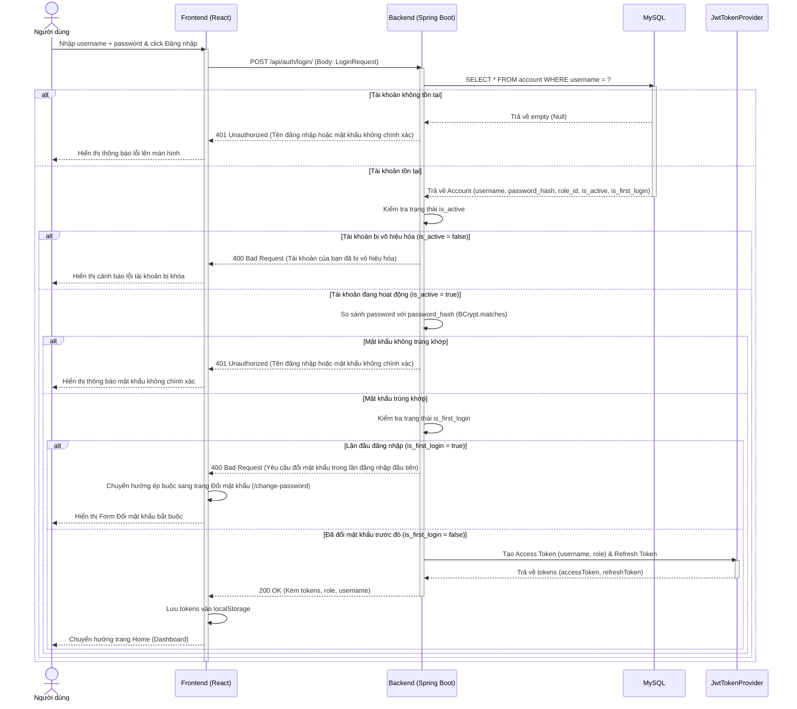
```mermaid
sequenceDiagram
    actor ND as Người dùng
    participant FE as Frontend (React)
    participant BE as Backend (Spring Boot)
    participant DB as MySQL
    participant JWT as JwtTokenProvider
    
    ND->>FE: Nhập username + password & click Đăng nhập
    activate FE
    FE->>BE: POST /api/auth/login/ (Body: LoginRequest)
    activate BE
    BE->>DB: SELECT * FROM account WHERE username = ?
    activate DB
    alt Tài khoản không tồn tại
        DB-->>BE: Trả về empty (Null)
        BE-->>FE: 401 Unauthorized (Tên đăng nhập hoặc mật khẩu không chính xác)
        FE-->>ND: Hiển thị thông báo lỗi lên màn hình
    else Tài khoản tồn tại
        DB-->>BE: Trả về Account (username, password_hash, role_id, is_active, is_first_login)
        deactivate DB
        BE->>BE: Kiểm tra trạng thái is_active
        alt Tài khoản bị vô hiệu hóa (is_active = false)
            BE-->>FE: 400 Bad Request (Tài khoản của bạn đã bị vô hiệu hóa)
            FE-->>ND: Hiển thị cảnh báo lỗi tài khoản bị khóa
        else Tài khoản đang hoạt động (is_active = true)
            BE->>BE: So sánh password với password_hash (BCrypt.matches)
            alt Mật khẩu không trùng khớp
                BE-->>FE: 401 Unauthorized (Tên đăng nhập hoặc mật khẩu không chính xác)
                FE-->>ND: Hiển thị thông báo mật khẩu không chính xác
            else Mật khẩu trùng khớp
                BE->>BE: Kiểm tra trạng thái is_first_login
                alt Lần đầu đăng nhập (is_first_login = true)
                    BE-->>FE: 400 Bad Request (Yêu cầu đổi mật khẩu trong lần đăng nhập đầu tiên)
                    FE->>FE: Chuyển hướng ép buộc sang trang Đổi mật khẩu (/change-password)
                    FE-->>ND: Hiển thị Form Đổi mật khẩu bắt buộc
                else Đã đổi mật khẩu trước đó (is_first_login = false)
                    BE->>JWT: Tạo Access Token (username, role) & Refresh Token
                    activate JWT
                    JWT-->>BE: Trả về tokens (accessToken, refreshToken)
                    deactivate JWT
                    BE-->>FE: 200 OK (Kèm tokens, role, username)
                    deactivate BE
                    FE->>FE: Lưu tokens vào localStorage
                    FE-->>ND: Chuyển hướng trang Home (Dashboard)
                end
            end
        end
    end
    deactivate FE
```

### UC02: Đăng xuất hệ thống (System Logout)
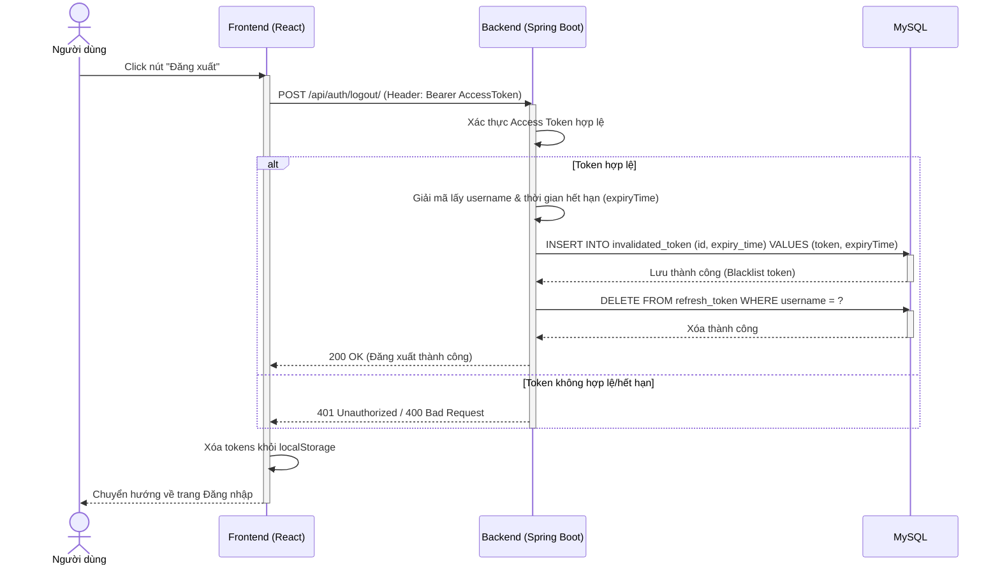
```mermaid
sequenceDiagram
    actor ND as Người dùng
    participant FE as Frontend (React)
    participant BE as Backend (Spring Boot)
    participant DB as MySQL
    
    ND->>FE: Click nút "Đăng xuất"
    activate FE
    FE->>BE: POST /api/auth/logout/ (Header: Bearer AccessToken)
    activate BE
    BE->>BE: Xác thực Access Token hợp lệ
    alt Token hợp lệ
        BE->>BE: Giải mã lấy username & thời gian hết hạn (expiryTime)
        BE->>DB: INSERT INTO invalidated_token (id, expiry_time) VALUES (token, expiryTime)
        activate DB
        DB-->>BE: Lưu thành công (Blacklist token)
        deactivate DB
        BE->>DB: DELETE FROM refresh_token WHERE username = ?
        activate DB
        DB-->>BE: Xóa thành công
        deactivate DB
        BE-->>FE: 200 OK (Đăng xuất thành công)
    else Token không hợp lệ/hết hạn
        BE-->>FE: 401 Unauthorized / 400 Bad Request
    end
    deactivate BE
    FE->>FE: Xóa tokens khỏi localStorage
    FE-->>ND: Chuyển hướng về trang Đăng nhập
    deactivate FE
```

### UC03: Làm mới Token tự động (Token Refresh)
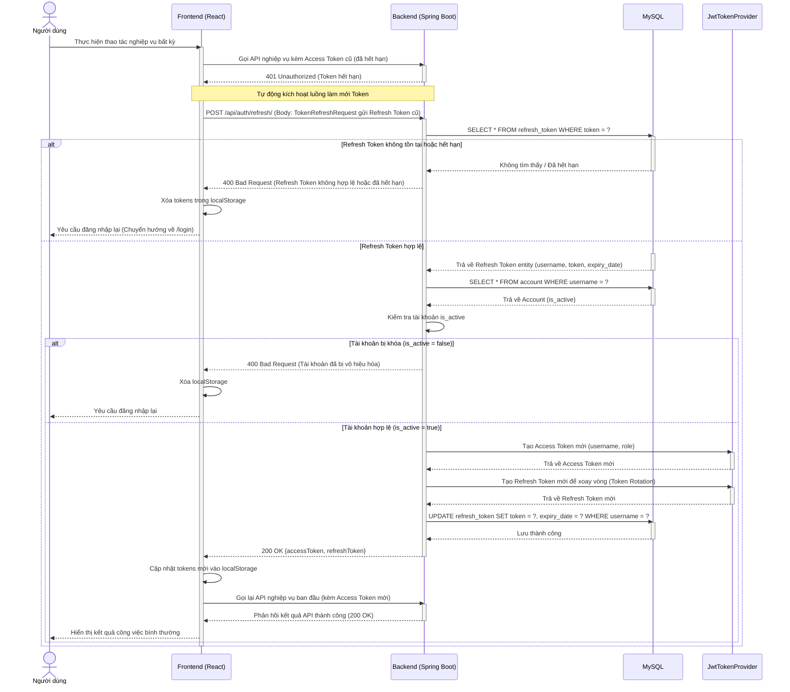
```mermaid
sequenceDiagram
    actor ND as Người dùng
    participant FE as Frontend (React)
    participant BE as Backend (Spring Boot)
    participant DB as MySQL
    participant JWT as JwtTokenProvider
    
    ND->>FE: Thực hiện thao tác nghiệp vụ bất kỳ
    activate FE
    FE->>BE: Gọi API nghiệp vụ kèm Access Token cũ (đã hết hạn)
    activate BE
    BE-->>FE: 401 Unauthorized (Token hết hạn)
    deactivate BE
    
    Note over FE,BE: Tự động kích hoạt luồng làm mới Token
    FE->>BE: POST /api/auth/refresh/ (Body: TokenRefreshRequest gửi Refresh Token cũ)
    activate BE
    BE->>DB: SELECT * FROM refresh_token WHERE token = ?
    activate DB
    alt Refresh Token không tồn tại hoặc hết hạn
        DB-->>BE: Không tìm thấy / Đã hết hạn
        deactivate DB
        BE-->>FE: 400 Bad Request (Refresh Token không hợp lệ hoặc đã hết hạn)
        FE->>FE: Xóa tokens trong localStorage
        FE-->>ND: Yêu cầu đăng nhập lại (Chuyển hướng về /login)
    else Refresh Token hợp lệ
        activate DB
        DB-->>BE: Trả về Refresh Token entity (username, token, expiry_date)
        deactivate DB
        BE->>DB: SELECT * FROM account WHERE username = ?
        activate DB
        DB-->>BE: Trả về Account (is_active)
        deactivate DB
        BE->>BE: Kiểm tra tài khoản is_active
        alt Tài khoản bị khóa (is_active = false)
            BE-->>FE: 400 Bad Request (Tài khoản đã bị vô hiệu hóa)
            FE->>FE: Xóa localStorage
            FE-->>ND: Yêu cầu đăng nhập lại
        else Tài khoản hợp lệ (is_active = true)
            BE->>JWT: Tạo Access Token mới (username, role)
            activate JWT
            JWT-->>BE: Trả về Access Token mới
            deactivate JWT
            BE->>JWT: Tạo Refresh Token mới để xoay vòng (Token Rotation)
            activate JWT
            JWT-->>BE: Trả về Refresh Token mới
            deactivate JWT
            BE->>DB: UPDATE refresh_token SET token = ?, expiry_date = ? WHERE username = ?
            activate DB
            DB-->>BE: Lưu thành công
            deactivate DB
            BE-->>FE: 200 OK {accessToken, refreshToken}
            deactivate BE
            FE->>FE: Cập nhật tokens mới vào localStorage
            FE->>BE: Gọi lại API nghiệp vụ ban đầu (kèm Access Token mới)
            activate BE
            BE-->>FE: Phản hồi kết quả API thành công (200 OK)
            deactivate BE
            FE-->>ND: Hiển thị kết quả công việc bình thường
        end
    end
    deactivate FE
```

### UC04: Xem thông tin tài khoản cá nhân (Get Me)
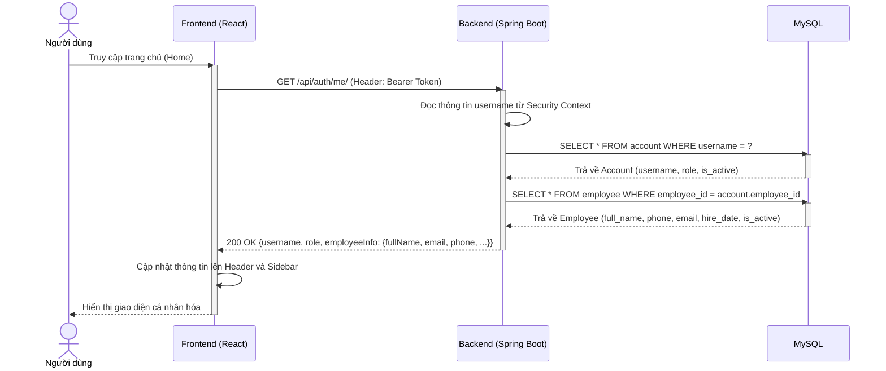
```mermaid
sequenceDiagram
    actor ND as Người dùng
    participant FE as Frontend (React)
    participant BE as Backend (Spring Boot)
    participant DB as MySQL
    
    ND->>FE: Truy cập trang chủ (Home)
    activate FE
    FE->>BE: GET /api/auth/me/ (Header: Bearer Token)
    activate BE
    BE->>BE: Đọc thông tin username từ Security Context
    BE->>DB: SELECT * FROM account WHERE username = ?
    activate DB
    DB-->>BE: Trả về Account (username, role, is_active)
    deactivate DB
    BE->>DB: SELECT * FROM employee WHERE employee_id = account.employee_id
    activate DB
    DB-->>BE: Trả về Employee (full_name, phone, email, hire_date, is_active)
    deactivate DB
    BE-->>FE: 200 OK {username, role, employeeInfo: {fullName, email, phone, ...}}
    deactivate BE
    FE->>FE: Cập nhật thông tin lên Header và Sidebar
    FE-->>ND: Hiển thị giao diện cá nhân hóa
    deactivate FE
```

### UC05: Đổi mật khẩu tài khoản (Change Password)
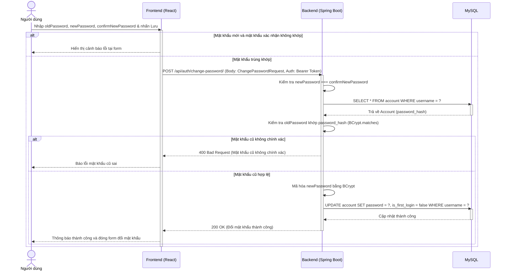
```mermaid
sequenceDiagram
    actor ND as Người dùng
    participant FE as Frontend (React)
    participant BE as Backend (Spring Boot)
    participant DB as MySQL
    
    ND->>FE: Nhập oldPassword, newPassword, confirmNewPassword & nhấn Lưu
    activate FE
    alt Mật khẩu mới và mật khẩu xác nhận không khớp
        FE-->>ND: Hiển thị cảnh báo lỗi tại form
    else Mật khẩu trùng khớp
        FE->>BE: POST /api/auth/change-password/ (Body: ChangePasswordRequest, Auth: Bearer Token)
        activate BE
        BE->>BE: Kiểm tra newPassword === confirmNewPassword
        BE->>DB: SELECT * FROM account WHERE username = ?
        activate DB
        DB-->>BE: Trả về Account (password_hash)
        deactivate DB
        BE->>BE: Kiểm tra oldPassword khớp password_hash (BCrypt.matches)
        alt Mật khẩu cũ không chính xác
            BE-->>FE: 400 Bad Request (Mật khẩu cũ không chính xác)
            FE-->>ND: Báo lỗi mật khẩu cũ sai
        else Mật khẩu cũ hợp lệ
            BE->>BE: Mã hóa newPassword bằng BCrypt
            BE->>DB: UPDATE account SET password = ?, is_first_login = false WHERE username = ?
            activate DB
            DB-->>BE: Cập nhật thành công
            deactivate DB
            BE-->>FE: 200 OK (Đổi mật khẩu thành công)
            deactivate BE
            FE-->>ND: Thông báo thành công và đóng form đổi mật khẩu
        end
    end
    deactivate FE
```

### UC06: Cấp lại mật khẩu tạm khi quên mật khẩu (Forgot Password)
```mermaid
sequenceDiagram
    actor ND as Nhân viên (Khách truy cập)
    participant FE as Frontend (React)
    participant BE as Backend (Spring Boot)
    participant DB as MySQL
    participant Mail as MailService
    
    ND->>FE: Nhấn "Quên mật khẩu", nhập username + email & nhấn nút
    activate FE
    FE->>BE: POST /api/auth/forgot-password/ (Body: ForgotPasswordRequest)
    activate BE
    BE->>DB: SELECT * FROM account WHERE username = ?
    activate DB
    alt Không tìm thấy tài khoản
        DB-->>BE: Trả về rỗng
        BE-->>FE: 400 Bad Request (Tên đăng nhập hoặc email không chính xác)
        FE-->>ND: Hiển thị thông báo lỗi
    else Tìm thấy tài khoản
        DB-->>BE: Trả về Account (employee_id)
        deactivate DB
        BE->>DB: SELECT * FROM employee WHERE id = account.employee_id
        activate DB
        DB-->>BE: Trả về Employee (email)
        deactivate DB
        BE->>BE: So sánh email nhập vào khớp với email nhân sự (ignorecase)
        alt Email không khớp
            BE-->>FE: 400 Bad Request (Tên đăng nhập hoặc email không chính xác)
            FE-->>ND: Hiển thị thông báo lỗi
        else Email trùng khớp
            BE->>BE: Sinh mật khẩu ngẫu nhiên 8 ký tự (tempPassword)
            BE->>BE: Mã hóa tempPassword bằng BCrypt
            BE->>DB: UPDATE account SET password = ?, is_first_login = true WHERE username = ?
            activate DB
            DB-->>BE: Cập nhật thành công
            deactivate DB
            BE->>Mail: Gửi Email mật khẩu tạm thời (CompletableFuture.completedFuture / @Async)
            activate Mail
            Note over BE,Mail: Chạy nền bất đồng bộ (Async)
            Mail-->>BE: Trả về thành công ngay lập tức
            deactivate Mail
            BE-->>FE: 200 OK (Mật khẩu tạm thời đã gửi thành công)
            deactivate BE
            FE-->>ND: Thông báo thành công, hướng dẫn check email và chuyển về Login
        end
    end
    deactivate FE

---

## PHÂN HỆ 2: QUẢN LÝ DANH MỤC VÀ DỮ LIỆU THUỐC (UC07 - UC16)

### UC07: Xem danh sách danh mục thuốc (View Catalogs)
```mermaid
sequenceDiagram
    actor TK as Thủ kho / Quản lý
    participant FE as Frontend (React)
    participant BE as Backend (Spring Boot)
    participant DB as MySQL
    
    TK->>FE: Chọn mục "Danh mục thuốc"
    activate FE
    FE->>BE: GET /api/catalogs (kèm page, size, search)
    activate BE
    BE->>DB: SELECT * FROM catalog WHERE name LIKE %search% OR code LIKE %search% LIMIT size OFFSET page*size
    activate DB
    DB-->>BE: Trả về danh sách Catalog (phân trang)
    deactivate DB
    BE-->>FE: 200 OK (Trả về danh sách danh mục & thông tin phân trang)
    deactivate BE
    FE-->>TK: Hiển thị danh sách danh mục thuốc lên bảng dữ liệu
    deactivate FE
```

### UC08: Thêm danh mục thuốc mới (Create Catalog)
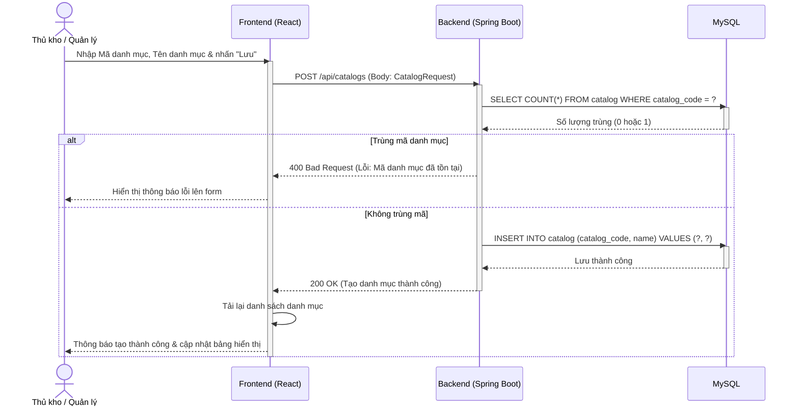
```mermaid
sequenceDiagram
    actor TK as Thủ kho / Quản lý
    participant FE as Frontend (React)
    participant BE as Backend (Spring Boot)
    participant DB as MySQL
    
    TK->>FE: Nhập Mã danh mục, Tên danh mục & nhấn "Lưu"
    activate FE
    FE->>BE: POST /api/catalogs (Body: CatalogRequest)
    activate BE
    BE->>DB: SELECT COUNT(*) FROM catalog WHERE catalog_code = ?
    activate DB
    DB-->>BE: Số lượng trùng (0 hoặc 1)
    deactivate DB
    alt Trùng mã danh mục
        BE-->>FE: 400 Bad Request (Lỗi: Mã danh mục đã tồn tại)
        FE-->>TK: Hiển thị thông báo lỗi lên form
    else Không trùng mã
        BE->>DB: INSERT INTO catalog (catalog_code, name) VALUES (?, ?)
        activate DB
        DB-->>BE: Lưu thành công
        deactivate DB
        BE-->>FE: 200 OK (Tạo danh mục thành công)
        deactivate BE
        FE->>FE: Tải lại danh sách danh mục
        FE-->>TK: Thông báo tạo thành công & cập nhật bảng hiển thị
    end
    deactivate FE
```

### UC09: Cập nhật danh mục thuốc (Update Catalog)
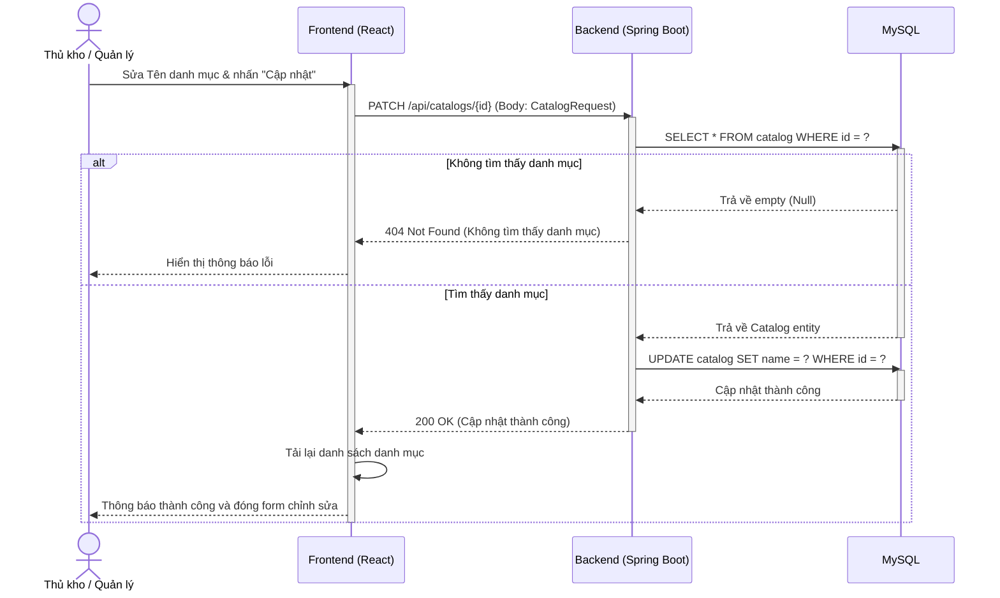
```mermaid
sequenceDiagram
    actor TK as Thủ kho / Quản lý
    participant FE as Frontend (React)
    participant BE as Backend (Spring Boot)
    participant DB as MySQL
    
    TK->>FE: Sửa Tên danh mục & nhấn "Cập nhật"
    activate FE
    FE->>BE: PATCH /api/catalogs/{id} (Body: CatalogRequest)
    activate BE
    BE->>DB: SELECT * FROM catalog WHERE id = ?
    activate DB
    alt Không tìm thấy danh mục
        DB-->>BE: Trả về empty (Null)
        BE-->>FE: 404 Not Found (Không tìm thấy danh mục)
        FE-->>TK: Hiển thị thông báo lỗi
    else Tìm thấy danh mục
        DB-->>BE: Trả về Catalog entity
        deactivate DB
        BE->>DB: UPDATE catalog SET name = ? WHERE id = ?
        activate DB
        DB-->>BE: Cập nhật thành công
        deactivate DB
        BE-->>FE: 200 OK (Cập nhật thành công)
        deactivate BE
        FE->>FE: Tải lại danh sách danh mục
        FE-->>TK: Thông báo thành công và đóng form chỉnh sửa
    end
    deactivate FE
```

### UC10: Xóa danh mục thuốc (Delete Catalog)
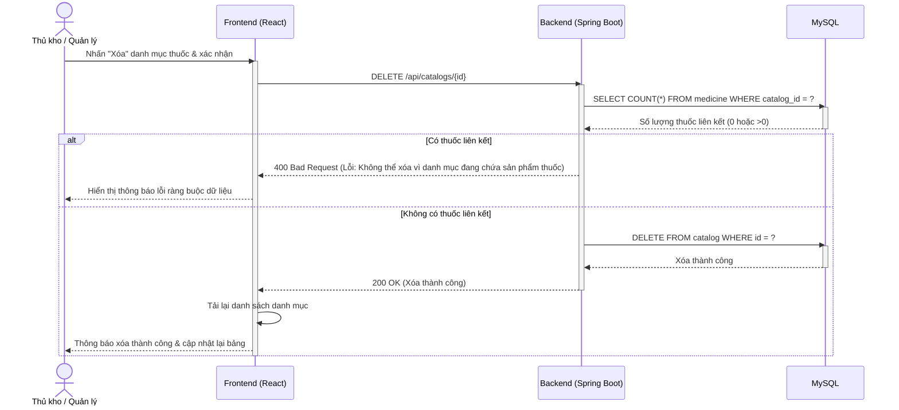
```mermaid
sequenceDiagram
    actor TK as Thủ kho / Quản lý
    participant FE as Frontend (React)
    participant BE as Backend (Spring Boot)
    participant DB as MySQL
    
    TK->>FE: Nhấn "Xóa" danh mục thuốc & xác nhận
    activate FE
    FE->>BE: DELETE /api/catalogs/{id}
    activate BE
    BE->>DB: SELECT COUNT(*) FROM medicine WHERE catalog_id = ?
    activate DB
    DB-->>BE: Số lượng thuốc liên kết (0 hoặc >0)
    deactivate DB
    alt Có thuốc liên kết
        BE-->>FE: 400 Bad Request (Lỗi: Không thể xóa vì danh mục đang chứa sản phẩm thuốc)
        FE-->>TK: Hiển thị thông báo lỗi ràng buộc dữ liệu
    else Không có thuốc liên kết
        BE->>DB: DELETE FROM catalog WHERE id = ?
        activate DB
        DB-->>BE: Xóa thành công
        deactivate DB
        BE-->>FE: 200 OK (Xóa thành công)
        deactivate BE
        FE->>FE: Tải lại danh sách danh mục
        FE-->>TK: Thông báo xóa thành công & cập nhật lại bảng
    end
    deactivate FE
```

### UC11: Quản lý nước sản xuất - Origin CRUD (Xem/Thêm/Sửa/Xóa)
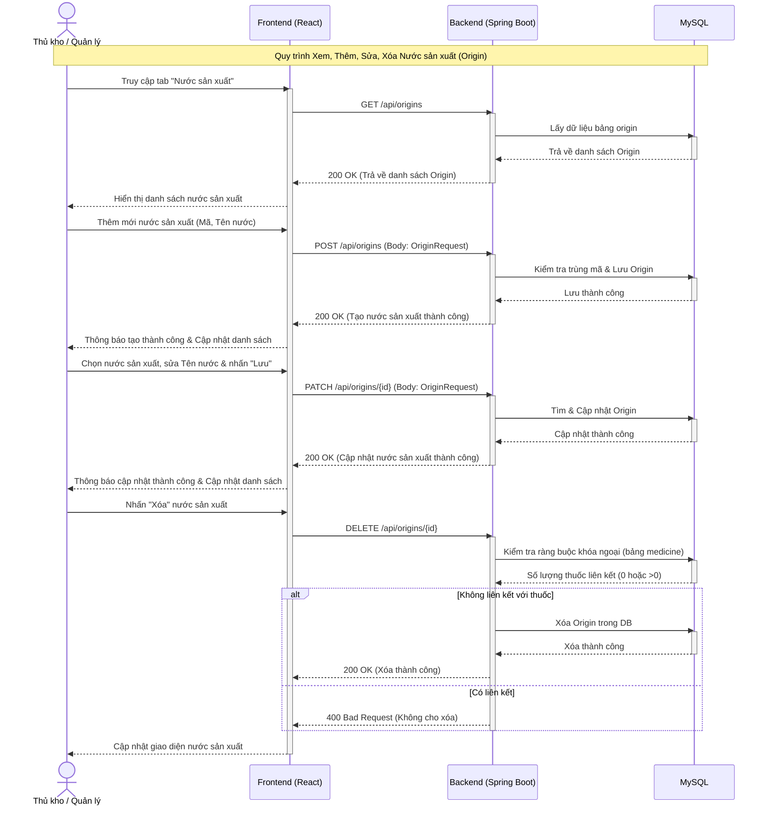
```mermaid
sequenceDiagram
    actor TK as Thủ kho / Quản lý
    participant FE as Frontend (React)
    participant BE as Backend (Spring Boot)
    participant DB as MySQL
    
    Note over TK,DB: Quy trình Xem, Thêm, Sửa, Xóa Nước sản xuất (Origin)
    TK->>FE: Truy cập tab "Nước sản xuất"
    activate FE
    FE->>BE: GET /api/origins
    activate BE
    BE->>DB: Lấy dữ liệu bảng origin
    activate DB
    DB-->>BE: Trả về danh sách Origin
    deactivate DB
    BE-->>FE: 200 OK (Trả về danh sách Origin)
    deactivate BE
    FE-->>TK: Hiển thị danh sách nước sản xuất
    
    TK->>FE: Thêm mới nước sản xuất (Mã, Tên nước)
    FE->>BE: POST /api/origins (Body: OriginRequest)
    activate BE
    BE->>DB: Kiểm tra trùng mã & Lưu Origin
    activate DB
    DB-->>BE: Lưu thành công
    deactivate DB
    BE-->>FE: 200 OK (Tạo nước sản xuất thành công)
    deactivate BE
    FE-->>TK: Thông báo tạo thành công & Cập nhật danh sách
    
    TK->>FE: Chọn nước sản xuất, sửa Tên nước & nhấn "Lưu"
    FE->>BE: PATCH /api/origins/{id} (Body: OriginRequest)
    activate BE
    BE->>DB: Tìm & Cập nhật Origin
    activate DB
    DB-->>BE: Cập nhật thành công
    deactivate DB
    BE-->>FE: 200 OK (Cập nhật nước sản xuất thành công)
    deactivate BE
    FE-->>TK: Thông báo cập nhật thành công & Cập nhật danh sách
    
    TK->>FE: Nhấn "Xóa" nước sản xuất
    FE->>BE: DELETE /api/origins/{id}
    activate BE
    BE->>DB: Kiểm tra ràng buộc khóa ngoại (bảng medicine)
    activate DB
    DB-->>BE: Số lượng thuốc liên kết (0 hoặc >0)
    deactivate DB
    alt Không liên kết với thuốc
        BE->>DB: Xóa Origin trong DB
        activate DB
        DB-->>BE: Xóa thành công
        deactivate DB
        BE-->>FE: 200 OK (Xóa thành công)
    else Có liên kết
        BE-->>FE: 400 Bad Request (Không cho xóa)
    end
    deactivate BE
    FE-->>TK: Cập nhật giao diện nước sản xuất
    deactivate FE
```

### UC12: Quản lý đơn vị tính - Unit CRUD (Xem/Thêm/Sửa/Xóa)
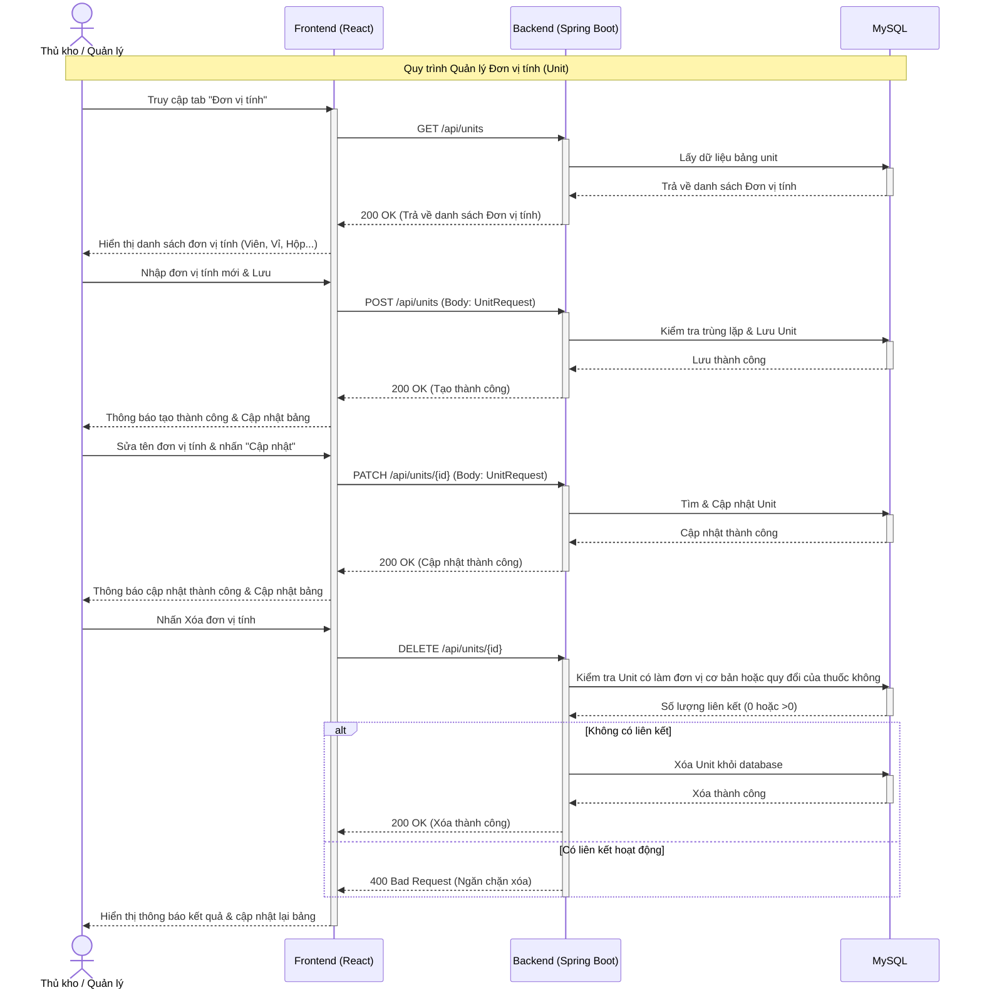
```mermaid
sequenceDiagram
    actor TK as Thủ kho / Quản lý
    participant FE as Frontend (React)
    participant BE as Backend (Spring Boot)
    participant DB as MySQL
    
    Note over TK,DB: Quy trình Quản lý Đơn vị tính (Unit)
    TK->>FE: Truy cập tab "Đơn vị tính"
    activate FE
    FE->>BE: GET /api/units
    activate BE
    BE->>DB: Lấy dữ liệu bảng unit
    activate DB
    DB-->>BE: Trả về danh sách Đơn vị tính
    deactivate DB
    BE-->>FE: 200 OK (Trả về danh sách Đơn vị tính)
    deactivate BE
    FE-->>TK: Hiển thị danh sách đơn vị tính (Viên, Vỉ, Hộp...)
    
    TK->>FE: Nhập đơn vị tính mới & Lưu
    FE->>BE: POST /api/units (Body: UnitRequest)
    activate BE
    BE->>DB: Kiểm tra trùng lặp & Lưu Unit
    activate DB
    DB-->>BE: Lưu thành công
    deactivate DB
    BE-->>FE: 200 OK (Tạo thành công)
    deactivate BE
    FE-->>TK: Thông báo tạo thành công & Cập nhật bảng
    
    TK->>FE: Sửa tên đơn vị tính & nhấn "Cập nhật"
    FE->>BE: PATCH /api/units/{id} (Body: UnitRequest)
    activate BE
    BE->>DB: Tìm & Cập nhật Unit
    activate DB
    DB-->>BE: Cập nhật thành công
    deactivate DB
    BE-->>FE: 200 OK (Cập nhật thành công)
    deactivate BE
    FE-->>TK: Thông báo cập nhật thành công & Cập nhật bảng
    
    TK->>FE: Nhấn Xóa đơn vị tính
    FE->>BE: DELETE /api/units/{id}
    activate BE
    BE->>DB: Kiểm tra Unit có làm đơn vị cơ bản hoặc quy đổi của thuốc không
    activate DB
    DB-->>BE: Số lượng liên kết (0 hoặc >0)
    deactivate DB
    alt Không có liên kết
        BE->>DB: Xóa Unit khỏi database
        activate DB
        DB-->>BE: Xóa thành công
        deactivate DB
        BE-->>FE: 200 OK (Xóa thành công)
    else Có liên kết hoạt động
        BE-->>FE: 400 Bad Request (Ngăn chặn xóa)
    end
    deactivate BE
    FE-->>TK: Hiển thị thông báo kết quả & cập nhật lại bảng
    deactivate FE
```

### UC13: Xem danh sách và tìm kiếm thuốc (Search Medicines)
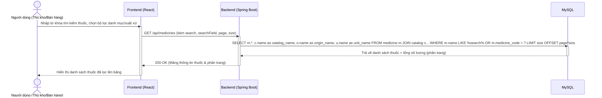
```mermaid
sequenceDiagram
    actor TK as Người dùng (Thủ kho/Bán hàng)
    participant FE as Frontend (React)
    participant BE as Backend (Spring Boot)
    participant DB as MySQL
    
    TK->>FE: Nhập từ khóa tìm kiếm thuốc, chọn bộ lọc danh mục/xuất xứ
    activate FE
    FE->>BE: GET /api/medicines (kèm search, searchField, page, size)
    activate BE
    BE->>DB: SELECT m.*, c.name as catalog_name, o.name as origin_name, u.name as unit_name FROM medicine m JOIN catalog c... WHERE m.name LIKE %search% OR m.medicine_code = ? LIMIT size OFFSET page*size
    activate DB
    DB-->>BE: Trả về danh sách thuốc + tổng số lượng (phân trang)
    deactivate DB
    BE-->>FE: 200 OK (Mảng thông tin thuốc & phân trang)
    deactivate BE
    FE-->>TK: Hiển thị danh sách thuốc đã lọc lên bảng
    deactivate FE
```

### UC14: Thêm thông tin thuốc mới (Create Medicine)
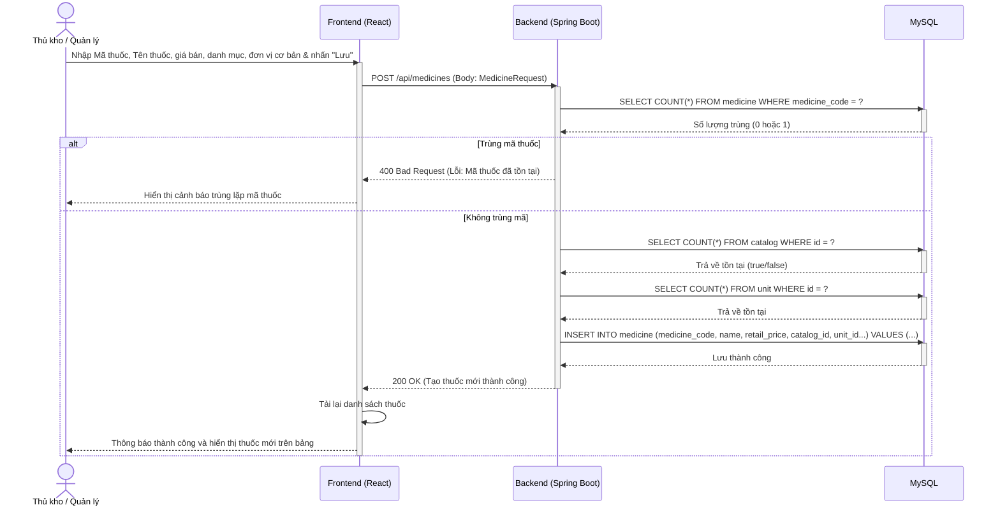
```mermaid
sequenceDiagram
    actor TK as Thủ kho / Quản lý
    participant FE as Frontend (React)
    participant BE as Backend (Spring Boot)
    participant DB as MySQL
    
    TK->>FE: Nhập Mã thuốc, Tên thuốc, giá bán, danh mục, đơn vị cơ bản & nhấn "Lưu"
    activate FE
    FE->>BE: POST /api/medicines (Body: MedicineRequest)
    activate BE
    BE->>DB: SELECT COUNT(*) FROM medicine WHERE medicine_code = ?
    activate DB
    DB-->>BE: Số lượng trùng (0 hoặc 1)
    deactivate DB
    alt Trùng mã thuốc
        BE-->>FE: 400 Bad Request (Lỗi: Mã thuốc đã tồn tại)
        FE-->>TK: Hiển thị cảnh báo trùng lặp mã thuốc
    else Không trùng mã
        BE->>DB: SELECT COUNT(*) FROM catalog WHERE id = ?
        activate DB
        DB-->>BE: Trả về tồn tại (true/false)
        deactivate DB
        BE->>DB: SELECT COUNT(*) FROM unit WHERE id = ?
        activate DB
        DB-->>BE: Trả về tồn tại
        deactivate DB
        BE->>DB: INSERT INTO medicine (medicine_code, name, retail_price, catalog_id, unit_id...) VALUES (...)
        activate DB
        DB-->>BE: Lưu thành công
        deactivate DB
        BE-->>FE: 200 OK (Tạo thuốc mới thành công)
        deactivate BE
        FE->>FE: Tải lại danh sách thuốc
        FE-->>TK: Thông báo thành công và hiển thị thuốc mới trên bảng
    end
    deactivate FE
```

### UC15: Cập nhật thông tin thuốc (Update Medicine)
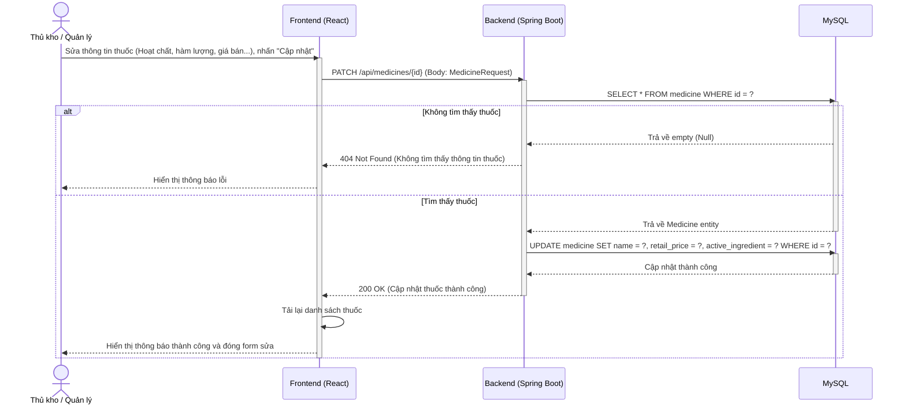
```mermaid
sequenceDiagram
    actor TK as Thủ kho / Quản lý
    participant FE as Frontend (React)
    participant BE as Backend (Spring Boot)
    participant DB as MySQL
    
    TK->>FE: Sửa thông tin thuốc (Hoạt chất, hàm lượng, giá bán...), nhấn "Cập nhật"
    activate FE
    FE->>BE: PATCH /api/medicines/{id} (Body: MedicineRequest)
    activate BE
    BE->>DB: SELECT * FROM medicine WHERE id = ?
    activate DB
    alt Không tìm thấy thuốc
        DB-->>BE: Trả về empty (Null)
        BE-->>FE: 404 Not Found (Không tìm thấy thông tin thuốc)
        FE-->>TK: Hiển thị thông báo lỗi
    else Tìm thấy thuốc
        DB-->>BE: Trả về Medicine entity
        deactivate DB
        BE->>DB: UPDATE medicine SET name = ?, retail_price = ?, active_ingredient = ? WHERE id = ?
        activate DB
        DB-->>BE: Cập nhật thành công
        deactivate DB
        BE-->>FE: 200 OK (Cập nhật thuốc thành công)
        deactivate BE
        FE->>FE: Tải lại danh sách thuốc
        FE-->>TK: Hiển thị thông báo thành công và đóng form sửa
    end
    deactivate FE
```

### UC16: Xóa thông tin thuốc (Delete Medicine)
```mermaid
sequenceDiagram
    actor TK as Thủ kho / Quản lý
    participant FE as Frontend (React)
    participant BE as Backend (Spring Boot)
    participant DB as MySQL
    
    TK->>FE: Nhấn "Xóa" loại thuốc & xác nhận
    activate FE
    FE->>BE: DELETE /api/medicines/{id}
    activate BE
    BE->>DB: SELECT COUNT(*) FROM inventory WHERE medicine_id = ?
    activate DB
    DB-->>BE: Số lượng lô hàng trong kho (0 hoặc >0)
    deactivate DB
    alt Đã phát sinh lô hàng/giao dịch kho
        BE-->>FE: 400 Bad Request (Lỗi: Không thể xóa vì đã phát sinh dữ liệu kho)
        FE-->>TK: Hiển thị cảnh báo lỗi dữ liệu liên kết
    else Chưa phát sinh dữ liệu kho
        BE->>DB: DELETE FROM medicine WHERE id = ?
        activate DB
        DB-->>BE: Xóa thành công
        deactivate DB
        BE-->>FE: 200 OK (Xóa thuốc thành công)
        deactivate BE
        FE->>FE: Tải lại danh sách thuốc
        FE-->>TK: Hiển thị thông báo xóa thành công và cập nhật bảng
    end
    deactivate FE

---

## PHÂN HỆ 3: QUẢN LÝ ĐỐI TÁC VÀ NHÂN SỰ (UC17 - UC21)

### UC17: Quản lý nhà cung cấp - Supplier CRUD (Xem/Thêm/Sửa/Xóa)
```mermaid
sequenceDiagram
    actor TK as Thủ kho / Quản lý
    participant FE as Frontend (React)
    participant BE as Backend (Spring Boot)
    participant DB as MySQL
    
    Note over TK,DB: Quản lý đối tác Nhà cung cấp (Supplier)
    TK->>FE: Truy cập tab "Nhà cung cấp"
    activate FE
    FE->>BE: GET /api/suppliers
    activate BE
    BE->>DB: Lấy dữ liệu bảng supplier
    activate DB
    DB-->>BE: Danh sách nhà cung cấp
    deactivate DB
    BE-->>FE: 200 OK (Danh sách nhà cung cấp)
    deactivate BE
    FE-->>TK: Hiển thị lên bảng
    
    TK->>FE: Thêm NCC mới (Mã, Tên, SĐT, Địa chỉ)
    FE->>BE: POST /api/suppliers (Body: SupplierRequest)
    activate BE
    BE->>DB: Kiểm tra trùng mã NCC & Lưu
    activate DB
    DB-->>BE: Lưu thành công
    deactivate DB
    BE-->>FE: 200 OK (Tạo NCC thành công)
    deactivate BE
    FE-->>TK: Thông báo tạo thành công & Cập nhật danh sách
    
    TK->>FE: Chỉnh sửa thông tin NCC & nhấn "Cập nhật"
    FE->>BE: PATCH /api/suppliers/{id} (Body: SupplierRequest)
    activate BE
    BE->>DB: Tìm & Cập nhật Supplier
    activate DB
    DB-->>BE: Cập nhật thành công
    deactivate DB
    BE-->>FE: 200 OK (Cập nhật NCC thành công)
    deactivate BE
    FE-->>TK: Thông báo cập nhật thành công & Cập nhật danh sách
    
    TK->>FE: Nhấn "Xóa" nhà cung cấp
    FE->>BE: DELETE /api/suppliers/{id}
    activate BE
    BE->>DB: Kiểm tra NCC đã có phiếu nhập kho nào chưa
    activate DB
    DB-->>BE: Số lượng phiếu nhập (0 hoặc >0)
    deactivate DB
    alt Chưa có phiếu nhập
        BE->>DB: Xóa NCC khỏi DB
        activate DB
        DB-->>BE: Xóa thành công
        deactivate DB
        BE-->>FE: 200 OK (Xóa thành công)
    else Đã có phiếu nhập
        BE-->>FE: 400 Bad Request (Chặn không cho xóa)
    end
    deactivate BE
    FE-->>TK: Cập nhật lại danh sách hiển thị
    deactivate FE
```

### UC18: Quản lý thông tin khách hàng - Customer CRUD (Xem/Thêm/Sửa/Xóa)
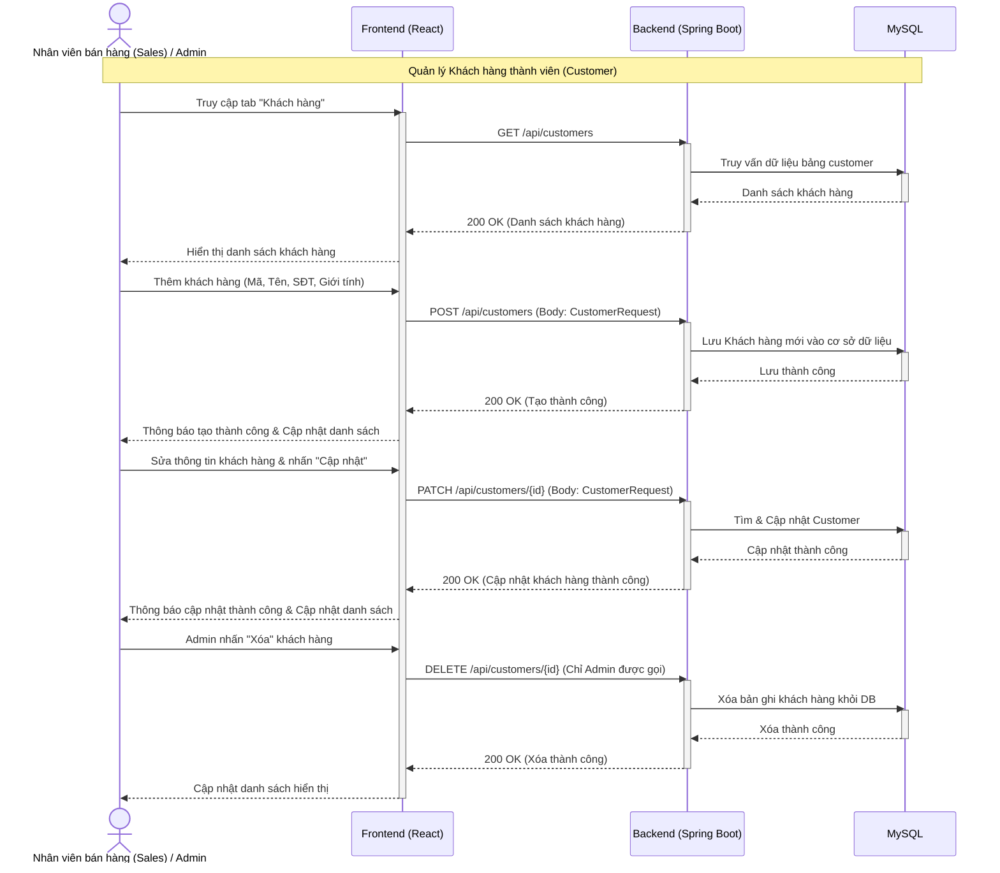
```mermaid
sequenceDiagram
    actor NV as Nhân viên bán hàng (Sales) / Admin
    participant FE as Frontend (React)
    participant BE as Backend (Spring Boot)
    participant DB as MySQL
    
    Note over NV,DB: Quản lý Khách hàng thành viên (Customer)
    NV->>FE: Truy cập tab "Khách hàng"
    activate FE
    FE->>BE: GET /api/customers
    activate BE
    BE->>DB: Truy vấn dữ liệu bảng customer
    activate DB
    DB-->>BE: Danh sách khách hàng
    deactivate DB
    BE-->>FE: 200 OK (Danh sách khách hàng)
    deactivate BE
    FE-->>NV: Hiển thị danh sách khách hàng
    
    NV->>FE: Thêm khách hàng (Mã, Tên, SĐT, Giới tính)
    FE->>BE: POST /api/customers (Body: CustomerRequest)
    activate BE
    BE->>DB: Lưu Khách hàng mới vào cơ sở dữ liệu
    activate DB
    DB-->>BE: Lưu thành công
    deactivate DB
    BE-->>FE: 200 OK (Tạo thành công)
    deactivate BE
    FE-->>NV: Thông báo tạo thành công & Cập nhật danh sách
    
    NV->>FE: Sửa thông tin khách hàng & nhấn "Cập nhật"
    FE->>BE: PATCH /api/customers/{id} (Body: CustomerRequest)
    activate BE
    BE->>DB: Tìm & Cập nhật Customer
    activate DB
    DB-->>BE: Cập nhật thành công
    deactivate DB
    BE-->>FE: 200 OK (Cập nhật khách hàng thành công)
    deactivate BE
    FE-->>NV: Thông báo cập nhật thành công & Cập nhật danh sách
    
    NV->>FE: Admin nhấn "Xóa" khách hàng
    FE->>BE: DELETE /api/customers/{id} (Chỉ Admin được gọi)
    activate BE
    BE->>DB: Xóa bản ghi khách hàng khỏi DB
    activate DB
    DB-->>BE: Xóa thành công
    deactivate DB
    BE-->>FE: 200 OK (Xóa thành công)
    deactivate BE
    FE-->>NV: Cập nhật danh sách hiển thị
    deactivate FE
```

### UC19: Quản lý thông tin nhân viên - Employee CRUD (Xem/Thêm/Sửa/Xóa)
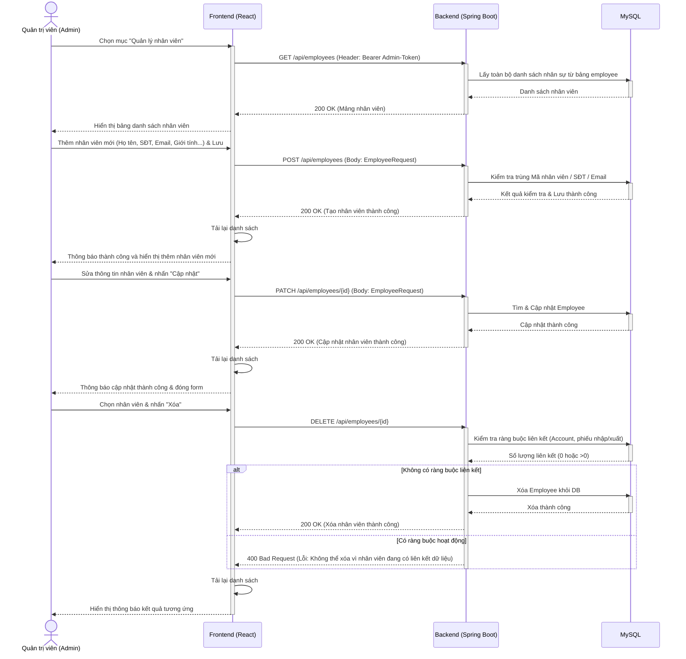
```mermaid
sequenceDiagram
    actor AD as Quản trị viên (Admin)
    participant FE as Frontend (React)
    participant BE as Backend (Spring Boot)
    participant DB as MySQL
    
    AD->>FE: Chọn mục "Quản lý nhân viên"
    activate FE
    FE->>BE: GET /api/employees (Header: Bearer Admin-Token)
    activate BE
    BE->>DB: Lấy toàn bộ danh sách nhân sự từ bảng employee
    activate DB
    DB-->>BE: Danh sách nhân viên
    deactivate DB
    BE-->>FE: 200 OK (Mảng nhân viên)
    deactivate BE
    FE-->>AD: Hiển thị bảng danh sách nhân viên
    
    AD->>FE: Thêm nhân viên mới (Họ tên, SĐT, Email, Giới tính...) & Lưu
    FE->>BE: POST /api/employees (Body: EmployeeRequest)
    activate BE
    BE->>DB: Kiểm tra trùng Mã nhân viên / SĐT / Email
    activate DB
    DB-->>BE: Kết quả kiểm tra & Lưu thành công
    deactivate DB
    BE-->>FE: 200 OK (Tạo nhân viên thành công)
    deactivate BE
    FE->>FE: Tải lại danh sách
    FE-->>AD: Thông báo thành công và hiển thị thêm nhân viên mới
    
    AD->>FE: Sửa thông tin nhân viên & nhấn "Cập nhật"
    FE->>BE: PATCH /api/employees/{id} (Body: EmployeeRequest)
    activate BE
    BE->>DB: Tìm & Cập nhật Employee
    activate DB
    DB-->>BE: Cập nhật thành công
    deactivate DB
    BE-->>FE: 200 OK (Cập nhật nhân viên thành công)
    deactivate BE
    FE->>FE: Tải lại danh sách
    FE-->>AD: Thông báo cập nhật thành công & đóng form
    
    AD->>FE: Chọn nhân viên & nhấn "Xóa"
    FE->>BE: DELETE /api/employees/{id}
    activate BE
    BE->>DB: Kiểm tra ràng buộc liên kết (Account, phiếu nhập/xuất)
    activate DB
    DB-->>BE: Số lượng liên kết (0 hoặc >0)
    deactivate DB
    alt Không có ràng buộc liên kết
        BE->>DB: Xóa Employee khỏi DB
        activate DB
        DB-->>BE: Xóa thành công
        deactivate DB
        BE-->>FE: 200 OK (Xóa nhân viên thành công)
    else Có ràng buộc hoạt động
        BE-->>FE: 400 Bad Request (Lỗi: Không thể xóa vì nhân viên đang có liên kết dữ liệu)
    end
    deactivate BE
    FE->>FE: Tải lại danh sách
    FE-->>AD: Hiển thị thông báo kết quả tương ứng
    deactivate FE
```

### UC20: Quản lý tài khoản người dùng - Account CRUD
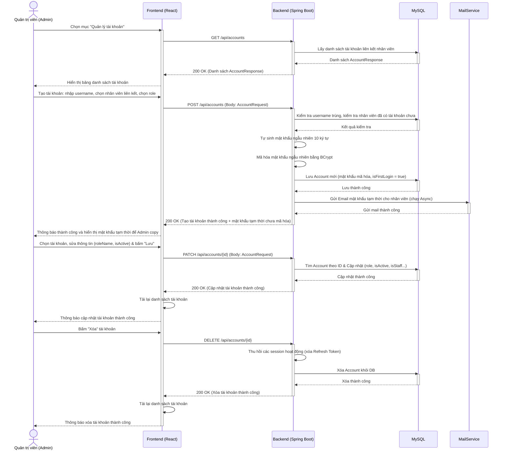
```mermaid
sequenceDiagram
    actor AD as Quản trị viên (Admin)
    participant FE as Frontend (React)
    participant BE as Backend (Spring Boot)
    participant DB as MySQL
    participant Mail as MailService
    
    AD->>FE: Chọn mục "Quản lý tài khoản"
    activate FE
    FE->>BE: GET /api/accounts
    activate BE
    BE->>DB: Lấy danh sách tài khoản liên kết nhân viên
    activate DB
    DB-->>BE: Danh sách AccountResponse
    deactivate DB
    BE-->>FE: 200 OK (Danh sách AccountResponse)
    deactivate BE
    FE-->>AD: Hiển thị bảng danh sách tài khoản
    
    AD->>FE: Tạo tài khoản: nhập username, chọn nhân viên liên kết, chọn role
    FE->>BE: POST /api/accounts (Body: AccountRequest)
    activate BE
    BE->>DB: Kiểm tra username trùng, kiểm tra nhân viên đã có tài khoản chưa
    activate DB
    DB-->>BE: Kết quả kiểm tra
    deactivate DB
    BE->>BE: Tự sinh mật khẩu ngẫu nhiên 10 ký tự
    BE->>BE: Mã hóa mật khẩu ngẫu nhiên bằng BCrypt
    BE->>DB: Lưu Account mới (mật khẩu mã hóa, isFirstLogin = true)
    activate DB
    DB-->>BE: Lưu thành công
    deactivate DB
    BE->>Mail: Gửi Email mật khẩu tạm thời cho nhân viên (chạy Async)
    activate Mail
    Mail-->>BE: Gửi mail thành công
    deactivate Mail
    BE-->>FE: 200 OK (Tạo tài khoản thành công + mật khẩu tạm thời chưa mã hóa)
    deactivate BE
    FE-->>AD: Thông báo thành công và hiển thị mật khẩu tạm thời để Admin copy
    
    AD->>FE: Chọn tài khoản, sửa thông tin (roleName, isActive) & bấm "Lưu"
    FE->>BE: PATCH /api/accounts/{id} (Body: AccountRequest)
    activate BE
    BE->>DB: Tìm Account theo ID & Cập nhật (role, isActive, isStaff...)
    activate DB
    DB-->>BE: Cập nhật thành công
    deactivate DB
    BE-->>FE: 200 OK (Cập nhật tài khoản thành công)
    deactivate BE
    FE->>FE: Tải lại danh sách tài khoản
    FE-->>AD: Thông báo cập nhật tài khoản thành công
    
    AD->>FE: Bấm "Xóa" tài khoản
    FE->>BE: DELETE /api/accounts/{id}
    activate BE
    BE->>BE: Thu hồi các session hoạt động (xóa Refresh Token)
    BE->>DB: Xóa Account khỏi DB
    activate DB
    DB-->>BE: Xóa thành công
    deactivate DB
    BE-->>FE: 200 OK (Xóa tài khoản thành công)
    deactivate BE
    FE->>FE: Tải lại danh sách tài khoản
    FE-->>AD: Thông báo xóa tài khoản thành công
    deactivate FE
```

### UC21: Đặt lại mật khẩu nhân viên (Admin Reset Password)
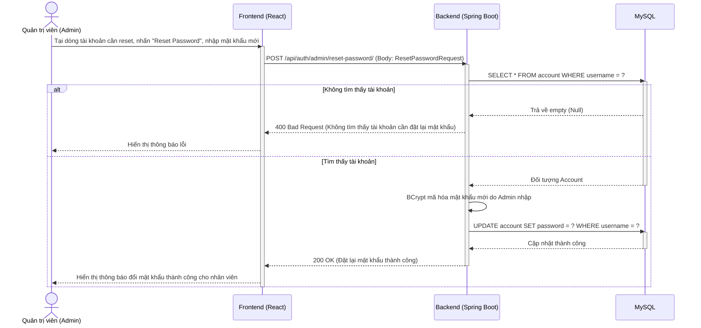
```mermaid
sequenceDiagram
    actor AD as Quản trị viên (Admin)
    participant FE as Frontend (React)
    participant BE as Backend (Spring Boot)
    participant DB as MySQL
    
    AD->>FE: Tại dòng tài khoản cần reset, nhấn "Reset Password", nhập mật khẩu mới
    activate FE
    FE->>BE: POST /api/auth/admin/reset-password/ (Body: ResetPasswordRequest)
    activate BE
    BE->>DB: SELECT * FROM account WHERE username = ?
    activate DB
    alt Không tìm thấy tài khoản
        DB-->>BE: Trả về empty (Null)
        BE-->>FE: 400 Bad Request (Không tìm thấy tài khoản cần đặt lại mật khẩu)
        FE-->>AD: Hiển thị thông báo lỗi
    else Tìm thấy tài khoản
        DB-->>BE: Đối tượng Account
        deactivate DB
        BE->>BE: BCrypt mã hóa mật khẩu mới do Admin nhập
        BE->>DB: UPDATE account SET password = ? WHERE username = ?
        activate DB
        DB-->>BE: Cập nhật thành công
        deactivate DB
        BE-->>FE: 200 OK (Đặt lại mật khẩu thành công)
        deactivate BE
        FE-->>AD: Hiển thị thông báo đổi mật khẩu thành công cho nhân viên
    end
    deactivate FE
```

---

## PHÂN HỆ 4: NGHIỆP VỤ KHO THUỐC (UC22 - UC30)

### UC22: Lập phiếu nhập kho nháp (Create Goods Receipt Draft)
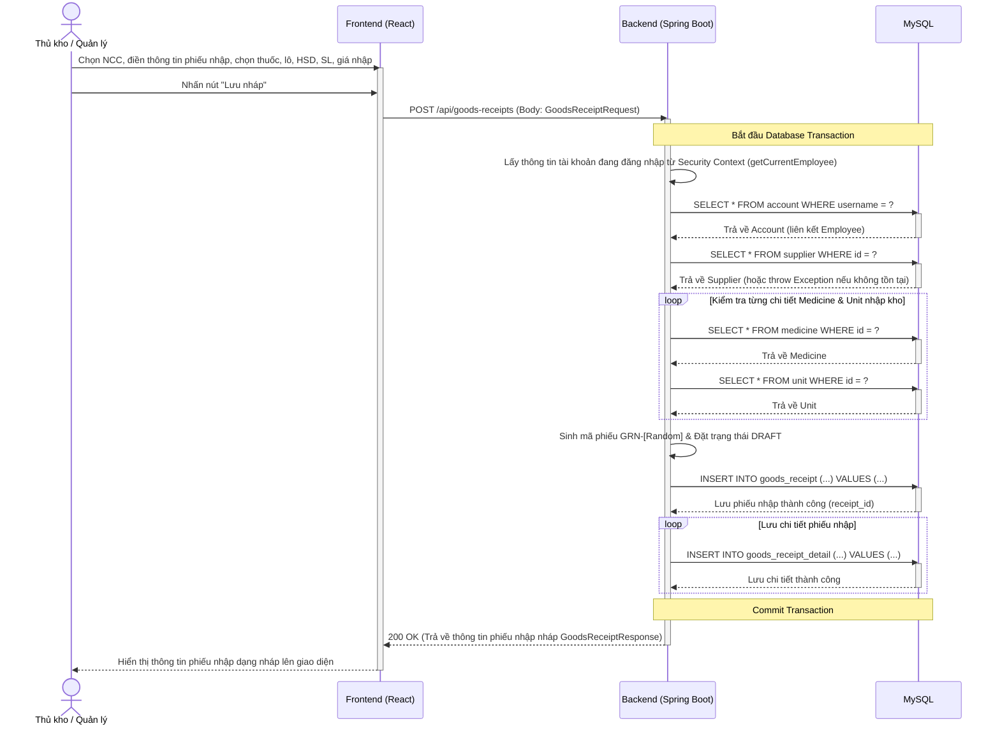
```mermaid
sequenceDiagram
    actor TK as Thủ kho / Quản lý
    participant FE as Frontend (React)
    participant BE as Backend (Spring Boot)
    participant DB as MySQL
    
    TK->>FE: Chọn NCC, điền thông tin phiếu nhập, chọn thuốc, lô, HSD, SL, giá nhập
    activate FE
    TK->>FE: Nhấn nút "Lưu nháp"
    FE->>BE: POST /api/goods-receipts (Body: GoodsReceiptRequest)
    activate BE
    
    Note over BE,DB: Bắt đầu Database Transaction
    BE->>BE: Lấy thông tin tài khoản đang đăng nhập từ Security Context (getCurrentEmployee)
    BE->>DB: SELECT * FROM account WHERE username = ?
    activate DB
    DB-->>BE: Trả về Account (liên kết Employee)
    deactivate DB
    
    BE->>DB: SELECT * FROM supplier WHERE id = ?
    activate DB
    DB-->>BE: Trả về Supplier (hoặc throw Exception nếu không tồn tại)
    deactivate DB
    
    loop Kiểm tra từng chi tiết Medicine & Unit nhập kho
        BE->>DB: SELECT * FROM medicine WHERE id = ?
        activate DB
        DB-->>BE: Trả về Medicine
        deactivate DB
        BE->>DB: SELECT * FROM unit WHERE id = ?
        activate DB
        DB-->>BE: Trả về Unit
        deactivate DB
    end
    
    BE->>BE: Sinh mã phiếu GRN-[Random] & Đặt trạng thái DRAFT
    BE->>DB: INSERT INTO goods_receipt (...) VALUES (...)
    activate DB
    DB-->>BE: Lưu phiếu nhập thành công (receipt_id)
    deactivate DB
    
    loop Lưu chi tiết phiếu nhập
        BE->>DB: INSERT INTO goods_receipt_detail (...) VALUES (...)
        activate DB
        DB-->>BE: Lưu chi tiết thành công
        deactivate DB
    end
    Note over BE,DB: Commit Transaction
    
    BE-->>FE: 200 OK (Trả về thông tin phiếu nhập nháp GoodsReceiptResponse)
    deactivate BE
    FE-->>TK: Hiển thị thông tin phiếu nhập dạng nháp lên giao diện
    deactivate FE
```

### UC23: Xác nhận phiếu nhập kho (Confirm Goods Receipt)
```mermaid
sequenceDiagram
    actor TK as Thủ kho / Quản lý
    participant FE as Frontend (React)
    participant BE as Backend (Spring Boot)
    participant DB as MySQL
    
    TK->>FE: Tại chi tiết phiếu nháp, nhấn nút "Xác nhận nhập kho"
    activate FE
    FE->>BE: PATCH /api/goods-receipts/{id}/confirm
    activate BE
    
    Note over BE,DB: Bắt đầu Database Transaction (@Transactional)
    BE->>DB: SELECT * FROM goods_receipt WHERE id = ?
    activate DB
    DB-->>BE: Đối tượng GoodsReceipt (status, details)
    deactivate DB
    BE->>BE: Kiểm tra trạng thái phiếu phải là DRAFT
    alt Trạng thái không phải DRAFT
        BE-->>FE: 400 Bad Request (Chỉ có thể xác nhận phiếu ở trạng thái nháp)
        FE-->>TK: Hiển thị thông báo lỗi trạng thái
    else Trạng thái là DRAFT
        loop Duyệt qua từng chi tiết thuốc nhập (GoodsReceiptDetail)
            BE->>BE: Quy đổi số lượng thực nhập về đơn vị cơ bản (Qty * Rate)
            BE->>DB: SELECT * FROM inventory WHERE medicine_id = ? AND batch_code = ?
            activate DB
            DB-->>BE: Trả về đối tượng Inventory (nếu có)
            deactivate DB
            alt Lô chưa tồn tại trong kho (Inventory == null)
                BE->>DB: INSERT INTO inventory (medicine_id, batch_code, expiry_date, stock_quantity, import_price, status) VALUES (...)
                activate DB
                DB-->>BE: Lưu lô mới thành công
                deactivate DB
            else Lô đã tồn tại trong kho
                BE->>DB: UPDATE inventory SET stock_quantity = stock_quantity + Qty_quydoi, import_price = ?, expiry_date = ? WHERE id = ?
                activate DB
                DB-->>BE: Cập nhật lô thành công
                deactivate DB
            end
            BE->>DB: INSERT INTO inventory_transaction (inventory_id, transaction_type, quantity_change, balance_after, reference_id) VALUES (...)
            activate DB
            DB-->>BE: Ghi thẻ kho thành công (loại IMPORT, SL dương)
            deactivate DB
        end
        BE->>DB: UPDATE goods_receipt SET status = 'CONFIRMED' WHERE id = ?
        activate DB
        DB-->>BE: Cập nhật trạng thái phiếu thành công
        deactivate DB
        Note over BE,DB: Commit Transaction
        
        BE-->>FE: 200 OK (Xác nhận nhập kho thành công GoodsReceiptResponse)
        deactivate BE
        FE->>FE: Gọi hàm printContent() tạo popup HTML in phiếu
        FE-->>TK: Thông báo thành công và hiển thị cửa sổ in phiếu nhập kho
    end
    deactivate FE

### UC24: Hủy phiếu nhập kho nháp (Cancel Goods Receipt)
```mermaid
sequenceDiagram
    actor TK as Thủ kho / Quản lý
    participant FE as Frontend (React)
    participant BE as Backend (Spring Boot)
    participant DB as MySQL
    
    TK->>FE: Tại chi tiết phiếu nháp, nhấn nút "Hủy phiếu" & xác nhận
    activate FE
    FE->>BE: PATCH /api/goods-receipts/{id}/cancel
    activate BE
    BE->>DB: SELECT * FROM goods_receipt WHERE id = ?
    activate DB
    DB-->>BE: Đối tượng GoodsReceipt (status)
    deactivate DB
    BE->>BE: Kiểm tra trạng thái phiếu phải là DRAFT
    alt Trạng thái không phải DRAFT
        BE-->>FE: 400 Bad Request (Lỗi: Chỉ có thể hủy phiếu nhập nháp)
        FE-->>TK: Hiển thị cảnh báo lỗi
    else Trạng thái là DRAFT
        BE->>DB: UPDATE goods_receipt SET status = 'CANCELLED' WHERE id = ?
        activate DB
        DB-->>BE: Cập nhật thành công
        deactivate DB
        BE-->>FE: 200 OK (Hủy phiếu nhập kho thành công GoodsReceiptResponse)
        deactivate BE
        FE-->>TK: Cập nhật trạng thái phiếu hiển thị thành "CANCELLED"
    end
    deactivate FE
```

### UC25: Lập phiếu xuất kho nháp (Create Goods Issue Draft)
```mermaid
sequenceDiagram
    actor TK as Thủ kho / Quản lý
    participant FE as Frontend (React)
    participant BE as Backend (Spring Boot)
    participant DB as MySQL
    
    TK->>FE: Chọn lý do xuất kho, ghi chú, tìm chọn lô hàng trong kho, nhập SL xuất & nhấn "Lưu nháp"
    activate FE
    FE->>BE: POST /api/goods-issues (Body: GoodsIssueRequest)
    activate BE
    
    Note over BE,DB: Bắt đầu Database Transaction
    BE->>BE: Lấy thông tin nhân viên lập qua Security Context (getCurrentEmployee)
    BE->>DB: SELECT * FROM account WHERE username = ?
    activate DB
    DB-->>BE: Trả về Account (Employee)
    deactivate DB
    
    loop Kiểm tra từng chi tiết Medicine & Inventory lô cần xuất
        BE->>DB: SELECT * FROM inventory WHERE id = ?
        activate DB
        DB-->>BE: Trả về Inventory (stockQuantity)
        deactivate DB
    end
    
    BE->>BE: Sinh mã phiếu xuất GIN-[Random] & Đặt trạng thái DRAFT
    BE->>DB: INSERT INTO goods_issue (...) VALUES (...)
    activate DB
    DB-->>BE: Lưu phiếu xuất thành công (issue_id)
    deactivate DB
    
    loop Lưu chi tiết phiếu xuất
        BE->>DB: INSERT INTO goods_issue_detail (...) VALUES (...)
        activate DB
        DB-->>BE: Lưu chi tiết thành công
        deactivate DB
    end
    Note over BE,DB: Commit Transaction
    
    BE-->>FE: 200 OK (Trả về thông tin phiếu xuất nháp GoodsIssueResponse)
    deactivate BE
    FE-->>TK: Hiển thị phiếu xuất dạng nháp lên giao diện bảng kê
    deactivate FE
```

### UC26: Xác nhận phiếu xuất kho (Confirm Goods Issue)
```mermaid
sequenceDiagram
    actor TK as Thủ kho / Quản lý
    participant FE as Frontend (React)
    participant BE as Backend (Spring Boot)
    participant DB as MySQL
    
    TK->>FE: Xem lại phiếu nháp & nhấn "Xác nhận xuất kho"
    activate FE
    FE->>BE: PATCH /api/goods-issues/{id}/confirm
    activate BE
    
    Note over BE,DB: Bắt đầu Database Transaction (@Transactional)
    BE->>DB: SELECT * FROM goods_issue WHERE id = ?
    activate DB
    DB-->>BE: Đối tượng GoodsIssue (status, details)
    deactivate DB
    BE->>BE: Kiểm tra trạng thái phiếu xuất phải là DRAFT
    alt Trạng thái không phải DRAFT
        BE-->>FE: 400 Bad Request (Lỗi: Chỉ có thể xác nhận xuất kho từ phiếu nháp)
        FE-->>TK: Hiển thị thông báo lỗi
    else Trạng thái là DRAFT
        loop Duyệt qua từng chi tiết thuốc xuất (GoodsIssueDetail)
            BE->>DB: SELECT * FROM inventory WHERE id = ? FOR UPDATE (Lock)
            activate DB
            DB-->>BE: Đối tượng Inventory (stock_quantity thực tế)
            deactivate DB
            BE->>BE: Quy đổi số lượng xuất về đơn vị tính cơ bản (Qty * Rate)
            alt Tồn kho thực tế không đủ (stock_quantity < SL quy đổi)
                BE-->>FE: 400 Bad Request (Lỗi: Không đủ tồn kho thực tế cho lô này!)
                Note over BE,DB: Rollback toàn bộ các giao dịch đã thực hiện trong khối Transaction
                FE-->>TK: Hiển thị thông báo lỗi hết hàng tồn trong lô
            else Đủ tồn kho để xuất
                BE->>DB: UPDATE inventory SET stock_quantity = stock_quantity - SL_quydoi WHERE id = ?
                activate DB
                DB-->>BE: Cập nhật tồn kho thành công
                deactivate DB
                BE->>DB: INSERT INTO inventory_transaction (inventory_id, transaction_type, quantity_change, balance_after, reference_id) VALUES (...)
                activate DB
                DB-->>BE: Ghi thẻ kho thành công (loại EXPORT, SL âm)
                deactivate DB
            end
        end
        BE->>DB: UPDATE goods_issue SET status = 'CONFIRMED' WHERE id = ?
        activate DB
        DB-->>BE: Cập nhật trạng thái phiếu thành công
        deactivate DB
        Note over BE,DB: Commit Transaction
        
        BE-->>FE: 200 OK (Xác nhận xuất kho thành công GoodsIssueResponse)
        deactivate BE
        FE-->>TK: Thông báo thành công và hỗ trợ in phiếu xuất kho
    end
    deactivate FE
```

### UC27: Hủy phiếu xuất kho nháp (Cancel Goods Issue)
```mermaid
sequenceDiagram
    actor TK as Thủ kho / Quản lý
    participant FE as Frontend (React)
    participant BE as Backend (Spring Boot)
    participant DB as MySQL
    
    TK->>FE: Tại chi tiết phiếu nháp, nhấn nút "Hủy phiếu" & xác nhận
    activate FE
    FE->>BE: PATCH /api/goods-issues/{id}/cancel
    activate BE
    BE->>DB: SELECT * FROM goods_issue WHERE id = ?
    activate DB
    DB-->>BE: Đối tượng GoodsIssue (status)
    deactivate DB
    BE->>BE: Kiểm tra trạng thái phiếu phải là DRAFT
    alt Trạng thái không phải DRAFT
        BE-->>FE: 400 Bad Request (Lỗi: Chỉ có thể hủy phiếu xuất nháp)
        FE-->>TK: Hiển thị cảnh báo lỗi
    else Trạng thái là DRAFT
        BE->>DB: UPDATE goods_issue SET status = 'CANCELLED' WHERE id = ?
        activate DB
        DB-->>BE: Cập nhật thành công
        deactivate DB
        BE-->>FE: 200 OK (Hủy phiếu xuất kho thành công GoodsIssueResponse)
        deactivate BE
        FE-->>TK: Cập nhật trạng thái hiển thị thành "CANCELLED"
    end
    deactivate FE

### UC28: Lập phiếu kiểm kê kho nháp (Create Stock Audit Draft)
```mermaid
sequenceDiagram
    actor TK as Thủ kho / Quản lý
    participant FE as Frontend (React)
    participant BE as Backend (Spring Boot)
    participant DB as MySQL
    
    TK->>FE: Nhấn nút "Tạo phiếu kiểm kê mới"
    activate FE
    FE->>BE: POST /api/stock-audits (Body: StockAuditRequest)
    activate BE
    
    Note over BE,DB: Bắt đầu Database Transaction (@Transactional)
    BE->>BE: Định danh nhân viên kiểm qua Security Context (getCurrentEmployee)
    BE->>DB: SELECT * FROM account WHERE username = ?
    activate DB
    DB-->>BE: Trả về Account (Employee)
    deactivate DB
    BE->>DB: SELECT * FROM inventory WHERE stock_quantity >= 0 AND status = 'ACTIVE'
    activate DB
    DB-->>BE: Danh sách các lô tồn kho thực tế (Inventory)
    deactivate DB
    
    BE->>BE: Sinh mã phiếu AUD-[Random] & Đặt trạng thái DRAFT
    BE->>DB: INSERT INTO audit (audit_code, created_date, status, employee_id) VALUES (...)
    activate DB
    DB-->>BE: Lưu phiếu kiểm kê thành công (audit_id)
    deactivate DB
    
    loop Lưu danh sách chi tiết kiểm kê (tồn hệ thống = stock_quantity)
        BE->>BE: systemQuantity = Inventory.stockQuantity
        BE->>BE: actualQuantity = systemQuantity & discrepancy = 0
        BE->>DB: INSERT INTO audit_detail (audit_id, inventory_id, system_quantity, actual_quantity, discrepancy) VALUES (...)
        activate DB
        DB-->>BE: Lưu chi tiết kiểm kê thành công
        deactivate DB
    end
    Note over BE,DB: Commit Transaction
    
    BE-->>FE: 200 OK (Trả về thông tin phiếu kiểm kê nháp StockAuditResponse)
    deactivate BE
    FE-->>TK: Hiển thị danh sách các lô cần kiểm kê với SL sổ sách
    deactivate FE
```

### UC29: Nhập số đếm thực tế kiểm kho (Save Audit Quantities)
```mermaid
sequenceDiagram
    actor TK as Thủ kho / Quản lý
    participant FE as Frontend (React)
    participant BE as Backend (Spring Boot)
    participant DB as MySQL
    
    TK->>FE: Nhấn "Bắt đầu thực hiện kiểm kho"
    activate FE
    FE->>BE: PATCH /api/stock-audits/{id}/start
    activate BE
    BE->>DB: SELECT * FROM audit WHERE id = ?
    activate DB
    DB-->>BE: Trả về Audit
    deactivate DB
    BE->>DB: UPDATE audit SET status = 'IN_PROGRESS' WHERE id = ?
    activate DB
    DB-->>BE: Cập nhật thành công
    deactivate DB
    BE-->>FE: 200 OK (Chuyển đổi trạng thái thành công)
    deactivate BE
    
    TK->>FE: Kiểm đếm thực tế & nhập số lượng đếm được, nhấn "Lưu tạm"
    FE->>BE: PUT /api/stock-audits/{id}/items (Body: StockAuditRequest chứa list actualQuantity)
    activate BE
    Note over BE,DB: Bắt đầu Database Transaction
    loop Với từng chi tiết kiểm kê được cập nhật
        BE->>DB: SELECT * FROM audit_detail WHERE id = ?
        activate DB
        DB-->>BE: Đối tượng AuditDetail (system_quantity)
        deactivate DB
        BE->>BE: Tính chênh lệch từng lô (discrepancy = actualQuantity - systemQuantity)
        BE->>DB: UPDATE audit_detail SET actual_quantity = ?, discrepancy = ? WHERE id = ?
        activate DB
        DB-->>BE: Cập nhật số đếm tạm thời thành công
        deactivate DB
    end
    Note over BE,DB: Commit Transaction
    BE-->>FE: 200 OK (Lưu nháp số đếm thành công StockAuditResponse)
    deactivate BE
    FE-->>TK: Hiển thị số lượng chênh lệch thừa (+) hoặc thiếu (-) lên màn hình
    deactivate FE
```

### UC30: Xác nhận đối soát hoàn thành kiểm kê (Confirm Stock Audit)
```mermaid
sequenceDiagram
    actor TK as Thủ kho / Quản lý
    participant FE as Frontend (React)
    participant BE as Backend (Spring Boot)
    participant DB as MySQL
    
    TK->>FE: Kiểm tra đầy đủ số đếm & Nhấn "Xác nhận đối soát hoàn thành kiểm kê"
    activate FE
    FE->>BE: PATCH /api/stock-audits/{id}/confirm
    activate BE
    
    Note over BE,DB: Bắt đầu Database Transaction (@Transactional)
    BE->>DB: SELECT * FROM audit WHERE id = ?
    activate DB
    DB-->>BE: Đối tượng StockAudit (status, details)
    deactivate DB
    BE->>BE: Kiểm tra trạng thái và đảm bảo status == 'IN_PROGRESS'
    alt Trạng thái sai
        BE-->>FE: 400 Bad Request (Lỗi: Phiếu phải ở trạng thái đang kiểm kê)
        FE-->>TK: Hiển thị thông báo lỗi
    else Trạng thái là IN_PROGRESS
        loop Duyệt qua từng chi tiết kiểm kê (StockAuditDetail)
            BE->>DB: SELECT * FROM inventory WHERE id = ? FOR UPDATE
            activate DB
            DB-->>BE: Trả về Inventory (stockQuantity hiện tại)
            deactivate DB
            BE->>DB: UPDATE inventory SET stock_quantity = actual_quantity WHERE id = ?
            activate DB
            DB-->>BE: Đồng bộ tồn kho sổ sách về số đếm thực tế thành công
            deactivate DB
            alt Có xảy ra chênh lệch (discrepancy != 0)
                BE->>DB: INSERT INTO inventory_transaction (inventory_id, transaction_type, quantity_change, balance_after, reference_id) VALUES (...)
                activate DB
                DB-->>BE: Ghi thẻ kho chênh lệch thành công (loại AUDIT_ADJUST, SL +/-)
                deactivate DB
            end
        end
        BE->>DB: UPDATE audit SET status = 'CONFIRMED', approved_by = ? WHERE id = ?
        activate DB
        DB-->>BE: Cập nhật trạng thái phiếu thành công
        deactivate DB
        Note over BE,DB: Commit Transaction
        
        BE-->>FE: 200 OK (Đối soát thành công, tồn kho đã đồng bộ StockAuditResponse)
        deactivate BE
        FE-->>TK: Thông báo đối soát thành công và kết thúc quy trình kiểm kê
    end
    deactivate FE

---

## PHÂN HỆ 5: BÁN HÀNG VÀ BÁO CÁO TỒN KHO (UC31 - UC32)

### UC31: Lập hóa đơn bán lẻ thuốc tại quầy - POS (Create Invoice)
```mermaid
sequenceDiagram
    actor NV as Nhân viên bán hàng (Sales)
    participant FE as Frontend (React)
    participant BE as Backend (Spring Boot)
    participant DB as MySQL

    NV->>FE: Tìm thuốc, chọn lô, nhập số lượng & đơn vị bán
    activate FE
    FE->>FE: Kiểm tra đơn vị & Tính thành tiền dòng sản phẩm (SL * Đơn giá)
    
    opt Tra cứu khách hàng thành viên tích điểm
        NV->>FE: Nhập SĐT khách hàng
        FE->>BE: GET /api/customers/search?phone={phone}
        activate BE
        BE->>DB: SELECT * FROM customer WHERE phone_number = ? AND status = 'ACTIVE'
        activate DB
        DB-->>BE: Đối tượng Customer (id, name, accumulated_points)
        deactivate DB
        BE-->>FE: 200 OK (Thông tin Customer & điểm tích lũy hiện tại)
        deactivate BE
        FE->>FE: Hiển thị tên KH & điểm tích lũy, tự động tính điểm cộng dự kiến
    end

    NV->>FE: Nhập số tiền mặt khách đưa & áp dụng điểm tích lũy (nếu có)
    FE->>FE: Tính toán tiền thừa trả khách (Tiền thừa = Tiền khách đưa - (Tổng tiền - Điểm quy đổi))
    NV->>FE: Nhấp chọn "Thanh toán & Xuất hóa đơn"
    
    FE->>BE: POST /api/invoices (InvoiceRequest chứa customerId, items, pointsUsed, receivedCash)
    activate BE
    
    BE->>BE: Xác thực & Trích xuất Username từ JWT Token (SecurityContextHolder)
    BE->>DB: SELECT * FROM account WHERE username = ?
    activate DB
    DB-->>BE: Đối tượng Account & Employee (nhân viên lập hóa đơn)
    deactivate DB

    Note over BE,DB: Bắt đầu Database Transaction (@Transactional)
    
    opt Khách hàng có dùng điểm tích lũy hoặc tích điểm mới
        BE->>DB: SELECT * FROM customer WHERE id = ? FOR UPDATE (Khóa dòng tích điểm)
        activate DB
        DB-->>BE: Trả về thông tin Customer chi tiết
        deactivate DB
    end

    loop Duyệt qua từng chi tiết thuốc bán lẻ trong giỏ hàng
        BE->>DB: SELECT * FROM inventory WHERE id = ? FOR UPDATE (Khóa dòng lô thuốc tránh tranh chấp)
        activate DB
        DB-->>BE: Trả về Inventory (medicine_id, stock_quantity, status, batch_number)
        deactivate DB
        
        BE->>DB: SELECT * FROM medicine WHERE id = ?
        activate DB
        DB-->>BE: Trả về Medicine (base_unit, conversion_rate)
        deactivate DB
        
        BE->>BE: Quy đổi số lượng bán về đơn vị cơ bản: SL_bán_quy_đổi = quantity * rate
        
        alt Không đủ số lượng tồn kho lô (stock_quantity < SL_bán_quy_đổi)
            BE->>DB: Rollback Transaction
            BE-->>FE: 400 Bad Request (Lỗi: Lô thuốc [Batch] không đủ tồn kho bán lẻ!)
            FE-->>NV: Hiển thị thông báo lỗi chi tiết, đề xuất đổi lô hoặc cập nhật số lượng
        else Đủ số lượng tồn kho lô
            BE->>BE: Trừ số lượng tồn kho: stock_quantity = stock_quantity - SL_bán_quy_đổi
            opt Nếu tồn kho giảm về 0
                BE->>BE: Đặt trạng thái status = 'SOLD_OUT'
            end
            BE->>DB: UPDATE inventory SET stock_quantity = ?, status = ? WHERE id = ?
            activate DB
            DB-->>BE: Cập nhật tồn kho thành công
            deactivate DB
            
            BE->>DB: INSERT INTO inventory_transaction (inventory_id, transaction_type, quantity_change, balance_after, reference_id) VALUES (?, 'SALE', -SL_bán_quy_đổi, stock_quantity, [invoice_id])
            activate DB
            DB-->>BE: Ghi thẻ kho biến động thành công
            deactivate DB
        end
    end
    
    BE->>BE: Sinh mã hóa đơn mới INV-[Random] & Tính toán điểm tích lũy mới
    opt Cập nhật điểm tích lũy khách hàng
        BE->>BE: Tính điểm cộng mới: points_gained = totalAmount * 0.01
        BE->>BE: Tính điểm mới: new_points = current_points - pointsUsed + points_gained
        BE->>DB: UPDATE customer SET accumulated_points = ? WHERE id = ?
        activate DB
        DB-->>BE: Cập nhật điểm tích lũy thành công
        deactivate DB
    end
    
    BE->>DB: INSERT INTO invoice (invoice_code, employee_id, customer_id, total_amount, discount, paid_amount, change_amount, status) VALUES (...)
    activate DB
    DB-->>BE: Lưu hóa đơn thành công (invoice_id)
    deactivate DB
    
    loop Lưu chi tiết hóa đơn (InvoiceDetail)
        BE->>DB: INSERT INTO invoice_detail (invoice_id, inventory_id, quantity, unit_name, price, sub_total) VALUES (...)
        activate DB
        DB-->>BE: Lưu chi tiết hóa đơn thành công
        deactivate DB
    end
    
    Note over BE,DB: Commit Transaction
    
    BE-->>FE: 200 OK (Trả về InvoiceResponse đầy đủ thông tin hóa đơn)
    deactivate BE
    
    FE->>FE: Tạo/Mô phỏng template in nhiệt khổ K80 (Quầy thuốc, Mã HD, ds Thuốc, Tiền khách đưa, Tiền trả lại, QR)
    FE->>FE: Kích hoạt window.print() tự động kích hoạt hộp thoại in hệ thống
    FE-->>NV: Hiển thị hóa đơn hoàn tất, mở két tiền, hoàn thành giao dịch bán hàng
    deactivate FE
```

### UC32: Xem lịch sử thẻ kho của thuốc (View Stock Card)
```mermaid
sequenceDiagram
    actor ND as Quản lý / Thủ kho
    participant FE as Frontend (React)
    participant BE as Backend (Spring Boot)
    participant DB as MySQL
    
    ND->>FE: Chọn mục "Thẻ kho" -> Tìm kiếm và chọn thuốc cụ thể & khoảng thời gian
    activate FE
    FE->>BE: GET /api/inventory/transactions?medicineId={id}&startDate={start}&endDate={end}
    activate BE
    
    BE->>BE: Xác thực & kiểm tra quyền truy cập (Role: ADMIN, MANAGER, WAREHOUSE_KEEPER)
    
    BE->>DB: SELECT * FROM medicine WHERE id = ?
    activate DB
    DB-->>BE: Trả về Medicine (Tên thuốc, Đơn vị tính cơ bản)
    deactivate DB
    
    BE->>DB: SELECT SUM(quantity_change) FROM inventory_transaction t JOIN inventory i ON t.inventory_id = i.id WHERE i.medicine_id = ? AND t.created_date < ?
    activate DB
    DB-->>BE: Trả về số lượng tồn kho đầu kỳ (initial_balance)
    deactivate DB
    
    BE->>DB: SELECT t.*, i.batch_number, i.expiry_date FROM inventory_transaction t JOIN inventory i ON t.inventory_id = i.id WHERE i.medicine_id = ? AND t.created_date BETWEEN ? AND ? ORDER BY t.created_date ASC, t.id ASC
    activate DB
    DB-->>BE: Trả về danh sách InventoryTransaction (IMPORT, EXPORT, SALE, AUDIT_ADJUST) kèm chi tiết lô
    deactivate DB
    
    BE-->>FE: 200 OK (Trả về StockCardResponse gồm initial_balance & list transactions)
    deactivate BE
    
    FE->>FE: Khởi tạo biến running_balance = initial_balance
    loop Với mỗi giao dịch kho trong danh sách (tăng dần thời gian)
        FE->>FE: running_balance = running_balance + quantity_change
        FE->>FE: Gán giá trị số dư lũy kế vào dòng hiển thị tương ứng
        FE->>FE: Định dạng loại giao dịch (SALE -> Bán lẻ, IMPORT -> Nhập kho, EXPORT -> Xuất kho, AUDIT_ADJUST -> Cân đối kiểm kê)
    end
    
    FE-->>ND: Hiển thị bảng Thẻ kho trực quan (Thời gian, Số chứng từ, Loại biến động, Số lượng +/- , Tồn lũy kế)
    deactivate FE
```
