# BẢN VẼ CHI TIẾT TOÀN BỘ 32 SEQUENCE DIAGRAM - HỆ THỐNG QUẢN LÝ KHO THUỐC (PIS)

Tài liệu này cung cấp **đầy đủ 32 bản vẽ Sequence Diagram (Sơ đồ tuần tự)** cho toàn bộ 32 Use Case của hệ thống **PIS**. Các sơ đồ được biểu diễn chi tiết bằng ngôn ngữ **Mermaid**, mô tả chính xác sự tương tác đa tầng giữa:
1. **Người dùng / Thủ kho / Nhân viên bán hàng / Admin**
2. **Frontend (Vite + React)**
3. **Backend (Spring Boot Controller & Service)**
4. **MySQL Database**
5. **Các dịch vụ bổ trợ** (`JwtTokenProvider`, `MailService`)

---

## PHÂN HỆ 1: XÁC THỰC VÀ TÀI KHOẢN CÁ NHÂN (UC01 - UC06)

### UC01: Đăng nhập hệ thống (System Login)
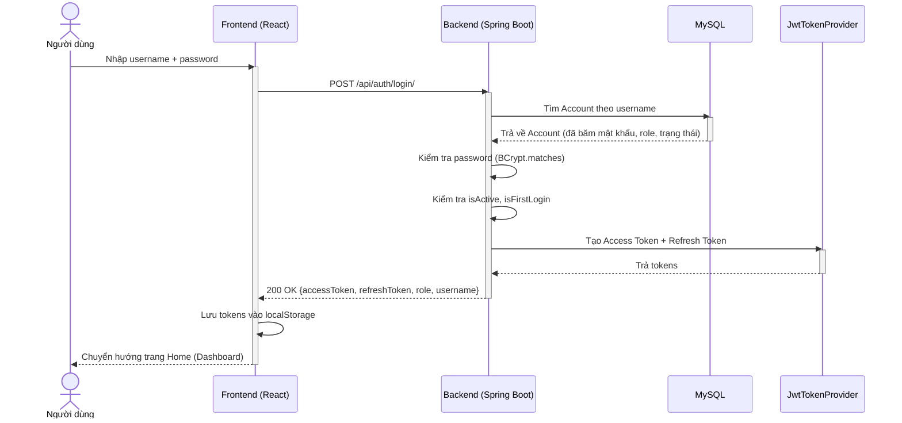

### UC02: Đăng xuất hệ thống (System Logout)
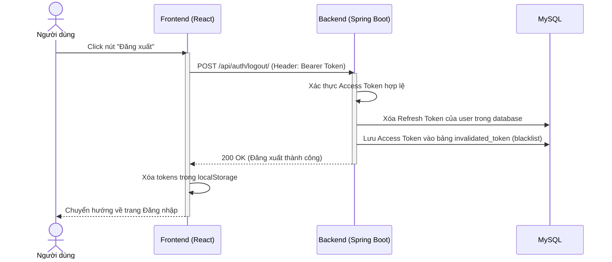

### UC03: Làm mới Token tự động (Token Refresh)
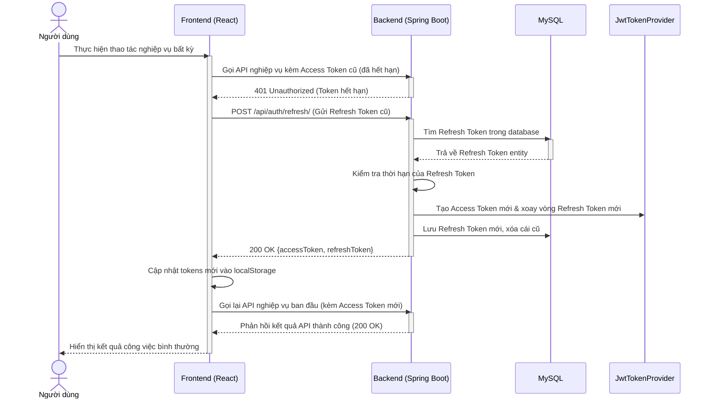

### UC04: Xem thông tin tài khoản cá nhân (Get Me)
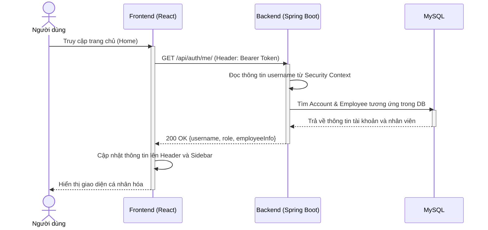

### UC05: Đổi mật khẩu tài khoản (Change Password)
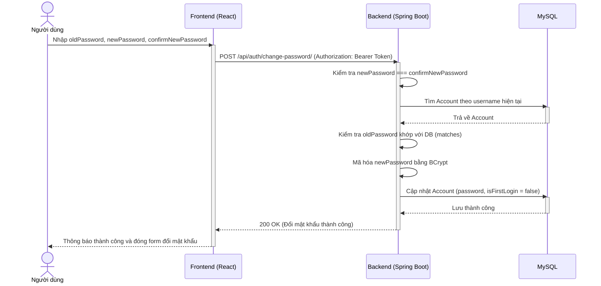

### UC06: Cấp lại mật khẩu tạm khi quên mật khẩu (Forgot Password)
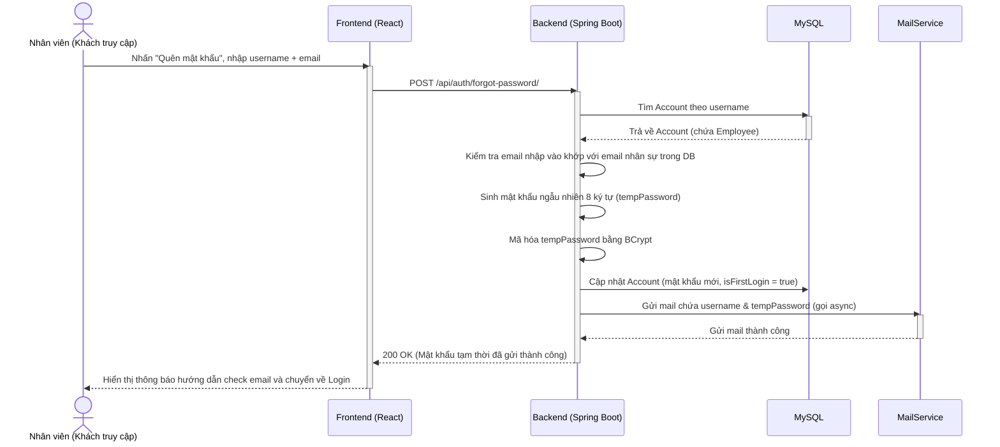

---

## PHÂN HỆ 2: QUẢN LÝ DANH MỤC VÀ DỮ LIỆU THUỐC (UC07 - UC16)

### UC07: Xem danh sách danh mục thuốc (View Catalogs)
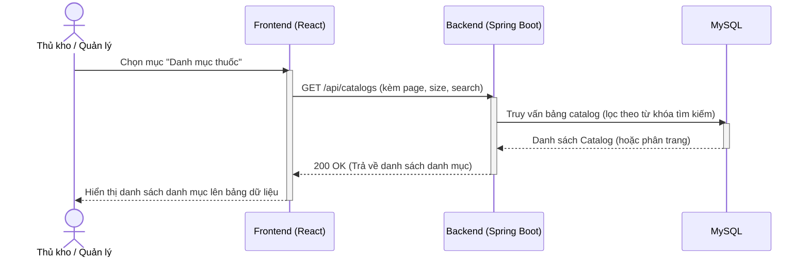

### UC08: Thêm danh mục thuốc mới (Create Catalog)
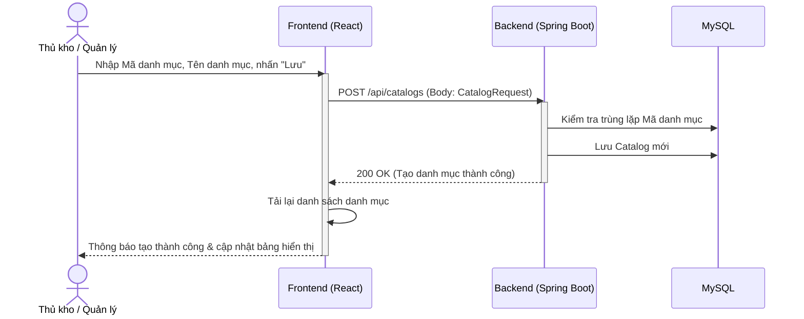

### UC09: Cập nhật danh mục thuốc (Update Catalog)
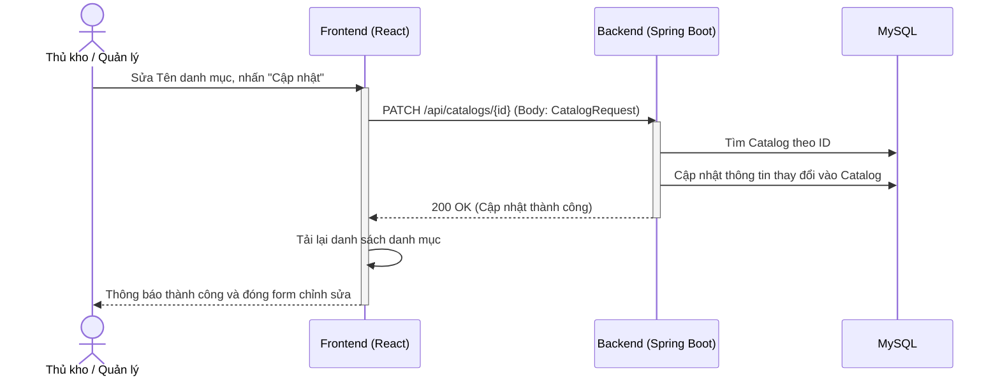

### UC10: Xóa danh mục thuốc (Delete Catalog)
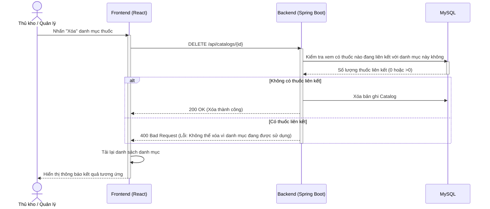

### UC11: Quản lý nước sản xuất - Origin CRUD (Xem/Thêm/Sửa/Xóa)
```mermaid
sequenceDiagram
    actor TK as Thủ kho / Quản lý
    participant FE as Frontend (React)
    participant BE as Backend (Spring Boot)
    participant DB as MySQL
    
    Note over TK,DB: Quy trình Xem, Thêm, Sửa, Xóa Nước sản xuất (Origin)
    TK->>FE: Truy cập tab "Nước sản xuất"
    activate FE
    FE->>BE: GET /api/origins
    BE->>DB: Lấy dữ liệu bảng origin
    BE-->>FE: Trả về danh sách Origin
    FE-->>TK: Hiển thị danh sách nước sản xuất
    
    TK->>FE: Thêm mới nước sản xuất (Mã, Tên nước)
    FE->>BE: POST /api/origins (Body: OriginRequest)
    BE->>DB: Kiểm tra trùng mã & Lưu Origin
    BE-->>FE: 200 OK (Tạo nước sản xuất thành công)
    
    TK->>FE: Chỉnh sửa hoặc Xóa nước sản xuất
    FE->>BE: DELETE /api/origins/{id}
    BE->>DB: Kiểm tra ràng buộc khóa ngoại (bảng medicine)
    alt Không liên kết với thuốc
        BE->>DB: Xóa Origin trong DB
        BE-->>FE: 200 OK (Xóa thành công)
    else Có liên kết
        BE-->>FE: 400 Bad Request (Không cho xóa)
    end
    deactivate BE
    FE-->>TK: Cập nhật giao diện nước sản xuất
    deactivate FE
```

### UC12: Quản lý đơn vị tính - Unit CRUD (Xem/Thêm/Sửa/Xóa)
```mermaid
sequenceDiagram
    actor TK as Thủ kho / Quản lý
    participant FE as Frontend (React)
    participant BE as Backend (Spring Boot)
    participant DB as MySQL
    
    Note over TK,DB: Quy trình Quản lý Đơn vị tính (Unit)
    TK->>FE: Truy cập tab "Đơn vị tính"
    activate FE
    FE->>BE: GET /api/units
    BE->>DB: Lấy dữ liệu bảng unit
    BE-->>FE: Trả về danh sách Đơn vị tính
    FE-->>TK: Hiển thị danh sách đơn vị tính (Viên, Vỉ, Hộp...)
    
    TK->>FE: Nhập đơn vị tính mới & Lưu
    FE->>BE: POST /api/units (Body: UnitRequest)
    BE->>DB: Kiểm tra trùng lặp & Lưu Unit
    BE-->>FE: 200 OK (Tạo thành công)
    
    TK->>FE: Nhấn Xóa đơn vị tính
    FE->>BE: DELETE /api/units/{id}
    BE->>DB: Kiểm tra Unit có làm đơn vị cơ bản hoặc quy đổi của thuốc không
    alt Không có liên kết
        BE->>DB: Xóa Unit khỏi database
        BE-->>FE: 200 OK (Xóa thành công)
    else Có liên kết hoạt động
        BE-->>FE: 400 Bad Request (Ngăn chặn xóa)
    end
    deactivate BE
    FE-->>TK: Hiển thị thông báo kết quả & cập nhật lại bảng
    deactivate FE
```

### UC13: Xem danh sách và tìm kiếm thuốc (Search Medicines)
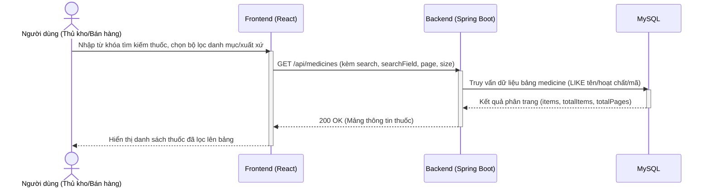

### UC14: Thêm thông tin thuốc mới (Create Medicine)
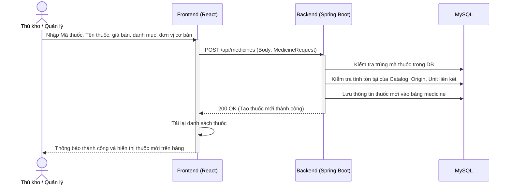

### UC15: Cập nhật thông tin thuốc (Update Medicine)
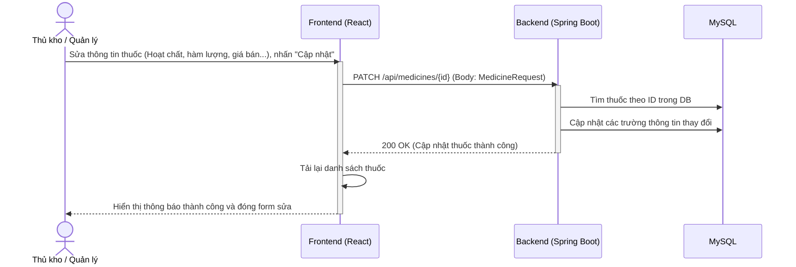

### UC16: Xóa thông tin thuốc (Delete Medicine)
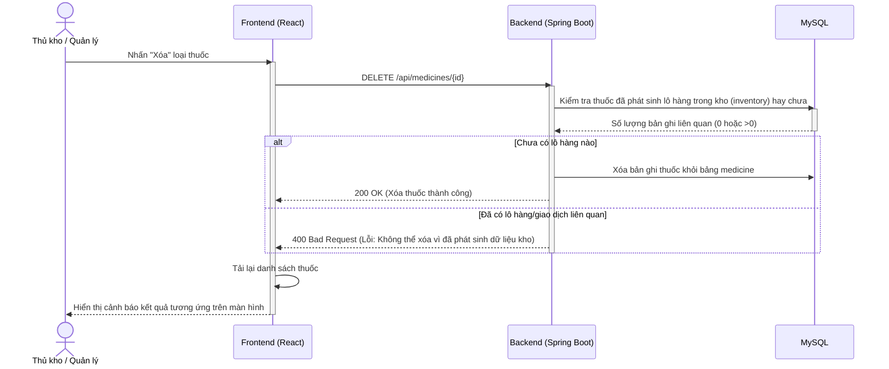

---

## PHÂN HỆ 3: QUẢN LÝ ĐỐI TÁC VÀ NHÂN SỰ (UC17 - UC21)

### UC17: Quản lý nhà cung cấp - Supplier CRUD (Xem/Thêm/Sửa/Xóa)
```mermaid
sequenceDiagram
    actor TK as Thủ kho / Quản lý
    participant FE as Frontend (React)
    participant BE as Backend (Spring Boot)
    participant DB as MySQL
    
    Note over TK,DB: Quản lý đối tác Nhà cung cấp (Supplier)
    TK->>FE: Truy cập tab "Nhà cung cấp"
    activate FE
    FE->>BE: GET /api/suppliers
    BE->>DB: Lấy dữ liệu bảng supplier
    BE-->>FE: Danh sách nhà cung cấp
    FE-->>TK: Hiển thị lên bảng
    
    TK->>FE: Thêm NCC mới (Mã, Tên, SĐT, Địa chỉ)
    FE->>BE: POST /api/suppliers (Body: SupplierRequest)
    BE->>DB: Kiểm tra trùng mã NCC & Lưu
    BE-->>FE: 200 OK (Tạo NCC thành công)
    
    TK->>FE: Sửa hoặc Xóa nhà cung cấp
    FE->>BE: DELETE /api/suppliers/{id}
    BE->>DB: Kiểm tra NCC đã có phiếu nhập kho nào chưa
    alt Chưa có phiếu nhập
        BE->>DB: Xóa NCC khỏi DB
        BE-->>FE: 200 OK (Xóa thành công)
    else Đã có phiếu nhập
        BE-->>FE: 400 Bad Request (Chặn không cho xóa)
    end
    deactivate BE
    FE-->>TK: Cập nhật lại danh sách hiển thị
    deactivate FE
```

### UC18: Quản lý thông tin khách hàng - Customer CRUD (Xem/Thêm/Sửa/Xóa)
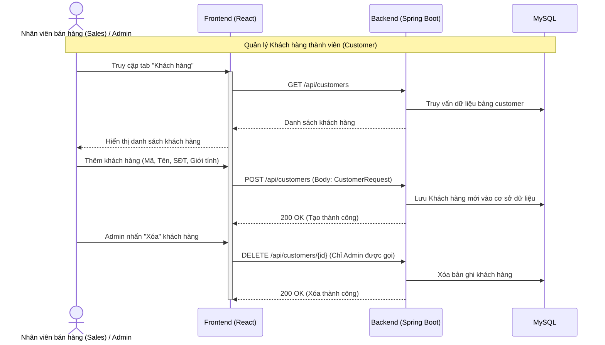

### UC19: Quản lý thông tin nhân viên - Employee CRUD (Xem/Thêm/Sửa/Xóa)
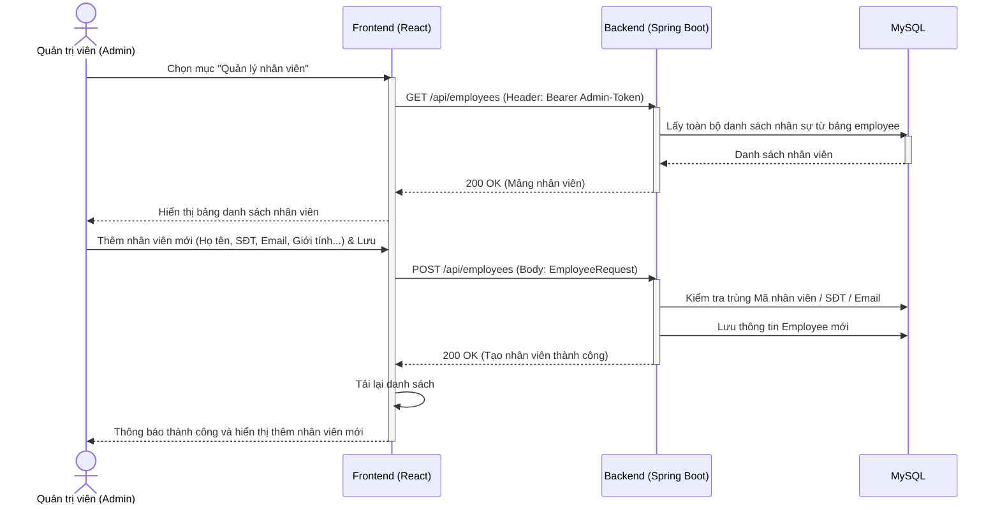

### UC20: Quản lý tài khoản người dùng - Account CRUD
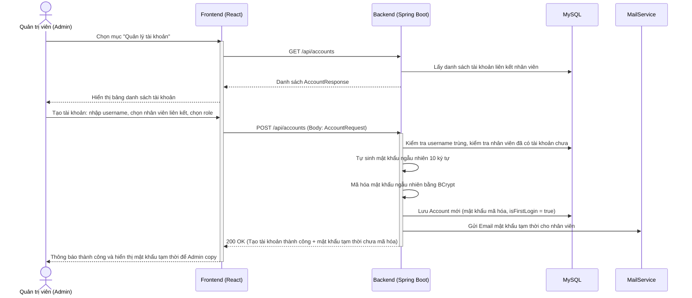

### UC21: Đặt lại mật khẩu nhân viên (Admin Reset Password)
```mermaid
sequenceDiagram
    actor AD as Quản trị viên (Admin)
    participant FE as Frontend (React)
    participant BE as Backend (Spring Boot)
    participant DB as MySQL
    
    AD->>FE: Tại dòng tài khoản cần reset, nhấn "Reset Password", nhập mật khẩu mới
    activate FE
    FE->>BE: POST /api/auth/admin/reset-password/ (Body: ResetPasswordRequest)
    activate BE
    BE->>DB: Tìm Account theo username
    activate DB
    DB-->>BE: Đối tượng Account
    deactivate DB
    BE->>BE: BCrypt mã hóa mật khẩu mới do Admin nhập
    BE->>DB: Cập nhật mật khẩu băm mới của tài khoản vào database
    activate DB
    DB-->>BE: Lưu thành công
    deactivate DB
    BE-->>FE: 200 OK (Đặt lại mật khẩu thành công)
    deactivate BE
    FE-->>AD: Hiển thị thông báo đổi mật khẩu thành công cho nhân viên
    deactivate FE
```

---

## PHÂN HỆ 4: NGHIỆP VỤ KHO THUỐC (UC22 - UC30)

### UC22: Lập phiếu nhập kho nháp (Create Goods Receipt Draft)
```mermaid
sequenceDiagram
    actor TK as Thủ kho / Quản lý
    participant FE as Frontend (React)
    participant BE as Backend (Spring Boot)
    participant DB as MySQL
    
    TK->>FE: Chọn NCC, điền thông tin phiếu nhập, chọn thuốc, lô, HSD, SL, giá nhập
    activate FE
    TK->>FE: Nhấn nút "Lưu nháp"
    FE->>BE: POST /api/goods-receipts (Body: GoodsReceiptRequest)
    activate BE
    BE->>DB: Kiểm tra Supplier, các Medicine và Unit giao dịch có tồn tại không
    BE->>BE: Sinh mã phiếu GRN-[Random] & Đặt trạng thái DRAFT
    BE->>DB: Lưu GoodsReceipt & các GoodsReceiptDetail vào DB
    BE-->>FE: 200 OK (Trả về thông tin phiếu nhập nháp)
    deactivate BE
    FE-->>TK: Hiển thị thông tin phiếu nhập dạng nháp lên giao diện
    deactivate FE
```

### UC23: Xác nhận phiếu nhập kho (Confirm Goods Receipt)
```mermaid
sequenceDiagram
    actor TK as Thủ kho / Quản lý
    participant FE as Frontend (React)
    participant BE as Backend (Spring Boot)
    participant DB as MySQL
    
    TK->>FE: Tại chi tiết phiếu nháp, nhấn nút "Xác nhận nhập kho"
    activate FE
    FE->>BE: PATCH /api/goods-receipts/{id}/confirm
    activate BE
    BE->>DB: Tìm phiếu nhập kho theo Receipt ID
    activate DB
    DB-->>BE: Đối tượng GoodsReceipt
    deactivate DB
    BE->>BE: Kiểm tra trạng thái phiếu phải là DRAFT
    loop Duyệt qua từng chi tiết thuốc nhập (GoodsReceiptDetail)
        BE->>BE: Quy đổi số lượng thực nhập về đơn vị cơ bản (Qty * Rate)
        BE->>DB: Tìm lô tồn kho (inventoryId = medicineId-batchId)
        alt Lô chưa tồn tại trong kho
            BE->>DB: Tạo mới lô tồn kho (SL quy đổi, giá nhập mới nhất, HSD, trạng thái ACTIVE)
        else Lô đã tồn tại trong kho
            BE->>DB: Cộng dồn số lượng tồn kho mới, cập nhật giá nhập mới, HSD
        end
        BE->>DB: Lưu InventoryTransaction (loại IMPORT, SL thay đổi dương, cập nhật số dư cuối)
    end
    BE->>DB: Cập nhật trạng thái phiếu nhập kho = CONFIRMED
    BE-->>FE: 200 OK (Xác nhận nhập kho thành công)
    deactivate BE
    FE->>FE: Gọi hàm printContent() tạo popup HTML in phiếu
    FE-->>TK: Thông báo thành công và hiển thị cửa sổ in phiếu nhập kho
    deactivate FE
```

### UC24: Hủy phiếu nhập kho nháp (Cancel Goods Receipt)
```mermaid
sequenceDiagram
    actor TK as Thủ kho / Quản lý
    participant FE as Frontend (React)
    participant BE as Backend (Spring Boot)
    participant DB as MySQL
    
    TK->>FE: Tại chi tiết phiếu nháp, nhấn nút "Hủy phiếu"
    activate FE
    FE->>BE: PATCH /api/goods-receipts/{id}/cancel
    activate BE
    BE->>DB: Tìm phiếu nhập kho theo ID
    activate DB
    DB-->>BE: Đối tượng GoodsReceipt
    deactivate DB
    BE->>BE: Kiểm tra trạng thái phiếu phải là DRAFT
    BE->>DB: Cập nhật trạng thái phiếu = CANCELLED trong DB
    BE-->>FE: 200 OK (Hủy phiếu nhập kho thành công)
    deactivate BE
    FE-->>TK: Cập nhật trạng thái phiếu hiển thị thành "CANCELLED"
    deactivate FE
```

### UC25: Lập phiếu xuất kho nháp (Create Goods Issue Draft)
```mermaid
sequenceDiagram
    actor TK as Thủ kho / Quản lý
    participant FE as Frontend (React)
    participant BE as Backend (Spring Boot)
    participant DB as MySQL
    
    TK->>FE: Chọn lý do xuất kho, ghi chú, tìm chọn lô hàng trong kho, nhập SL xuất
    activate FE
    TK->>FE: Nhấn nút "Lưu nháp"
    FE->>BE: POST /api/goods-issues (Body: GoodsIssueRequest)
    activate BE
    BE->>DB: Kiểm tra các lô thuốc tồn tại trong kho (inventory)
    BE->>BE: Sinh mã phiếu xuất GIN-[Random] & Đặt trạng thái DRAFT
    BE->>DB: Lưu GoodsIssue & các GoodsIssueDetail vào DB
    BE-->>FE: 200 OK (Trả về thông tin phiếu xuất nháp)
    deactivate BE
    FE-->>TK: Hiển thị phiếu xuất dạng nháp lên giao diện bảng kê
    deactivate FE
```

### UC26: Xác nhận phiếu xuất kho (Confirm Goods Issue)
```mermaid
sequenceDiagram
    actor TK as Thủ kho / Quản lý
    participant FE as Frontend (React)
    participant BE as Backend (Spring Boot)
    participant DB as MySQL
    
    TK->>FE: Xem lại phiếu nháp & nhấn "Xác nhận xuất kho"
    activate FE
    FE->>BE: PATCH /api/goods-issues/{id}/confirm
    activate BE
    BE->>DB: Tìm phiếu xuất kho theo ID
    activate DB
    DB-->>BE: Đối tượng GoodsIssue
    deactivate DB
    BE->>BE: Kiểm tra trạng thái phiếu xuất phải là DRAFT
    loop Duyệt qua từng chi tiết thuốc xuất
        BE->>DB: Tìm lô tồn kho tương ứng theo Inventory ID
        activate DB
        DB-->>BE: Đối tượng Inventory (chứa tồn kho thực tế)
        deactivate DB
        BE->>BE: Quy đổi số lượng xuất về đơn vị tính cơ bản
        BE->>BE: So sánh tồn kho thực tế với số lượng yêu cầu xuất
        alt Đủ tồn kho để xuất
            BE->>BE: Trừ số lượng tồn kho (stockQuantity = stockQuantity - SL quy đổi)
            BE->>DB: Cập nhật Inventory mới (SOLD_OUT hoặc DISPOSED nếu SL=0)
            BE->>DB: Lưu InventoryTransaction (loại EXPORT, ghi nhận SL xuất âm, cập nhật kết dư)
        else Không đủ tồn kho để xuất
            BE-->>FE: 400 Bad Request (Lỗi: Không đủ tồn kho để xuất!)
            Note over BE,FE: Rollback toàn bộ các giao dịch đã thực hiện trong khối Transaction
        end
    end
    BE->>DB: Cập nhật trạng thái phiếu xuất kho = CONFIRMED
    BE-->>FE: 200 OK (Xác nhận xuất kho thành công)
    deactivate BE
    FE-->>TK: Thông báo thành công và hỗ trợ in phiếu xuất kho
    deactivate FE
```

### UC27: Hủy phiếu xuất kho nháp (Cancel Goods Issue)
```mermaid
sequenceDiagram
    actor TK as Thủ kho / Quản lý
    participant FE as Frontend (React)
    participant BE as Backend (Spring Boot)
    participant DB as MySQL
    
    TK->>FE: Tại chi tiết phiếu nháp, nhấn nút "Hủy phiếu"
    activate FE
    FE->>BE: PATCH /api/goods-issues/{id}/cancel
    activate BE
    BE->>DB: Tìm phiếu xuất kho theo ID
    activate DB
    DB-->>BE: Đối tượng GoodsIssue
    deactivate DB
    BE->>BE: Kiểm tra trạng thái phiếu phải là DRAFT
    BE->>DB: Cập nhật trạng thái phiếu = CANCELLED trong DB
    BE-->>FE: 200 OK (Hủy phiếu xuất kho thành công)
    deactivate BE
    FE-->>TK: Cập nhật trạng thái hiển thị thành "CANCELLED"
    deactivate FE
```

### UC28: Lập phiếu kiểm kê kho nháp (Create Stock Audit Draft)
```mermaid
sequenceDiagram
    actor TK as Thủ kho / Quản lý
    participant FE as Frontend (React)
    participant BE as Backend (Spring Boot)
    participant DB as MySQL
    
    TK->>FE: Nhấn nút "Tạo phiếu kiểm kê mới"
    activate FE
    FE->>BE: POST /api/stock-audits (Body: StockAuditRequest)
    activate BE
    BE->>DB: Lấy danh sách toàn bộ các lô thuốc có tồn kho >= 0
    activate DB
    DB-->>BE: Danh sách Inventory
    deactivate DB
    BE->>BE: Sinh mã phiếu AUD-[Random] & Đặt trạng thái DRAFT
    BE->>BE: Chụp tồn kho hệ thống (systemQuantity = stockQuantity hiện tại)
    BE->>BE: Mặc định actualQuantity = systemQuantity & chênh lệch = 0
    BE->>DB: Lưu StockAudit & các StockAuditDetail vào DB
    BE-->>FE: 200 OK (Trả về thông tin phiếu kiểm kê nháp)
    deactivate BE
    FE-->>TK: Hiển thị danh sách các lô cần kiểm kê với SL sổ sách
    deactivate FE
```

### UC29: Nhập số đếm thực tế kiểm kho (Save Audit Quantities)
```mermaid
sequenceDiagram
    actor TK as Thủ kho / Quản lý
    participant FE as Frontend (React)
    participant BE as Backend (Spring Boot)
    participant DB as MySQL
    
    TK->>FE: Nhấn "Bắt đầu thực hiện kiểm kho"
    activate FE
    FE->>BE: PATCH /api/stock-audits/{id}/start
    BE->>DB: Cập nhật trạng thái phiếu = IN_PROGRESS
    BE-->>FE: 200 OK (Chuyển đổi trạng thái thành công)
    
    TK->>FE: Kiểm đếm thực tế & nhập số lượng đếm được, nhấn "Lưu tạm"
    FE->>BE: PUT /api/stock-audits/{id}/items (Body: danh sách actualQuantity)
    activate BE
    BE->>BE: Tính chênh lệch từng lô (discrepancy = actualQuantity - systemQuantity)
    BE->>DB: Lưu số thực tế đếm tạm thời và chênh lệch vào StockAuditDetail
    BE-->>FE: 200 OK (Lưu nháp số đếm thành công)
    deactivate BE
    FE-->>TK: Hiển thị số lượng chênh lệch thừa (+) hoặc thiếu (-) lên màn hình
    deactivate FE
```

### UC30: Xác nhận đối soát hoàn thành kiểm kê (Confirm Stock Audit)
```mermaid
sequenceDiagram
    actor TK as Thủ kho / Quản lý
    participant FE as Frontend (React)
    participant BE as Backend (Spring Boot)
    participant DB as MySQL
    
    TK->>FE: Kiểm tra đầy đủ số đếm & Nhấn "Xác nhận đối soát hoàn thành kiểm kê"
    activate FE
    FE->>BE: PATCH /api/stock-audits/{id}/confirm
    activate BE
    BE->>DB: Tìm phiếu kiểm kê theo ID
    BE->>BE: Kiểm tra trạng thái và đảm bảo mọi lô đều đã được điền số đếm thực tế
    loop Duyệt qua từng chi tiết kiểm kê
        BE->>DB: Tìm lô tồn kho tương ứng theo Inventory ID
        BE->>BE: Đồng bộ tồn kho sổ sách về số đếm thực tế (stockQuantity = actualQuantity)
        BE->>DB: Lưu Inventory mới (Cập nhật trạng thái ADJUSTED nếu số đếm bằng 0)
        alt Có xảy ra chênh lệch (discrepancy != 0)
            BE->>DB: Lưu InventoryTransaction (loại AUDIT_ADJUST, ghi lượng chênh lệch âm/dương, kết dư)
        end
    end
    BE->>DB: Cập nhật trạng thái phiếu kiểm kê = CONFIRMED, lưu người phê duyệt
    BE-->>FE: 200 OK (Đối soát thành công, tồn kho đã đồng bộ)
    deactivate BE
    FE-->>TK: Thông báo đối soát thành công và kết thúc quy trình kiểm kê
    deactivate FE
```

---

## PHÂN HỆ 5: BÁN HÀNG VÀ BÁO CÁO TỒN KHO (UC31 - UC32)

### UC31: Lập hóa đơn bán lẻ thuốc tại quầy - POS (Create Invoice)
```mermaid
sequenceDiagram
    actor NV as Nhân viên bán hàng (Sales)
    participant FE as Frontend (React)
    participant BE as Backend (Spring Boot)
    participant DB as MySQL
    
    NV->>FE: Tìm thuốc, chọn lô thuốc, nhập số lượng, chọn đơn vị tính
    activate FE
    FE->>FE: Tự động tính thành tiền dòng sản phẩm và tổng tiền giỏ hàng
    NV->>FE: Nhập SĐT tìm khách hàng thành viên, nhập số tiền mặt khách đưa
    FE->>FE: Tính số tiền thừa trả lại khách hàng (Tiền thừa = Khách đưa - Tổng tiền)
    NV->>FE: Nhấp nút "Thanh toán & Xuất hóa đơn"
    
    FE->>BE: POST /api/invoices (Gửi InvoiceRequest chứa chi tiết giỏ hàng)
    activate BE
    BE->>DB: Truy vấn thông tin Khách hàng (nếu có customerId)
    
    loop Duyệt qua từng chi tiết mua hàng trong giỏ
        BE->>DB: Tìm lô thuốc tồn kho theo Inventory ID
        activate DB
        DB-->>BE: Trả về đối tượng Inventory (tồn kho hiện tại)
        deactivate DB
        BE->>BE: Quy đổi số lượng bán ra về đơn vị cơ bản (SL bán * Tỷ lệ)
        BE->>BE: Kiểm tra số lượng tồn kho của lô thuốc
        alt Đủ tồn kho
            BE->>BE: Trừ tồn kho lô (stockQuantity = stockQuantity - số lượng bán quy đổi)
            BE->>DB: Cập nhật Inventory (đặt trạng thái SOLD_OUT nếu số lượng giảm về 0)
            BE->>DB: Lưu tạm InventoryTransaction (loại SALE, ghi số lượng thay đổi âm, cập nhật kết dư)
        else Không đủ tồn kho
            BE-->>FE: 400 Bad Request (Lỗi: Không đủ tồn kho lô thuốc!)
            Note over BE,FE: Rollback toàn bộ giao dịch cơ sở dữ liệu
        end
    end
    
    BE->>DB: Lưu Invoice & các InvoiceDetail (trạng thái Paid) vào DB
    BE->>DB: Cập nhật mã hóa đơn chính thức (INV-XXXX) vào referenceId của các giao dịch kho tương ứng
    BE-->>FE: 200 OK (Trả về thông tin hóa đơn bán lẻ thành công)
    deactivate BE
    
    FE->>FE: Hiển thị popup mô phỏng hóa đơn nhiệt khổ K80
    FE->>FE: Kích hoạt hội thoại window.print() tự động in nhiệt
    FE-->>NV: Hoàn thành giao dịch bán lẻ thuốc
    deactivate FE
```

### UC32: Xem lịch sử thẻ kho của thuốc (View Stock Card)
```mermaid
sequenceDiagram
    actor ND as Quản lý / Thủ kho
    participant FE as Frontend (React)
    participant BE as Backend (Spring Boot)
    participant DB as MySQL
    
    ND->>FE: Chọn mục "Thẻ kho" -> Tìm kiếm và chọn thuốc cụ thể
    activate FE
    FE->>BE: GET /api/inventory/transactions?medicineId={id}
    activate BE
    BE->>DB: Truy vấn tất cả giao dịch kho của thuốc đó (sắp xếp tăng dần theo thời gian)
    activate DB
    DB-->>BE: Danh sách InventoryTransaction (chứa loại: IMPORT, EXPORT, SALE, AUDIT_ADJUST)
    deactivate DB
    BE-->>FE: 200 OK (Trả về mảng danh sách lịch sử thẻ kho)
    deactivate BE
    FE->>FE: Định dạng dữ liệu và tính toán hiển thị số dư lũy kế
    FE-->>ND: Hiển thị bảng Thẻ kho chi tiết (Thời gian, Chứng từ, Loại biến động, Thay đổi, Số dư)
    deactivate FE
```
